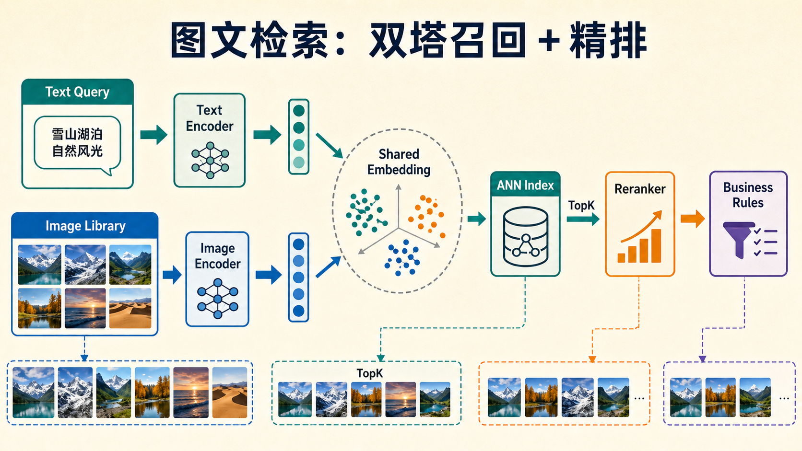

# 对比学习在多模态与检索中的作用

对比学习一旦进入多模态，最直接的落地形态就是检索系统。  
它把“图像和文本是否说的是同一件事”这个问题，转成了共享向量空间中的距离问题。

实际系统通常不是“模型算一个相似度就结束”，而是双塔召回、向量索引、reranker 和业务规则共同工作。下面这张图把图文检索的主链路画在一起。

{ width="920" }

**读图提示**：双塔模型负责把文本和图像放进同一个 embedding space，ANN index 负责快速召回 TopK，reranker 再用更重的模型精排。对比学习主要决定“召回池里有没有正确候选”，但最终排序还会被精排模型和业务规则改写。

## 1. 双塔检索的基本形式

图像编码器和文本编码器分别输出向量：

\[
v = f_\theta(i),\qquad t = g_\theta(x)
\]

**相似度常写成点积或余弦相似度**：

\[
s(i,t) = \langle f_\theta(i), g_\theta(t)\rangle
\]

若做归一化，也可写成：

\[
s(i,t)=\frac{f_\theta(i)^\top g_\theta(t)}{\|f_\theta(i)\|\|g_\theta(t)\|}
\]

训练时通常用双向对比损失同时优化：

- image-to-text
- text-to-image

这意味着模型不仅要会“给图找文字”，也要会“给文字找图”。

## 2. 为什么双塔这么重要

因为它把昂贵的图文匹配问题拆开了：

- 商品图可以离线编码进向量库
- 用户查询时只编码一次文本
- 然后做近邻搜索

于是在线复杂度从“所有图逐一重算交互”变成了“向量检索 + rerank”。  
这就是双塔检索成为工业标准范式的原因。

## 3. 检索系统的基本目标

给定查询 \(q\)，目标是从库 \(\mathcal{I}\) 中找到最相关项：

\[
i^\star = \arg\max_{i \in \mathcal{I}} s(i,q)
\]

对图搜文、文搜图、商品搜商品，本质上都是这个公式的变形。

## 4. 评测指标和生成任务完全不同

检索系统更关心排序质量。常见指标包括：

### Recall@K

\[
\text{Recall@K} = \frac{1}{N}\sum_{n=1}^{N}\mathbf{1}[\text{正确结果出现在前 K}]
\]

### MRR

\[
\text{MRR} = \frac{1}{N}\sum_{n=1}^{N}\frac{1}{\text{rank}_n}
\]

### nDCG

适用于多级相关性场景，更关注排序前部质量。

### 一个直观例子：商品搜索

用户输入“黑色防水登山外套”。  
如果系统前 10 个结果里都大致是外套，但真正最匹配的“黑色冲锋衣”排在第 9 位，用户体验仍然会差。  
因此检索任务里，“排第几”往往比“是否大概相关”更重要。

## 5. 多模态对比学习真正学的是什么

它并不是在学一句 caption 的表面措辞，而是在学跨模态属性对齐，例如：

- 颜色
- 材质
- 形状
- 场景
- 动作
- 关系

### 一个例子：电商检索

“米白色麻质宽松长裙”和“白色修身连衣裙”在词面上都带“裙”，但用户真正在意的常是：

- 材质
- 长度
- 版型
- 颜色细节

如果 embedding 只学到粗类别，就会出现“看起来都差不多，但都不对”的情况。

## 6. 负样本在多模态里更棘手

在视觉自监督中，负样本通常是别的图片。  
但在图文检索里，所谓“负样本”经常不是真的负：

- 两张图都属于同一商品不同视角
- 两段描述都在说同一件衣服但措辞不同
- 一张图和多条文本都合理匹配

这意味着 naive contrastive learning 会引入大量假负样本。

## 7. Hard Negative 为什么重要

若负样本都太容易，模型学不到细粒度边界。  
因此很多系统会引入 hard negative，例如：

- 同类商品不同款
- 同场景不同目标
- 相近 wording 但关键属性不同

**可把目标理解为**：  
不只是区分“猫和飞机”，而是区分“黑色防水冲锋衣”和“黑色非防水软壳”。

## 8. 检索系统通常不是只有双塔

**工业系统常是两阶段**：

1. `双塔召回`
2. `交叉编码器或生成模型 rerank`

双塔负责从百万级库里先找出候选：

\[
\mathcal{C}_K = \text{TopK}\big(s(i,q)\big)
\]

然后更重的模型在候选集上做精排。  
**这类分层设计的现实原因是**：

- 双塔快
- 交互模型准
- 两者结合最划算

## 9. 一个典型案例：商品搜索

用户输入“黑色防水登山外套”，系统流程通常是：

1. 文本编码成向量
2. 在向量库中 ANN 搜索
3. 召回 top-K 商品图
4. 用更重的 reranker 排序
5. 再叠加库存、价格、业务规则

如果对比学习做得好，模型会自动把：

- “冲锋衣”
- “户外外套”
- “防泼水连帽款”

拉近，同时把“黑色西装外套”这种文本相近但语义不对的结果推远。

## 10. 另一个案例：图文搜索里的长尾属性

用户搜索“有木质扶手的浅灰色布艺沙发”。  
这个请求的难点不在“沙发”类别，而在多个属性共同成立：

- 浅灰色
- 布艺
- 木质扶手

检索系统若只学到粗语义，会把所有沙发都召回来。  
只有当 embedding 稳定保留这些细属性时，系统才真正可用。

## 11. 生成模型与检索模型的目标差异

这点很容易被忽视。  
**生成式多模态模型关心的是**：

- 能不能说出一句合理答案
- 能不能解释和推理

**检索模型关心的是**：

- embedding 是否稳定
- 排序是否正确
- 向量空间是否适合 ANN

**所以检索优先关注**：

- 召回率
- embedding 稳定性
- 同义表达鲁棒性

而不是语言流畅性。

## 12. 工程上最常见的三个坑

### 12.1 只看离线 Recall，不看线上点击

离线 benchmark 可能很好，但线上用户表达更短、更脏、更口语化。

### 12.2 Embedding 漂移

模型每次升级后，向量分布变化太大，旧索引和新索引不兼容，检索质量会突然波动。

### 12.3 只做语义检索，不加业务约束

检索出“很像”的商品，不代表：

- 有库存
- 可配送
- 价格合适

因此真实系统常常是“语义召回 + 业务规则”的组合。

## 13. 总结

对比学习在多模态中的最大价值，是把跨模态匹配转成了统一嵌入空间里的几何问题。  
这让图文检索、商品搜索、向量召回变得可扩展。  
但真正可用的系统不只靠一个漂亮的 embedding，还要处理 hard negative、两阶段排序、索引稳定性和线上业务约束。

## 快速代码示例

```python
import torch
import torch.nn.functional as F

def retrieve_topk(query_emb, doc_emb, k=10):
    q = F.normalize(query_emb, dim=-1)
    d = F.normalize(doc_emb, dim=-1)
    scores = q @ d.T
    return torch.topk(scores, k=k, dim=-1).indices
```

这段代码展示了多模态检索的最小在线读法：先归一化向量，再用点积相似度做 TopK 召回。生产系统通常会在这一层后再加 reranker 和业务约束，避免只靠语义相似度做最终决策。


## 实践补充与检查

### 把 **对比学习在多模态与检索中的作用** 从损失函数写成表示系统

对比学习页面若只讲公式和论文脉络，读者很容易把它理解成一类训练技巧；但真正更有价值的视角是：**它在组织一个表示系统**。围绕 **对比学习在多模态与检索中的作用**，更扎实的页面应同时说明表示几何、采样制度、增广与负样本策略、下游读取方式，以及线上检索或多模态系统如何真正消费这些表示。

从这个角度看，把跨模态对齐、检索系统、嵌入漂移和线上价值写清楚。因此，对比学习的关键从来不只是“损失写成什么样”，还包括：哪些样本被拉近、哪些样本被推远、这种几何关系是否真的符合任务边界、以及这种关系在部署后会不会因为分布漂移而崩掉。

### 从训练目标到下游消费的一条链

围绕 **对比学习在多模态与检索中的作用**，建议沿着下面这条链来理解：

1. **训练目标** 决定表示空间希望保留哪些不变性；
2. **采样与增广制度** 决定模型究竟会把什么当作“同一个对象”或“不同对象”；
3. **评测与读取方式** 决定这种表示是否真的能被检索、聚类、重排、多模态对齐或下游任务消费；
4. **线上分布变化** 决定这些几何关系是否仍然成立。

只要把这条链讲明白，很多常见误解就会自然消失。比如为什么某些表示在离线线性评估里很好，但线上检索或跨模态系统里收益有限；为什么难负样本设计稍有不慎就会把本来该靠近的东西推开；为什么 teacher-student 或 non-contrastive 方法在某些场景下更稳，而在另一些场景里又会被长尾和分布偏移放大缺陷。

### 更常见、也更隐蔽的失败模式

对比学习最容易被低估的风险，是它常常在“整体上看起来没问题”时悄悄损伤任务边界。比如表示过度压缩导致难例分不清，过强增广导致语义信息被抹掉，负样本制度不合适导致相关样本被错误推远，或者多模态对齐表面很好、实际线上文本和图像分布漂移后迅速失效。

这类失败之所以难，是因为它们很少通过一个总分暴露。页面若要更扎实，就应明确告诉读者：**一定要按任务桶、难例桶、线上流量桶来看表示质量**，而不是相信一个总体召回率或线性 probe 分数就足够。

### 更像工程文档的验收方式

对 **对比学习在多模态与检索中的作用**，更可靠的验收至少应同时看：

1. **表示层**：聚类、线性可读性、近邻结构是否合理；
2. **任务层**：检索、重排、跨模态匹配或下游分类是否真正受益；
3. **系统层**：索引更新、向量漂移、回灌与在线反馈是否可管理；
4. **长尾层**：少数高价值任务、难例和漂移样本是否被特殊关注。

把这些层写进页面后，**对比学习在多模态与检索中的作用** 就会从“方法介绍”变成“表示系统设计指南”。


### 和相邻页面的接口要怎么看

**对比学习在多模态与检索中的作用** 更值得被写清楚的地方，是 多模态表示、检索系统和线上反馈的接口。对比学习若脱离这些接口来谈，就容易只剩损失函数差异；而一旦把接口讲明白，读者就能理解为什么同样是表示学习，有的更适合检索，有的更适合多模态对齐，有的在长尾上更脆弱。

### 一条更实用的落地顺序

更稳的推进顺序往往是：先定义下游任务想保留什么不变性，再设计采样和增广，再做离线表示评测，最后再接进索引、检索或多模态系统。很多问题不是对比目标本身，而是增广和采样从一开始就和任务边界不一致。

### 还值得继续深挖的问题

围绕 **对比学习在多模态与检索中的作用**，后续最值得继续加厚的通常是：表示漂移如何在线监控；哪些难例和长尾样本最能揭示几何问题；teacher/student 与 non-contrastive 路线在部署上的真实差异；以及一旦下游效果突然退化，应如何把问题回溯到训练目标、样本制度和评测桶。


