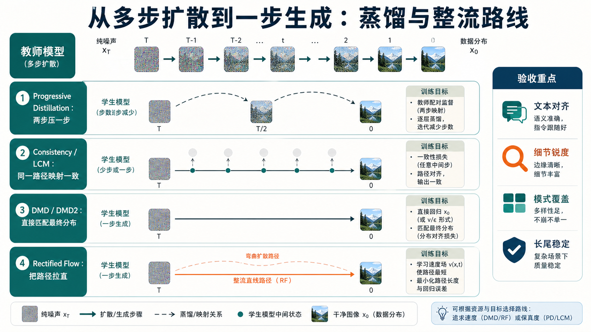
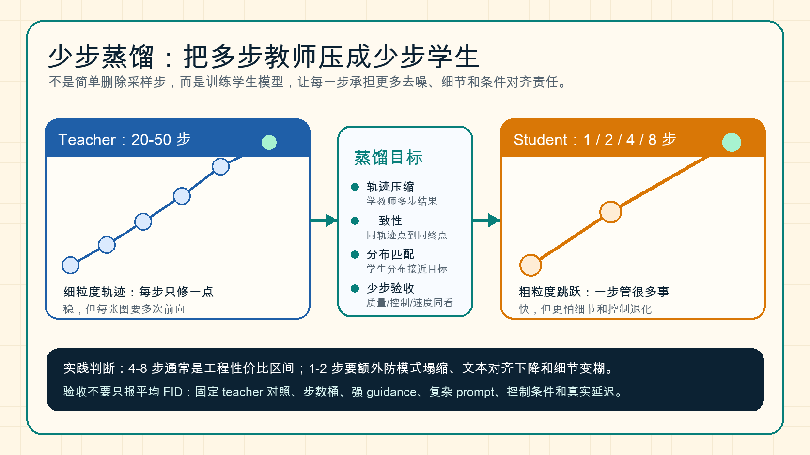

# 扩散蒸馏、一步生成与整流路线

当 `DDIM`、`Euler`、`DPM-Solver` 已经把推理压到几十步后，下一步问题就变成了：能不能直接把几十步教师，压缩成几步甚至一步学生。

下面这张图把几条加速路线放在同一张路线图里：Progressive Distillation 更像“逐级压缩教师步数”，Consistency/LCM 更像“让同一路径上的点直接映射到一致结果”，DMD/DMD2 更像“直接对齐最终分布”，Rectified Flow 则更像“把路径本身改得更适合少步走完”。

{ width="920" }

**读图提示**：少步生成不是单纯把采样步数删掉。越接近一步生成，越需要重新验证文本对齐、细节锐度、模式覆盖和长尾稳定性，否则速度提升很容易换来不可控退化。

## 少步蒸馏：从多步教师到 1-8 步学生 { #few-step-distillation }

少步蒸馏要解决的问题很具体：已经有一个质量可靠但很慢的 teacher diffusion model，它可能需要 20、30、50 步甚至更多步才能生成一张图；现在希望训练一个 student，让它只用 1、2、4 或 8 步就达到接近教师的结果。

这件事不能理解成“把采样循环里的步数删掉”。如果原模型是在 30 步里逐渐修正构图、纹理、边缘、文字和条件对齐，那么删到 4 步后，每一步都必须承担原来好几步的信息量。少步蒸馏的核心，就是重新定义训练信号，让学生学会这种“粗粒度跳跃”。

{ width="920" }

**读图提示**：teacher 的轨迹细、慢、稳定；student 的轨迹粗、快、风险更高。蒸馏目标要同时约束轨迹、终点、分布和实际少步推理质量，否则学生很容易只学到“看起来像”，却在复杂 prompt、强 guidance 或细节区域退化。

### 1. 为什么少步蒸馏和普通 teacher-student 不一样

普通分类蒸馏里，teacher 给一个 soft label，student 学这个 label 就可以。扩散少步蒸馏更麻烦，因为 teacher 的输出不是一个静态答案，而是一条从噪声到图像的轨迹：

\[
x_T \rightarrow x_{t_1} \rightarrow x_{t_2} \rightarrow \cdots \rightarrow x_0.
\]

如果 student 只有 \(K\) 步，就要学习一个更大的跳跃：

\[
x_T \rightarrow x_{\tau_1} \rightarrow \cdots \rightarrow x_0,\qquad K \ll T.
\]

这意味着 student 不只是在模仿 teacher 的单步预测，而是在学习 teacher 多步复合后的结果。直觉上，teacher 每一步像“慢慢擦掉噪声”，student 每一步像“直接跨过一大片噪声区间”。跨度越大，训练目标越难，越需要额外的稳定手段。

### 2. 三类常见蒸馏信号

| 蒸馏信号 | 学什么 | 代表路线 | 优点 | 风险 |
| --- | --- | --- | --- | --- |
| 轨迹压缩 | 学 teacher 两步或多步采样后的状态 | Progressive Distillation | 直觉清楚，适合逐级从 32 到 16、8、4 步 | 步数越低，误差累积越明显 |
| 终点一致性 | 同一 PF-ODE 轨迹上的不同噪声点映射到一致结果 | Consistency Models、LCM | 适合 1-4 步快速生成，和 latent diffusion 结合自然 | 容易牺牲细节或强条件控制 |
| 分布匹配 | 不要求逐点模仿 teacher，只要求 student 生成分布接近目标 | DMD、DMD2、Phased DMD | 更适合一步生成和极低步数 | 训练稳定性、模式覆盖和锐度都更难管 |

工程上可以先这样判断：如果目标是 4-8 步，轨迹压缩和一致性路线通常更稳；如果目标是一两步，并且能接受更复杂训练和更严格回归，再看 DMD/DMD2 这类分布匹配路线。

### 3. 一个简化的少步蒸馏训练流程

下面的伪代码不是照搬某一篇论文，而是把少步蒸馏的共同骨架抽出来：

```text
Algorithm: Few-Step Diffusion Distillation

Input:
  teacher T                 # 多步扩散模型或高精度采样器
  student S                 # 目标少步模型
  step budget K             # 例如 1, 2, 4, 8
  prompts / conditions c

repeat:
  1. 采样噪声 x_T 和条件 c
  2. 用 teacher 从 x_T 生成高质量轨迹:
       x_T -> ... -> x_0^teacher
  3. 选择 student 的粗时间点:
       tau_K > ... > tau_1 > 0
  4. 构造训练目标:
       path target: teacher 多步结果
       consistency target: 同轨迹终点
       distribution target: teacher/真实分布的 score 差
  5. 更新 student:
       L = L_path + lambda_c L_consistency + lambda_d L_distribution
  6. 用 K 步真实推理回放验证:
       quality, prompt fidelity, control, latency

until validation passes
```

真正做实验时，第 6 步非常关键。少步模型训练 loss 看起来下降，并不代表真实 4 步或 1 步推理就稳。因为训练时看到的 \(x_t\) 分布和 student 自己推理时产生的中间状态可能不一样，这就是很多少步路线会遇到的 train-inference mismatch。

### 4. 一个例子：把 50 步文生图压到 4 步

假设 teacher 是一个 50 步 latent diffusion 文生图模型。原流程大致是：

1. 前 10 步确定整体构图和主体位置；
2. 中间 20 步逐渐补物体关系、材质和局部结构；
3. 最后 20 步修边缘、纹理、文字和高频细节。

如果 student 只有 4 步，就不能指望它按原来的细节节奏慢慢修。更现实的分工是：

1. 第 1 步先把大构图和主要对象拉出来；
2. 第 2 步把对象关系、颜色和光照压稳；
3. 第 3 步补关键细节和条件对齐；
4. 第 4 步做局部锐化和伪影修复。

这就是少步蒸馏最难的地方：student 的每一步不再是“微小去噪”，而是带有阶段性规划意义的大跳跃。步数越少，它越像一个非自回归生成器，而不是传统意义上的逐步扩散采样器。

### 5. 少步蒸馏最该验什么

只比较“生成速度快了多少”是不够的。少步蒸馏至少要固定下面几类对照：

1. **teacher-student 同 seed 对照**：同一个 prompt、seed、guidance 下看退化来自哪里；
2. **步数桶对照**：1、2、4、8 步分别测，不要只展示最好看的那一档；
3. **强条件对照**：文本、ControlNet、参考图、局部编辑、风格约束要分开测；
4. **长尾 prompt 对照**：多对象、计数、空间关系、文字、复杂材质最容易暴露问题；
5. **真实延迟对照**：报告端到端时延，而不只是 UNet 前向次数。

如果一个少步学生在平均视觉指标上接近 teacher，但在复杂 prompt 里丢对象、文字糊、结构控制漂移，那么它还不能算真正可替代 teacher，只能算快速预览或低风险场景的候选。

### 6. 相关论文入口

1. Progressive Distillation: [Progressive Distillation for Fast Sampling of Diffusion Models](https://arxiv.org/abs/2202.00512)
2. Consistency Models: [Consistency Models](https://arxiv.org/abs/2303.01469) / [官方 GitHub](https://github.com/openai/consistency_models)
3. LCM: [Latent Consistency Models](https://arxiv.org/abs/2310.04378)
4. DMD: [One-step Diffusion with Distribution Matching Distillation](https://arxiv.org/abs/2311.18828)
5. DMD2: [Improved Distribution Matching Distillation for Fast Image Synthesis](https://arxiv.org/abs/2405.14867)

## 1. Progressive Distillation

**它的思想可以写成**：

\[
\text{student}(x_t, t) \approx \text{teacher}^{(2)}(x_t, t)
\]

也就是让学生学会“教师两步完成的事”。不断重复后，步数可以从 \(N\) 压到 \(N/2\)、\(N/4\) 甚至更低。

这条路线的价值，在于它尽量保留了原始扩散教师的行为方式。学生不是从零发明一条新路径，而是在教师已经验证过的多步轨迹上逐级压缩。这样做的优点是直觉清楚、过渡自然，也更容易和原有训练框架兼容。

但它的局限也很明确。因为学生始终在模仿教师的压缩版本，所以一旦目标步数压得非常低，误差会层层累积。换句话说，它非常适合把 32 步压到 16、8、4 这种区间，却不一定天然擅长“高质量一步生成”。

### 例子：学徒画师

老师原本需要 16 笔画完一张苹果静物，学徒先学“两笔合成一笔”，再学“四笔合成一笔”，最后压缩成 4 笔或 2 笔完成。

## 2. Consistency / LCM

**一致性路线希望直接学会**：

\[
f_\theta(x_t, t) \approx f_\theta(x_s, s), \qquad \text{当 } x_t, x_s \text{ 属于同一数据轨迹}
\]

直觉上，不同噪声层级的点，只要它们对应同一个真实样本，就应该被映射到接近的干净结果。

**这类方法适合**：

- 一步或少步采样
- 保留与大教师模型的一致性
- 与 latent diffusion 结合

一致性路线真正吸引人的地方，是它不再执着于“严格走完整条教师轨迹”，而是希望不同噪声层级上的点能被直接收束到相近的干净结果。这样一来，模型在推理时就不必重演那么多中间步骤，而可以更像一个“跨层级纠偏器”。

这类方法因此特别适合交互式预览、少步 latent diffusion 和需要快速试错的产品场景。风险则在于，一旦一致性目标定义得不够稳，学生很容易在高难 prompt、强 guidance 或长尾视觉模式上丢掉细节和条件敏感性。

## 3. DMD：从轨迹模仿转向分布匹配

`DMD` 的关键不是“模仿教师每一步动作”，而是直接优化学生分布与目标分布的差异。

**可以把它粗略理解为最小化**：

\[
D\left(p_{\text{student}}(x), p_{\text{target}}(x)\right)
\]

论文中利用真实分布侧和生成分布侧的 score 差来构造训练信号。直觉上：

- 如果学生样本分布偏离真实数据，两个 score 会给出方向差。
- 这个差可以推动一步生成器朝正确分布移动。

`DMD` 的关键突破，不是简单让学生“少走几步”，而是把问题改写成“学生最终落到的分布对不对”。这会带来一种完全不同的蒸馏哲学：不再要求学生逐帧模仿老师，而是允许它用自己的方式，只要最终分布足够接近目标。

这也正是一步生成难度陡增的地方。因为你抛开了轨迹监督之后，学生获得了更大自由度，但训练稳定性、模式覆盖和锐度也更容易一起失控。

### 例子：做面包而不是背配方

传统轨迹蒸馏像让学徒严格模仿师傅每一步揉面、发酵、烘烤。

`DMD` 更像只看最终面包是否外形、口感和香气都接近目标产品，然后用“结果差异”反推哪里需要改。

## 4. DMD2：解决模糊与训练不稳

`DMD2` 延续分布匹配思路，但更强调稳定性。可以用一个近似的总目标来理解：

\[
\mathcal{L} = \mathcal{L}_{\text{dist-match}} + \lambda_{\text{gan}}\mathcal{L}_{\text{gan}}
\]

**这里的直觉是**：

- 分布匹配负责把总体分布拉对。
- 对抗损失负责提升清晰度和锐度。

**这很像图像生成里常见的分工**：一个目标保“方向对”，另一个目标保“画面利”。

`DMD2` 更像是在承认一个现实：只靠分布级别的方向信号，往往还不足以把视觉清晰度和细节锐度也一起拉起来。于是它通过更稳定的训练耦合和更清楚的损失分工，把“分布对齐”和“视觉可用”重新接到一起。

从方法演化上看，`DMD2` 说明一步生成真正困难的，不是目标本身够不够激进，而是训练信号是否既能管大方向，又能管高频细节。只要这两者失衡，结果不是糊，就是不稳。

## 5. Phased DMD：把一步难题拆成多个阶段

`Phased DMD` 把噪声空间按 phase 划开，每个 phase 内再做局部分布匹配。可以写成：

\[
\mathcal{L}_{\text{total}} = \sum_{k=1}^{K} \left(\lambda_k \mathcal{L}_{\text{dm}}^{(k)} + \gamma_k \mathcal{L}_{\text{score}}^{(k)}\right)
\]

这里 \(k\) 表示不同阶段。这样做的好处是：

- 早期 phase 先学大结构。
- 中期 phase 学物体关系和构图。
- 后期 phase 再盯住纹理与细节。

### 例子：画一辆赛车

如果要求学生一步完成，很可能只画出“像车”的轮廓，赞助商贴纸、轮胎纹理、反光材质会丢失。

**如果分阶段学**：

1. 第一阶段先把赛车姿态、车头、轮胎位置定住。
2. 第二阶段学习车壳分色和赛道背景。
3. 第三阶段再补 logo、反射和运动模糊。

这比硬做一步往往稳得多。

## 6. Rectified Flow / Rectified Diffusion

这条路线并不是主要做“教师蒸馏”，而是重新设计从噪声到数据的生成路径，让它更适合少步离散。

**可以把目标想成**：学习一条更平直、更容易数值积分的轨迹

\[
\frac{dx}{dt} = v_\theta(x,t)
\]

若轨迹足够规则，一步或少步 Euler 就可能已经足够。

`Rectified Diffusion` 进一步说明：真正关键的不一定是几何意义上的“绝对直”，而是轨迹和配对方式是否适合粗离散。

这条路线值得单独看，是因为它把重点从“如何蒸馏教师”转成了“如何让路径本身更适合少步求解”。也就是说，它不是首先回答“老师怎么教学生”，而是先回答“从噪声走到数据，什么样的路更适合用很少步数走完”。

因此 rectified 路线和 DMD 路线虽然都在追求极少步，但关注点并不一样。前者更像重画道路，后者更像在结果空间里直接纠偏。

## 7. 什么时候选哪条路线

### 你不想重训

看求解器，不看蒸馏。

这种场景最常见于：模型已经训完、部署链路已经跑通、团队只想在当前权重上把推理速度再压一点。此时蒸馏和整流的训练成本通常不划算，因为它们会把问题从“推理调优”升级成“重新训练并重新验收”。所以更稳妥的路径仍然是先换 solver，再看是否真的有必要进入学生模型路线。

### 你要 4 到 8 步

**优先看**：

- Progressive Distillation
- Consistency / LCM
- Rectified 路线

这一档通常是工程上最有现实吸引力的区间。因为 4 到 8 步已经足够明显地降低时延和成本，但又没有一步生成那么极端，因此更容易兼顾质量、控制性和稳定性。很多真实产品若不是强追求一步，往往会在这个区间找到更好的性价比。

### 你要 1 步并且追求很高质量

**重点看**：

- DMD
- DMD2
- Phased DMD

这类目标往往只在两种情况下值得认真投入：一是交互预算极紧，二是推理成本极敏感。因为一步生成不是“更快一点”，而是会显著改变训练、评测和回退设计。只要你决定走这条路，就等于接受了更复杂的训练流程和更严格的长尾验收要求。

## 8. 一个总判断

一步生成的难点，不是“把 20 步删成 1 步”，而是：

- 如何保住分布正确性
- 如何保住高频细节
- 如何避免模式塌缩
- 如何仍然满足文本条件

所以 `DMD2`、`Phased DMD`、`Rectified Diffusion` 本质上都在回答同一个问题：**极少步下，怎样既快又不崩。**

## 快速代码示例

```python
import torch
import torch.nn.functional as F

def distill_step(student, teacher, x_t, t, cond):
    with torch.no_grad():
        target = teacher(x_t, t, cond=cond).sample
    pred = student(x_t, t, cond=cond).sample
    return F.mse_loss(pred, target)
```

这段代码给出最小 teacher-student 蒸馏步：用 teacher 生成目标噪声（或速度）预测，student 直接回归。一步或少步扩散蒸馏通常都以这类“轨迹/分布对齐”损失为核心，再叠加对抗或感知约束稳住细节。


## 实践补充与检查

### 把 **扩散蒸馏、一步生成与整流路线** 从方法名写成设计空间

这一类页面如果只停留在“概念、公式、论文关系”，读者很容易知道名词却不知道何时该用、何时不该用。围绕 **扩散蒸馏、一步生成与整流路线**，更扎实的写法应当把它放回一个明确设计空间：

1. **teacher-student 差距、步数压缩、模式覆盖、稳定性、部署收益**。

只有把这些坐标讲清楚，读者才能理解：某种方法为什么在论文里成立、落到工程里时最容易在哪些环节变形，以及它和相邻方法的真正边界在哪里。

### 更实用的分析顺序

围绕 **扩散蒸馏、一步生成与整流路线**，建议读者和实践者都先按下面顺序思考：

1. **先问目标**：你到底追求画质、控制性、速度、稳定性、还是部署成本；
2. **再问数据制度**：训练样本是什么形态、分布有没有长尾、标注或条件信号是否可靠；
3. **再问系统边界**：推理预算、显存预算、工具链与下游接口是否支持；
4. **最后问方法细节**：采样器、蒸馏、量化、损失函数、控制机制的具体选型。

这比一上来就在方法之间横向比较更有帮助，因为很多“方法优劣”其实是由目标和系统边界决定的，而不是由方法名字决定的。

### 最容易被忽略的失败模式

围绕 **扩散蒸馏、一步生成与整流路线**，常见失败并不只是“指标低”，更常见的是：

1. **蒸馏后快了但控制性变差**。
2. **只看单一视觉指标**。
3. **teacher 偏差继承到 student**。

这些问题说明，方法页若只讲主线和优点，会让读者得到一个过于平滑的印象。真正扎实的内容应当明确指出：哪些收益最容易被 benchmark 放大，哪些副作用最容易被平均值遮住，哪些结论只在某些数据制度或硬件路径上成立。

再具体一点，少步学生最容易在三类地方露怯：

1. **强条件控制**：文本、结构或参考图要求一上来，学生容易更早失控；
2. **高频细节**：纹理、字体、logo、边缘锐度往往比大结构更容易掉；
3. **长尾 prompt**：平均样本看起来没问题，但复杂构图、多对象关系或极端风格会明显退化。

如果只看平均 FID 或少量精选样图，这些问题几乎都会被遮住。

### 验收与实践清单

对 **扩散蒸馏、一步生成与整流路线**，更像工程文档的验收至少要覆盖：

1. **同时看质量与 controllability**。
2. **保留 teacher 对照**。
3. **关注长尾 prompt 与极端场景**。

此外，建议把方法验收长期绑定三类材料：

1. **热路径案例**，证明它在主场景下确实有价值；
2. **尾部案例**，避免方法只在容易样本上好看；
3. **回退与替代方案**，明确什么时候应该切回更简单、更稳的方法。

做到这一步后，**扩散蒸馏、一步生成与整流路线** 才会从“资料页”升级成“真正能指导设计决策的页面”。

如果要再落细一点，至少建议固定四类对照：

1. **teacher-student 对照**：同一 prompt、同一 seed、同一 guidance，直接比较退化模式；
2. **步数桶对照**：1 步、2 步、4 步、8 步分别能换来什么质量；
3. **控制桶对照**：看 student 在文本、结构和图像条件下是否一起退化；
4. **回退门槛**：明确什么情况下必须切回教师或更保守路径。

只有这些对照长期保留，极少步路线的收益才不会停留在演示层面。
