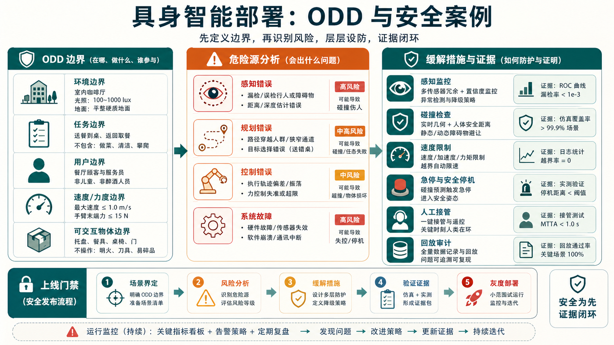

# 部署模式与安全案例

具身智能一旦离开实验室，面对的就不再是“平均成功率”，而是具体责任边界、真实物理风险和持续运营问题。部署模式决定系统怎样接入业务流程，安全案例则回答一个更根本的问题：为什么我们相信它足够安全、何时必须回退、出了问题如何追责与修复。本页把具身智能系统从研究样机推向生产环境时常见的部署模式与安全论证框架做一个系统梳理。

## 1. 为什么具身智能部署比纯软件系统难

对话系统的错误常常是答非所问，而机器人的错误会表现为撞击、夹伤、摔落、卡死、误抓、阻塞通道或破坏物品。风险直接作用于物理世界，因此部署必须考虑：

1. 人员安全
2. 财产损失
3. 任务可靠性
4. 系统可恢复性
5. 合规与责任界面

此外，具身系统是“长链路系统”：感知、识别、规划、控制、执行器、通信、电源、机械结构缺一不可，任何一环的偏差都会被物理过程放大。

下面这张图把部署安全拆成三件事：先定义 ODD 边界，再做危险源分析，最后用分层缓解措施和验证证据支撑安全案例。它不是合规文档装饰，而是决定系统能否从 demo 进入真实运营的主线材料。

{ width="920" }

**读图提示**：不要把“模型准确率高”当作安全案例。安全案例需要说明在哪些场景可运行、哪些危险源已识别、哪些保护层能兜底、哪些日志和回放能证明问题可追责。

## 2. 常见部署模式

### 2.1 助手模式

机器人只提供建议或执行低风险动作，人类保留最终决策权。比如仓库盘点机器人给出“疑似放错货位”的建议，由人类确认；家务机器人先规划清理顺序，由用户点击确认开始。

这种模式优点是上线快、风险低，缺点是自动化收益有限。

### 2.2 受限自动化模式

系统只在明确边界内独立工作，例如：

1. 只在夜间无人时段清扫固定区域；
2. 只抓取预定义货箱类型；
3. 只在围栏内执行搬运；
4. 只在低速物流通道中运行。

这种模式是当前工业部署最常见的形态。关键不是追求“全能”，而是把可控边界定义清楚。

### 2.3 人机协作模式

机器人与人同时工作，需要共享空间、共享节拍甚至共享工具。例如装配线协作、护士站递物、餐厅传菜。这要求系统额外具备：

1. 人体检测与跟踪
2. 安全停机与速度限制
3. 意图识别或至少路径礼让
4. 更强的交互解释能力

### 2.4 高自治闭环模式

系统独立完成大部分任务，人类只做监控和异常接管。例如封闭仓储中的自动搬运与拣选。此模式要求最严格的安全案例和运行监控，因为它对人工兜底依赖最低。

## 3. 安全案例是什么

安全案例（safety case）可以理解为一套结构化论证：系统为什么在给定场景下足够安全。它通常不是一句“模型准确率 95%”，而是一个层层展开的论证树，包括：

1. **顶层主张**：系统在场景 S 中可接受地安全。
2. **论据**：有哪些设计、测试、约束和流程支持这个主张。
3. **证据**：实验、日志、仿真、形式化规则、现场演练、事故复盘。

**可把总风险写成一个粗略表达**：

$$
\text{Risk}
=
\sum_i P(\text{hazard}_i)\cdot \text{Severity}(\text{hazard}_i).
$$

部署的目标不是把风险变成零，而是把高严重度风险的概率压到可接受范围，并确保出现异常时系统能进入安全状态。

## 4. 典型危险源

具身系统的危险源往往来自多因素耦合，而不是单一模型错误。

### 4.1 感知危险

1. 漏检人、宠物、障碍物
2. 误识别目标对象
3. 受反光、阴影、遮挡影响
4. 坐标系漂移或标定失效

### 4.2 规划危险

1. 选择不可达目标姿态
2. 动作路径穿越禁区
3. 忽视动态障碍
4. 错误估计抓取或放置可行性

### 4.3 控制与执行危险

1. 关节超速
2. 力控异常
3. 末端执行器卡住
4. 紧急制动不及时

### 4.4 系统性危险

1. 网络中断导致状态不同步
2. 上下游系统接口变化
3. 电池低电量时行为退化
4. 远程更新带来新回归

## 5. 安全设计的基本原则

### 5.1 分层防护

不要把安全完全寄托在“大模型会判断”。通常需要至少三层：

1. **任务层约束**：哪些任务允许做，哪些场景禁止做。
2. **规划层约束**：禁区、速度限制、碰撞检查、力阈值。
3. **硬件层约束**：急停、围栏、限位、扭矩保护、冗余传感器。

任意一层失效时，其他层仍可兜底。

### 5.2 可降级运行

一套好的部署系统不应只有“正常工作”和“彻底瘫痪”两种状态，而应具有降级模式。例如：

1. 视觉置信度低时减速运行；
2. 语言解析歧义高时请求人工确认；
3. 网络断开时切换本地安全策略；
4. 不确定性过高时回到待命位姿重新观察。

### 5.3 明确 ODD

ODD（Operational Design Domain）即操作设计域，描述系统在哪些条件下允许运行。比如：

1. 室内平整地面
2. 光照范围 200 到 800 lux
3. 只处理重量小于 2kg 的物品
4. 与人共享空间时速度上限 0.5m/s

很多事故不是模型“突然变差”，而是系统被拿去超出 ODD 的场景使用。

## 6. 安全案例的组成

### 6.1 场景界定

**首先要把场景边界写清楚**：地点、对象、人类参与方式、速度范围、失败后果、应急流程。

### 6.2 危险分析

列出所有关键 hazards，并按照严重度和发生概率排序。可以借鉴 FMEA 风格：

$$
\text{RPN} = \text{Severity} \times \text{Occurrence} \times \text{Detectability}.
$$

RPN 高的风险项需要优先设计防护与测试。

### 6.3 缓解措施

每个危险项应有明确缓解措施，如：

1. 漏检行人 -> 加装冗余深度传感器 + 安全减速区
2. 抓取失败滑落 -> 夹持力监控 + 失败姿态回退
3. 错误目标识别 -> 双重确认 + 条码辅助

### 6.4 验证证据

**证据可以来自**：

1. 离线数据回放
2. 仿真压力测试
3. 实机封闭场演练
4. 小流量灰度运行
5. 历史日志统计

## 7. 机器人部署中的监控指标

仅靠“任务成功率”无法支持现场运维。更应记录：

1. 每小时急停次数
2. 碰撞接近事件数
3. 人工接管率
4. 平均恢复时间
5. 低置信度动作比例
6. 安全区侵入事件

这些指标构成持续安全运营的基础。

## 8. 失败恢复为何是部署关键

实验室里，失败后通常由研究员手动重置环境；真实部署里，这个成本非常高。一个系统若没有恢复能力，会在现场表现成“只要第一次没做好，就把整个工位堵死”。因此安全不仅是“不伤人”，还包括“出错时能否优雅退出”。

**可把恢复策略视作一个条件策略**：

$$
\pi_{\text{recover}}(a_t \mid s_t, e_t),
$$

其中 $e_t$ 表示错误类型，如抓取失败、遮挡、路径被占用。恢复策略越明确，系统越适合部署。

## 9. 三个具体部署案例

### 9.1 仓库拣选机器人

**场景**：围栏内无人区，处理固定尺寸纸箱和塑封件。

**安全重点**：

1. 误抓后掉落砸坏货品
2. 机械臂与输送线碰撞
3. 异常件卡住末端执行器

**适合模式**：受限自动化。可以通过围栏、固定工位、对象白名单和条码二次确认，把 ODD 压缩到足够清晰。

### 9.2 医院配送机器人

**场景**：与医护、病患共用走廊，需避让人群并到站点交接。

**安全重点**：

1. 与人近距离通行安全
2. 电梯和自动门接口失效
3. 紧急情况下的人类接管

**适合模式**：人机协作。要把速度限制、礼让规则、远程监控和语音提示都纳入安全案例。

### 9.3 家庭收纳机器人

**场景**：开放式家庭环境，对象杂乱、光照复杂、儿童和宠物随机出现。

**安全重点**：

1. 抓取玻璃器皿摔碎
2. 儿童突然进入工作区域
3. 误把私人物品当垃圾处理

**适合模式**：助手模式或高度受限自动化。当前阶段如果没有明确 ODD 和强人工确认，不适合完全自治。

## 10. 安全与产品收益的关系

工程团队常担心安全约束会“压掉模型能力”。实际更常见的情况是：没有安全框架，系统根本无法进场测试，自然也谈不上收益。合理的安全设计不是阻碍，而是让系统在有限边界内稳定创造价值。

可以把部署收益近似写成

$$
\text{Net Value}
=
\text{Automation Gain}
- \text{Incident Cost}
- \text{Oversight Cost}.
$$

过于激进的自动化会提高事故成本，过于保守又会抬高监督成本。部署模式就是在这三项之间找平衡。

## 11. 一个生动比喻

把具身智能部署想成让一名新司机上路。你不会因为他在驾校模拟器里成绩好，就立刻让他独自跑高速夜间长途。更合理的方式是：先在封闭场地、再在低速熟路、再在教练陪同下上路，并且车上有刹车辅助、速度限制、后视镜与仪表监控。安全案例就是这整套论证：为什么他现在可以在某个边界内开车，以及一旦情况超出边界该怎么办。

## 12. 小结

具身智能部署的核心不是“把模型放到机器人上”，而是把模型、规则、硬件和运营流程组合成一个可被论证、监控和回退的系统。部署模式决定自治程度，安全案例决定上线资格。对于大多数现实团队，先缩小 ODD、建立分层防护、完善恢复与监控，比追求一句“通用机器人”更有实际价值。 

## 实践补充与检查

### 把 **部署模式与安全案例** 放回闭环系统里讨论

VLM、VLA、具身与世界模型类页面，最大的风险不是内容太少，而是内容只停留在“模型结构”和“离线指标”层。真正扎实的页面，必须把方法放回 **任务接口、数据制度、动作/工具链、风险治理和上线边界** 里讨论。围绕 **部署模式与安全案例**，更有价值的写法不是单纯列方法，而是明确说明它在闭环系统里到底负责哪一段能力。

更具体地说，围绕部署形态、案例论证、接管与审计补充。只有把这些接口真正讲明白，读者才会知道：某一条路线到底是在提升理解、提升决策、提升执行恢复、提升数据回流效率，还是只是在离线表征上更强。对这类系统而言，接口不清楚，比方法不够新更容易误导决策。

### 从离线能力到闭环能力的递进关系

围绕 **部署模式与安全案例**，更稳妥的分析方式是把能力分成三层：

1. **离线表征层**：模型是否真的提取到了任务相关信息；
2. **策略与计划层**：模型是否能基于这些信息做出正确下一步，而不是只是生成“看起来像对的输出”；
3. **闭环与恢复层**：当环境、界面、用户或机器人状态变化后，系统是否还能稳定继续。

很多页面容易把第一层和第二层混在一起，仿佛离线分数高就等于闭环更强。事实上，真实系统里最难也最贵的往往是第三层。无论是屏幕代理、VLA、世界模型还是具身部署，真正的差距经常出现在：模型是否能在失败后恢复、是否能在风险边界前收手、是否能在高价值任务上保持一致性，而不是单次离线预测是否好看。

### 更容易被忽略的失败与误判

这类主题里，最常见的误判通常包括：把静态评测当成闭环能力；把高保真生成误当成高价值决策；把多模态数据量增加误当成接口设计已经合理；把实机或线上失败都归因于“模型还不够大”。这些误判共同指向一点：**没有把任务链条拆开验收**。

因此，更扎实的内容应当把失败模式写细：哪些问题来自观测不全，哪些来自接口不稳，哪些来自动作粒度设计不对，哪些来自回流数据抓错重点，哪些来自评测桶没有覆盖真正高价值风险场景。只有这些被写透，读者才会真正理解为什么同一个模型结构，在论文和系统里会呈现出完全不同的表现。

### 更像系统手册的验收方式

对 **部署模式与安全案例**，推荐把验收至少写成四层：

1. **表征验收**：是否看懂、对齐对不对、关键状态是否保留；
2. **决策验收**：下一步动作、工具选择、计划输出是否可靠；
3. **闭环验收**：失败恢复、风险抑制、长任务稳定性是否成立；
4. **运营验收**：是否能被 replay、shadow、回流、灰度和审计系统接住。

页面只要把这四层真正写实，**部署模式与安全案例** 就会从“方向介绍页”变成“设计和落地都能用的页”。

### 和相邻页面的接口要怎么看

对 **部署模式与安全案例**，更扎实的扩写重点不是再堆概念，而是把 部署架构、审计、接管与案例论证的接口 真正讲清楚。因为这类系统天然跨页：数据页讲输入资产，方法页讲模型能力，评测页讲证据，部署页讲风险。若页面之间的接口没写出来，读者很容易看完每一页仍然不知道系统是怎么连起来的。

### 一条更实用的落地顺序

把 **部署模式与安全案例** 用到真实系统时，更稳的顺序通常是：先把任务接口和风险边界写清，再决定模型和数据方案；再做离线验证、回放和小规模闭环；最后才进入更大规模的部署或实机阶段。很多返工其实都源于顺序反了：先把模型训出来，后来才发现动作接口、回退逻辑或评测桶根本没准备好。

### 还值得继续深挖的问题

围绕 **部署模式与安全案例**，下一轮最值得继续加厚的，往往是这些内容：失败恢复怎么真正进入主逻辑；哪些高价值样本最值得回流；哪些闭环指标才真正决定可用性；以及一旦线上或实机表现和离线不一致，应该优先怀疑数据、接口、执行层还是评测口径。把这些补充写厚，页面就会更像系统设计手册而不只是综述页。

