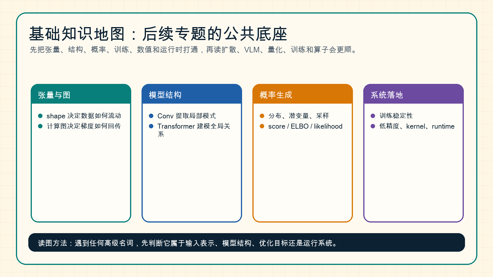

# 基础知识总览

这一组页面是后续专题的公共底座。它不追求把数学、深度学习和系统工程全部讲完，而是把阅读扩散模型、VLM、VLA、量化、训练、推理和算子时最常反复出现的概念提前讲清。

{ width="920" }

**读图提示**：遇到一个新名词时，先判断它属于哪一层：输入表示、模型结构、概率目标、训练过程，还是运行系统。很多复杂问题并不是新概念本身难，而是这些层被混在一起讨论。

## 为什么要单独有基础知识模块

很多专题页面都会反复出现同一批基础概念：

- 扩散模型会讲 `UNet`、`DiT`、`score`、`SDE/ODE`、`ELBO`。
- VLM 和 VLA 会讲 `token`、`embedding`、`cross-attention`、视觉编码器和动作 token。
- 量化会讲 `FP8`、`INT4`、显存、带宽、kernel 和 runtime。
- 训练会讲 loss、反向传播、optimizer、checkpoint、mixed precision。
- 算子与编译器会讲 GEMM、attention kernel、通信、访存和数值误差。

如果每个专题都从零解释，页面会重复且分散；如果完全不解释，初学者会很难把概念串起来。因此这里把通用部分抽出来，后面专题只需要链接回来。

## 建议阅读顺序

1. [张量、Shape 与计算图](tensors-shapes-and-computation-graphs.md)
2. [线性层、MLP 与 GEMM](linear-layers-mlp-and-gemm.md)
3. [卷积、CNN 与特征提取](convolution-and-feature-extraction.md)
4. [Transformer、Attention 与 Tokenization](transformer-attention-and-tokenization.md)
5. [位置编码、Mask 与上下文](positional-encoding-masks-and-context.md)
6. [归一化、残差与激活函数](normalization-residual-and-activation.md)
7. [概率、潜变量与生成模型](probability-latent-variables-and-generative-models.md)
8. [优化与训练基础](optimization-and-training-basics.md)
9. [自动微分、激活显存与 Checkpointing](autograd-activation-checkpointing-and-memory.md)
10. [数据划分、指标与评测基础](data-splits-metrics-and-evaluation-basics.md)
11. [数值、显存与运行时基础](numerics-memory-and-runtime-basics.md)

## 一条最短主线

如果只想快速建立直觉，可以抓住这条链：

\[
\text{Tensor} \rightarrow \text{Module} \rightarrow \text{Loss} \rightarrow \text{Gradient} \rightarrow \text{Runtime}
\]

也就是：

1. 数据先被组织成张量。
2. 张量通过 Conv、Attention、MLP 等模块流动。
3. 模型输出和目标之间形成 loss。
4. 反向传播把 loss 转成参数梯度。
5. runtime、kernel 和硬件决定这套计算能否高效执行。

这条链一旦打通，后面读扩散、量化和训练系统时会容易很多。

## 和后续专题的接口

| 基础页 | 后续最常用在哪里 | 典型问题 |
| --- | --- | --- |
| 张量与计算图 | 训练、算子、VLM、VLA | 为什么 shape 对不上，为什么显存爆了 |
| 线性层与 GEMM | Transformer、量化、算子 | 为什么大模型性能经常卡在矩阵乘 |
| 卷积与特征提取 | 扩散 UNet、视觉编码器、VLM | 为什么局部纹理和层级特征重要 |
| Transformer 与 Attention | LLM、VLM、DiT、推理 KV cache | 为什么 attention 既强又贵 |
| 位置编码与 Mask | 长上下文、VLM、VLA、推理 | 为什么 token 顺序、可见性和上下文成本必须一起看 |
| 归一化与残差 | 深层网络、低精度训练 | 为什么模型能训深，为什么数值会崩 |
| 概率与生成模型 | 扩散、世界模型、VAE | 为什么要采样，为什么要学分布 |
| 优化与训练 | 预训练、后训练、QAT | 为什么 loss 下降不等于能力可靠 |
| 自动微分与显存 | 大模型训练、多模态训练 | 为什么训练显存远高于推理，checkpointing 如何省显存 |
| 数据与评测 | 训练、量化、推理、VLM | 为什么平均分不够，为什么需要分桶和回放 |
| 数值与运行时 | 量化、推理、算子 | 为什么格式能保存不等于能跑快 |

## 一个总判断

基础知识不是“学完才能开始”的门槛，而是一个随时回查的地图。读后面的高级专题时，如果发现概念开始混乱，优先回到这里判断它属于哪一层，再继续追具体方法。
