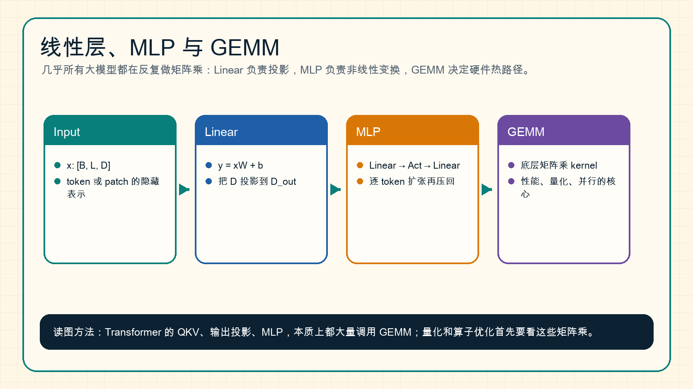

# 线性层、MLP 与 GEMM

如果把现代大模型拆到最底层，会发现大量计算都在做矩阵乘。`Linear` 层负责把表示从一个维度投影到另一个维度，`MLP` 负责逐 token 做非线性变换，而底层高性能实现通常会落到 `GEMM`。

{ width="920" }

**读图提示**：Transformer 的 QKV 投影、attention 输出投影、MLP 的升维和降维，本质上都在反复调用矩阵乘。量化、算子优化和并行训练首先要看这些矩阵乘是否高效。

## 1. Linear 层在做什么

线性层最常见的形式是：

\[
y = xW + b
\]

如果输入是：

\[
x \in \mathbb{R}^{B \times L \times D}
\]

权重是：

\[
W \in \mathbb{R}^{D \times D_{\text{out}}}
\]

输出就是：

\[
y \in \mathbb{R}^{B \times L \times D_{\text{out}}}
\]

直觉上，Linear 层是在问：当前每个 token 的 \(D\) 维表示，应该被重新组合成什么新的 \(D_{\text{out}}\) 维表示。

## 2. 为什么 Transformer 到处都是 Linear

一个 Transformer block 里常见的 Linear 包括：

| 位置 | 作用 | 典型维度变化 |
| --- | --- | --- |
| Q 投影 | 生成 query | \(D \rightarrow D\) |
| K 投影 | 生成 key | \(D \rightarrow D\) |
| V 投影 | 生成 value | \(D \rightarrow D\) |
| Attention 输出投影 | 合并多头结果 | \(D \rightarrow D\) |
| MLP 升维 | 扩张中间表达 | \(D \rightarrow 4D\) 或更大 |
| MLP 降维 | 压回 hidden size | \(4D \rightarrow D\) |

所以当你听到“优化 Transformer 性能”时，很多时候其实是在优化这些 Linear 变成的矩阵乘。

## 3. MLP 为什么通常先升维再降维

Transformer 里的 MLP 常写成：

\[
\text{MLP}(x)=W_2 \sigma(W_1x)
\]

其中 \(W_1\) 把维度升高，激活函数 \(\sigma\) 引入非线性，\(W_2\) 再把维度压回去。

这像一个“临时扩展工作台”：

1. 先把表示展开到更大的中间空间；
2. 在中间空间里做非线性组合；
3. 再把结果压回模型主干维度。

如果没有 MLP，Transformer 只有 attention 的信息混合能力，逐 token 的非线性变换会弱很多。

## 4. GEMM 为什么是硬件热路径

GEMM 是 General Matrix-Matrix Multiplication，通用矩阵乘：

\[
C = AB
\]

GPU、TPU、NPU 等加速器都非常擅长大规模矩阵乘。大模型性能优化里，很多问题最终会变成：

1. 矩阵形状是否适合硬件 tile；
2. 数据是否连续；
3. dtype 是否命中 Tensor Core 或专用低精度路径；
4. 是否能把小矩阵合并成更大的 batch GEMM；
5. 量化后是否仍有对应 INT4/FP8/FP4 kernel。

这也是为什么 [算子与编译器](../operators/index.md) 章节会反复讨论 GEMM、layout、tile 和 kernel。

## 5. 一个最小伪代码

```text
function Linear(x, W, b):
    # x: [B, L, D]
    # W: [D, D_out]
    # y: [B, L, D_out]
    return matmul(x, W) + b

function MLP(x):
    h = Linear(x, W_up, b_up)      # D -> 4D
    h = GELU(h)
    y = Linear(h, W_down, b_down)  # 4D -> D
    return y
```

## 6. 和量化有什么关系

权重量化最常压的就是 Linear 层权重，因为它们占参数量大头。常见形式包括：

- `W8A16`：权重 INT8，激活 FP16/BF16。
- `W4A16`：权重 INT4，激活 FP16/BF16。
- `W8A8`：权重和激活都 INT8。
- `FP8 W8A8`：权重和激活走 FP8 或近似 FP8 路径。

如果量化格式没有高效 GEMM kernel，模型文件虽然变小，推理可能并不会更快。这个问题会在 [量化总览](../quantization/index.md) 和 [数值、显存与运行时基础](numerics-memory-and-runtime-basics.md) 里继续展开。

## 小结

Linear 是表示投影，MLP 是逐 token 非线性变换，GEMM 是底层执行核心。理解这三者，能帮助你把 Transformer、量化、算子优化和推理性能连成一条线。

