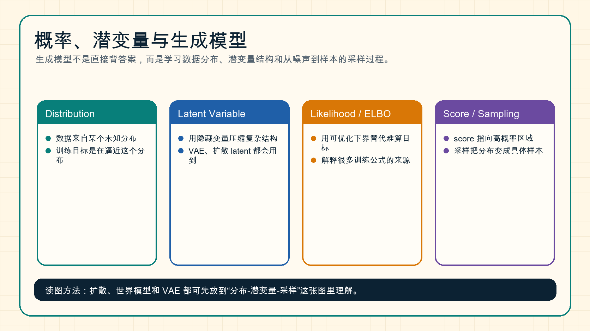

# 概率、潜变量与生成模型

生成模型的目标不是记住训练样本，而是学习数据背后的分布，并从这个分布中采样出新样本。

{ width="920" }

**读图提示**：扩散、VAE、世界模型都可以先放进“分布、潜变量、目标函数、采样”这张图里理解。不同方法只是选择了不同的建模和优化路径。

## 1. 分布是什么

可以把数据看成来自某个未知分布：

\[
x \sim p_{\text{data}}(x)
\]

生成模型希望学一个模型分布 \(p_\theta(x)\)，让它接近真实数据分布。

如果是条件生成，例如文生图，则写成：

\[
p_\theta(x \mid c)
\]

其中 \(c\) 可以是文本、类别、图像、动作或其他条件。

## 2. 潜变量为什么有用

很多数据背后有隐藏因素。例如一张人脸图片背后可能有姿态、光照、表情、身份、背景等因素。潜变量 \(z\) 用来表示这些隐藏结构：

\[
p_\theta(x) = \int p_\theta(x \mid z)p(z)\,dz
\]

直觉上，潜变量像草稿或内部状态。模型先在潜空间里组织结构，再把它解码成可见样本。

## 3. Likelihood、KL 和 ELBO

很多生成模型想最大化 likelihood：

\[
\max_\theta \log p_\theta(x)
\]

但带潜变量时，真实 likelihood 往往难算，所以会用 ELBO 这类可优化下界。

ELBO 常见形式可以粗略理解为：

\[
\text{ELBO} = \text{重建质量} - \text{潜变量分布偏离先验的代价}
\]

这解释了为什么 VAE 既要重建样本，又要约束 latent 不要乱跑。

## 4. Score 和扩散模型

Score 指的是：

\[
\nabla_x \log p(x)
\]

它表示在当前位置，往哪个方向走会更接近高概率数据区域。扩散模型可以理解为学习一个随噪声时间变化的 score field 或等价的噪声预测器。

这也是为什么扩散采样可以被看成“从噪声往数据分布走回去”。

## 5. 采样：从分布到具体样本

训练得到分布还不够，最终要采样出具体样本：

```text
z = sample_prior()
for step in sampling_steps:
    z = denoise_or_update(z, condition)
x = decode(z)
```

不同生成模型的差异，很多时候就体现在 `denoise_or_update` 怎么定义。

## 6. 和后续专题的关系

- [扩散模型总览](../diffusion/index.md)：理解加噪、去噪和 score。
- [Score Matching、SDE 与 Probability Flow](../diffusion/score-matching-sde-and-probability-flow.md)：理解连续时间生成轨迹。
- [世界模型总览](../world-models/index.md)：理解潜状态、未来预测和动作条件分布。
- [量化](../quantization/index.md)：低精度误差最终也会改变模型分布。

## 小结

生成模型的核心问题是：如何表示分布、如何训练分布、如何从分布采样。只要这三件事清楚，扩散、VAE、世界模型和视频生成之间的关系会更容易理解。

