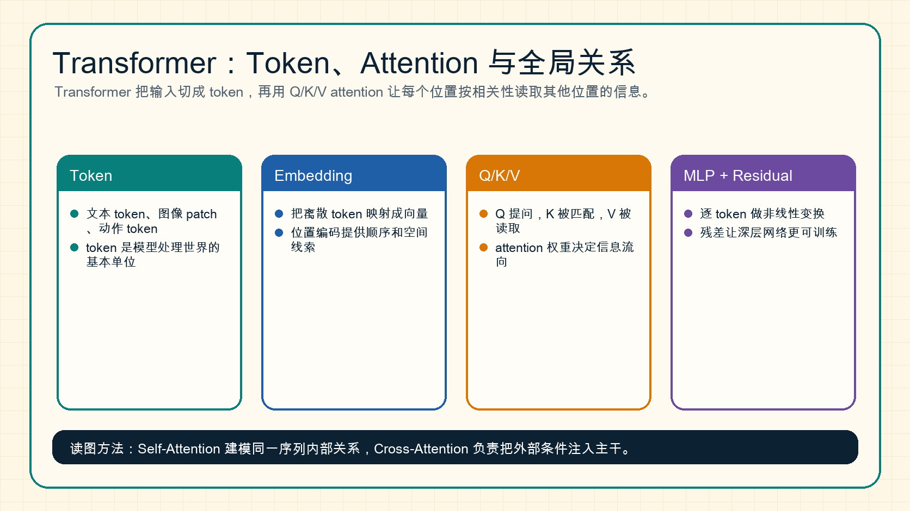

# Transformer、Attention 与 Tokenization

Transformer 是现代 LLM、VLM、DiT、世界模型和很多推理系统的核心结构。它的关键思想是：把输入变成 token，再用 attention 让 token 之间按相关性互相读取信息。

{ width="920" }

**读图提示**：Self-Attention 建模同一序列内部关系；Cross-Attention 把外部条件注入主干。扩散模型里的文本控制、VLM 里的图文对齐、VLA 里的语言到动作接口，都离不开这两个概念。

## 1. Tokenization：模型如何“切开”输入

Token 是模型处理信息的基本单位。不同模态有不同 token：

| 模态 | token 例子 |
| --- | --- |
| 文本 | subword token |
| 图像 | patch token |
| 视频 | tubelet token 或 frame token |
| 机器人 | action token、state token |
| 世界模型 | latent token、未来状态 token |

Tokenization 的作用是把复杂输入变成一个序列：

\[
x = [x_1, x_2, \ldots, x_L]
\]

然后每个 token 被映射成 embedding：

\[
h_i = \text{Embedding}(x_i)
\]

## 2. Attention 的 Q/K/V 直觉

Attention 可以用“提问、匹配、读取”理解：

- `Q`：Query，当前位置想问什么。
- `K`：Key，每个位置暴露什么可匹配信息。
- `V`：Value，真正被读取的内容。

公式是：

\[
\text{Attention}(Q,K,V)=\text{softmax}\left(\frac{QK^\top}{\sqrt{d}}\right)V
\]

这表示每个 token 会根据相似度，从其他 token 里加权读取信息。

## 3. Self-Attention 和 Cross-Attention

### Self-Attention

Q、K、V 都来自同一个序列。例如 LLM 中每个 token 读取上下文中的其他 token。

### Cross-Attention

Q 来自主干序列，K/V 来自外部条件。例如扩散模型中，图像 latent 的 query 去读取文本 embedding 的 key/value，从而让图像生成受 prompt 控制。

一个极简伪代码：

```text
# self-attention
Q = x @ Wq
K = x @ Wk
V = x @ Wv
y = softmax(Q @ K.T / sqrt(d)) @ V

# cross-attention
Q = image_latent @ Wq
K = text_embedding @ Wk
V = text_embedding @ Wv
y = softmax(Q @ K.T / sqrt(d)) @ V
```

## 4. 为什么 Attention 强也贵

Self-Attention 的核心矩阵是 \(L \times L\)，其中 \(L\) 是序列长度。序列越长，attention 计算和显存压力越大。

这解释了为什么长上下文推理会重点优化：

- KV cache
- FlashAttention
- sliding window attention
- context compression
- prefix cache

如果你关心为什么长上下文还会涉及位置编码、causal mask、padding mask 和 KV cache，可以继续看 [位置编码、Mask 与上下文](positional-encoding-masks-and-context.md)。

## 5. Transformer Block 的基本结构

一个常见 block 可以写成：

```text
function TransformerBlock(x):
    x = x + Attention(Norm(x))
    x = x + MLP(Norm(x))
    return x
```

这里的残差连接和归一化非常关键。没有它们，深层 Transformer 很难稳定训练。

## 6. 和后续专题的关系

- [扩散模型中的 DiT](../diffusion/training.md)：图像 patch token 进入 Transformer 去做去噪。
- [VLM 架构与训练](../vlm/architecture-and-training.md)：图像 token 和文本 token 如何连接。
- [推理系统](../inference/index.md)：KV cache 和 attention 决定长上下文成本。
- [算子与编译器](../operators/index.md)：FlashAttention 和 GEMM 是 Transformer 性能核心。
- [线性层、MLP 与 GEMM](linear-layers-mlp-and-gemm.md)：理解 QKV 投影、MLP 和矩阵乘热路径。

## 小结

Transformer 的核心不是“一个大模型名字”，而是一套 token 之间动态通信的机制。理解 token、embedding、Q/K/V、self-attention 和 cross-attention，就能读懂很多现代 AI 系统的共同骨架。
