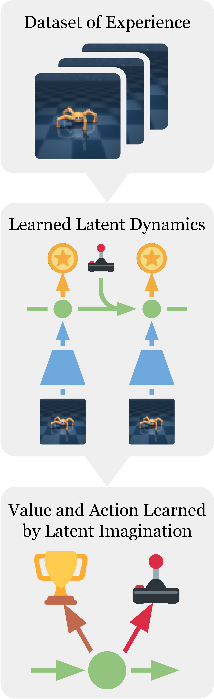
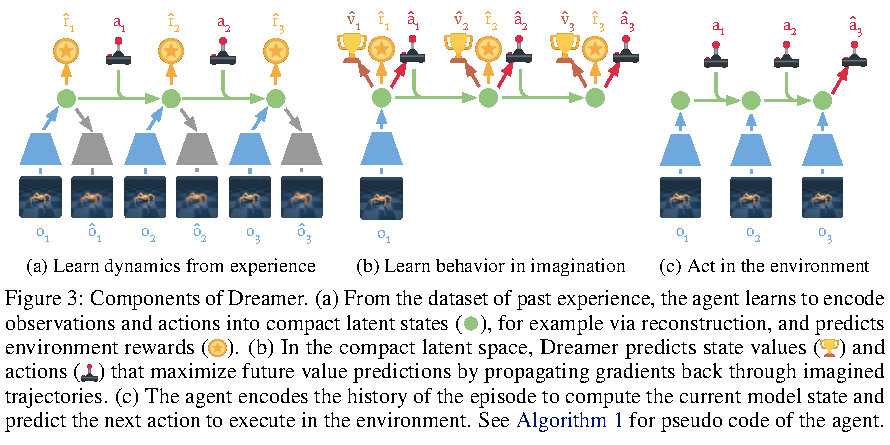
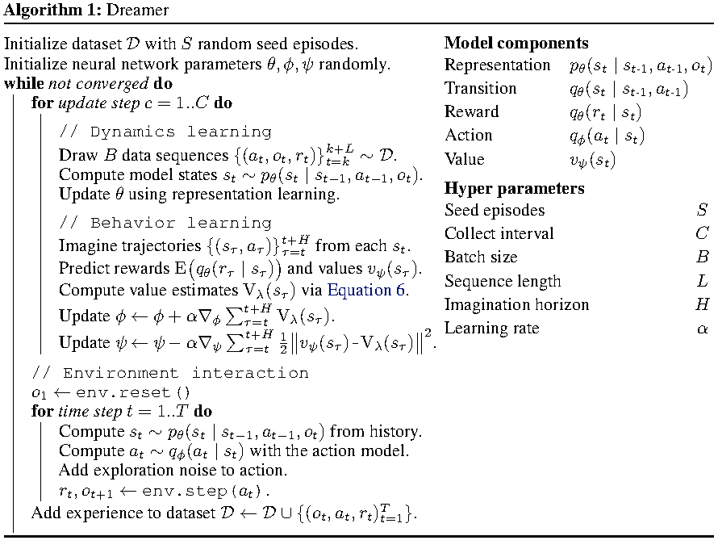
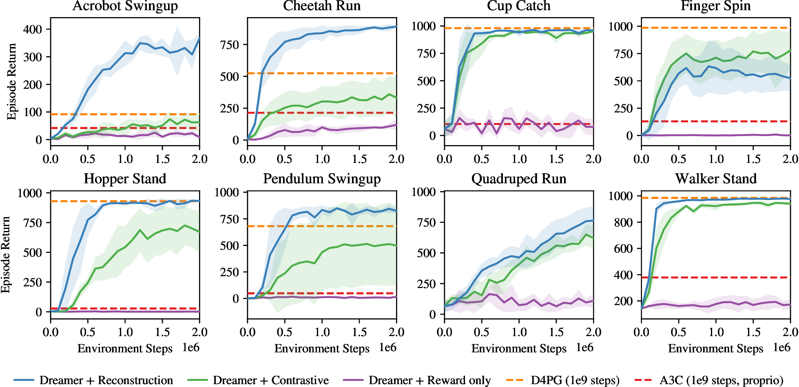
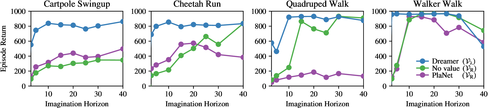
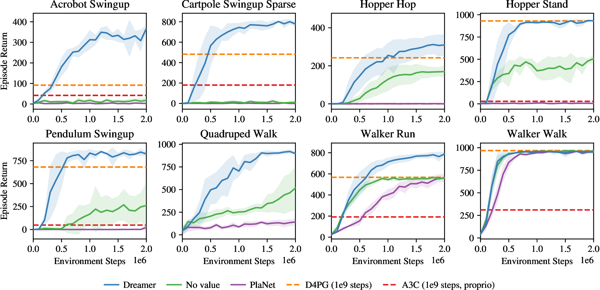
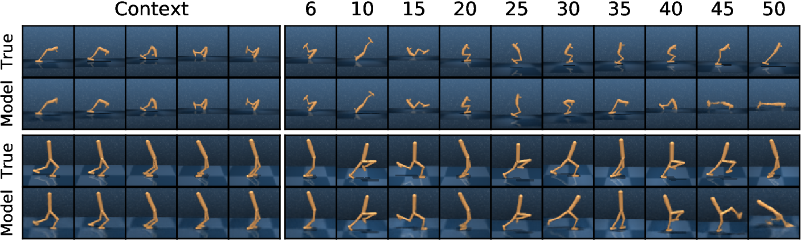
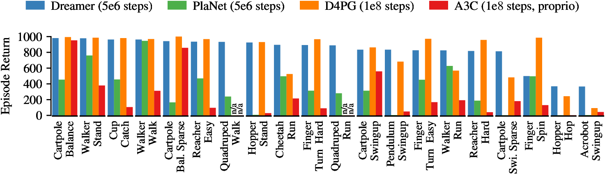

# Dreamer：Dream to Control

!!! info "论文信息"
    - 论文：`Dream to Control: Learning Behaviors by Latent Imagination`
    - 系统：`Dreamer`
    - 链接：[arXiv:1912.01603](https://arxiv.org/abs/1912.01603)
    - 项目页：[danijar.com/dreamer](https://danijar.com/dreamer)
    - 关键词：Dreamer、RSSM、latent imagination、analytic value gradients、model-based RL、actor-critic

这篇论文是从 [PlaNet](planet.md) 到 [DreamerV3](dreamerv3.md) 之间最关键的一步。PlaNet 已经证明了可以从像素交互轨迹中学习 RSSM world model，并在 latent space 中用 CEM 做在线规划。Dreamer 的核心变化是：不再每个环境 step 都做昂贵的在线搜索，而是在 learned world model 的 latent imagination 中训练 action model 和 value model。

可以把 Dreamer 压缩成一句话：

```text
experience replay
  -> learn RSSM latent dynamics
  -> imagine trajectories in latent space
  -> backpropagate value gradients through imagined trajectories
  -> train actor and critic
  -> execute actor in environment
```

它回答的问题不是“未来视频长什么样”，而是“如果我在当前 latent state 里采取某个动作，未来 latent state、reward 和 value 会怎么变化”。这让 Dreamer 成为交互轨迹驱动 latent dynamics 世界模型路线的核心节点。

{ width="430" }

<small>Figure source: `Dream to Control`, Figure 1. 原论文图注要点：Dreamer 从历史经验中学习 world model，并在其 latent space 中通过把 value estimates 反向传播穿过 imagined trajectories 来高效学习长视野行为。</small>

## 论文位置

Dreamer 的历史位置可以这样理解：

| 阶段 | 代表 | 行为生成方式 | 关键变化 |
| --- | --- | --- | --- |
| Latent planning | PlaNet | 每步用 CEM 在线规划 | RSSM 从像素学习可 rollout 的 latent dynamics |
| Latent imagination actor-critic | Dreamer | 在 imagined trajectories 上训练 actor 和 critic | 把在线 planning 成本摊到 policy learning |
| Robust generalist world model RL | DreamerV3 | 固定超参数跨域训练 | 用离散 latent、symlog、twohot、free bits 等提升鲁棒性 |

PlaNet 和 Dreamer 的 world model 很接近，但使用方式不同：

| 维度 | PlaNet | Dreamer |
| --- | --- | --- |
| 动作选择 | CEM online planning | learned action model |
| 价值估计 | 累加 planning horizon 内 reward | value model 估计 horizon 之后的收益 |
| 推理成本 | 每步大量采样 action sequences | actor 一次前向输出动作 |
| 训练重点 | world model + planner | world model + imagined actor-critic |
| 主要收益 | 数据效率高 | 数据效率高且计算更省，长视野行为更强 |

因此，Dreamer 不是替代 world model，而是把 world model 从“每步搜索的模拟器”变成“训练策略的 imagination environment”。

## 核心问题

Dreamer 针对 PlaNet 之后的两个问题。

第一，在线规划成本高。PlaNet 每个环境 step 都要在 latent space 中采样大量候选 action sequences，再用 RSSM rollout 评估 reward。这个过程比 model-free actor 慢得多，也不适合高频控制。

第二，固定 planning horizon 容易短视。只优化 horizon 内 reward，会让 agent 倾向于短期收益，尤其在 Acrobot、Hopper 这类需要长时信用分配的任务中问题明显。单纯把 horizon 变长又会让搜索空间和模型误差快速放大。

Dreamer 的解法是引入 latent actor-critic：

1. action model 负责直接给出动作；
2. value model 负责估计 imagination horizon 之后的收益；
3. actor 的梯度不通过 REINFORCE 估计，而是通过 reparameterization 反向穿过 latent dynamics、reward model 和 value model。

这就是论文标题里 `Dream to Control` 的含义：控制策略不是直接从真实环境 reward 里慢慢试出来，而是在 learned world model 里通过想象轨迹训练出来。

## 总体结构

Dreamer 包含三件事：学 dynamics、学 behavior、和环境交互。

{ width="920" }

<small>Figure source: `Dream to Control`, Figure 3. 原论文图注要点：该图展示 Dreamer 的三个组件。模型先从经验数据中把观测和动作编码到 compact latent states，并预测 reward；然后在 compact latent space 里预测 value 和 action，通过 imagined trajectories 反向传播梯度；最后在真实环境中用 episode 历史编码当前 model state 并输出下一步动作。</small>

对应到训练循环：

```text
初始化 replay dataset，先收集 S 个随机 seed episodes
while not converged:
  从 replay dataset 采样 B 条长度为 L 的序列
  更新 latent dynamics world model
  从真实序列的 latent states 出发，rollout H 步 imagined trajectories
  用 imagined rewards 和 value bootstrap 更新 value model
  通过 value estimates 反向穿过 imagined trajectories 更新 action model
  用 action model 和探索噪声收集新 episode
  追加到 replay dataset
```

{ width="820" }

<small>Figure source: `Dream to Control`, Algorithm 1. 原论文图注要点：伪代码把 Dreamer 拆成 dynamics learning、behavior learning 和 environment interaction；模型组件包括 representation、transition、reward、action 和 value，核心超参包括 seed episodes、collect interval、batch size、sequence length、imagination horizon 和 learning rate。</small>

这里最值得注意的是训练顺序：world model 先用 replay 中的真实观测序列训练；actor 和 critic 再在固定 world model 的 imagined trajectories 上训练。论文明确说，behavior learning 时 world model 是 fixed 的，这避免 actor 更新直接改写 dynamics。

## World Model 训练

Dreamer 使用的 latent dynamics 和 PlaNet 一脉相承，核心是 RSSM。论文把 world model 拆成三个基础组件：

$$
\text{Representation model:}\quad p_\theta(s_t \mid s_{t-1}, a_{t-1}, o_t)
$$

$$
\text{Transition model:}\quad q_\theta(s_t \mid s_{t-1}, a_{t-1})
$$

$$
\text{Reward model:}\quad q_\theta(r_t \mid s_t)
$$

训练阶段 representation model 可以看到真实观测 \(o_t\)，得到当前 latent state；imagination 阶段没有未来观测，只能用 transition model 根据 \(s_{t-1},a_{t-1}\) 往前预测。这个约束和 PlaNet 相同，也是 world model 能否用于控制的关键。

### Reconstruction Objective

论文默认使用 pixel reconstruction 训练 world model。此时还会加入 observation model：

$$
q_\theta(o_t \mid s_t)
$$

训练目标可以理解为三项：

| Term | Objective | Role |
| --- | --- | --- |
| \(\mathcal{J}_{O}^{t}\) | \(\ln q(o_t \mid s_t)\) | 让 latent state 保留可重建观测的信息 |
| \(\mathcal{J}_{R}^{t}\) | \(\ln q(r_t \mid s_t)\) | 让 latent state 包含决策相关 reward 信息 |
| \(\mathcal{J}_{D}^{t}\) | \(-\beta \mathrm{KL}(p(s_t \mid s_{t-1},a_{t-1},o_t)\|q(s_t \mid s_{t-1},a_{t-1}))\) | 让 transition prior 能预测 posterior latent |

也就是：

$$
\mathcal{J}_{\mathrm{REC}}
=
\mathbb{E}_{p}\left[
\sum_t
\left(
\mathcal{J}_{O}^{t}
+
\mathcal{J}_{R}^{t}
+
\mathcal{J}_{D}^{t}
\right)
\right]
+ \text{const}
$$

这不是为了部署时生成视频，而是为了给 latent state 一个密集训练信号。如果只预测 reward，稀疏奖励任务里的监督太弱，模型可能学不到那些暂时不产生 reward、但未来会影响控制的视觉因素。

### Contrastive Objective 与 Reward-only

论文还比较了三种 representation learning 目标：

| World model objective | 训练信号 | 论文实验结论 |
| --- | --- | --- |
| `Dreamer + Reconstruction` | image reconstruction + reward + KL | 大多数任务表现最好 |
| `Dreamer + Contrastive` | state model \(q(s_t\mid o_t)\) + NCE + reward + KL | 能解决约一半任务，但整体弱于 reconstruction |
| `Dreamer + Reward only` | reward prediction + KL | 在论文实验中不够 |

contrastive 目标的动机是避免像素预测占用太多模型容量。它用 state model \(q_\theta(s_t \mid o_t)\) 代替 observation decoder，并通过 batch 内负样本估计 state marginal，形式上接近 InfoNCE：

$$
\mathcal{J}_{S}^{t}
=
\ln q(s_t \mid o_t)
-
\ln \left(
\sum_{o'} q(s_t \mid o')
\right)
$$

这部分非常重要，因为它说明 Dreamer 的算法本身不绑定 pixel decoder；只要 world model 能产生可 rollout 的 latent states 和 rewards，actor-critic 部分可以接上不同 representation learning objective。只是在这篇论文的实验条件下，pixel reconstruction 仍是最稳定的选择。

{ width="920" }

<small>Figure source: `Dream to Control`, Figure 8. 原论文图注要点：该图比较 Dreamer 使用不同 representation learning objectives 的表现；pixel reconstruction 在多数任务上最好，contrastive objective 约能解决一半任务，而只预测 reward 在实验中不足。</small>

### 具体训练超参

论文给出的实现细节很有工程参考价值。

| Detail | Value |
| --- | --- |
| Encoder / decoder | convolutional encoder and decoder networks from World Models |
| Dynamics | RSSM from PlaNet |
| Other functions | 3 dense layers of size 300 with ELU activations |
| Latent distribution | 30-dimensional diagonal Gaussians |
| World model learning rate | \(6\times10^{-4}\) |
| Action model learning rate | \(8\times10^{-5}\) |
| Value model learning rate | \(8\times10^{-5}\) |
| Batch size | 50 sequences |
| Sequence length | 50 |
| Gradient clipping | scale down gradient norms that exceed 100 |
| KL regularizer | \(\beta=1\), clipped below 3 free nats |
| Imagination horizon | \(H=15\) for continuous control |
| Return parameters | \(\gamma=0.99,\lambda=0.95\) |
| Seed dataset | \(S=5\) random episodes |
| Collection schedule | 100 training steps, then collect 1 episode |
| Exploration noise | \(\mathcal{N}(0,0.3)\) |
| Action repeat | \(R=2\) across tasks |

论文还明确提到几个“没有使用”的设计：latent overshooting、action model entropy bonus、value target networks 在这里都不是必要的。这个信息很有用，因为它说明 Dreamer 的核心提升不是靠更复杂的 world model 正则，而是靠把 behavior learning 改成 latent actor-critic。

## Behavior Learning

Dreamer 的行为学习发生在 latent space。imagined trajectory 从 replay 序列编码出的真实 model state \(s_t\) 出发，然后循环：

$$
a_\tau \sim q_\phi(a_\tau \mid s_\tau)
$$

$$
s_{\tau+1} \sim q_\theta(s_{\tau+1} \mid s_\tau,a_\tau)
$$

$$
r_{\tau+1} \sim q_\theta(r_{\tau+1} \mid s_{\tau+1})
$$

这里的 \(\tau\) 是 imagination time index，不是真实环境时间。actor 和 critic 都只看 latent state：

$$
\text{Action model:}\quad a_\tau \sim q_\phi(a_\tau \mid s_\tau)
$$

$$
\text{Value model:}\quad v_\psi(s_\tau)\approx
\mathbb{E}\left[
\sum_{\tau=t}^{t+H}
\gamma^{\tau-t}r_\tau
\right]
$$

连续控制中，action model 输出 tanh-transformed Gaussian。均值由网络预测后乘以 5，标准差通过 softplus 得到，然后再经过 tanh 变换：

$$
a_\tau
=
\tanh\left(
\mu_\phi(s_\tau)
+
\sigma_\phi(s_\tau)\epsilon
\right),
\quad
\epsilon\sim\mathcal{N}(0,I)
$$

这个 reparameterization 很关键。它让 sampled action 可以看成网络输出的可微函数，从而允许梯度从 value estimates 反向穿过 action、transition、reward 和 future value。

### \(\lambda\)-return

Dreamer 不是只最大化 horizon 内 reward，而是用 learned value model 做 bootstrap。论文比较了三种 value estimates：

$$
V_R(s_\tau)
=
\mathbb{E}
\left[
\sum_{n=\tau}^{t+H}r_n
\right]
$$

$$
V_N^k(s_\tau)
=
\mathbb{E}
\left[
\sum_{n=\tau}^{h-1}
\gamma^{n-\tau}r_n
+
\gamma^{h-\tau}v_\psi(s_h)
\right],
\quad
h=\min(\tau+k,t+H)
$$

$$
V_\lambda(s_\tau)
=
(1-\lambda)
\sum_{n=1}^{H-1}
\lambda^{n-1}
V_N^n(s_\tau)
+
\lambda^{H-1}V_N^H(s_\tau)
$$

直觉上，\(V_R\) 只看 horizon 内 reward，bias 低但非常短视；\(V_N^k\) 用 value model 估计 \(k\) 步之后的收益；\(V_\lambda\) 把不同 \(k\) 的估计做指数加权，平衡 bias 和 variance。

### Actor 与 Critic 更新

value model 回归 stop-gradient 后的 \(\lambda\)-return target：

$$
\min_\psi
\mathbb{E}
\left[
\sum_{\tau=t}^{t+H}
\frac{1}{2}
\left\|
v_\psi(s_\tau)
-
V_\lambda(s_\tau)
\right\|^2
\right]
$$

action model 则最大化 imagined states 上的 value estimates：

$$
\max_\phi
\mathbb{E}
\left[
\sum_{\tau=t}^{t+H}
V_\lambda(s_\tau)
\right]
$$

关键区别在于 actor 梯度不是从真实环境采样得到的 policy gradient，而是 analytic gradients through learned dynamics。因为 transition、reward、value 和 action model 都是神经网络，Dreamer 可以通过 stochastic backpropagation 直接计算 actor 参数对 multi-step value estimates 的影响。

{ width="920" }

<small>Figure source: `Dream to Control`, Figure 4. 原论文图注要点：该图比较 Dreamer、没有 value prediction 的 action model、以及 PlaNet online planning 在不同 imagination horizon 下的最终表现；value model 能估计 horizon 之后的 reward，使 Dreamer 对 horizon length 更鲁棒。</small>

Figure 4 支持了 Dreamer 的核心论点：只优化 horizon 内 imagined rewards 容易短视；引入 value model 后，即使 horizon 不长，也能学习需要长期信用分配的行为。

{ width="920" }

<small>Figure source: `Dream to Control`, Figure 7. 原论文图注要点：Dreamer 能解决需要 long-horizon credit assignment 的视觉控制任务，例如 acrobot 和 hopper；只优化 horizon 内 imagined rewards 的 action model 或在线规划更容易产生短视行为，而在 walker 这类反应式任务中更容易成功。</small>

## 离散动作与 Early Termination

Dreamer 主要实验是连续控制，但论文也补充了离散动作和 early termination 的设置。这里有几个训练细节值得记住：

| Setting | Detail |
| --- | --- |
| Discrete action model | predicts logits of a categorical distribution |
| Gradient estimator | straight-through gradients during latent imagination |
| Exploration | epsilon greedy, \(\epsilon\) linearly scheduled from 0.4 to 0.1 over first 200,000 gradient steps |
| Imagination horizon | \(H=10\) |
| KL scale | \(\beta=0.1\) |
| Rewards | bounded using tanh |
| Termination | predict discount factor from latent state with a binary classifier trained toward soft labels 0 and \(\gamma\) |

这说明 Dreamer 的 latent imagination 不是只能处理连续控制。只要 action sampling 能给 actor 提供可用梯度，离散动作也可以通过 straight-through estimator 接入同一套框架。early termination 则通过预测 discount factor，把 imagined trajectory 中已经可能终止的步权重降下来。

## 实验结论

论文在 DeepMind Control Suite 的 20 个视觉控制任务上评估 Dreamer。输入是 \(64\times64\times3\) 图像，动作维度从 1 到 12，reward 范围为 0 到 1，episode 长度 1000，action repeat 固定为 \(R=2\)。

论文先用 open-loop prediction 检查 RSSM 是否能做长程视觉预测。

{ width="920" }

<small>Figure source: `Dream to Control`, Figure 5. 原论文图注要点：模型先用 representation model 处理 hold-out trajectories 的前 5 帧，然后只给动作、用 latent dynamics 向前预测 45 步；RSSM 能做较准确的长程预测，使 Dreamer 可以在 compact latent space 中学习行为。</small>

这张图的意义和 PlaNet 类似：它不是为了证明 Dreamer 是视频生成模型，而是为了诊断 latent dynamics 是否能在没有未来观测的情况下继续 rollout。

主要性能对比如下。

{ width="920" }

<small>Figure source: `Dream to Control`, Figure 6. 原论文图注要点：Dreamer 继承 PlaNet 的数据效率，同时超过最佳 model-free agents 的渐近表现；在 \(5\times10^6\) environment steps 后，Dreamer 平均分 823，PlaNet 为 332，而 D4PG 在 \(10^8\) steps 后为 786，结果为 5 个 seeds 的平均。</small>

从实验数字看，Dreamer 的贡献有三层：

1. 相比 D4PG，Dreamer 用 \(5\times10^6\) environment steps 达到 823 平均分，而 D4PG 用 \(10^8\) steps 达到 786；
2. 相比 PlaNet，Dreamer 在相同 \(5\times10^6\) steps 下平均分 823，而 PlaNet 为 332；
3. 计算时间上，论文报告 Dreamer 在 Control Suite 上约 3 hours per \(10^6\) environment steps，PlaNet online planning 约 11 hours，D4PG 达到类似表现约 24 hours。

Appendix 中的 continuous control scores 如下。字段和值保持论文原格式。

|  | A3C | D4PG | PlaNet | Dreamer |
| --- | ---: | ---: | ---: | ---: |
| Input modality | proprio | pixels | pixels | pixels |
| Environment steps | \(10^8\) | \(10^8\) | \(5\times10^6\) | \(5\times10^6\) |
| Acrobot Swingup | 41.90 | 91.70 | 3.21 | 365.26 |
| Cartpole Balance | 951.60 | 992.80 | 452.56 | 979.56 |
| Cartpole Balance Sparse | 857.40 | 1000.00 | 164.74 | 941.84 |
| Cartpole Swingup | 558.40 | 862.00 | 312.56 | 833.66 |
| Cartpole Swingup Sparse | 179.80 | 482.00 | 0.64 | 812.22 |
| Cheetah Run | 213.90 | 523.80 | 496.12 | 894.56 |
| Cup Catch | 104.70 | 980.50 | 455.98 | 962.48 |
| Finger Spin | 129.40 | 985.70 | 495.25 | 498.88 |
| Finger Turn  Easy | 167.30 | 971.40 | 451.22 | 825.86 |
| Finger Turn  Hard | 88.70 | 966.00 | 312.55 | 891.38 |
| Hopper Hop | 0.50 | 242.00 | 0.37 | 368.97 |
| Hopper Stand | 27.90 | 929.90 | 5.96 | 923.72 |
| Pendulum Swingup | 48.60 | 680.90 | 3.27 | 833.00 |
| Quadruped Run | - | - | 280.45 | 888.39 |
| Quadruped Walk | - | - | 238.90 | 931.61 |
| Reacher Easy | 95.60 | 967.40 | 468.50 | 935.08 |
| Reacher Hard | 39.70 | 957.10 | 187.02 | 817.05 |
| Walker Run | 191.80 | 567.20 | 626.25 | 824.67 |
| Walker Stand | 378.40 | 985.20 | 759.19 | 977.99 |
| Walker Walk | 311.00 | 968.30 | 944.70 | 961.67 |
| Average | 243.70 | 786.32 | 332.97 | 823.39 |

这张表最重要的不是 Dreamer 每个任务都最高，而是它在少 20 倍环境步数的条件下，整体平均超过 D4PG，并显著超过同样使用 world model 的 PlaNet。也就是说，Dreamer 保留了 model-based RL 的数据效率，同时把 action selection 从昂贵 online planning 迁移到 amortized actor。

## 和视频世界模型路线的关系

Dreamer 会重建图像，也会展示 open-loop video predictions，但它不是视频生成型世界模型。它和 LingBot-World 这类路线的区别在于：

| 维度 | Dreamer | 视频生成型世界模型 |
| --- | --- | --- |
| 数据 | agent interaction trajectories: observation, action, reward | 大规模视频、图文视频、相机轨迹、动作或交互信号 |
| 核心状态 | compact latent state \(s_t\) | video latent 或帧级 latent |
| 训练目标 | latent dynamics、reward prediction、representation learning | future video generation、action-conditioned video rollout |
| 行为接口 | action model \(q_\phi(a_t\mid s_t)\) | 通常还需要额外 planner 或 policy |
| 主要输出 | 动作、value、latent rollout | 未来视频或可交互视觉场景 |

所以 Dreamer 里的 action 不是最终解释视频的附加标签，而是 world model transition 的核心条件变量。模型训练的目标是：

$$
s_t,a_t \rightarrow s_{t+1},r_{t+1},v_{t+1}
$$

而不是：

$$
o_t \rightarrow o_{t+1}
$$

这也是为什么 Dreamer 更接近 model-based RL 世界模型路线，而不是 video-generation-based world simulator 路线。

## 局限与后续影响

Dreamer 的局限也比较清楚。

1. 视觉复杂度有限。论文主要成功集中在 DeepMind Control Suite 的低分辨率视觉控制任务；Atari 和 DMLab 只是证明适用性，还不是全面竞争。
2. representation learning 仍是瓶颈。Figure 8 显示 reconstruction 明显好于 contrastive 和 reward-only，说明当时的 latent representation 对图像重建信号依赖较强。
3. learned dynamics 仍可能被 actor exploit。actor 通过 world model 梯度优化，如果 model bias 存在系统漏洞，policy 可能学到只在模型里有效的行为。
4. 对训练稳定性和超参仍敏感。Dreamer 使用同一组连续控制超参，但还没有 DreamerV3 那种跨域固定超参鲁棒性。
5. 它不是开放世界模拟器。Dreamer 的目标是控制收益，不是高保真开放场景生成。

从后续发展看，Dreamer 的贡献非常明确：它把 PlaNet 的 RSSM world model 接到了 latent actor-critic 上，证明 imagined rollout 不只可以用于在线 planning，也可以高效训练 policy。DreamerV2、DreamerV3 后续主要是在这个基础上提升离散 latent、任务范围、鲁棒性和超参迁移。

## 阅读结论

Dreamer 最值得记住的是三点：

1. world model 学的是 action-conditioned latent dynamics，而不是单纯视频预测；
2. behavior learning 不再依赖 CEM online planning，而是在 latent imagination 中训练 actor 和 critic；
3. value model 是解决有限 imagination horizon 短视问题的关键。

一句话总结：Dreamer 是交互轨迹型世界模型路线从“会模拟、会规划”走向“会在模拟中训练策略”的关键论文。它把 RSSM latent world model 变成了一个可微的 imagination environment，并用 analytic value gradients 在里面学习长视野控制行为。
