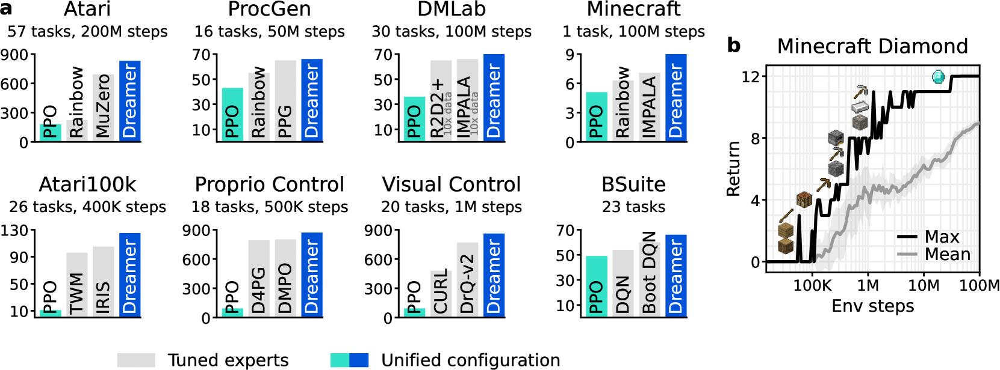
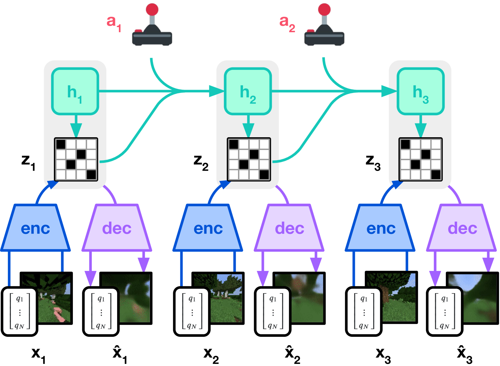
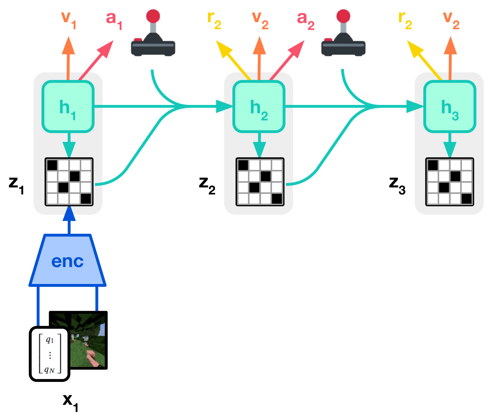
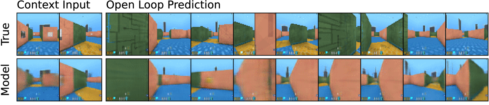
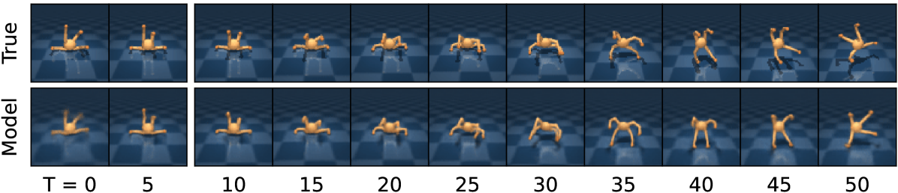
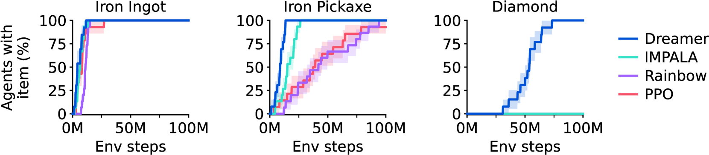
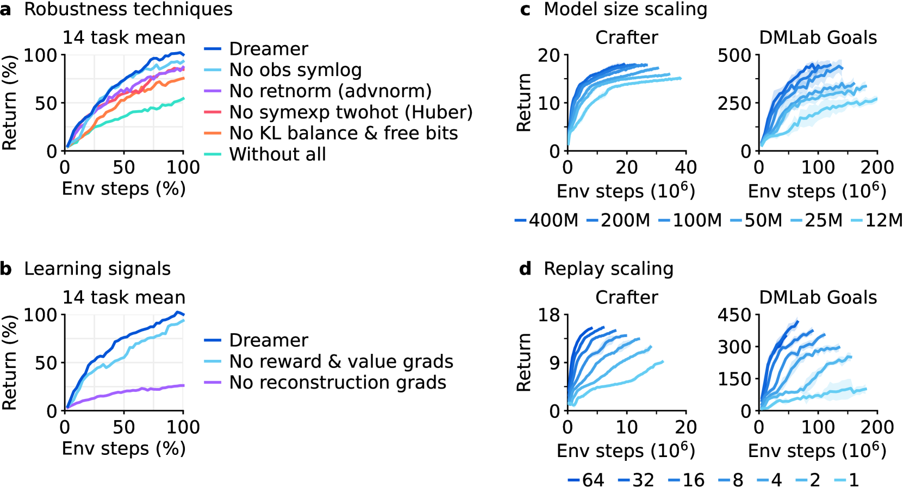

# DreamerV3：Mastering Diverse Domains through World Models

!!! info "论文信息"
    - 论文：`Mastering Diverse Domains through World Models`
    - 系统：`DreamerV3`
    - 链接：[arXiv:2301.04104](https://arxiv.org/abs/2301.04104)
    - 代码：[GitHub](https://github.com/danijar/dreamerv3)
    - 关键词：RSSM、latent dynamics、model-based RL、imagined rollout、fixed hyperparameters、Minecraft Diamond

这篇论文是理解“交互轨迹驱动的 latent dynamics 世界模型路线”的核心入口。它不从大规模视频生成出发，而是从 agent 与环境交互产生的 \((x_t, a_t, r_t, c_t)\) 轨迹中学习世界模型，再在模型内部 rollout 出抽象未来，用这些 imagined trajectories 训练 actor 和 critic。

## 论文位置

DreamerV3 和 [LingBot-World](lingbot-world.md)、[DreamZero](dreamzero.md) 的位置不同。LingBot-World 代表“视频生成模型路线”：先学会生成未来画面，再加入动作、交互、长记忆和实时化。DreamZero 则把视频基础模型改造成 joint video-action prediction，让 WAM 直接输出机器人动作。

DreamerV3 代表另一条更经典的 model-based RL 路线：

```text
环境交互轨迹
  -> RSSM latent world model
  -> imagined rollout
  -> actor-critic policy learning
```

它的世界模型不追求生成高清视频，而是学习对决策有用的 latent state、reward 和 continuation。换句话说，DreamerV3 的重点不是“未来看起来像不像”，而是“如果我做这个动作，隐状态、奖励和终止概率会怎样变化”。

{ width="920" }

<small>Figure source: `Mastering Diverse Domains through World Models`, Figure 1. 原论文图注要点：该图汇总跨基准结果，强调 Dreamer 在固定超参数下超过多类专家算法和 PPO，并能在 Minecraft 稀疏奖励任务中从零学会获得钻石。</small>

## 核心问题

Dreamer 系列一直在回答一个问题：能否先学习一个可 rollout 的世界模型，再用这个模型内部的想象轨迹训练策略，从而减少真实环境采样。

DreamerV3 把问题进一步推到“跨域鲁棒性”：同一个算法、同一套超参数，是否能同时覆盖 Atari、ProcGen、DMLab、连续控制、视觉控制、BSuite、Crafter 和 Minecraft 这些差异很大的环境。

这件事难在三个地方：

1. 观测尺度不同：有的是图像，有的是低维向量；
2. 奖励尺度不同：有的是 dense reward，有的是极稀疏 reward；
3. 环境复杂度不同：从 2D 游戏到随机生成的 3D Minecraft，状态和长期信用分配难度完全不同。

DreamerV3 的主要贡献不是换一个更大的 backbone，而是把 world model、critic、actor 的目标函数都做成更鲁棒的形式，让固定超参数在不同域里都能工作。

## 总体训练循环

论文把 DreamerV3 拆成三个网络：

| Component | Role |
| --- | --- |
| World Model | Encodes observations, predicts future latent representations, rewards, and continuation flags |
| Critic | Estimates return distributions on imagined latent trajectories |
| Actor | Chooses actions from latent model states to maximize imagined returns |

训练时，agent 一边和环境交互，一边把经验写入 replay buffer。之后从 replay buffer 采样短序列，更新 world model；再从 world model 的 latent state 出发做 imagined rollout，更新 critic 和 actor。环境交互时不做在线树搜索，动作直接从 actor 采样。

{ width="920" }

<small>Figure source: `Mastering Diverse Domains through World Models`, Figure 3(a). 原论文图注要点：该图展示 Dreamer 的训练流程，world model 将感知输入编码为离散表示，并在动作条件下由 recurrent state 预测未来表示。</small>

{ width="920" }

<small>Figure source: `Mastering Diverse Domains through World Models`, Figure 3(b). 原论文图注要点：actor 和 critic 在 world model 预测出的抽象表示轨迹上学习动作与价值，重建目标用于塑造 latent representation。</small>

## World Model 训练细节

DreamerV3 的 world model 使用 `Recurrent State-Space Model`。RSSM 的核心是把状态拆成确定性 recurrent state \(h_t\) 和随机 latent representation \(z_t\)。前者负责记忆历史，后者负责表达当前观测中与未来相关的不确定信息。

RSSM 的主要组件可以写成：

$$
h_t = f_\phi(h_{t-1}, z_{t-1}, a_{t-1})
$$

$$
z_t \sim q_\phi(z_t \mid h_t, x_t)
$$

$$
\hat{z}_t \sim p_\phi(\hat{z}_t \mid h_t)
$$

$$
\hat{r}_t \sim p_\phi(\hat{r}_t \mid h_t, z_t), \quad
\hat{c}_t \sim p_\phi(\hat{c}_t \mid h_t, z_t), \quad
\hat{x}_t \sim p_\phi(\hat{x}_t \mid h_t, z_t)
$$

这里的 \(x_t\) 是观测，\(a_t\) 是动作，\(r_t\) 是奖励，\(c_t\) 是 episode continuation flag。训练阶段 encoder 可以看到真实观测得到 posterior \(q_\phi(z_t \mid h_t, x_t)\)，但 imagined rollout 阶段没有未来观测，只能用 dynamics predictor \(p_\phi(z_t \mid h_t)\) 自己往前滚。

这正是 DreamerV3 的关键约束：posterior 表示必须包含足够信息来重建观测和预测奖励，但又不能变得太依赖真实观测，否则 rollout 时 prior 预测不出来。

### 三个损失

DreamerV3 的 world model loss 由三类项组成：

$$
\mathcal{L}_{pred}(\phi) =
-\ln p_\phi(x_t \mid z_t,h_t)
-\ln p_\phi(r_t \mid z_t,h_t)
-\ln p_\phi(c_t \mid z_t,h_t)
$$

$$
\mathcal{L}_{dyn}(\phi) =
\max\left(1,
\operatorname{KL}\left[
\operatorname{sg}(q_\phi(z_t \mid h_t,x_t))
\| p_\phi(z_t \mid h_t)
\right]\right)
$$

$$
\mathcal{L}_{rep}(\phi) =
\max\left(1,
\operatorname{KL}\left[
q_\phi(z_t \mid h_t,x_t)
\| \operatorname{sg}(p_\phi(z_t \mid h_t))
\right]\right)
$$

三项的分工很清楚：

1. `prediction loss` 让 \(h_t,z_t\) 能重建观测、预测奖励和预测是否继续；
2. `dynamics loss` 让 prior \(p_\phi(z_t \mid h_t)\) 学会预测 posterior 表示；
3. `representation loss` 让 posterior 表示变得更可预测，避免 encoder 任意编码细节。

`sg` 是 stop-gradient。它让 dynamics loss 主要训练 prior，让 representation loss 主要约束 posterior。这个拆分比单个 KL 更好解释，也更容易控制梯度方向。

### Free bits

论文对 dynamics loss 和 representation loss 使用 `free bits`，把 KL 项下限裁到 `1 nat`。直觉是：如果 KL 已经足够小，就不要继续压缩 representation，否则模型可能学到一个太容易预测、但对任务和重建都不够有信息量的 latent。

这对跨域固定超参数很关键。复杂 3D 环境里，观测包含大量和控制无关的细节，需要更强正则；而 Atari 这类任务里，单个像素或小物体可能决定动作，需要保留细节。DreamerV3 用 `free bits + small representation loss` 缓解了这个环境差异。

### Uniform mix

DreamerV3 的 encoder 和 dynamics predictor 使用 categorical distributions。为了避免分布变得过于确定、导致 KL spike，论文把分类分布参数化为 `1% uniform + 99% neural network output` 的混合形式。

这相当于给离散 latent 的概率分布留出一个很小的熵下限。它不是为了增加探索，而是为了让 world model 的 KL 数值更平滑，避免变分模型训练中常见的尖峰。

### Symlog 与 symexp twohot

DreamerV3 还处理了一个经常被忽略的问题：不同环境的观测、奖励和回报量级可能差很多。如果直接用 MSE 或标准回归，极端数值会主导梯度，固定超参数很难跨域工作。

论文使用 `symlog` 压缩大正数和大负数：

$$
\operatorname{symlog}(x) = \operatorname{sign}(x)\ln(|x|+1)
$$

对应反变换为：

$$
\operatorname{symexp}(x) = \operatorname{sign}(x)(\exp(|x|)-1)
$$

具体用法是：

| Target | Treatment |
| --- | --- |
| Vector observations | Use symlog for encoder inputs and decoder targets |
| Rewards | Use symexp twohot loss |
| Critic returns | Use symexp twohot loss |
| Continue flag | Use logistic regression |

`twohot` 的作用是把连续标量编码到相邻两个 bins 上，再用分类交叉熵训练。论文设置的 bins 是 `symexp([-20, ..., +20])`。这样梯度大小主要由分类误差决定，而不是由目标数值的绝对大小决定。

### World model 训练到底学了什么

从训练目标看，DreamerV3 的 world model 不是单纯的视频预测器。它同时学四类东西：

1. 从观测到 latent state 的编码；
2. 在动作条件下的 latent dynamics；
3. reward 和 continuation 的 readout；
4. 能约束 latent 表示的信息重建目标。

这里最重要的是第二点和第三点。世界模型必须能回答：

$$
s_t, a_t \rightarrow s_{t+1}, r_{t+1}, c_{t+1}
$$

而不是只回答：

$$
x_t \rightarrow x_{t+1}
$$

这也是 DreamerV3 和视频生成型世界模型的根本区别。

{ width="820" }

{ width="820" }

<small>Figure source: `Mastering Diverse Domains through World Models`, Figure 4. 原论文图注要点：给定 5 张上下文图像和完整动作序列，模型在 DMLab 迷宫和四足机器人环境中预测未来 45 帧，用于展示 world model 对环境结构的建模。</small>

## Imagined Rollout 与策略学习

World model 学好后，DreamerV3 并不是把它拿去生成视频给人看，而是在 latent space 里 rollout：

```text
从 replay trajectory 中编码一个起始 state
  -> actor 在 state 上采样 action
  -> RSSM prior 预测下一个 latent state
  -> reward head 和 continue head 预测收益与终止
  -> 重复 T=16 步
  -> 用 imagined trajectory 更新 critic 和 actor
```

critic 学习 return distribution，而不是只回归一个标量 value。论文使用 \(\lambda\)-return：

$$
R^\lambda_t =
r_t + \gamma c_t ((1-\lambda)v_t + \lambda R^\lambda_{t+1}),
\quad R^\lambda_T = v_T
$$

其中 \(\gamma = 0.997\)，prediction horizon \(T = 16\)。continue flag \(c_t\) 在这里很重要：如果模型预测 episode 已经终止，未来回报不应该继续无条件累加。

actor 使用 Reinforce estimator，同一套形式覆盖离散动作和连续动作。为了让 entropy regularizer 可以跨域固定，DreamerV3 对 return scale 做归一化：用 batch 中 \(R^\lambda_t\) 的 95th percentile 和 5th percentile 差值估计范围，并用 EMA 平滑。

关键设置包括：

| Quantity | Value |
| --- | --- |
| discount factor | 0.997 |
| prediction horizon | 16 |
| entropy scale | \(3 \times 10^{-4}\) |
| return range estimator | EMA(Per(\(R^\lambda_t\), 95) - Per(\(R^\lambda_t\), 5), 0.99) |
| imagined critic loss scale | 1 |
| replay critic loss scale | 0.3 |

这说明 DreamerV3 的策略学习并不是“world model 预测未来帧，然后策略看未来帧”。它更像是把真实环境压缩成一个可微、可采样的 latent simulator，actor 和 critic 直接在这个内部模拟器上学习。

## 实验结论

DreamerV3 的实验结论主要支持三点。

第一，固定超参数可以跨很多环境工作。论文在 8 个 domain、超过 150 个任务上评估，覆盖视觉输入、低维输入、离散动作、连续动作、稠密奖励、稀疏奖励、2D、3D 和程序生成环境。

第二，Minecraft Diamond 证明了 learned world model 对长时、稀疏奖励探索有实际价值。论文报告 DreamerV3 在不使用人类数据和 adaptive curricula 的情况下，从零学会获得 diamond；所有 Minecraft agents 在 100M environment steps 内发现 diamonds。

{ width="920" }

<small>Figure source: `Mastering Diverse Domains through World Models`, Figure 5. 原论文图注要点：该图统计 Minecraft Diamond 任务中训练出的 agent 发现关键物品的比例，突出 Dreamer 相比基线能可靠发现钻石。</small>

第三，ablation 支持“world model 的无监督重建信号很关键”。论文对鲁棒化技巧和学习信号做消融，发现 KL objective、return normalization、symexp twohot regression 都有贡献；同时 DreamerV3 的性能很大程度依赖 world model 的 unsupervised reconstruction loss，而不是只靠 reward/value prediction gradients。

{ width="920" }

<small>Figure source: `Mastering Diverse Domains through World Models`, Figure 6. 原论文图注要点：该图展示 Dreamer 的鲁棒性消融和 scaling 结果，包括各个稳健化技巧、无监督重建损失、模型规模和 replay ratio 对性能的影响。</small>

Figure 6 还显示了两个 scaling 结论：模型规模从 12M 增加到 400M 时，性能整体提升；更高 replay ratio 也能提高数据效率。这给 model-based RL 一个很重要的工程启发：如果环境交互贵，可以用更多模型更新和更大的 world model 换取更少真实采样。

## 和视频世界模型的关系

DreamerV3 和 LingBot-World 都可以叫 world model，但训练对象和使用方式不同。

| 维度 | DreamerV3 | LingBot-World / 视频路线 |
| --- | --- | --- |
| 数据来源 | agent-environment interaction trajectories | large-scale video and video-action data |
| 核心状态 | latent RSSM state \(s_t = (h_t,z_t)\) | video latent / frame sequence |
| 训练目标 | reconstruction, dynamics KL, reward prediction, continuation prediction | video generation, video continuation, action-conditioned future video |
| rollout 空间 | latent space | visual/video space |
| 下游用途 | actor-critic learning and planning | visual simulation, interaction, data generation |
| 主要风险 | model bias hurts policy learning | visual plausibility may not imply action-grounded dynamics |

这也是为什么 DreamerV3 值得和视频世界模型分开讲。DreamerV3 的世界模型更像“决策内部引擎”；LingBot-World 更像“可视化世界模拟器”。前者直接服务 policy learning，后者更强调视觉真实感、长时一致性和交互体验。

## 和 DreamZero 的关系

DreamZero 和 DreamerV3 都关心动作后果，但接口不同。

DreamerV3 学的是：

$$
s_t, a_t \rightarrow s_{t+1}, r_{t+1}, c_{t+1}
$$

DreamZero 学的是：

$$
o_{\le t}, q_t, c \rightarrow o_{t:t+H}, a_{t:t+H}
$$

所以 DreamerV3 是 dynamics-first：先建模世界，再在 imagined latent dynamics 里训练 policy。DreamZero 是 WAM/policy 融合：模型联合预测未来视频和动作，并把 WAM 直接部署成 zero-shot policy。

如果把两条路线放到机器人方向里看，DreamerV3 提供的是“怎么训练一个可规划的内部动力学模型”；DreamZero 提供的是“怎么把视频基础模型改造成能直接输出动作的闭环策略”。

## 局限与启发

DreamerV3 的局限也很清楚。它需要环境交互轨迹和 reward/continuation 信号，因此不像大视频模型那样可以直接吃互联网视频。它的 rollout 发生在 latent space 中，可解释性和视觉真实感都弱于视频生成路线。并且一旦 world model 在关键状态上预测偏了，actor 会在错误的 imagined future 上被优化，形成 model bias。

但它给世界模型训练留下了几个非常可复用的经验：

1. world model 不应该只预测 observation，还要预测 reward 和 continuation；
2. posterior 和 prior 的训练目标要拆开，否则 latent 容易在“信息量”和“可预测性”之间失衡；
3. 跨域训练时，数值尺度处理不是小技巧，而是算法能否固定超参数运行的前提；
4. imagined rollout 的价值不在于生成漂亮画面，而在于提供可训练 policy 的内部环境；
5. 如果真实交互昂贵，提高 replay ratio 和扩大 world model 规模可能比盲目增加环境采样更划算。

一句话概括：DreamerV3 展示的是 `latent dynamics / model-based RL` 世界模型的成熟形态。它把世界模型从“预测未来的表示器”推进到“能支撑策略学习的内部模拟器”。
