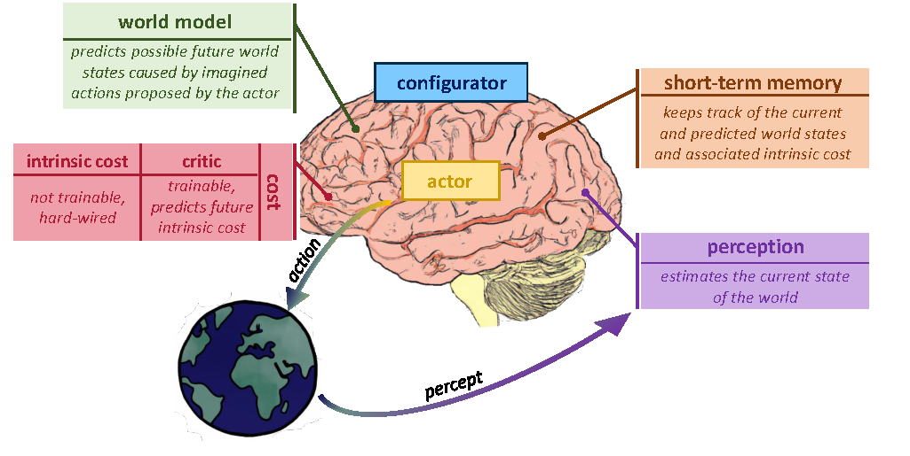
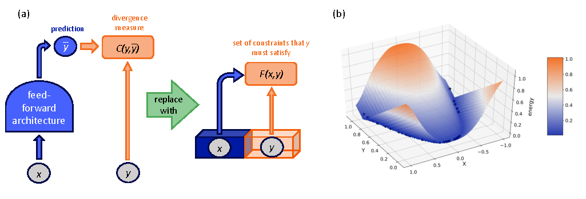
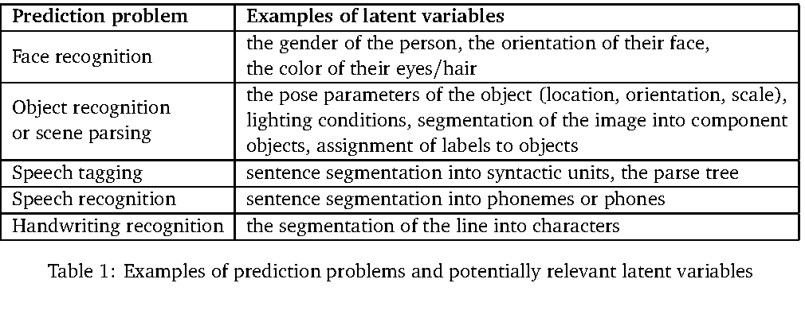
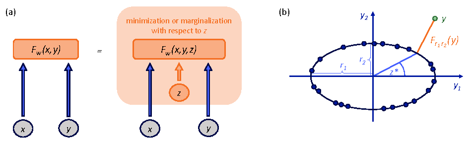
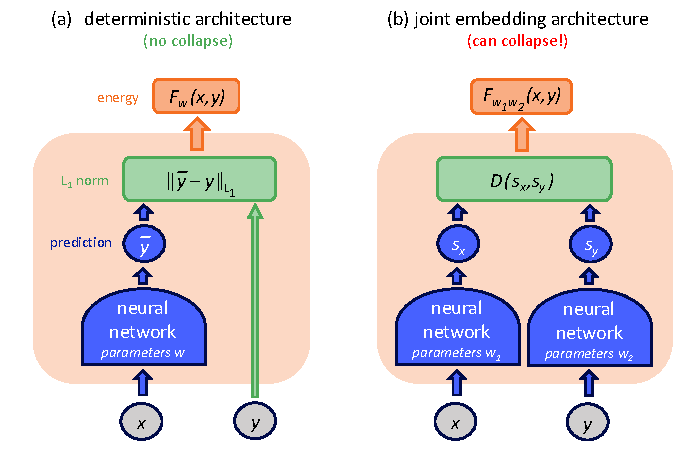
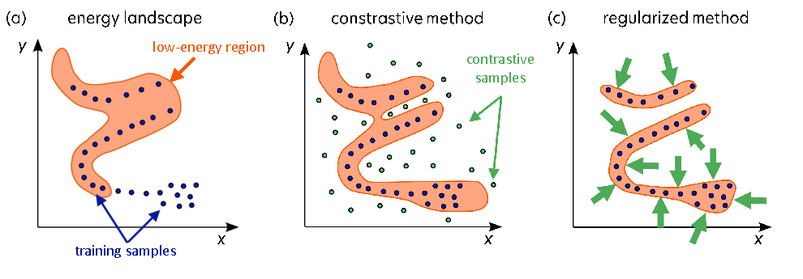
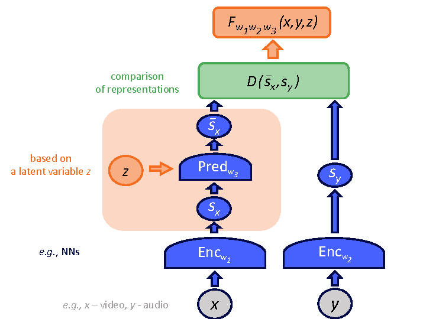
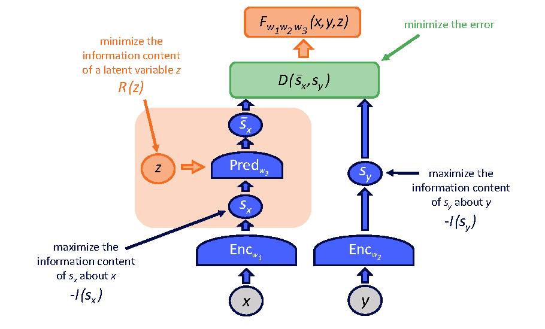
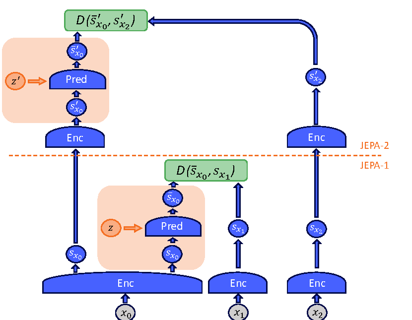

# H-JEPA：Latent Variable EBMs and Hierarchical JEPA

!!! info "论文信息"
    - 论文：`Introduction to Latent Variable Energy-Based Models: A Path Towards Autonomous Machine Intelligence`
    - 作者：`Anna Dawid, Yann LeCun`
    - 链接：[arXiv PDF](https://arxiv.org/pdf/2306.02572)
    - 时间：`2023-06`
    - 类型：Les Houches lecture notes / 方法路线综述，不是带 benchmark 的实验论文
    - 关键词：H-JEPA、latent variable EBM、energy collapse、regularized EBM training、representation prediction、hierarchical planning

这篇文章不是一篇“训练出某个 H-JEPA 模型并刷榜”的论文。它更像一篇把 LeCun 世界模型路线讲清楚的教学型论文：先解释为什么高维连续世界不适合只靠显式概率建模，再引入 `energy-based model`、`latent variable`、`JEPA` 和最终的 `H-JEPA`。

放在世界模型专题里，它的价值是补上一个关键问题：**如果世界模型不直接生成未来像素，而是在表征空间里预测未来状态，训练时到底要约束什么，为什么会坍缩，以及为什么需要层级结构。**

## 论文位置

论文沿用 LeCun 提出的自主智能架构。这个架构不是把模型看成一个端到端 policy，而是拆成 perception、world model、actor、cost/critic、short-term memory 和 configurator 等模块。

{ width="920" }

<small>Figure source: `Introduction to Latent Variable Energy-Based Models: A Path Towards Autonomous Machine Intelligence`, Figure 1. 原论文图注要点：该图展示 LeCun 提出的 modular autonomous AI 结构，其中 world model 负责预测 actor 设想动作导致的未来世界状态，short-term memory 维护当前与预测状态，cost/critic 评估这些状态。</small>

这张图里最重要的是 `world model` 的位置。它不是直接回答“下一步动作是什么”的 policy，而是回答：

$$
\text{current world state} + \text{imagined action sequence}
\rightarrow
\text{possible future world states}
$$

然后 actor 可以通过 cost/critic 评估这些未来，选择更低 cost 的动作序列。这和 Dreamer 系列的 latent imagination 有相通处，但这篇文章的重点不是 RL 算法，而是解释世界模型的表示和训练目标应该如何设计。

## 为什么引入 EBM

传统生成式模型常把预测写成概率分布：

$$
p(y \mid x)
$$

但高维连续数据里，未来往往是多模态的。例如给定一段视频历史，未来可以有很多合理发展；给定同一个路口状态，其他车辆可能减速、直行或转向。如果强行预测一个像素级结果，模型会被迫解释大量不可预测细节。

EBM 的思路是不直接要求模型给出规范化概率，而是学习一个能量函数：

$$
F_w(x,y)
$$

兼容的 \((x,y)\) 应该有低能量，不兼容的 \((x,y)\) 应该有高能量。推理时寻找低能量的 \(y\)：

$$
\hat{y}=\arg\min_y F_w(x,y)
$$

{ width="920" }

<small>Figure source: `Introduction to Latent Variable Energy-Based Models: A Path Towards Autonomous Machine Intelligence`, Figure 3. 原论文图注要点：作者用 EBM 替代显式概率预测，把问题转成寻找满足输入约束的低能量输出；图中还展示了一个学习到 \(x\) 与 \(y\) 依赖关系的能量景观。</small>

这里有一个容易误解的点：**energy function 是推理时用来找答案的函数，不等于训练时直接最小化的 loss。** 训练 EBM 的目标是塑造整个能量景观：让真实数据附近低能量，让不合理区域高能量。如果只把训练样本能量压低，而不约束其他区域，就会出现低能量区域无限扩张或能量坍缩。

## Latent Variable EBM

世界模型需要处理不确定性。仅凭当前观测，很多未来因素并不在 \(x\) 里，例如遮挡物体、他人意图、未观测场景结构、未来随机事件。论文用 latent variable \(z\) 表达这些不可直接从输入读出的解释因素。

{ width="850" }

<small>Table source: `Introduction to Latent Variable Energy-Based Models: A Path Towards Autonomous Machine Intelligence`, Table 1. 原论文图注要点：表格列举了 prediction problems 中可能相关的 latent variables，例如姿态、光照、分割结构、句法结构和字符分割等。</small>

引入 \(z\) 后，模型可以先定义：

$$
E_w(x,y,z)
$$

再通过对 \(z\) 做最小化或边缘化得到可用于推理的能量：

$$
F_w(x,y)=\min_z E_w(x,y,z)
$$

也可以用 free-energy 式的边缘化形式。直觉是：同一个 \(x\) 可能允许多个合理 \(y\)，而不同 \(z\) 对应不同解释路径。

{ width="860" }

<small>Figure source: `Introduction to Latent Variable Energy-Based Models: A Path Towards Autonomous Machine Intelligence`, Figure 4. 原论文图注要点：latent variable EBM 在推理时额外对 latent variable 做 minimization 或 marginalization；右侧椭圆例子说明 latent variable 可以表示数据流形上的隐含角度。</small>

对世界模型来说，\(z\) 的作用可以理解成：

| 场景 | \(z\) 应该表达什么 |
| --- | --- |
| 视频未来预测 | 当前画面无法确定的运动分支、遮挡对象、未观测细节 |
| 自动驾驶 | 其他交通参与者的意图、短期随机行为、不可见区域状态 |
| 机器人操作 | 接触状态、物体内部状态、不可见受力或摩擦条件 |
| 多智能体环境 | 其他 agent 的目标、策略类型和私有信息 |

但 \(z\) 不是越大越好。如果 \(z\) 容量太强，模型可以把所有预测所需信息都塞进 \(z\)，从而绕开从 \(x\) 推断 \(y\) 的任务。论文反复强调 latent variable 的信息量必须被限制，否则世界模型会学成“带答案通道的预测器”。

## EBM 训练为什么会坍缩

EBM 最大的训练风险是 `collapse`。在 joint embedding 结构中，如果两个 encoder 都输出常数表示，那么任意 \((x,y)\) 的表示距离都很小，训练误差看起来很好，但模型没有学到任何世界结构。

{ width="700" }

<small>Figure source: `Introduction to Latent Variable Energy-Based Models: A Path Towards Autonomous Machine Intelligence`, Figure 5. 原论文图注要点：标准 deterministic prediction 架构不容易发生这种表示坍缩，但 joint embedding architecture 如果只最小化表示距离，就可能让 encoder 忽略输入并输出无信息常数。</small>

这对世界模型尤其危险。一个坍缩的模型可能在训练 loss 上很好看，却无法回答任何反事实问题：

```text
如果我左转，世界会怎样？
如果我继续前进，风险会不会上升？
如果目标被遮挡，它可能在哪些位置？
```

论文把 EBM 训练概括成“塑造低能量区域”。训练样本附近要低能量，但训练集外、不兼容或不合理的配置不能也低能量。

{ width="920" }

<small>Figure source: `Introduction to Latent Variable Energy-Based Models: A Path Towards Autonomous Machine Intelligence`, Figure 6. 原论文图注要点：proper training 要压低训练样本能量并防止 energy collapse；contrastive methods 通过负样本抬高训练集外能量，regularized methods 则限制低能量区域能占据的空间体积。</small>

论文区分两类训练方式：

| 训练方式 | 基本做法 | 主要问题 |
| --- | --- | --- |
| Contrastive methods | 压低正样本能量，同时抬高负样本或 contrastive samples 的能量 | 高维连续空间里负样本生成和覆盖很困难 |
| Regularized methods | 通过架构或正则项限制低能量区域体积，不完全依赖负样本 | 需要设计能防 collapse 的表示约束 |

这也是为什么 H-JEPA 路线更重视 `regularized` 和 `non-contrastive` 训练。世界模型面对的是视频、机器人观测和多模态状态，空间太大，不能假设负样本能覆盖所有不合理未来。

## JEPA 的训练目标

JEPA 是把 EBM、latent variable 和 joint embedding 结合起来的一种预测结构。给定输入 \(x\) 和目标 \(y\)，两个 encoder 先产生表征：

$$
s_x=\operatorname{Enc}_{w_1}(x), \qquad s_y=\operatorname{Enc}_{w_2}(y)
$$

predictor 再基于 \(s_x\) 和 latent variable \(z\) 预测目标表征：

$$
\bar{s}_y=\operatorname{Pred}_{w_3}(s_x,z)
$$

能量由预测表征和目标表征之间的差异给出：

$$
F_{w_1,w_2,w_3}(x,y,z)=D(\bar{s}_y,s_y)
$$

{ width="680" }

<small>Figure source: `Introduction to Latent Variable Energy-Based Models: A Path Towards Autonomous Machine Intelligence`, Figure 9. 原论文图注要点：JEPA 使用两个 encoder 学习 \(x\) 与 \(y\) 的表征，predictor 借助 latent variable \(z\) 从 \(s_x\) 预测 \(s_y\)，能量由两种表征之间的距离定义。</small>

训练 JEPA 不能只最小化 \(D(\bar{s}_y,s_y)\)。论文给出的 regularized loss 思路包含三类约束：

1. 最小化 prediction error，让 \(s_y\) 能从 \(s_x\) 和必要的 \(z\) 中预测出来；
2. 最大化 \(s_x\) 和 \(s_y\) 对各自输入的信息量，防止 encoder 输出常数；
3. 最小化 \(z\) 的信息量，防止 predictor 只依赖 latent variable 搬运答案。

{ width="820" }

<small>Figure source: `Introduction to Latent Variable Energy-Based Models: A Path Towards Autonomous Machine Intelligence`, Figure 10. 原论文图注要点：JEPA 的训练除了 prediction error，还需要让 \(s_x\)、\(s_y\) 保留输入信息，并限制 latent variable \(z\) 的信息量；图中把这些正则项和预测误差一起放入训练目标。</small>

论文提到的一个具体方向是 VICReg 类正则：通过 variance、invariance、covariance 约束让表示既不坍缩，又减少冗余相关性。这里的重点不是某个固定公式，而是训练原则：**预测目标、表示保真和 latent 压缩必须同时存在。**

## H-JEPA：层级表征世界模型

单层 JEPA 很难同时处理短期细节和长期规划。短期预测需要保留足够多的低层状态，例如位置、速度、局部接触和局部几何；长期预测则不可能精确保留所有细节，反而需要更抽象的状态，例如任务阶段、可达区域、目标关系和风险结构。

H-JEPA 的核心是把多个 JEPA 堆叠起来：

1. lower-level JEPA 处理细粒度表示和短期预测；
2. higher-level JEPA 使用 lower-level 表示作为输入，做更抽象、更长时间尺度的预测；
3. 层与层之间可以用 CNN、pooling 或其他 coarse-graining 模块降低细节密度；
4. 每一层都需要自己的 prediction loss、collapse prevention 和 latent capacity control。

{ width="820" }

<small>Figure source: `Introduction to Latent Variable Energy-Based Models: A Path Towards Autonomous Machine Intelligence`, Figure 11. 原论文图注要点：H-JEPA 由堆叠的 JEPA 组成，低层 JEPA-1 基于更多细节做短期预测，高层 JEPA-2 基于更少细节做长期预测，从而支持 multiscale planning。</small>

从世界模型角度看，可以把 H-JEPA 写成多时间尺度预测：

$$
\hat{s}^{(1)}_{t+1}
=
f^{(1)}(s^{(1)}_t, a_t, z^{(1)})
$$

$$
\hat{s}^{(2)}_{t+K}
=
f^{(2)}(s^{(2)}_t, a_{t:t+K-1}, z^{(2)})
$$

其中第 1 层更接近局部动态，第 2 层更接近抽象计划。原论文的图没有显式动作输入，但如果把它扩展成 action-conditioned world model，动作或动作序列应该进入 predictor，而不是只在最后接一个 policy head。

## 从视频训练框架拓展到 H-JEPA 世界模型

如果从现有视频训练框架出发，H-JEPA 给出的不是“再加一个视频 decoder”，而是一条表征预测路线。

```text
历史视频片段 x
  -> low-level encoder
  -> short-term JEPA prediction
  -> coarse-grained higher-level state
  -> long-term JEPA prediction
  -> cost / planner / policy 使用预测状态
```

和视频生成模型相比，关键改造是：

| 改造点 | 视频生成训练 | H-JEPA 式世界模型训练 |
| --- | --- | --- |
| 预测对象 | future frames / video latents | future representations |
| 目标函数 | 重建、去噪或 token likelihood | representation prediction + anti-collapse regularization |
| 不确定性 | 通过噪声、自回归采样或 diffusion trajectory 表达 | 通过受限 latent variable \(z\) 表达 |
| 长时序 | 常靠长上下文、记忆或分块生成 | 靠层级表征和多尺度预测降低细节负担 |
| 动作条件 | 常作为额外 condition 注入生成器 | 应进入 predictor，学习 action-conditioned dynamics |
| 可视化 | 直接输出视频 | 默认不输出画面，必要时再接 decoder |

这条路线和 LingBot-World 的视频生成路线不冲突，但目标不同。LingBot-World 需要生成可交互画面，因此视觉质量、实时性和长时一致性是核心约束。H-JEPA 更关注内部状态是否可预测、可规划、可组合；它可以作为视频世界模型的 latent dynamics 层，也可以作为机器人或自动驾驶系统的 state abstraction 层。

## 和 Dreamer / V-JEPA / LingBot 的关系

| 维度 | H-JEPA / latent EBM route | Dreamer route | V-JEPA route | LingBot route |
| --- | --- | --- | --- | --- |
| 主要目标 | 在 representation space 中学习多尺度世界预测 | 从交互轨迹学习 latent dynamics 并训练 policy | 用视频自监督学习强视觉表征 | 从视频生成模型扩展成交互式世界模拟器 |
| 数据接口 | 可来自多模态配对、视频片段或交互轨迹 | \(o_t,a_t,r_t,done_t\) 轨迹 | 视频 clip 和 mask | 大规模视频与交互控制数据 |
| 动作建模 | 原文是架构原则，动作可作为 predictor 条件扩展 | 动作是 RSSM transition 的核心条件 | 原论文没有 action | 动作/控制信号用于视频 rollout |
| 输出 | future representation / low-energy state | latent state、reward、continuation、policy | masked region representation | future video / interactive scene |
| 训练重点 | anti-collapse、latent capacity、层级预测 | KL、reward/continuation、imagination actor-critic | EMA target encoder、3D masking、latent regression | action grounding、causalization、long-horizon consistency |

最容易混淆的是 H-JEPA 和 V-JEPA。V-JEPA 是一个实证视频表征学习方法，给出了具体数据、mask、EMA target encoder、loss 和实验。H-JEPA 这篇文章则更基础：它解释为什么 JEPA 需要 regularized loss、为什么 latent variable 不能无限大、为什么长期世界模型需要层级抽象。

## 训练细节可复用点

这篇文章没有给出完整的 batch size、optimizer、训练步数和 benchmark recipe，但它给了几条很适合迁移到世界模型训练的原则。

第一，不能只压低正样本能量。无论是视频世界模型还是机器人 latent dynamics，如果 loss 只奖励“训练对匹配”，模型可能扩大低能量区域，导致反事实预测不可用。

第二，表征预测必须配 anti-collapse 机制。EMA teacher、variance/covariance regularization、stop-gradient、信息瓶颈和 latent capacity penalty 都是这个问题的不同实现方式。

第三，latent variable 应该表达不可观测但有用的不确定性，而不是成为答案缓存。工程上需要限制 \(z\) 的维度、噪声分布、互信息或可访问目标信息。

第四，长期 rollout 应该提高抽象层级，而不是强行保留短期细节。H-JEPA 的层级结构对应世界模型里的多尺度状态：底层负责局部物理和短期运动，高层负责任务进度、可达性和规划约束。

第五，动作条件要进入 dynamics predictor。如果只是训练 \(x \rightarrow y\)，模型学到的是被动观察世界；如果要服务规划，训练样本必须让模型看到不同动作导致的不同未来。

## 局限与不可外推结论

这篇文章适合用来理解 H-JEPA 的训练思想，但不能当作 H-JEPA 已经被大规模验证的证据。

具体边界包括：

1. 它是 lecture-note 风格论文，没有 H-JEPA benchmark、数据配方或消融实验；
2. 图中的 H-JEPA 是概念架构，不是可直接复现的工程系统；
3. 原文没有给出 action-conditioned predictor 的完整训练算法；
4. cost/critic 如何学习、如何和任务奖励或人类目标对齐，仍是开放问题；
5. representation-space prediction 可能丢掉规划需要的细节，例如小物体、接触状态、危险区域或可操作 affordance。

更稳妥的读法是：把这篇论文当成“表征型世界模型如何训练”的原则说明。它补充了 Dreamer 系列偏 RL recipe、V-JEPA 偏视频表征、LingBot 偏视频生成系统的部分，重点回答一个更底层的问题：**世界模型的 latent space 如何既可预测、又不坍缩、还能支持长时层级规划。**
