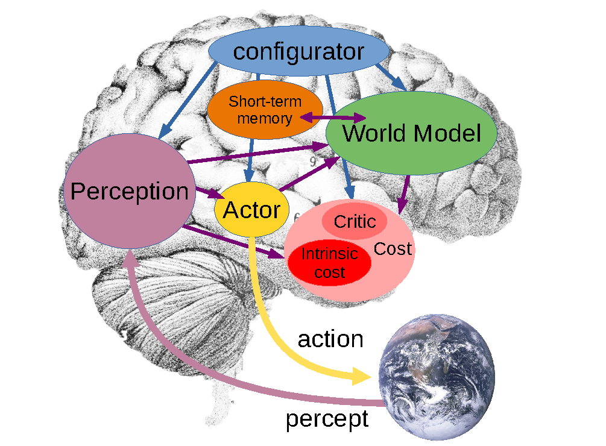
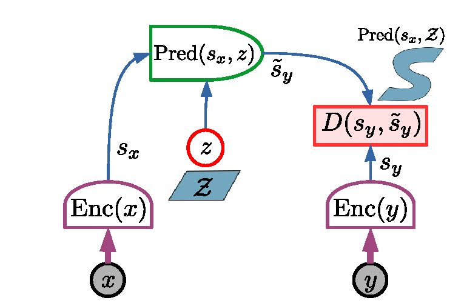
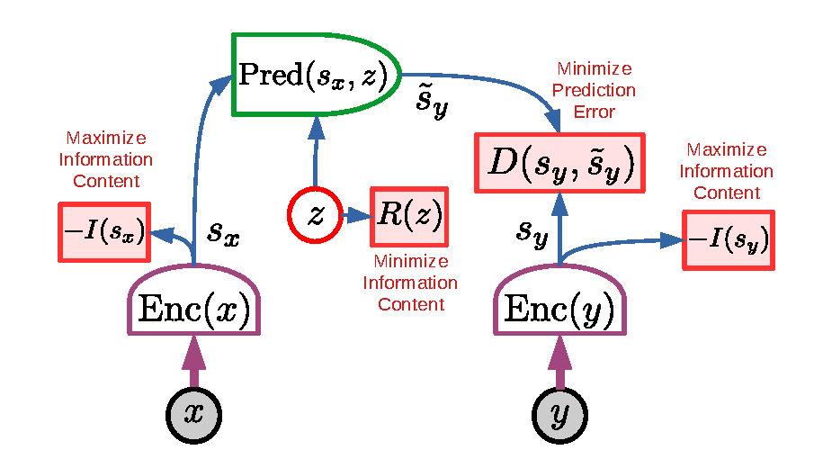
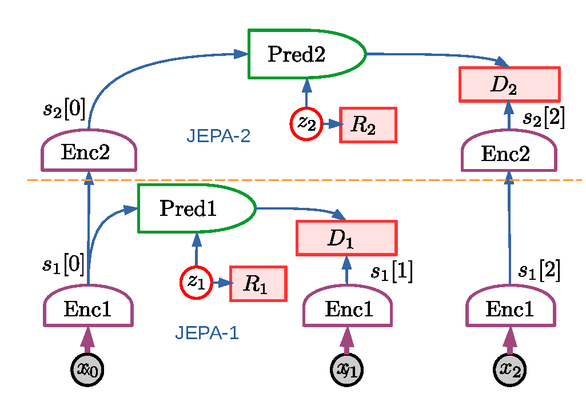
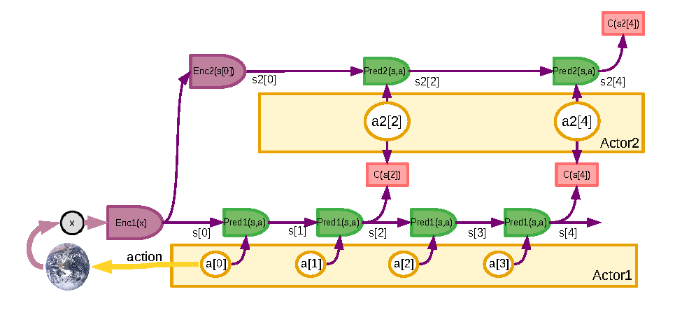
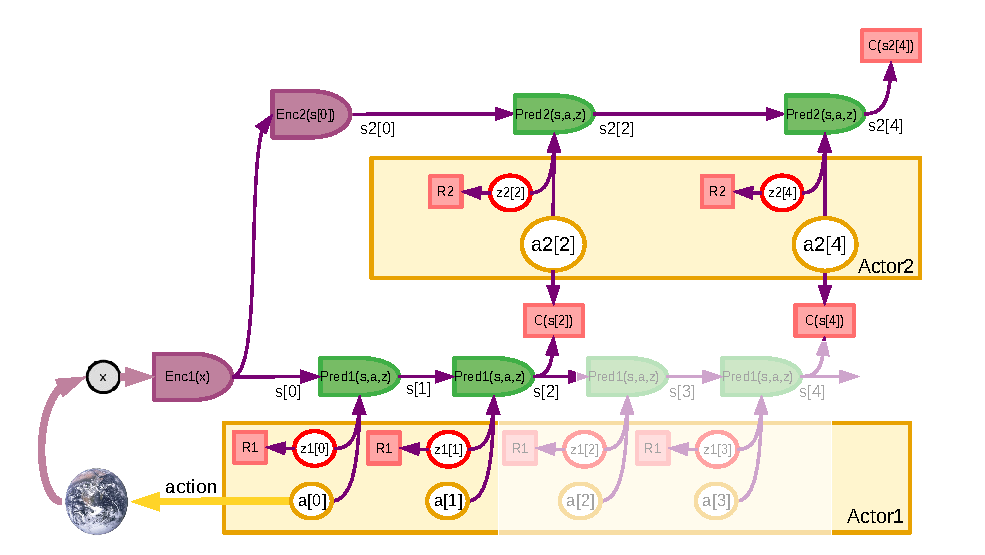

# JEPA：A Path Towards Autonomous Machine Intelligence

!!! info "论文信息"
    - 论文：`A Path Towards Autonomous Machine Intelligence`
    - 作者：`Yann LeCun`
    - 链接：[OpenReview](https://openreview.net/forum?id=BZ5a1r-kVsf)
    - 类型：研究路线与架构提案，不是带完整 benchmark 的实验论文
    - 关键词：JEPA、H-JEPA、energy-based model、representation prediction、non-contrastive learning、world model、planning

这篇论文的价值不在某个实验指标，而在于给出了一条和“生成未来像素”不同的世界模型路线：**世界模型不一定要重建未来画面的每个细节，而可以预测未来的抽象表征。** 这就是 `Joint-Embedding Predictive Architecture`，也就是 JEPA。

如果把 LingBot-World 看作“从视频生成模型发展出的视觉世界模拟器路线”，Dreamer 看作“从交互轨迹学习 latent dynamics 的 model-based RL 路线”，那么 JEPA 更像一条上层架构原则：用可预测、可规划、可组合的 latent representation 来承载世界动态。

## 论文位置

论文提出的自主智能系统由多个模块组成：感知模块估计当前世界状态，世界模型预测未来状态，actor 提出动作，cost/critic 评估状态好坏，短期记忆保存当前和预测状态，configurator 根据任务调度各模块。

{ width="860" }

<small>Figure source: `A Path Towards Autonomous Machine Intelligence`, Figure 2. 原论文图注要点：该图把自主智能系统拆成 perception、world model、actor、cost/critic、short-term memory 和 configurator；其中 world model 根据 actor 设想的动作序列预测可能的未来世界状态，cost 模块给这些状态分配能量。</small>

这张图说明 JEPA 不是单独的自监督学习模块，而是服务于一个完整 agent 架构。论文里的世界模型承担的不是“把输入视频补全得漂亮”，而是：

$$
\text{current state} + \text{imagined action sequence}
\rightarrow
\text{possible future states}
$$

然后 actor 可以通过搜索、优化或规划，选择让未来 cost 最低的动作序列。这一点和 Dreamer 的思想有相通之处：两者都重视 latent space 中的未来预测。但 Dreamer 给出了可训练的 RL 算法和大量实验，JEPA 这篇文章更偏向提出通用架构和训练原则。

## 核心问题

传统生成式世界模型常见目标是预测未来观测：

$$
p(x_{t+1:t+H} \mid x_{\le t}, a_{t:t+H-1})
$$

这在视频模型里很自然，因为训练目标可以是重建像素、预测 latent token 或扩散去噪。但真实世界有大量不可预测、也不影响决策的细节。例如一辆车到岔路口后，重要的是车的位置、速度、方向和路线选择，而不是路边树叶纹理的每个像素。

JEPA 的核心判断是：如果世界模型被迫预测所有细节，它会把容量浪费在决策不需要的信息上。更合适的目标是预测未来的表示：

$$
s_y = \operatorname{Enc}(y)
$$

而不是直接预测 \(y\)。只要 encoder 学到的 \(s_y\) 保留任务相关、可预测、可规划的信息，就可以故意丢弃纹理、噪声和其他不相关细节。

## JEPA 架构

JEPA 有两个编码分支和一个 predictor。给定输入 \(x\) 和目标 \(y\)，两个 encoder 先得到表示：

$$
s_x = \operatorname{Enc}_x(x), \qquad s_y = \operatorname{Enc}_y(y)
$$

predictor 再根据 \(s_x\) 和可能的 latent variable \(z\) 预测目标表示：

$$
\hat{s}_y = \operatorname{Pred}(s_x, z)
$$

模型的能量是预测误差：

$$
E(x,y,z)=D(s_y,\hat{s}_y)
$$

如果存在多个可能未来，模型可以通过 \(z\) 表达多模态性。整体能量可以写成：

$$
F(x,y)=\min_z D(s_y,\operatorname{Pred}(s_x,z))
$$

{ width="760" }

<small>Figure source: `A Path Towards Autonomous Machine Intelligence`, Figure 12. 原论文图注要点：JEPA 通过两个 encoding branches 得到 \(s_x\) 和 \(s_y\)，predictor 在 latent variable \(z\) 的帮助下预测 \(s_y\)，能量由目标表示和预测表示之间的误差给出；这种设计的关键优势是只在 representation space 中预测。</small>

这和生成式视频模型的区别非常重要：

| 维度 | Generative prediction | JEPA prediction |
| --- | --- | --- |
| 预测对象 | 未来像素、视频 latent、token 或完整观测 | 未来状态的抽象表示 |
| 训练压力 | 必须解释大量视觉细节 | 允许 encoder 丢弃不可预测或无关细节 |
| 多模态处理 | 常用随机变量、扩散噪声或自回归采样生成不同未来 | latent \(z\) 只解释 representation prediction 中必要的不确定性 |
| 对规划的意义 | 视觉真实不等于对动作后果有用 | 表示可以直接围绕可预测性和任务相关性组织 |

因此，JEPA 对世界模型的启发是：**world model 的输出不必等同于未来观测本身。** 对控制和规划来说，更重要的是未来状态表示是否保留了可行动、可评估、可优化的信息。

## 非对比训练

JEPA 可以用 contrastive learning 训练，但论文更强调 non-contrastive training。原因是：在高维空间里靠负样本把错误匹配推开，会遇到维度灾难和采样效率问题。JEPA 想要避免靠大量 negatives 维持表示空间结构。

论文给出的非对比训练原则可以概括成四个约束：

1. \(s_x\) 要尽可能保留关于 \(x\) 的信息；
2. \(s_y\) 要尽可能保留关于 \(y\) 的信息；
3. \(s_y\) 要容易从 \(s_x\) 预测出来；
4. latent variable \(z\) 的信息量要尽量小，避免模型把所有不可预测信息都塞进 \(z\)。

{ width="840" }

<small>Figure source: `A Path Towards Autonomous Machine Intelligence`, Figure 13. 原论文图注要点：非对比 JEPA 训练同时最大化 \(s_x\) 与 \(s_y\) 对输入的信息量、最小化 prediction error，并约束 latent variable \(z\) 的信息量；论文把 VICReg 和 Barlow Twins 视为这类非对比准则的例子。</small>

这四个约束共同解决两个 collapse 问题。

第一，如果只要求 \(s_y\) 可预测，模型可能把 \(s_x\) 和 \(s_y\) 都变成常数。预测误差很小，但表示完全没用。这就是 informational collapse。

第二，如果允许 \(z\) 携带过多信息，predictor 可以绕过 \(s_x\)，把所有目标细节都通过 \(z\) 解释掉。这样表面上能量低，但 world model 并没有真正学会“从当前状态预测未来”。

因此，JEPA 训练不是简单最小化 \(D(s_y,\hat{s}_y)\)，而是在“信息保留、可预测性、latent 压缩”之间做平衡。

## 训练细节怎么理解

这篇论文没有给出类似 DreamerV3 那样完整的 replay buffer、optimizer、batch size 和 benchmark recipe，但它给了世界模型训练的核心接口。

如果把 \(x\) 和 \(y\) 放到时序任务里，可以理解为：

$$
x = \text{past observation or current state}
$$

$$
y = \text{future observation or future state}
$$

在动作条件世界模型中，predictor 还应接收动作或动作序列：

$$
\hat{s}_{t+k}
= \operatorname{Pred}(s_t, a_{t:t+k-1}, z)
$$

训练样本来自时间相邻或跨时间的观测对：

```text
历史观测/状态 x
  -> encoder 得到 s_x
未来观测/状态 y
  -> target encoder 得到 s_y
动作或候选动作序列 a
  -> predictor 预测未来表示 s_y
预测误差 + 表示正则 + latent 正则
  -> 更新 encoder 和 predictor
```

这和视频训练框架的关系可以这样理解：

| 视频训练框架 | JEPA 化之后的世界模型训练 |
| --- | --- |
| 用 VAE/tokenizer 把视频压到 latent | 用 encoder 把观测压到可预测、可规划的 state representation |
| 训练生成器重建或去噪未来视频 latent | 训练 predictor 预测未来 state representation |
| 目标偏重视觉质量和时间连续性 | 目标偏重预测充分性、抽象性和规划可用性 |
| 不一定显式建模动作后果 | predictor 应接收 action，并预测 action-conditioned future state |
| 失败主要表现为画质差或漂移 | 失败还包括表示丢掉控制变量、latent 作弊、规划不可用 |

这也是 JEPA 和 LingBot-World 这类视频世界模型的关键差异。LingBot-World 仍然需要生成可交互视频画面，因此必须关心视觉真实感、长时一致性和实时 rollout。JEPA 则主张先把世界预测放到 representation space，避免模型把难预测但无用的细节当成主要目标。

## H-JEPA：层级世界模型

论文进一步提出 H-JEPA，也就是 hierarchical JEPA。直觉是：短期预测可以用较低层、较细粒度的表示，长期预测则需要更抽象的表示。因为预测跨度越长，细节越不可控，越应该舍弃无关局部信息。

{ width="860" }

<small>Figure source: `A Path Towards Autonomous Machine Intelligence`, Figure 15. 原论文图注要点：H-JEPA 把多个 JEPA 模块层级堆叠，低层提取较细粒度表示并做短期预测，高层使用低层表示作为输入，学习更抽象的状态并支持更长期预测。</small>

H-JEPA 对世界模型训练有三个启发。

第一，世界模型不应该只有一个统一时间尺度。机器人控制、自动驾驶和游戏代理都同时存在毫秒级控制、秒级技能和分钟级任务目标。单层模型很难同时对所有尺度都高效。

第二，长期预测不能追求和短期预测同样的细节。短期可以预测位置、速度、局部接触；长期更适合预测拓扑位置、任务阶段、风险区域和可达目标。

第三，表示越高层，越应该围绕规划约束组织，而不是围绕视觉重建组织。也就是说，高层 world state 的好坏不由画面像不像直接决定，而由它能否支持 cost evaluation 和 action search 决定。

## 规划接口

论文把规划描述成一个 energy minimization 问题。actor 不是只输出一个动作，而是提出候选动作序列；world model 预测这些动作序列导致的未来状态；cost 模块评估未来状态；actor 再选择能量较低的动作序列，并执行其中的前一个或前几个动作。

这与 model predictive control 的思路接近：

```text
估计当前 state
  -> 提出候选 action sequence
  -> world model rollout future states
  -> cost module 评估每个 predicted state
  -> 优化 action sequence
  -> 执行第一个动作并重新感知
```

{ width="920" }

<small>Figure source: `A Path Towards Autonomous Machine Intelligence`, Figure 16. 原论文图注要点：两层 H-JEPA 规划中，高层 cost 在抽象 world-state representation 上定义目标，高层抽象动作变成低层子目标，低层再搜索满足这些子目标的具体动作序列。</small>

这里的“高层动作”不一定是真实可执行动作，更像是给下层的目标或约束。例如高层决定“到达房间门口”，低层再决定具体转向、移动和避障动作。

论文还讨论了不确定性。真实环境里，同一个状态和动作可能对应多个未来，原因包括环境随机性、部分可观测、表示不完整、模型能力不足等。JEPA 用 latent variable 表达这类多模态预测，但也必须正则化 latent，否则模型会依赖 latent 逃避真正的状态预测。

{ width="920" }

<small>Figure source: `A Path Towards Autonomous Machine Intelligence`, Figure 17. 原论文图注要点：在不确定环境中，latent variables 表达不能从先验观测推出的预测信息；规划时可以采样多条 latent trajectory，并通过均值、方差或风险敏感目标选择动作序列。</small>

这部分对世界模型评测很重要。一个好的世界模型不只要给出一个看似合理的未来，还应该知道哪些未来不确定、哪些动作会放大风险、哪些状态需要重新感知。

## 和 Dreamer 路线的关系

JEPA 和 Dreamer 都反对把世界模型简单等同于像素重建，但它们落点不同。

| 维度 | JEPA / H-JEPA | Dreamer / DreamerV3 |
| --- | --- | --- |
| 论文类型 | 自主智能架构与训练原则 | 可复现的 model-based RL 算法 |
| 数据来源 | 可来自视频、时序观测、交互轨迹或多模态配对 | agent 与环境交互轨迹 |
| 核心预测 | \(s_x, a, z \rightarrow s_y\) 的 representation prediction | RSSM 中 \(s_t,a_t \rightarrow s_{t+1}, r_t, c_t\) 的 latent dynamics |
| policy 学习 | 通过 actor、cost 和规划优化动作序列 | 在 imagined rollout 上训练 actor-critic |
| 实验支撑 | 这篇文章主要是 conceptual proposal | Dreamer 系列有大量 benchmark 实验 |
| 主要风险 | 训练准则和实现细节需要后续论文落地 | latent dynamics 可能偏向任务奖励，视觉真实感通常不是目标 |

可以把 JEPA 看成更一般的表示预测原则，把 Dreamer 看成其中一种非常具体的交互轨迹训练系统。Dreamer 的 RSSM、reward head 和 continuation head 更像工程化版本；JEPA 则更强调表示空间本身应该如何设计，尤其是如何避免预测无关细节。

## 和视频世界模型路线的关系

JEPA 与视频生成型世界模型不是互斥关系，而是目标函数层面的差异。

视频世界模型通常先解决：

$$
\text{history frames} + \text{condition/action}
\rightarrow
\text{future frames or video latent}
$$

JEPA 更关注：

$$
\text{history representation} + \text{condition/action}
\rightarrow
\text{future representation}
$$

如果要把视频模型往 JEPA 方向改，可以考虑三层接口：

1. 用视频 encoder 把历史片段和未来片段编码成 \(s_x\)、\(s_y\)；
2. 用 action-conditioned predictor 预测未来表示，而不是直接生成未来像素；
3. 只在需要可视化、交互回放或数据生成时，再接 decoder 或生成模型还原画面。

这样做的潜在好处是：训练世界模型时不用把所有容量都花在像素细节上，但系统仍然可以在需要时生成视频。潜在风险是：如果 representation 丢掉了规划需要的细节，例如小物体、接触状态、可操作 affordance，规划效果会直接受损。

## 对世界模型训练的启发

这篇论文最值得放进世界模型章节的训练启发有四点。

第一，世界模型训练目标不应默认等于视频重建。视频重建能提供视觉监督，但对规划来说，真正重要的是动作后果、状态抽象、风险和 cost。

第二，表示学习和动力学学习不能分开看。如果 encoder 学到的表示不可预测，world model rollout 会漂移；如果表示过度可预测但没信息，规划又没有依据。JEPA 的四个非对比约束正是在处理这个张力。

第三，多模态未来需要被压到必要变量里。latent \(z\) 应该解释“从当前状态无法确定但会影响未来”的部分，而不是成为复制目标信息的捷径。

第四，层级抽象是长时序世界模型的核心。短期预测、技能级预测和任务级预测应该使用不同粒度的 state representation 和不同 horizon，而不是强行让一个模型在所有尺度上输出同样细的结果。

## 局限与不可外推结论

这篇论文不能当作 JEPA 世界模型已经被完整验证的证据。它主要提出方向和架构，并没有给出和 Dreamer、视频世界模型或机器人策略模型同等粒度的训练配方和 benchmark。

具体风险包括：

1. non-contrastive JEPA 的 collapse 控制在真实长时序交互数据上如何稳定实现，仍依赖后续具体方法；
2. encoder 丢弃细节是双刃剑，丢掉纹理噪声有益，丢掉可操作物体或接触状态会伤害控制；
3. H-JEPA 的层级训练、层间对齐和联合规划复杂度很高，论文没有给出完整工程实现；
4. cost module 如何学习、如何和人类目标或任务奖励对齐，是世界模型能否用于真实 agent 的关键问题；
5. 它没有提供实验表格或系统消融，因此页面中不应把它和 DreamerV3、LingBot-World 这类实证论文做指标级比较。

更稳妥的读法是：把这篇论文当作“为什么世界模型应该预测抽象表示，而不是只生成未来像素”的理论路线图。真正落到项目时，还需要结合 Dreamer 系列的交互轨迹训练、LingBot-World 这类视频生成系统，以及具体任务的数据、动作接口和评测设计。
