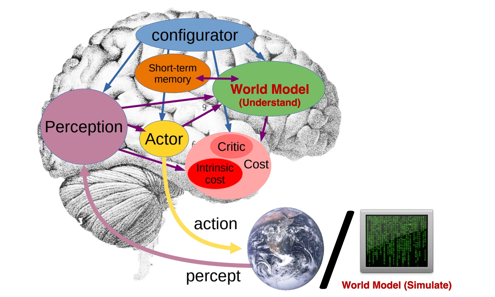
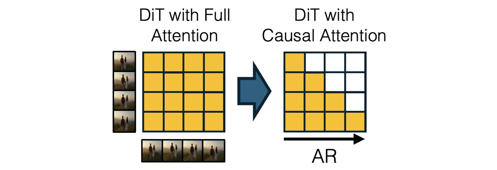
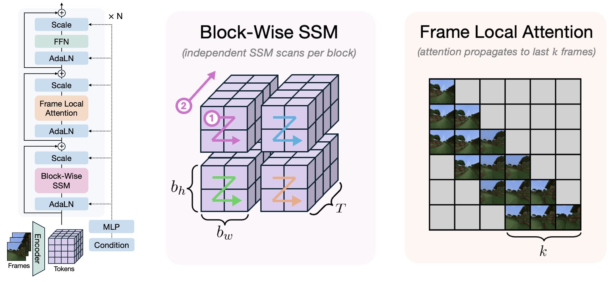
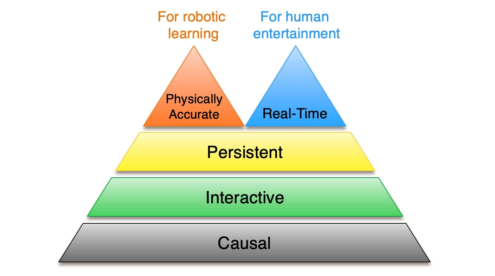
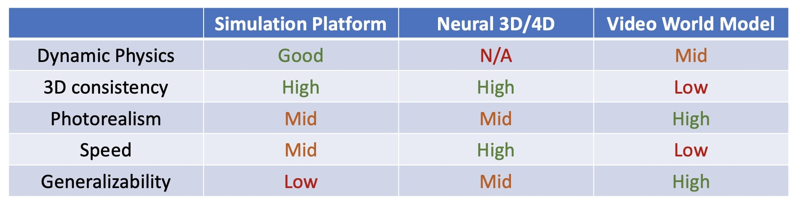

# Towards Video World Models：视频生成走向世界模型的五个门槛

!!! info "文章信息"
    - 文章：`Towards Video World Models`
    - 作者：`Xun Huang`
    - 链接：[Blog](https://www.xunhuang.me/blogs/world_model.html)
    - 时间：`2025-07-11`
    - 类型：路线综述 / 研究判断，不是带完整 benchmark 的实验论文
    - 关键词：video world model、causality、interactivity、persistence、real-time、physical accuracy、AR-DiT

这篇文章很适合放在 LingBot-World 前面读。它不提出一个新模型，而是回答一个更基础的问题：**为什么 Sora、Veo 这类强视频生成模型还不能直接等价于 video world model，以及从视频生成走向世界模型需要补哪些训练和系统能力。**

作者把 video world model 的核心要求概括成五个属性：`causal`、`interactive`、`persistent`、`real-time` 和 `physically accurate`。这五个词可以直接变成评估视频世界模型的 checklist。

## 论文位置

这篇文章先区分了两类经常被混用的 world model。

第一类是 internal world understanding model。它更接近人脑里的抽象世界模型，用语义状态预测粗粒度未来，服务 reasoning、planning 和 decision making。Dreamer、JEPA、V-JEPA 更接近这一侧。

第二类是 external world simulation model。它要生成足够详细、足够真实的外部世界模拟，服务机器人仿真训练、游戏、交互媒体和沉浸式体验。LingBot-World、Genie、CausVid、GameNGen、GAIA-1 等视频世界模型更接近这一侧。

{ width="860" }

<small>Figure source: `Towards Video World Models`, Figure 1. 原文图注要点：图中对比 internal world model 和 external world model，前者像人脑内部对粗粒度未来的预测，后者则试图模拟现实世界的完整细节。</small>

这个区分很重要。前者不一定需要生成像素，甚至可以故意丢掉视觉细节；后者则必须尽可能真实地模拟未来画面、对象、运动和交互后果。文章讨论的重点是后者，也就是 video world model。

{ width="900" }

<small>Figure source: `Towards Video World Models`, Figure 2. 原文图注要点：该图给出 world model 的 taxonomy，把内部理解型世界模型、外部模拟型世界模型以及 video world model、simulation platform、neural 3D/4D 等路线放在同一张图中。</small>

## 核心判断

普通视频生成模型通常学习：

$$
p(v_{1:T}\mid c),
$$

其中 \(c\) 可以是文本、图片、首帧或历史视频片段。这个目标能让模型生成视觉上合理的视频，但它不保证模型能被 agent 或用户动态控制。

video world model 至少要学习：

$$
p(v_{t+1:t+H}\mid v_{\le t}, a_{t:t+H-1}, c),
$$

其中 \(a\) 是动作、相机控制、键盘输入、机器人控制量或其他外部干预。也就是说，世界模型不只要回答“未来看起来像什么”，还要回答：

```text
在同一个历史状态下，如果动作不同，未来是否真的会分叉？
```

这也是文章和 LingBot-World、DreamZero 等页面的连接点。LingBot-World 给出一个具体系统如何继续训练和因果化；DreamZero 则把 video-action prediction 推到机器人 policy。本文更像上层路线图，明确这些系统应该满足哪些约束。

## 五个门槛

文章提出的五个要求可以压缩成下表。

| Requirement | 解决的问题 | 对训练和系统的直接含义 |
| --- | --- | --- |
| Causal | 未来不能影响过去 | 需要 causal attention、autoregressive rollout 或等价的时间因果结构 |
| Interactive | 用户或 agent 的动作能改变未来 | 数据必须包含 frame-action alignment，模型必须 action-conditioned |
| Persistent | 长时间生成不丢场景和对象状态 | 需要长记忆、状态压缩、3D/4D 约束或 state-space memory |
| Real-time | 交互延迟足够低 | 需要 few-step generation、KV cache、蒸馏和低延迟架构 |
| Physically accurate | 未来不能只视觉合理，还要物理合理 | 需要物理相关目标、数据筛选、仿真数据或稀有事件微调 |

前两个是硬约束。没有 causal，就无法在生成过程中插入新动作；没有 interactive，就只是 observer-mode simulator。后三个更像连续谱：不同应用对 persistence、real-time 和 physical accuracy 的优先级不同。

## 1. Causal：从双向视频生成到自回归世界模拟

当前很多强视频模型使用 diffusion transformer，在一个视频块内用双向注意力同时生成所有帧。这对离线视频生成很有效，但对世界模型有根本问题：模型在生成当前帧时可以利用未来帧信息，时间结构不是因果的。

如果模型一次性生成 \(T\) 秒视频，那么用户在第 \(t\) 秒输入的新动作无法真正改变已经被“整体决定”的未来。它最多重新生成下一段视频，而不是在统一世界状态里连续响应。

文章因此强调：video world model 需要把 diffusion 的画质和并行效率，与 autoregressive 的时间因果性结合起来。

{ width="920" }

<small>Figure source: `Towards Video World Models`, Figure 3. 原文图注要点：CausVid 将预训练的 bidirectional video diffusion model 改造成带 causal attention 的 few-step autoregressive video diffusion model。</small>

这里涉及三类训练路线：

| 路线 | 训练思路 | 对世界模型的意义 |
| --- | --- | --- |
| Diffusion Forcing | 给不同帧设置独立噪声水平，让扩散模型具备 next-token-like 的自回归生成能力 | 把 full-sequence diffusion 和 next-frame prediction 接起来 |
| CausVid | 从预训练 bidirectional video diffusion model 出发，适配成 causal attention 的 AR-DiT，并通过少步生成降低延迟 | 尽量保留视频扩散质量，同时获得流式 rollout |
| MAGI-1 | 从头预训练 AR-DiT，并针对自回归视频生成做基础设施优化 | 说明因果视频生成也可以作为基础模型路线，而不只是后训练补丁 |

这对训练框架的启发是：如果目标是交互式世界模型，训练和推理都必须避免“未来帧泄漏”。否则离线生成质量再高，闭环交互时也会出现训练-推理不一致。

## 2. Interactive：动作不是附加条件，而是未来分叉变量

interactive controllability 是 video world model 的分水岭。文章把它定义为：用户或 agent 可以在运行过程中注入动作，并让模型预测随动作改变的未来。

动作形式取决于应用：

| 应用 | 动作接口 |
| --- | --- |
| 游戏 | 键盘、鼠标、手柄、角色操作、物体交互 |
| 机器人 | 末端位姿、关节角、夹爪控制、移动底盘指令 |
| 自动驾驶 | 转向、速度、轨迹点、规划意图 |
| 导航世界模型 | 相机位姿、前进/转向/停止、视角控制 |

训练难点不只是把 action token 拼进模型，而是拿到足够好的 frame-action alignment。游戏和仿真环境可以直接记录动作；互联网视频通常没有动作标签，因此需要从视频中学习 latent action 或通过伪标签补控制信号。

文章提到 Genie 的意义就在这里：它尝试从未标注视频中学习可控 latent action。Genie-2 进一步展示了大规模 foundation world model 可以根据不同交互动作生成不同未来。

从训练角度看，interactive world model 需要满足三个条件：

1. 同一类状态下存在不同动作导致的不同后果，否则模型会学到平均未来；
2. action condition 要进入生成主干或 dynamics predictor，而不是只在浅层作为提示；
3. 评测必须固定历史、改变动作，检查未来是否出现一致、可解释的分叉。

这也解释了 LingBot-World 为什么强调 interaction data engine、action adapter 和 causal rollout。没有动作对齐数据，视频模型只能做视觉续写；有了动作但没有因果推理，模型也很难实时响应新输入。

## 3. Persistent：长时记忆不能只靠无限长上下文

世界模拟不能只生成几秒视频。游戏、机器人训练和导航都要求模型在长时间内保持同一个世界：房间结构不能变、对象身份不能漂移、走过的路径不能被重新生成。

直觉上可以把 persistence 当成“长上下文问题”，但文章指出这在 video world model 里不够。LLM 可以随着上下文变长而变慢，交互世界模型不行；如果游戏或仿真越玩越卡，系统就不可用。

因此 persistence 需要在长记忆和固定延迟之间折中。文章提到几条路线：

| 路线 | 核心思路 | 风险 |
| --- | --- | --- |
| Temporal compression | 对远处历史做激进压缩，例如 FAR、FramePack | 如果关键细节埋在早期帧，压缩后可能丢失 |
| Persistent 3D condition | 用 3D/4D 表示维护世界几何或场景状态 | 对动态对象和开放世界变化建模困难 |
| State-space memory | 用 linear RNN / SSM 处理长程依赖，让每帧计算不随历史线性增长 | 需要在长记忆和局部视觉细节之间补足归纳偏置 |

{ width="920" }

<small>Figure source: `Towards Video World Models`, Figure 5. 原文图注要点：State-Space Video World Model 将 block-wise SSM scan 与 3D hidden states 结合，用于长期记忆，同时用 local attention 提升视觉细节。</small>

对训练世界模型来说，persistence 不能只看 FVD 或单段视频质量。更直接的评测应该包括：

1. 长时间 rollout 后对象身份是否保持；
2. agent 转身再回来时场景是否一致；
3. 被遮挡或暂时离开画面的目标是否能恢复；
4. 生成速度是否随历史增长明显下降；
5. 错误是否会在自回归 rollout 中持续累积。

## 4. Real-Time：吞吐和延迟是两个指标

文章对 real-time 的区分很有工程价值：吞吐量和延迟不是一回事。

吞吐量是每秒能生成多少帧。只要生成速度大于播放速度，理论上可以实时播放。延迟是用户动作到响应画面的时间。交互式世界模型必须同时满足二者。

一个模型可以离线 30 FPS 生成一段 8 秒视频，但如果每次响应动作都必须先生成完整 8 秒块，它的最小交互延迟就是 8 秒。这对游戏、VR 或机器人闭环控制都不可接受。

文章给出一个关键结论：**非因果 diffusion model 无法获得真正 frame-wise 低延迟交互。** 只要模型必须整段生成，动作响应就被 chunk length 下限卡住。

因此 real-time video world model 通常需要组合：

```text
causal / autoregressive generation
  + KV cache or recurrent state
  + few-step distilled diffusion
  + training-time rollout simulation
  + action-conditioned finetuning
```

文章提到 CausVid 使用 DMD 方向的 distillation，Self-Forcing 进一步在训练中模拟推理过程，也就是让模型在训练时经历 autoregressive rollout + KV cache 的状态分布。它报告在单 GPU 上实现 `17FPS` 和 subsecond latency，同时接近强开源视频扩散模型的质量。

这个训练细节很重要：如果训练只看 teacher-forced clean context，推理时却不断吃自己生成的历史，误差会滚雪球。Self-Forcing、APT2 这类方向的共同点，是把 inference-time rollout 的状态分布提前带进训练。

## 5. Physically Accurate：视觉真实不等于物理可用

video world model 作为模拟器，不能只生成“看起来像真的”视频，还要尽量遵守物理约束。文章指出一个现实问题：模型规模和数据量会提升物理 realism，但不等于模型学会可外推的物理规律。

PhyWorld 这类工作用简单 2D 物理数据评估视频模型的 generalization。文章总结的关键现象是：组合式泛化可能做得到，但对速度、质量等物理属性的 OOD extrapolation 仍然困难。

这不意味着视频世界模型不可用，而是提醒我们区分两种目标：

| 使用场景 | 需要的物理能力 |
| --- | --- |
| 娱乐和交互媒体 | 足够骗过人眼，局部物理合理即可 |
| 机器人训练 | 必须保留接触、碰撞、摩擦、质量和可操作性 |
| 自动驾驶仿真 | 对罕见风险、事故、遮挡、碰撞有更高要求 |
| 科学仿真 | 需要可外推规律，纯视频模型通常不够 |

除了扩大数据和模型，文章提到两类增强方法：

1. 目标函数增强：例如 VideoJAM 加入 optical flow denoising objective，让模型不只重建外观，也学习运动一致性；
2. 数据分布增强：例如 Ctrl-Crash、PISA 这类方法对事故、物体下落等物理关键场景做 fine-tuning 或数据策展。

对训练世界模型来说，这一节的启发是：物理能力不能只靠视频质量指标验收。需要构造任务相关的 stress test，例如碰撞、接触、遮挡、快速运动、罕见事件和 OOD 参数。

## 五个属性之间的取舍

文章最后用一个双头金字塔总结了取舍关系。causality 和 interactivity 更像底座；persistence 是从短 demo 走向可用系统的中间约束；real-time 和 physical accuracy 之间存在明显冲突。

{ width="760" }

<small>Figure source: `Towards Video World Models`, Figure 8. 原文图注要点：图中把 video world model 的层级画成双头金字塔，强调 real-time responsiveness 与 physical accuracy 之间存在 trade-off，不同应用会选择不同优先级。</small>

这个判断很适合指导项目选型：

| 项目目标 | 优先级 |
| --- | --- |
| 交互游戏 / 虚拟体验 | causal、interactive、real-time 优先，physical accuracy 够用即可 |
| 机器人仿真训练 | interactive、persistent、physical accuracy 优先，real-time 不一定是硬约束 |
| 自动驾驶仿真 | physical accuracy、rare event coverage、long-horizon consistency 优先 |
| 数据生成 / 视频资产 | photorealism 和 controllability 优先，不一定需要低延迟 |

所以“最强视频世界模型”不是单一指标。不同应用会在速度、真实感、物理、可控性和长期一致性之间选择不同 Pareto 点。

## 其他世界模拟路线

文章还把 video world model 放到更大的 world simulation 路线里比较：传统 simulation platform、neural 3D/4D 和 video world model。

{ width="920" }

<small>Figure source: `Towards Video World Models`, Figure 9. 原文图注要点：该表比较 Simulation Platform、Neural 3D/4D 和 Video World Model 在 Dynamic Physics、3D consistency、Photorealism、Speed 与 Generalizability 上的优劣。</small>

这个表的重点是：video world model 在 photorealism 和 generalizability 上有优势，但 3D consistency 和 speed 仍弱；传统仿真平台物理强但泛化和 photorealism 受限；neural 3D/4D 渲染快、3D 一致，但动态物理和开放世界泛化仍难。

因此短期更现实的方向可能是 hybrid system：

```text
physics simulator / 3D state
  + neural 3D/4D representation
  + video diffusion / AR-DiT renderer
  + action-conditioned rollout
```

WonderPlay 这类方向就是把物理仿真、3D Gaussian 表示和视频扩散结合起来，试图同时获得物理动态、3D 一致性和照片级视觉。

## 和 LingBot-World 的关系

本文可以看作 LingBot-World 页面的前置路线图。

| 维度 | Towards Video World Models | LingBot-World |
| --- | --- | --- |
| 类型 | 路线综述和研究判断 | 具体开源系统论文 |
| 主要问题 | video generator 距离 world model 缺什么 | 如何把视频基础模型训练成交互世界模拟器 |
| 核心框架 | causal、interactive、persistent、real-time、physical accuracy | 数据引擎、长序列训练、动作条件、因果化、少步蒸馏 |
| 训练细节 | 总结 Diffusion Forcing、CausVid、Self-Forcing、SSM memory、VideoJAM 等方向 | 给出 LingBot-World 自己的多阶段训练和系统 pipeline |
| 适合用途 | 搭建判断框架和阅读地图 | 学习具体 video world model 工程实现 |

如果把 LingBot-World 的 pipeline 放进本文的五个门槛里，可以对应成：

| 本文门槛 | LingBot-World 对应设计 |
| --- | --- |
| Causal | block causal attention、causal student、streaming rollout |
| Interactive | action adapter、Plücker camera embedding、keyboard/action condition |
| Persistent | 5 秒到 60 秒 curriculum、long-horizon middle training、spatial memory |
| Real-time | few-step distillation、self-rollout、DMD/adversarial optimization |
| Physically accurate | 主要依赖视频基础模型和数据覆盖，仍是局限之一 |

所以本文不是 LingBot 的替代，而是解释为什么 LingBot 必须做这些训练改造：它不是为了“让视频更好看”，而是为了满足世界模型的因果、交互、长记忆和实时约束。

## 对世界模型训练的启发

第一，训练视频世界模型不能只用视频质量指标。FVD、VBench 或人眼偏好只能说明画面是否自然，不能说明动作是否真正改变未来、长期状态是否一致、物理是否可用于控制。

第二，causalization 应该尽早进入架构设计。后训练可以把 bidirectional DiT 改成 AR-DiT，但如果目标一开始就是交互系统，从数据、attention mask、cache、chunking 到 loss 都应该围绕 causal rollout 设计。

第三，动作数据是瓶颈。游戏和仿真环境天然有 action labels，互联网视频没有。无监督 latent action learning、相机轨迹估计、机器人日志、多模态伪标签会成为 video world model 数据引擎的核心。

第四，real-time 要训练时处理，而不是部署时再优化。KV cache、自回归 rollout、少步蒸馏和模型自生成历史都会改变输入分布；如果训练不覆盖这些状态，推理时延迟和误差累积会一起爆炸。

第五，物理能力需要任务化评测。对机器人和自动驾驶来说，真正重要的是接触、碰撞、遮挡、风险和 OOD 事件，而不是平均视频质量。

## 局限与不可外推结论

这篇文章是高质量路线综述，但不是实证论文。它不提供统一 benchmark，也不证明某个模型同时满足五个属性。

需要注意的边界包括：

1. `causal`、`interactive`、`persistent`、`real-time` 和 `physically accurate` 是作者提出的判断框架，不是社区统一标准；
2. 文章引用的很多方法来自不同任务、不同数据和不同评测口径，不能直接横向比较指标；
3. video world model 更偏外部模拟器，不等于 Dreamer 那类 latent dynamics / model-based RL 世界模型；
4. 对机器人训练来说，视觉真实仍可能不足以解决 sim-to-real，物理和接触建模更关键；
5. 对人类交互娱乐来说，低延迟可能比严格物理更重要，不能用同一套指标评价所有应用。

最实用的读法是：把这篇文章当作视频世界模型的“需求规格说明”。如果一个视频模型要从生成器升级成世界模拟器，至少要逐项回答：是否因果、是否可控、是否持久、是否低延迟、是否物理可信。
