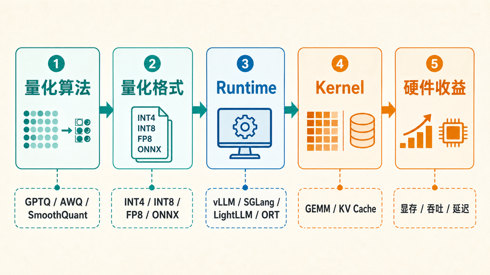

# 量化运行时与框架：vLLM、LightLLM、SGLang、TensorRT-LLM 与 ONNX Runtime

量化真正落地时，不能只看“模型被压到几 bit”。  
更关键的问题是：**目标运行时是否真的支持这种量化格式，并且能把显存、带宽或吞吐收益兑现出来**。

这一页把常见量化运行框架放到同一张工程地图里，重点回答：

1. 这些框架各自适合什么场景；
2. 支持的量化格式大致属于哪一类；
3. ONNX Runtime 和 ONNX 量化应该怎么理解；
4. 真实上线时应该按什么顺序选型和验证。

{ width="920" }

**读图提示**：量化收益要穿过算法、保存格式、runtime、kernel 和硬件五层才会兑现。只要其中一层不匹配，就可能出现“模型文件变小了，但线上请求没有更快”的情况。

## 1. 先分清：量化算法、模型格式、运行时不是一回事

很多量化讨论会把三件事混在一起：

| 层级 | 它回答的问题 | 例子 |
| --- | --- | --- |
| 量化算法 | 怎么得到低精度权重、激活或 KV cache | GPTQ、AWQ、SmoothQuant、RTN、HQQ、FP8 calibration |
| 模型格式 | 量化后的权重和 scale 怎么保存 | Hugging Face checkpoint、GGUF、ONNX、TensorRT engine |
| 运行时 | 实际用什么 kernel、cache、scheduler 跑起来 | vLLM、LightLLM、SGLang、TensorRT-LLM、ONNX Runtime |

**一个常见坑**是：算法报告里精度很好，但你的运行时没有对应 kernel，最后只能先反量化再算，吞吐收益就没了。  
所以量化上线的正确顺序通常是：

1. 先定服务目标：放得下、跑得快、降成本、上端侧，还是长上下文；
2. 再定运行时：它决定可用的 kernel、cache 和并发策略；
3. 再定量化格式：格式必须被运行时原生支持；
4. 最后定量化算法和校准集：它决定质量损失和尾部风险。

## 2. 常见框架对照

| 框架 | 更适合的场景 | 量化相关重点 | 使用时最该确认 |
| --- | --- | --- | --- |
| `vLLM` | 通用 LLM 在线服务、高吞吐、PagedAttention、OpenAI API 兼容服务 | 支持多种量化路径，如 AWQ、GPTQ、bitsandbytes、GGUF、INT4、INT8、FP8、TorchAO、量化 KV cache 等 | 量化方法和目标 GPU 架构是否匹配，真实流量下 TTFT/TPOT 是否改善 |
| `LightLLM` | 研究型和高性能服务栈、轻量 Python 架构、token 级 KV 管理 | 常作为高性能 serving backend；可结合 `LightCompress/LLMC` 导出 LightLLM 可用的量化权重 | 具体模型和量化格式是否已有 backend 支持，是否需要转换格式 |
| `SGLang` | LLM/VLM serving、结构化输出、prefix cache、agentic workload | 支持离线量化和在线动态量化；也支持 TorchAO 配置路径 | 不要把预量化模型和在线 `--quantization` 同时叠加；按文档确认当前方法状态 |
| `TensorRT-LLM` | NVIDIA GPU 上的生产级低延迟/高吞吐服务 | FP8、FP4、GPTQ/AWQ、FP8 KV cache 等和 NVIDIA kernel/engine 深度绑定 | 是否愿意进入 engine 构建、版本锁定和 NVIDIA 生态优化路径 |
| `ONNX Runtime` | 传统模型、跨平台部署、CPU/边缘/EP 生态、非纯 LLM 图推理 | ONNX 图级 INT8 量化、QDQ/QOperator、动态/静态量化、TensorRT EP、部分 INT4/UInt4 权重量化 | 模型图能否被 ONNX 表达，目标 EP 是否真正支持量化算子 |
| `Transformers + bitsandbytes` | 单机实验、快速加载 8bit/4bit、QLoRA 微调 | 使用门槛低，适合研究和微调入口 | 不等于生产 serving 最优路径，吞吐和并发通常还要看 vLLM/SGLang 等 runtime |

## 3. vLLM：最常见的通用 LLM serving 入口

`vLLM` 的量化能力适合从“服务系统”视角理解。它不只是加载一个低比特权重，而是要把量化权重、attention kernel、PagedAttention、KV cache、batching 和调度一起跑起来。

官方量化文档列出的常见路径包括：

1. `AutoAWQ`
2. `BitsAndBytes`
3. `GGUF`
4. `GPTQModel`
5. `Intel Neural Compressor`
6. `INT4 W4A16`
7. `INT8 W8A8`
8. `FP8 W8A8`
9. `NVIDIA Model Optimizer`
10. `Online Quantization`
11. `AMD Quark`
12. `Quantized KV Cache`
13. `TorchAO`

这说明 `vLLM` 更像一个**量化格式和服务 kernel 的汇合点**。  
如果你的目标是 LLM 在线服务，通常可以先问：

1. 这个模型是否已经有可用的 AWQ/GPTQ/FP8/INT4 checkpoint；
2. 目标 GPU 是 Ampere、Ada、Hopper、Blackwell，还是 CPU/Intel/AMD；
3. vLLM 当前硬件兼容表是否支持这个组合；
4. 真实请求是 prefill-heavy 还是 decode-heavy；
5. 长上下文下是否需要量化 KV cache。

### 3.1 vLLM 里的 KV cache 量化要单独看

长上下文场景里，权重显存不一定是最大瓶颈，KV cache 可能才是。  
因此只做权重量化可能不够，还要单独评估：

1. KV cache 是否占主导；
2. `--kv-cache-dtype` 这类路径是否支持目标硬件；
3. 精度是否需要 calibration scale；
4. 长上下文、推理任务和 reasoning 任务是否有专项回归。

一个实用判断是：如果短上下文吞吐改善明显，但长上下文并发仍然上不去，下一步通常不是继续压权重，而是看 KV cache、prefix cache、paged cache 和上下文裁剪。

## 4. LightLLM：更偏轻量高性能 serving backend

`LightLLM` 是一个 Python-based LLM inference/serving framework，强调轻量、易扩展和高性能。官方仓库说明里也提到它借鉴和结合了 FasterTransformer、TGI、vLLM、FlashAttention 等开源实现，并且其纯 Python 设计和 token-level KV cache 管理适合研究项目使用。

在量化主题里，`LightLLM` 更适合作为**运行 backend** 来理解，而不是把它当成一个单独量化算法。常见链路是：

1. 用量化工具生成可服务的低精权重；
2. 导出到 LightLLM 支持的保存格式或 backend 格式；
3. 用 LightLLM 的调度、KV 管理和 kernel 路径实际服务。

`LightCompress/LLMC` 这类 ModelTC 生态工具提供了面向多 backend 的压缩和量化能力，文档和仓库说明里提到支持导出到 `VLLM`、`LightLLM`、`SGLang`、`MLC-LLM`、`AutoAWQ` 等 backend，也覆盖 AWQ、GPTQ、SmoothQuant、Quarot、HQQ 等多种算法。

### 4.1 什么时候考虑 LightLLM

更值得看 LightLLM 的场景：

1. 团队想深入改 serving 内部调度、KV 管理或 kernel；
2. 目标模型或研究项目需要比较灵活的 Python 服务栈；
3. 已经使用 ModelTC/LLMC 生态做压缩和 backend 导出；
4. 要对 DeepSeek、MoE 或高吞吐场景做专项服务优化。

需要注意的是：LightLLM 的“能跑”与“量化收益可兑现”仍然取决于具体模型、量化格式、kernel 和硬件组合。上线前仍要做和全精度路径的质量、吞吐和尾延迟对照。

## 5. SGLang：离线量化、在线量化和 TorchAO 路径

`SGLang` 的官方量化文档把量化分成两类：

1. **离线量化**：直接加载预量化权重，例如 GPTQ、AWQ 这类通常需要校准或预计算统计量的方法；
2. **在线动态量化**：运行时动态计算 scaling 参数，把高精权重转成低精格式。

官方文档也明确建议：为了性能、可用性和便利性，通常优先推荐离线量化。  
如果使用预量化模型，不应再同时添加 `--quantization` 去叠加在线量化。

SGLang 还支持 TorchAO 配置路径，例如通过 `--torchao-config` 使用 `int4wo-128` 等配置；文档中列出的 TorchAO 方法包括 `int8dq`、`int8wo`、`fp8wo`、`fp8dq-per_tensor`、`fp8dq-per_row`、`int4wo-32/64/128/256` 等。

### 5.1 SGLang 的实用判断

适合 SGLang 的量化问题通常不是“能不能压低比特”，而是：

1. 结构化输出、agent 流程、prefix cache 是否是主需求；
2. 离线量化模型是否已经可用；
3. online quant 是否只是临时试验，而不是最终生产方案；
4. CUDA graph、TorchAO 配置、batching 和服务调度是否互相兼容。

## 6. TensorRT-LLM：NVIDIA 栈里的深度优化路线

`TensorRT-LLM` 更像一条**强硬件绑定的高性能路线**。它通过 TensorRT engine、plugin、kernel 和 runtime，把模型推理优化到 NVIDIA GPU 的能力边界附近。

官方量化文档列出的量化 recipe 包括：

1. `FP4`
2. `FP8 Per Tensor`
3. `FP8 Block Scaling`
4. `FP8 Rowwise`
5. `FP8 KV Cache`
6. `W4A16 GPTQ`
7. `W4A8 GPTQ`
8. `W4A16 AWQ`
9. `W4A8 AWQ`

这类路线的优势是性能上限高、NVIDIA 硬件适配强。  
代价是部署链路更重，通常要接受：

1. engine 构建和版本管理；
2. 更强的硬件/驱动/CUDA/TensorRT 绑定；
3. 模型结构和算子路径更严格；
4. 升级和回滚流程需要更完整的工程治理。

如果你在 NVIDIA Hopper、Blackwell 或数据中心 GPU 上做大规模生产服务，TensorRT-LLM 很值得评估；如果你仍在快速实验、频繁换模型或多硬件混部，vLLM/SGLang 可能更灵活。

## 7. ONNX Runtime 与 ONNX 量化

`ONNX Runtime` 和前面的 LLM serving 框架定位不完全一样。  
它更适合从“通用模型图部署”和“跨硬件 Execution Provider”角度理解，尤其适合传统 CV/NLP 模型、边缘端、CPU、移动端、TensorRT EP、OpenVINO、DirectML、QNN 等场景。

### 7.1 ONNX 量化表示：QOperator 与 QDQ

ONNX Runtime 文档里把量化表示分成两类：

| 表示 | 直观理解 | 适合关注点 |
| --- | --- | --- |
| `QOperator` | 把算子替换成量化算子，例如 `QLinearConv`、`MatMulInteger` | runtime 是否有对应量化 op kernel |
| `QDQ` | 在原图算子周围插入 `QuantizeLinear` / `DequantizeLinear` | 保留原图结构，便于 EP 识别和融合 |

工程上，`QDQ` 常更利于调试和后端融合，因为它能显式标出哪些 tensor 被量化、scale 和 zero-point 在哪里。  
但最终选哪种表示，要看目标 EP 和硬件对哪条路径支持更好。

### 7.2 动态量化与静态量化

| 类型 | 量化参数何时确定 | 优点 | 代价 |
| --- | --- | --- | --- |
| 动态量化 | 推理时按输入动态计算 activation scale | 通常精度更稳，适合 RNN/Transformer 类模型入口 | 有额外 runtime 计算开销 |
| 静态量化 | 用校准集提前确定 activation scale | 推理路径更固定，更利于性能 | 强依赖代表性 calibration data |

ONNX Runtime 文档中给出的经验是：动态量化通常推荐给 RNN 和 transformer-based models，静态量化常用于 CNN 类模型。实际项目中仍要以目标 EP、算子支持和任务回归为准。

### 7.3 ONNX Runtime 的 INT4 / UInt4 权重量化

ONNX Runtime 也支持对部分算子做 4bit integer quantization。文档中说明这是 block-wise weight-only quantization，典型支持：

1. `MatMul`：当输入 `B` 是常量时可量化；可走 QOperator 或 QDQ；
2. `Gather`：当输入 `data` 是常量时可量化；可走 QOperator。

`MatMul` 的 QOperator 路径会转换成 `MatMulNBits`，并支持 RTN、GPTQ、HQQ 等算法。  
这更接近“权重只读、块量化、运行时反量化/专用算子”的思路。

### 7.4 ONNX 量化的典型流程

```python
from onnxruntime.quantization import quantize_dynamic, QuantType

model_fp32 = "model.onnx"
model_int8 = "model.int8.onnx"

quantize_dynamic(
    model_input=model_fp32,
    model_output=model_int8,
    weight_type=QuantType.QInt8,
)
```

静态量化还需要 calibration data reader。更稳妥的流程通常是：

1. 先导出 FP32 / FP16 ONNX；
2. 做 shape inference，必要时做 symbolic shape inference；
3. 做图优化，但尽量把优化放在量化前，便于 debug；
4. 选择 QDQ 或 QOperator；
5. 动态量化或静态量化；
6. 对照 FP 模型做逐任务桶、逐层或逐 tensor debug；
7. 按目标 EP 重新测性能。

## 8. 框架选型建议

### 8.1 LLM 在线服务

优先看：

1. `vLLM`
2. `SGLang`
3. `TensorRT-LLM`
4. `LightLLM`

如果目标是快速上线和生态兼容，先看 `vLLM`。  
如果需要结构化输出、prefix cache、agent 工作负载，可以重点看 `SGLang`。  
如果硬件明确是 NVIDIA 数据中心 GPU，且追求极限性能，可以评估 `TensorRT-LLM`。  
如果团队要深度改 runtime 或使用 ModelTC 生态，可以看 `LightLLM`。

### 8.2 传统模型、边缘端和跨平台部署

优先看：

1. `ONNX Runtime`
2. `OpenVINO`
3. `TensorRT`
4. 设备厂商 NPU / DSP runtime

这类场景通常更关心图优化、EP 支持、端侧内存、模型包大小和算子覆盖，而不是 LLM 专用 KV cache 调度。

### 8.3 研究与微调

优先看：

1. `Transformers + bitsandbytes`
2. `AutoAWQ`
3. `GPTQModel`
4. `LLM Compressor`
5. `LightCompress/LLMC`

研究阶段可以先用这些工具快速得到量化模型；进入部署阶段，再确认目标 runtime 是否能直接消费这些格式。

## 9. 量化框架上线检查清单

上线前至少回答下面问题：

1. 量化格式是否被目标 runtime 原生支持；
2. 对应 kernel 是否覆盖目标 GPU/CPU/EP；
3. 是否真的减少 TTFT、TPOT、显存或单位 token 成本；
4. 是否有长上下文、工具调用、多模态、代码、数学等高风险桶回归；
5. 是否有全精度回退、复杂请求路由或混合精度保护；
6. 是否记录了校准集、量化参数、runtime 版本和硬件版本；
7. 是否对 KV cache、LoRA、多模型混部和 batch 调度做过专项压测。

**一句话判断**：量化框架选型不是“哪个支持的格式最多”，而是“哪个在你的模型、硬件、请求分布和质量门槛下，能把收益稳定兑现出来”。

## 10. 结合低比特 LLM 综述的选型补充

arXiv:2409.16694 把低比特 LLM 量化放在“基础、系统、算法”三个视角下统一整理，其中系统视角尤其提醒我们：量化不是只改变 checkpoint，而是会改变 runtime、kernel、硬件和部署流程的协同关系。

对运行框架选型来说，可以把这篇综述里的思路落成四个问题：

1. **基础格式是否合适**：`INT4`、`INT8`、`FP8`、`NF4`、block-wise scale、group-wise scale 的误差形态和硬件路径不同；
2. **系统是否支持**：格式能保存不等于能高效执行，必须确认 runtime 和 kernel 是否原生支持；
3. **训练阶段是否参与**：如果需要 `QAT`、`QLoRA` 或量化友好继续训练，就不能只评估推理 runtime；
4. **推理瓶颈在哪里**：短上下文常先看权重和 GEMM，长上下文常要把 KV cache、prefix cache 和调度一起评估。

### 10.1 一个更实用的决策顺序

如果你只需要一个可执行顺序，可以按下面走：

1. 先用真实请求确认瓶颈：权重显存、activation、KV cache、prefill、decode、还是调度；
2. 再选 runtime：`vLLM` / `SGLang` / `LightLLM` / `TensorRT-LLM` / `ONNX Runtime`；
3. 再选格式：`AWQ`、`GPTQ`、`FP8`、`INT8`、`INT4`、`ONNX QDQ` 等必须被 runtime 支持；
4. 再选算法：校准、二阶补偿、激活平滑、QAT 或 KV cache quant；
5. 最后固定回归桶：长上下文、代码、数学、多轮工具、RAG、多模态和高价值业务样本要分开看。

这套顺序的核心是：先把“能不能跑快”确定下来，再优化“怎么量得更准”。如果顺序反过来，团队很容易先得到一个漂亮的离线量化结果，最后发现目标 serving stack 根本吃不到收益。

## 11. 参考资料

1. vLLM Quantization：<https://docs.vllm.ai/en/latest/features/quantization/index.html>
2. vLLM FP8 KV Cache Blog：<https://vllm.ai/blog/fp8-kvcache>
3. LightLLM GitHub：<https://github.com/ModelTC/lightllm>
4. LightCompress / LLMC GitHub：<https://github.com/ModelTC/LightCompress>
5. SGLang Quantization：<https://docs.sglang.io/docs/advanced_features/quantization>
6. TensorRT-LLM Quantization：<https://nvidia.github.io/TensorRT-LLM/1.2.0rc5/features/quantization.html>
7. ONNX Runtime Quantize ONNX Models：<https://onnxruntime.ai/docs/performance/model-optimizations/quantization.html>
8. *A Survey of Low-bit Large Language Models: Basics, Systems, and Algorithms*：<https://arxiv.org/abs/2409.16694>
