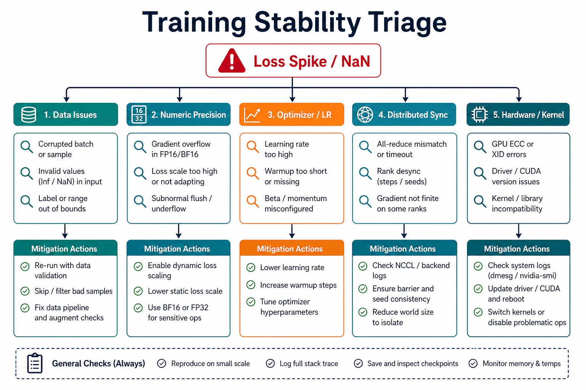
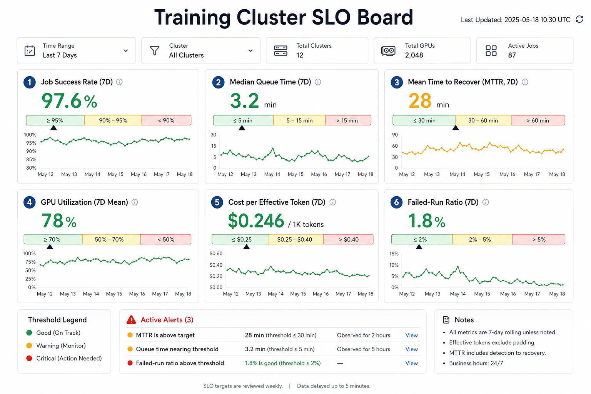

# 低比特训练、FP8/FP4 与训练数制

这一页讨论的是**训练里的低精度**，不是单纯的推理量化。

推理量化常问的是：模型已经训好了，能不能用更低比特部署。  
低比特训练问的是：模型还在训练中，前向、反向、激活、梯度、优化器状态和通信能不能都用更低精度，同时不让训练发散。

这两件事看起来都叫“量化”，但风险完全不同。

{ width="920" }

**读图提示**：低比特训练不是只选 `FP8` 或 `FP4`。真正要决定的是哪些张量降精度、哪些 scale 策略可控、哪些 kernel 支持原生低精度、哪些层必须保高精，以及如何证明长训练不会在后期崩。

## 1. 为什么这属于训练重点内容

训练时，模型每一步都要经历：

1. 前向计算；
2. loss 计算；
3. 反向传播；
4. 梯度规约；
5. 优化器更新；
6. checkpoint 保存与恢复。

每一步都可能被低精度影响。  
如果只是推理量化，错误通常只影响一次输出；如果是训练低精度，错误会通过参数更新写回模型，后续每一步都会继续继承它。

所以低比特训练的核心不是“省显存”，而是：

**在更低精度里保持可收敛、可扩展、可复现的训练动力学。**

## 2. 训练里到底哪些东西可以降精度

低比特训练至少涉及六类对象：

| 对象 | 是否容易降精度 | 主要风险 |
| --- | --- | --- |
| 权重 `W` | 相对容易 | 表示误差影响前向输出 |
| 激活 `A` | 很难 | 分布随输入、层数和序列长度变化，outlier 明显 |
| 激活缓存 | 很有价值 | 反向要用，压低后可能破坏梯度 |
| 梯度 `dW` | 中等偏难 | 累积误差会改变更新方向 |
| 优化器一阶动量 | 中等 | 影响更新平滑性 |
| 优化器二阶动量 | 更难 | 数值范围和小量变化很敏感 |

这里最容易被低估的是**激活**。  
权重、梯度和优化器状态很多时候可以通过 ZeRO/FSDP 分片到多卡上，但激活强依赖当前 micro-batch、sequence length 和模型层数，通常直接压在单卡显存上。长上下文训练里，激活经常比权重更早成为瓶颈。

## 3. 数制不是名字问题，而是表示预算问题

低精度训练里常见的格式可以粗略分成四类。

### 3.1 INT：规则简单，但动态范围压力大

`INT8 / INT4` 用整数加 scale 表示浮点张量：

\[
q = \mathrm{round}(x / s), \qquad \hat{x} = s q
\]

优点是硬件和 kernel 生态成熟。  
问题是低 bit 下动态范围非常紧，遇到 activation outlier 时容易出现两个坏结果：

1. scale 被极大值拖大，小值全部挤在少数桶里；
2. 直接截断极大值，破坏关键 token 或关键层。

所以 INT 路线常用于推理权重量化；训练里如果要做得很激进，通常需要更细粒度 scale、旋转、裁剪或 QAT 配合。

### 3.2 FP8：训练中最实用的低精度入口

`FP8` 保留指数位和尾数位，因此比 INT 更自然地处理动态范围。常见格式是：

| 格式 | 直觉 | 常见用途 |
| --- | --- | --- |
| `E4M3` | 指数较少、尾数较多，精度更好 | 权重、激活 |
| `E5M2` | 指数更多、范围更大，精度更粗 | 梯度、反向中范围更大的张量 |

一个实用理解是：  
前向传播更关心表示细节，所以常偏向 `E4M3`；反向传播和梯度可能范围更宽，所以有些路线会用 `E5M2`。但这不是铁律，后续 `MXFP8` 论文也验证了某些配置下梯度用 `E4M3` 仍可能更优。

### 3.3 MXFP：块共享 scale 的微缩放格式

`MXFP8 / MXFP4` 的核心是：一小块元素共享一个 scale，每个元素再用低比特浮点表示。

可以理解成：

\[
x_i \approx s_{\text{block}} \cdot q_i
\]

其中 \(s_{\text{block}}\) 是块级缩放因子，\(q_i\) 是低比特浮点值。

这样做的好处是：

1. 比 per-tensor scale 更能适配局部分布；
2. 比 per-element scale 更省元数据；
3. 更接近新硬件对低精度 tensor core 的原生支持方式。

代价是 scale 管理和 kernel 实现更复杂。

### 3.4 NVFP、HiFloat 与厂商格式

`NVFP4`、`HiFloat8 / HIFP8` 这类格式体现了一个趋势：  
低比特训练不只是在算法层面改 quantizer，也会向硬件和数制本身延伸。

例如 `NVFP4` 相比普通 `MXFP4`，会通过更小微块、更精确 scale 和分层缩放改善 FP4 的有效表达范围。  
`HiFloat8` 则通过不同的指数和尾数安排，试图在同样 8 bit 内获得更适合深度学习张量的动态范围。

## 4. 低比特训练的核心矛盾

低比特训练要同时优化三件事：

1. **表示误差**：低精度表示是否足够接近原张量；
2. **更新误差**：反向传播和优化器是否仍然给出正确方向；
3. **系统收益**：kernel、通信和显存是否真的变快变省。

只满足第一点不够。  
很多方法离线 MSE 很低，但训练一长就崩；也有方法数值还行，但 scale 计算和 cast 开销太大，端到端没有收益。

可以把低比特训练看成下面这个闭环：

```text
张量分布 -> scale/rounding -> 低精度 kernel -> 梯度更新 -> 参数分布改变 -> 下一步张量分布
```

推理量化通常只走一次前半段；训练低精度会不断循环，所以后期 outlier、rounding bias 和 loss spike 更危险。

## 5. 为什么 activation 是主战场

训练显存里，激活的特点是：

1. 随 batch size 增长；
2. 随 sequence length 增长；
3. 随层数增长；
4. 反向传播必须读取；
5. 很难像 optimizer state 那样简单分片掉。

这也是为什么 `COAT`、`MOSS`、`Scaling FP8 Training to Trillion-Token LLMs` 等论文都特别关注 activation。

### 5.1 一个直观例子

假设某层激活大多数值在 \([-2, 2]\)，但偶尔出现一个 1000。  
如果 per-tensor scale 为了容纳 1000，那么大量普通值会被压进很少的量化桶里。  
如果直接裁剪 1000，又可能破坏某些关键 token 的路径。

所以常见解决思路包括：

1. per-token 或 per-group scale；
2. SmoothQuant 这类难度迁移；
3. Hadamard rotation 分散 outlier；
4. 保留敏感层高精度；
5. 对 SwiGLU、LayerNorm、Attention 等结构做专项处理。

## 6. FP8 训练路线：从可用到长稳

### 6.1 FP8 Formats：先定义可用格式

[FP8 Formats for Deep Learning](https://arxiv.org/abs/2209.05433) 给出了 `E4M3 / E5M2` 的基础设定。  
它的意义不是“发明 8-bit”，而是证明深度学习训练和推理可以围绕一组更适配 tensor core 的 FP8 格式组织起来。

工程上，你可以把这篇看成 FP8 训练的数制起点。

### 6.2 FP8-LM：把梯度和优化器状态也纳入低精度

[FP8-LM: Training FP8 Large Language Models](https://arxiv.org/abs/2310.18313) 的重点是：不要只让 GEMM 用 FP8，还要考虑梯度和 Adam 状态。

它提醒我们，训练内存不是只有权重。Adam/AdamW 至少涉及：

1. 参数；
2. 梯度；
3. 一阶动量；
4. 二阶动量；
5. 有时还有 master weight。

如果只有矩阵乘降精度，优化器状态仍然高精度，低比特训练的显存收益会被严重限制。

### 6.3 COAT：optimizer states 和 activation 才是大头

[COAT](https://arxiv.org/abs/2410.19313) 重点压缩 optimizer states 和 activation。  
它的工程意义在于明确指出：很多训练路线只把 linear GEMM 做低精度，但真正消耗显存和引发不稳定的部分不止 linear。

尤其是 activation，因为它和 batch、序列长度直接绑定，往往决定你能不能开更长上下文。

### 6.4 Scaling FP8 to Trillion Tokens：短跑稳定不等于长跑稳定

[Scaling FP8 Training to Trillion-Token LLMs](https://arxiv.org/abs/2409.12517) 的核心价值是把 FP8 训练拉到长 token 规模，暴露出短实验看不到的不稳定。

其中一个关键问题是 `SwiGLU` 的 outlier 放大。  
训练到一定阶段后，某些激活异常值可能逐渐变大，在延迟缩放或低精度路径下触发 loss spike 甚至发散。

这给训练实验一个很重要的提醒：

**低精度方案不能只跑几千 step 就宣布稳定。**

### 6.5 μnit Scaling：减少动态缩放复杂度

[μnit Scaling](https://arxiv.org/abs/2502.05967) 关注更简单、可扩展的 FP8 训练参数化。  
它的方向是通过结构和初始化上的约束，减少对动态 scale 的依赖。

这类工作很重要，因为动态缩放虽然灵活，但会带来：

1. 运行时统计开销；
2. kernel 融合困难；
3. 恢复和复现实验复杂；
4. 对 outlier 更敏感。

### 6.6 MXFP8 与 MOSS：把 scale 做得更细，同时别让开销吃掉收益

[Microscaling Data Formats for Deep Learning](https://arxiv.org/abs/2310.10537) 和 [Recipes for Pre-training LLMs with MXFP8](https://arxiv.org/abs/2506.08027) 说明：微缩放格式可以让低精度更贴近局部张量分布。

但 scale 越细，系统问题越明显。  
`MOSS` 这类工作关注的就是：per-group 量化虽好，但 dequant、scale 计算和内维缩放可能引入很大开销。低精度训练最终必须和 kernel 设计一起看。

## 7. FP4 训练路线：更低 bit，更强系统耦合

`FP4` 的诱惑很直接：相比 BF16，理论存储更小，tensor core 路径也可能更快。  
但 FP4 的表示预算极小，训练稳定性比 FP8 更难。

### 7.1 MXFP4：用微缩放减轻 4-bit 表达压力

[Training LLMs with MXFP4](https://arxiv.org/abs/2502.20586) 说明，FP4 训练通常必须结合微缩放和 outlier 处理。  
只把 BF16 张量粗暴转成 FP4，几乎不可能稳定。

一个常见组合是：

1. 低比特元素；
2. 块级 scale；
3. 随机 Hadamard 变换；
4. 混合精度保护层；
5. 随机舍入或无偏梯度估计。

### 7.2 Quartet：低比特训练不能脱离硬件 kernel

[Quartet](https://arxiv.org/abs/2505.14669) 的价值在于把 FP4 算法和 Blackwell 原生 FP4 kernel 绑定起来看。  
它不是单纯比较量化误差，而是把训练速度、梯度估计、scaling law 和 GPU 实现放在一起。

这类工作说明一个现实结论：

**FP4 训练不是纯算法课题，它天然是数制、优化器、kernel 和硬件的共同设计。**

### 7.3 NVFP4：更小微块和更精确 scale

[Pretraining Large Language Models with NVFP4](https://arxiv.org/abs/2509.25149) 关注 `NVFP4` 在长 token 预训练里的可行性。  
相比普通 MXFP4，NVFP4 会使用更小的微块和更精确的 FP8 scale，目标是减少 4-bit 表达带来的有效精度浪费。

直观理解是：  
FP4 的元素本身太粗，所以必须让 scale 更聪明、更细、更贴合局部分布。

### 7.4 Four Over Six：scale 到最大值不一定最好

[Four Over Six](https://arxiv.org/abs/2512.02010) 提醒一个很反直觉的问题：  
把块最大值缩放到 FP4 最大可表示值，不一定让整体误差最小。

因为 FP4 的可表示点非常稀疏，最大值附近可能有很大的空洞。  
有时把块缩到 4 而不是 6，反而能让大部分值落在更合适的表示区间。

这说明低比特训练里的 scale 不是简单的：

```text
scale = max_abs / qmax
```

而是一个要和格式离散点分布共同优化的问题。

## 8. FlashAttention 与低精度训练稳定性

低精度训练不只影响 linear。  
Attention，尤其是 FlashAttention 这类高度融合 kernel，也可能改变数值误差形态。

典型风险包括：

1. softmax 概率接近 1 时的舍入偏置；
2. \(O = PV\) 中低精度累加误差；
3. 反向传播里 rowsum、归约和低秩结构误差累积；
4. BF16/FP8 混合路径下某些误差不再随机抵消。

这类问题说明：  
训练低精度不能只测 `Linear` 层误差。Attention kernel、归一化、残差流和激活函数都要纳入排查。

{ width="920" }

## 9. MTP、投机解码和量化训练为什么会碰到一起

你前面提到的 `QSpec` 很值得单独放在训练系统视角里看。  
它不是传统意义上的“把模型压小”，而是把不同精度路径用于不同推理角色：

1. 低精度路径负责 draft；
2. 高精度路径负责 verify；
3. 两者共享权重或共享部分状态，减少额外显存。

这给训练和推理联动带来一个启发：

**低精度不一定只服务最终输出，也可以服务中间草稿、候选树、提前退出和自投机路径。**

如果未来做 `MTP + quantization`，核心问题会变成：

1. 低精度 draft 是否足够快；
2. 低精度 draft 是否和高精度 target 分布足够一致；
3. 低精度 KV cache 是否会污染后续验证；
4. 接受率下降是否被单步速度提升抵消；
5. 能否按任务难度动态决定 draft token 数。

这就是为什么 `MTP`、`Speculative Decoding`、`QSpec`、`FP8/FP4` 最终都会回到同一个系统问题：  
**用更便宜的计算产生足够可信的中间结果，再用更贵的路径兜底。**

## 10. 一个低比特训练实验应该怎么设计

不要一上来就全模型 FP8 或 FP4。更稳的推进顺序是：

1. 先建立 BF16 baseline，并固定数据版本、token 预算和评测桶；
2. 只打开主干 GEMM 的 FP8，确认 loss 和吞吐；
3. 再压 activation cache，看显存收益和反向误差；
4. 再尝试梯度、optimizer states 或通信低精度；
5. 最后才推进 FP4 / NVFP4 这类更激进路线；
6. 每一步都保留可回退配置和逐层数值对照。

### 10.1 训练指标不能只看 loss

至少要同时看：

| 指标 | 为什么重要 |
| --- | --- |
| loss 曲线 | 发现明显发散和 loss spike |
| 梯度范数 | 发现更新方向异常 |
| activation max / percentile | 发现 outlier 是否放大 |
| scale 饱和率 | 发现 scale 是否被极端值拖住 |
| NaN / Inf 计数 | 发现数值路径崩坏 |
| throughput | 判断低精度是否真的提速 |
| 显存峰值 | 判断是否释放 batch / sequence 空间 |
| 下游 benchmark | 判断 loss 相近是否真的能力相近 |

### 10.2 低比特训练 dashboard 应该长什么样

{ width="920" }

一个实用 dashboard 至少要把下面几类图放在一起：

1. loss、learning rate、gradient norm；
2. activation percentile、max、scale；
3. 每类 kernel 的耗时和占比；
4. 显存峰值和 activation checkpoint 开关；
5. 通信时间、计算时间和 overlap 比例；
6. evaluation benchmark 分桶结果。

如果只看 loss，你会很晚才发现问题；如果只看吞吐，你会高估低精度收益。

## 11. 伪代码：低精度 Linear 的核心形态

下面是一个简化后的伪代码，用来说明低比特训练里的基本动作。真实实现会更复杂，并且会使用 fused kernel。

```python
def quantize_per_group(x, group_size, fp_format):
    groups = x.reshape(-1, group_size)
    scale = choose_scale(groups, fp_format)
    q = round_to_format(groups / scale, fp_format)
    return q, scale


def low_precision_linear(x, w, group_size=128):
    x_q, x_scale = quantize_per_group(x, group_size, fp_format="fp8_e4m3")
    w_q, w_scale = quantize_per_group(w, group_size, fp_format="fp8_e4m3")

    # 真实系统中这里应走 tensor core / fused kernel，而不是先反量化成高精度。
    y = matmul_dequant(x_q, w_q, x_scale, w_scale, accum_dtype="bf16")
    return y
```

这段代码背后的关键不是 `round`，而是：

1. scale 如何选；
2. group size 如何定；
3. accumulator 用什么精度；
4. 反向传播如何处理量化误差；
5. 是否能被 kernel 高效执行。

## 12. 伪代码：训练时的低精度保护策略

```python
for step, batch in enumerate(loader):
    with low_precision_region(dtype="fp8", allow_modules=["attention", "mlp"]):
        logits = model(batch["input_ids"])

    # loss、norm、部分 logits 相关操作保高精度。
    loss = cross_entropy(logits.float(), batch["labels"])

    loss.backward()

    if has_nan_or_inf(model):
        rollback_to_last_safe_checkpoint()
        disable_low_precision_for_sensitive_modules()
        continue

    clip_grad_norm_(model.parameters(), max_norm)
    optimizer.step()
    optimizer.zero_grad()
```

这个伪代码表达的是低比特训练的基本态度：  
低精度应该是可控区域，而不是全局赌博。敏感模块、异常恢复和自动降级必须提前设计。

## 13. 论文路线图：按问题而不是年份读

### 13.1 数制和格式

| 论文 / 文档 | 重点 |
| --- | --- |
| [FP8 Formats for Deep Learning](https://arxiv.org/abs/2209.05433) | `E4M3 / E5M2` 基础 |
| [Microscaling Data Formats for Deep Learning](https://arxiv.org/abs/2310.10537) | `MXFP / MXINT` 微缩放 |
| [Ascend HiFloat8 Format for Deep Learning](https://arxiv.org/abs/2409.16626) | `HiFloat8` 数制设计 |
| [OCP MX v1.0 Spec](https://www.opencompute.org/documents/ocp-microscaling-formats-mx-v1-0-spec-final-pdf) | MX 格式标准 |

### 13.2 FP8 训练稳定性

| 论文 | 重点 |
| --- | --- |
| [FP8-LM](https://arxiv.org/abs/2310.18313) | 梯度和优化器状态低精度 |
| [COAT](https://arxiv.org/abs/2410.19313) | activation 和 optimizer state 压缩 |
| [Scaling FP8 Training to Trillion-Token LLMs](https://arxiv.org/abs/2409.12517) | 长 token 训练稳定性与 SwiGLU outlier |
| [To FP8 and Back Again](https://arxiv.org/abs/2405.18710) | 低精度训练稳定性评估 |
| [μnit Scaling](https://arxiv.org/abs/2502.05967) | 简化 FP8 scaling 和参数化 |
| [Recipes for Pre-training LLMs with MXFP8](https://arxiv.org/abs/2506.08027) | MXFP8 预训练配方 |

### 13.3 FP4 / NVFP4 训练

| 论文 | 重点 |
| --- | --- |
| [Optimizing Large Language Model Training Using FP4 Quantization](https://arxiv.org/abs/2501.17116) | FP4 训练优化和可微量化估计 |
| [Training LLMs with MXFP4](https://arxiv.org/abs/2502.20586) | MXFP4、RHT 和 outlier 处理 |
| [Quartet](https://arxiv.org/abs/2505.14669) | 原生 FP4 kernel 与训练 |
| [Pretraining LLMs with NVFP4](https://arxiv.org/abs/2509.25149) | NVFP4 长 token 预训练 |
| [Four Over Six](https://arxiv.org/abs/2512.02010) | NVFP4 adaptive block scaling |
| [Quartet II](https://arxiv.org/abs/2601.22813) | NVFP4 无偏梯度估计 |

### 13.4 量化和投机解码交叉

| 论文 / 项目 | 重点 |
| --- | --- |
| [QSpec](https://arxiv.org/abs/2410.11305) | 低精度 draft + 高精度 verify |
| [EAGLE](https://arxiv.org/abs/2401.15077) | feature-level speculative draft |
| [EAGLE-3](https://arxiv.org/abs/2503.01840) | training-time test 与多层特征融合 |
| [TorchSpec](https://github.com/torchspec-project/TorchSpec) | speculative decoding 训练框架 |

## 14. 常见误区

### 14.1 把低比特训练当作推理量化的自然延伸

推理量化的误差不写回参数；训练误差会写回参数。  
所以训练低精度必须看长期稳定性，而不是只看单批输出误差。

### 14.2 只看平均 loss，不看尾部和后期

很多低精度问题不会一开始就炸。  
它可能在 outlier 慢慢放大、scale 慢慢失配、梯度误差慢慢累积之后突然出现。

### 14.3 只谈数制，不谈 kernel

如果低精度路径频繁 cast 回 BF16，或者 scale 计算开销很大，理论速度不会变成端到端速度。  
FP4 尤其如此：没有原生 kernel 支持，收益很容易被系统开销吃掉。

### 14.4 忽略恢复语义

低精度训练更容易出现偶发 NaN、loss spike 和不可重复问题。  
因此 checkpoint 必须保存足够信息，包括 scale 状态、混合精度配置、随机数状态、optimizer 状态和数据游标。

## 15. 最小落地清单

如果你要做一个低比特训练项目，至少先准备这张清单：

1. BF16 baseline，包含同数据、同 token、同评测桶；
2. 每层 activation percentile 统计；
3. 梯度范数、NaN/Inf、loss spike 告警；
4. 逐层数值对照脚本；
5. kernel profile，确认 FP8/FP4 路径没有频繁 fallback；
6. 高精度保护层列表；
7. 自动回退策略；
8. 长跑验证计划，不能只跑短实验；
9. 下游 benchmark 分桶，不只看平均分；
10. checkpoint 恢复一致性测试。

## 16. 和相邻章节怎么连起来

建议按下面顺序阅读：

1. [数值、显存与运行时基础](../foundations/numerics-memory-and-runtime-basics.md)
2. [训练稳定性、数值异常与故障排查](stability-numerics-and-failure-triage.md)
3. [分布式训练与 Checkpoint](distributed-training-and-checkpointing.md)
4. [MTP 与投机解码](mtp-and-speculative-decoding.md)
5. [FP8 与混合精度服务](../quantization/fp8-and-mixed-precision-serving.md)
6. [低精度与量化 Kernel](../operators/low-precision-and-quantized-kernels.md)

量化专题更关注“如何压缩和部署”；这一页更关注“训练过程中如何不崩，并且真的换来训练效率”。

