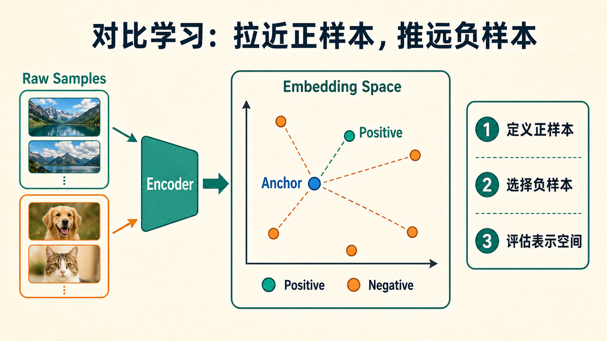

# 对比学习总览

对比学习的核心，是让“正样本更近、负样本更远”。

!!! tip "基础知识入口"
    对比学习依赖 embedding space、batch 内矩阵计算和 loss 优化。如果这些概念还不稳，可以先看 [张量与计算图](../foundations/tensors-shapes-and-computation-graphs.md)、[Transformer 与 Attention](../foundations/transformer-attention-and-tokenization.md) 和 [优化与训练基础](../foundations/optimization-and-training-basics.md)。

下面这张图先把对比学习压缩成一个表示空间问题：原始样本经过 encoder 变成向量，训练目标不是直接输出类别，而是让正确匹配在 embedding space 里靠近，让不匹配样本保持足够距离。

{ width="920" }

**读图提示**：图里的 `Anchor` 是当前样本，`Positive` 是应该被拉近的匹配样本，`Negative` 是应该被推远的干扰项。真正难的是右侧三步：正样本定义、负样本选择、表示空间评估，任何一步错了，损失函数本身再漂亮也会学歪。

**最经典的目标是 InfoNCE**：

\[
\mathcal{L}_{\text{InfoNCE}} = - \log \frac{\exp(\text{sim}(z_i, z_i^+)/\tau)}{\exp(\text{sim}(z_i, z_i^+)/\tau) + \sum_j \exp(\text{sim}(z_i, z_j^-)/\tau)}
\]

这个式子看起来像一条普通损失函数，但背后真正塑造的是表示空间的几何结构：什么应该聚在一起，什么应该分开，哪些差异要被保留，哪些差异可以被忽略。

## 1. 为什么它重要

它不仅影响自监督视觉，也深刻影响：

- CLIP 这类图文模型
- 检索系统
- 表征学习
- 多模态对齐
- 向量数据库召回

可以说，对比学习是现代“向量空间理解”最核心的训练范式之一。

## 2. 一个例子：金毛犬的两张照片

把一只金毛犬的两种图像增强视为正对，把其他图像视为负对。训练后，模型会倾向于把“同一只狗的不同视角”聚到一起，把不同对象分开。

这个例子看似简单，但已经包含对比学习的本质：

- 谁应该近
- 谁应该远
- 相似性由什么定义

### 2.1 为什么这个例子还不够真实

真实世界的问题通常更复杂。比如：

1. 两张狗图是不是同一种狗，还是同一只狗；
2. 不同拍摄环境该不该被忽略；
3. 颜色差异、背景差异、动作差异中哪些算语义，哪些算噪声；
4. 在文本检索里，同义句算正样本还是假负样本。

也就是说，对比学习真正难的地方从来不是“有没有损失函数”，而是“正负定义到底是什么”。

## 3. 对比学习真正解决的问题

在没有标签时，模型并不知道什么是“同类”。对比学习的关键就是自己构造监督信号，让模型学会一个有结构的嵌入空间：

\[
x \xrightarrow{f_\theta} z
\]

**这个空间随后可以被用于**：

- 分类
- 检索
- 聚类
- 多模态对齐

### 3.1 表示空间为什么比单一任务更重要

因为一旦嵌入空间足够有结构，很多下游任务只是“读取这个空间里的信息”，而不必每次从头学习。一个好的表示空间常常意味着：

1. 线性分类更容易；
2. 检索近邻更可信；
3. 多模态对齐更稳定；
4. 长尾迁移更自然。

## 4. 为什么它对多模态特别重要

图像和文本原本在完全不同的输入空间里。对比学习让它们可以共享一个可比较的嵌入空间，于是：

- 文本可以搜图
- 图像可以搜文
- 相似内容可以被聚到一起

这也是 CLIP、商品搜索、图文检索能大规模落地的重要原因。

### 4.1 多模态里的特殊难点

在多模态场景中，负样本问题会更棘手。因为很多图文对之间存在弱相关、部分重叠或语义近似。如果把这些都粗暴地当负样本，就会在嵌入空间里强行拉开本该靠近的点。

这也是为什么多模态系统常常需要：

1. 更大的 batch；
2. 更谨慎的 hard negative 设计；
3. 更强的数据清洗；
4. 更细的评测和长尾分析。

## 5. 两条最重要的发展线

### 自监督视觉线

如：

- SimCLR
- MoCo
- BYOL

**它们主要在回答**：没有标签时，怎样学出有用表征。

### 多模态对齐线

如：

- CLIP 风格图文对齐
- 向量检索
- 跨模态召回

**它们主要在回答**：不同模态之间，怎样建立统一语义空间。

### 5.1 还有一条常被忽略的系统线

随着对比学习进入生产环境，它又衍生出一条系统主线：

1. 向量索引和检索；
2. hard negative 挖掘；
3. embedding 评测与回流；
4. 在线召回质量监控。

这说明对比学习并不只是训练范式，也是一类系统基础设施的起点。

## 6. 为什么“自监督”不等于“无监督万能”

对比学习虽然不依赖显式标签，但依然非常依赖：

1. 数据增广设计；
2. 正负样本构造；
3. batch 与队列策略；
4. 假负样本控制；
5. 长尾评测。

如果这些环节没做好，模型依然可能学到捷径，而不是稳定语义结构。

## 7. 一个更现实的理解方式

可以把对比学习想成在训练一名“向量世界里的地图绘制者”。它的任务不是直接回答问题，而是把世界里的样本排布成一张地图：

1. 相似的样本应该住得近；
2. 不同的样本应该拉开；
3. 同一语义在不同模态中也要对齐；
4. 长尾和细粒度差异不能全被抹平。

地图画得好，后面的检索、分类、多模态对齐和推荐系统都会受益；地图画歪了，后面所有基于 embedding 的系统都会出问题。

## 8. 阅读建议

如果你是第一次系统学习这个方向，建议按下面顺序：

1. [基础方法](foundations.md)
2. [多模态与检索](multimodal-and-retrieval.md)
3. [难负样本与增广设计](hard-negatives-and-augmentation-design.md)
4. [评测与失效模式](evaluation-and-failure-modes.md)
5. [自蒸馏与非对比方法](self-distillation-and-non-contrastive-methods.md)

先理解 SimCLR/MoCo/BYOL 这类基础构件，再看它们如何自然延伸到 CLIP、检索系统与非对比表征学习。

## 9. 一个总判断

对比学习的价值，不在于它是一种“无标签也能学”的技巧，而在于它提供了一种组织表示空间的方式。现代多模态检索、向量数据库和很多自监督视觉能力，实际上都建立在这张表示空间地图是否画得足够合理之上。理解对比学习，也是在理解今天大量基础模型系统的底层几何。 

## 快速代码示例

```python
import torch
import torch.nn.functional as F

def info_nce(z1, z2, temperature=0.07):
    z1 = F.normalize(z1, dim=-1)
    z2 = F.normalize(z2, dim=-1)
    logits = z1 @ z2.T / temperature
    labels = torch.arange(z1.size(0), device=z1.device)
    return F.cross_entropy(logits, labels)
```

这段代码演示了一个最小可用的 **InfoNCE** 步骤：先把两路表示做归一化，再用相似度矩阵除温度得到 logits，最后用对角正样本标签计算交叉熵。实际训练时通常还会加入双向损失、大 batch 或队列来提升负样本质量。


## 学习路径与阶段检查

对比学习建议按“目标函数 -> 样本制度 -> 下游消费 -> 失效分析”读。它不是单个 loss，而是一套表示空间设计方法。

| 阶段 | 先读 | 读完要能回答 |
| --- | --- | --- |
| 1. 基础目标 | [基础方法](foundations.md) | InfoNCE、temperature、batch negatives 和 projection head 分别控制什么 |
| 2. 样本制度 | [难负样本与增广设计](hard-negatives-and-augmentation-design.md) | 正样本、负样本、hard negative 和 false negative 的边界如何定义 |
| 3. 多模态消费 | [多模态与检索](multimodal-and-retrieval.md) | 表示空间如何被 CLIP、向量检索、召回和重排系统消费 |
| 4. 替代路线和验收 | [自蒸馏与非对比方法](self-distillation-and-non-contrastive-methods.md)、[评测与失效模式](evaluation-and-failure-modes.md) | 不用显式负样本时如何防 collapse，表示质量如何按任务桶和长尾样本验收 |

读完后建议接 [VLM 总览](../vlm/index.md)：很多 VLM 的图文对齐、检索增强和数据清洗问题，本质上都在消费对比学习留下的 embedding 空间。
