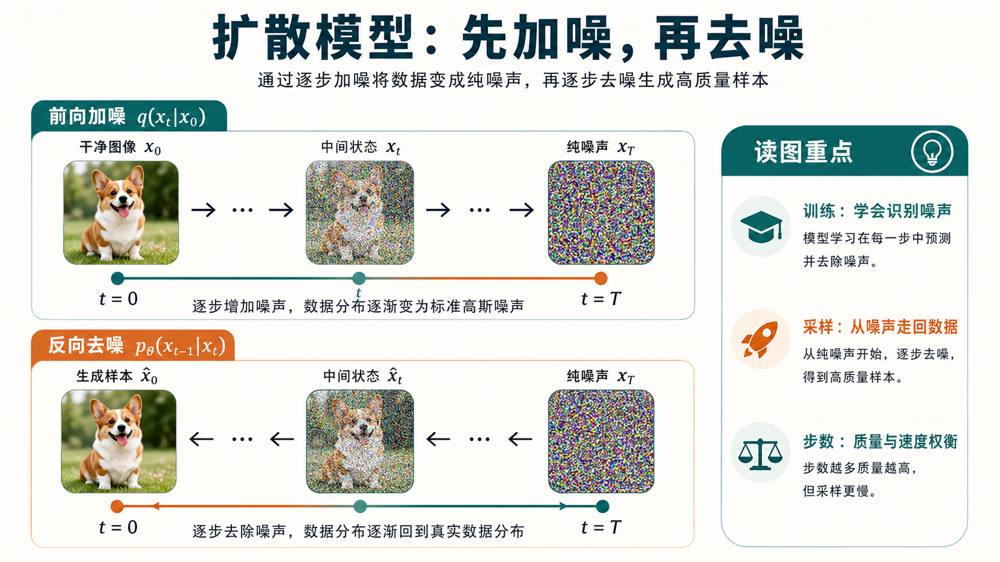

# 扩散模型总览

扩散模型可以看成一类“先破坏，再恢复”的生成模型。训练时，模型不断看到被噪声污染的数据；推理时，模型学习把纯噪声一步步还原成目标样本。

下面这张图先把主线压缩成一个直观流程：上半部分是训练时“把干净样本加噪”的前向过程，下半部分是推理时“从噪声逐步恢复”的反向过程。读扩散模型时，先把这两条方向分清，后面的噪声预测、采样器、蒸馏和整流才不会混在一起。

{ width="920" }

**读图提示**：前向过程不需要模型学习，它只是人为定义的破坏过程；真正要学习的是反向去噪。训练目标回答“怎样估计噪声或干净样本”，采样器回答“推理时沿什么路径走回去”，两者不是同一层问题。

!!! tip "基础知识入口"
    如果你对 `UNet`、`DiT`、`score`、`ELBO`、`SDE/ODE` 或 `Cross-Attention` 还不熟，可以先看 [卷积与特征提取](../foundations/convolution-and-feature-extraction.md)、[Transformer 与 Attention](../foundations/transformer-attention-and-tokenization.md) 和 [概率、潜变量与生成模型](../foundations/probability-latent-variables-and-generative-models.md)。这些是扩散模型后续章节反复使用的公共概念。

## 一个统一的数学骨架

设原始样本为 \(x_0 \sim q_{\text{data}}(x)\)。前向加噪过程写成：

\[
q(x_t \mid x_{t-1}) = \mathcal{N}\left(x_t; \sqrt{1-\beta_t}\,x_{t-1}, \beta_t I\right)
\]

把它展开到任意时刻 \(t\)，可以直接写成：

\[
q(x_t \mid x_0) = \mathcal{N}\left(x_t; \sqrt{\bar{\alpha}_t}x_0, (1-\bar{\alpha}_t)I\right)
\]

其中：

\[
\alpha_t = 1 - \beta_t,\qquad \bar{\alpha}_t = \prod_{s=1}^{t}\alpha_s
\]

这意味着我们可以一次采样到任意噪声时刻：

\[
x_t = \sqrt{\bar{\alpha}_t}x_0 + \sqrt{1-\bar{\alpha}_t}\,\epsilon,\qquad \epsilon \sim \mathcal{N}(0, I)
\]

这条式子非常重要，因为它把“长链加噪”变成了“直接构造带噪样本”的监督学习问题。

## 为什么它有效

直觉上，扩散模型把一个很难直接学的高维分布，拆成了很多个更容易学的局部恢复问题：

- 当噪声很大时，模型只需先学会粗结构。
- 当噪声很小时，模型再补细节和纹理。

**这有点像修复一张被雾化的照片**：

1. 先看出这是“人、树、房子”还是“猫、桌子、杯子”。
2. 再慢慢把轮廓、边缘、纹理补回来。

## 四个最重要的视角

理解扩散模型时，最好不要只盯某一篇论文，而是始终从四个视角来读：

### 1. 建模视角

数据如何被逐步加噪、又如何被逐步恢复。

### 2. 参数化视角

**模型到底在预测**：

- 噪声
- 原图
- score
- velocity

### 3. 求解器视角

推理过程能否被看成 <a class="term-tip" href="score-matching-sde-and-probability-flow/#6-probability-flow-ode" data-tip="ODE：Ordinary Differential Equation，常微分方程。扩散里常指不再额外注入随机噪声、沿 probability flow 连续轨迹求解。">ODE</a>/<a class="term-tip" href="score-matching-sde-and-probability-flow/#4-sde" data-tip="SDE：Stochastic Differential Equation，随机微分方程。扩散里常指带随机噪声项的连续时间加噪或反向生成过程。">SDE</a> 的数值积分问题。

!!! tip "术语快释"
    `ODE` 更像沿着一条确定路线开车，给定起点和方向场后轨迹可重复；`SDE` 更像开车时还不断受到随机风扰动，同一方向场下也可能走出不同轨迹。扩散采样器把这两类连续过程离散成有限步，因此会出现 `Euler`、`Heun`、`DPM-Solver` 等求解器。

### 4. 加速视角

**速度提升究竟来自**：

- 更好的采样器
- 更少的步数
- 蒸馏
- 路径整流

这四个视角串起来，基本就能覆盖从 DDPM 到 DMD2 / Rectified Diffusion 的主线。

## 三类核心问题

理解扩散模型时，可以一直抓住三个问题：

### 1. 训练什么

最常见的是预测噪声 \(\epsilon_\theta(x_t, t)\)，也可以预测：

- 原图 \(x_0\)
- score \(\nabla_{x_t} \log q(x_t)\)
- velocity \(v\)

### 2. 怎么采样

采样可以理解为解一个逆向 SDE 或 probability flow ODE，因此会出现：

- `DDIM`
- `Euler`
- `Heun`
- `DPM-Solver`

### 3. 怎么加速

**主要有两条路线**：

- 不重训模型，只换求解器。
- 重新训练学生模型，把几十步压到几步甚至一步，例如 `DMD2`、`Phased DMD`、`Rectified Diffusion`。

如果再细一点，可以把整条路线拆成四类方法：

| 类别 | 代表方法 | 本质 |
| --- | --- | --- |
| 原始建模 | DDPM | 学习逐步去噪的反向过程 |
| 少步采样 | DDIM | 改采样轨迹而不重训 |
| 数值求解器 | Euler、Heun、DPM-Solver | 把采样视作 ODE/SDE 求解 |
| 蒸馏与整流 | DMD、DMD2、Phased DMD、Rectified Diffusion | 重训以实现极少步或一步生成 |

## 一个生动例子：从噪声里“雕刻”柴犬头像

假设我们要生成一张“戴红围巾的柴犬正脸照片”。

- 在 \(t=T\) 时，输入只是纯高斯噪声，什么也看不出来。
- 前几步去噪后，模型先决定大结构：有一个圆形头部、两只耳朵、正脸构图。
- 中间阶段逐渐出现“狗脸”“围巾”“背景虚化”等语义。
- 后期阶段再修胡须、毛发、眼球高光和围巾褶皱。

**扩散模型的强项就在这里**：它天然适合把“全局语义 -> 中观结构 -> 局部细节”拆成多个阶段来学。

### 再换一个例子：城市夜景海报

如果提示词是“下雨的赛博朋克街道，远处有霓虹招牌和出租车”，那么扩散过程大致会表现为：

1. 先确定透视结构和大块亮暗区域。
2. 再形成道路、楼体、招牌和车辆轮廓。
3. 最后补雨丝、反光、灯牌字体和局部高光。

这也是为什么扩散模型在图像生成里常被认为比一次性生成更容易兼顾结构与细节。

## 为什么扩散模型会有这么多采样器

因为训练目标通常定义的是一个连续或近连续的去噪场，而真正出图时必须把这条轨迹离散成有限步。  
**于是你会看到**：

- `DDIM`：第一代少步采样
- `Euler / Heun`：数值积分器思路
- `DPM-Solver / DPM-Solver++`：扩散 ODE 专用高阶求解器

也就是说，采样器多并不是因为大家随便发明新名字，而是因为“怎么走回去”本来就是一个数值求解问题。

## 为什么后来又会转向蒸馏和一步生成

因为光靠更好的 solver，通常很难把几十步压到一步。  
**于是研究开始进一步问**：

- 能不能让学生直接学会更短的生成映射？
- 能不能不模仿整条轨迹，而是直接对齐最终分布？
- 能不能把生成路径改得更适合少步离散？

**这就自然引出了**：

- Progressive Distillation
- Consistency / LCM
- DMD / DMD2 / Phased DMD
- Rectified Flow / Rectified Diffusion

## 读扩散模型时最容易混淆的几件事

### 训练目标和采样器不是一回事

同一个训练好的模型，往往能搭配多种采样器。

### 少步采样和一步蒸馏不是一回事

前者通常是推理侧优化，后者通常需要重训学生模型。

### 质量与速度始终在拉扯

采样步数越少，系统越快；但想保住细节、多样性和文本对齐，难度也会急剧上升。

## 学习路径与阶段检查

扩散专题最容易混在一起的是“训练目标、采样轨迹、条件控制、少步蒸馏”。建议按下面四段读：

| 阶段 | 先读 | 读完要能回答 |
| --- | --- | --- |
| 1. 建模起点 | [发展脉络](evolution.md)、[训练与表示](training.md) | 前向加噪、反向去噪、ELBO、噪声预测和 \(x_0/v/score\) 参数化分别在解决什么 |
| 2. 连续视角 | [Score Matching、SDE 与 Probability Flow](score-matching-sde-and-probability-flow.md)、[噪声日程与参数化](noise-schedules-and-parameterization.md) | 为什么同一个扩散模型可以被看成 SDE、ODE 或 score field |
| 3. 推理与控制 | [条件控制与 Guidance](guidance-and-conditioning.md)、[采样与推理](inference.md) | CFG、solver、步数、随机性和文本对齐之间如何权衡 |
| 4. 加速与变体 | [蒸馏与整流](distillation.md)、[一致性模型与 Rectified Flow](consistency-models-and-rectified-flow.md)、[视频与多模态扩散](video-and-multimodal-diffusion.md) | 少步采样、一步蒸馏、rectified 路线和视频扩散各自改的是哪一层 |

如果只是快速定位方法，先看 [方法对照表](comparison-table.md)。如果要做训练或部署决策，最后一定补 [训练配方与失效分析](practical-training-recipes-and-failure-analysis.md)：扩散系统的很多失败不是公式错，而是数据、噪声日程、采样器和评测口径没有对齐。

## 快速代码示例

```python
import torch

def cfg_eps(eps_uncond, eps_cond, scale=6.0):
    # classifier-free guidance
    return eps_uncond + scale * (eps_cond - eps_uncond)

@torch.no_grad()
def ddim_step(x_t, alpha_t, alpha_prev, eps):
    # 一个简化版 DDIM 更新
    x0 = (x_t - (1 - alpha_t).sqrt() * eps) / alpha_t.sqrt()
    return alpha_prev.sqrt() * x0 + (1 - alpha_prev).sqrt() * eps
```

这段代码把两个常见推理组件放在一起：`cfg_eps` 展示了 **Classifier-Free Guidance** 如何混合条件/无条件噪声预测，`ddim_step` 展示了单步 **DDIM** 更新。实践中你可以先固定步数，再调 `scale` 找到质量与多样性的平衡点。

*[ODE]: Ordinary Differential Equation，常微分方程；在扩散里常指没有额外随机噪声项的 probability flow 轨迹。
*[SDE]: Stochastic Differential Equation，随机微分方程；在扩散里常指带随机噪声项的连续时间加噪或反向生成过程。
