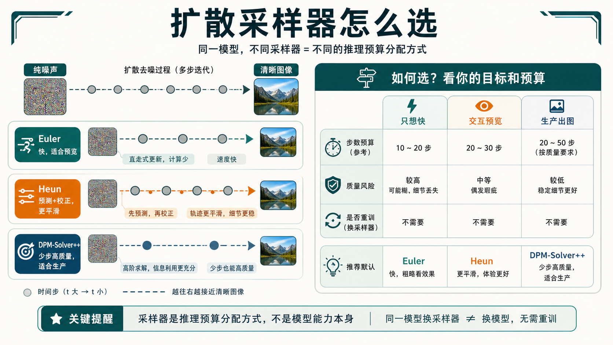

# 扩散模型的采样与推理

扩散推理的本质，是把训练好的去噪网络当成一个向量场估计器，再沿着这条向量场从噪声走回数据分布。

采样器可以先按“预算怎么花”来理解。`Euler` 更像低成本快速基线，`Heun` 用额外模型调用换更平滑的修正，`DPM-Solver++` 则更适合作为少步高质量和强 guidance 场景的默认候选。

{ width="920" }

**读图提示**：采样器不是在提升模型本身的知识，而是在决定同一个去噪网络如何离散求解。实际选型时不要只看单张图效果，应该按步数、guidance、prompt 类型、延迟和失败样本分桶比较。

!!! note "难点解释：采样器为什么能换"
    训练好的扩散网络给出的是“往哪里去噪”的方向估计。采样器决定每一步沿这个方向怎么走、走多远、是否校正。只要接口一致，同一个模型可以搭配不同 sampler，但步数越少，对 sampler 和预测质量的要求越高。

!!! example "有趣例子：下山路线"
    去噪像从雾山山顶走到山脚村庄。Euler 每次看当前坡度就迈一步；Heun 会先试走再校正；DPM-Solver 像根据山路形状做更聪明的多步预测。路线不同，但目标都是尽快安全到村庄。

## 1. 为什么推理会慢

原始 `DDPM` 往往需要 \(T=1000\) 左右的离散步。若每一步都要跑一次大 UNet，整体时延会很高。

**所以采样加速主要在做两件事**：

- 用更少的时间点离散同一条轨迹。
- 用更高阶的数值方法减少离散误差。

## 2. DDIM：把随机链改成确定路径

`DDIM` 的常见更新可以写成：

\[
x_{t-1} = \sqrt{\bar{\alpha}_{t-1}}\hat{x}_0 + \sqrt{1-\bar{\alpha}_{t-1}-\sigma_t^2}\,\hat{\epsilon} + \sigma_t z
\]

当 \(\sigma_t = 0\) 时，采样变成确定性的。这样做的好处是：

- 同样模型可以跳过很多中间步。
- 轨迹更可控。
- 图像插值和反演更方便。

### 例子：草图成图

你给模型一张简单线稿和提示词“日落下的海边灯塔”。

- 用很多步时，灯塔、海面、霞光会逐层细化。
- 用 DDIM 减少到 20 或 30 步时，整体结构仍可保住，但一些浪花和云层细节会更依赖模型本身的先验。

## 3. ODE 视角：采样是数值积分

在连续时间视角下，可以把采样写成 probability flow <a class="term-tip" href="../score-matching-sde-and-probability-flow/#6-probability-flow-ode" data-tip="ODE：Ordinary Differential Equation，常微分方程。这里把去噪过程看成确定性的连续轨迹，然后用有限步近似。">ODE</a>：

\[
\frac{dx}{dt} = f_\theta(x,t)
\]

这里 \(f_\theta\) 由 score 或噪声预测网络导出。于是采样器就变成了 <a class="term-tip" href="../score-matching-sde-and-probability-flow/#8" data-tip="ODE solver：常微分方程求解器。扩散采样里，它决定每一步怎样沿向量场移动，例如 Euler、Heun 或 DPM-Solver。">ODE solver</a>。

!!! tip "简称怎么读"
    `ODE` 是常微分方程，强调确定性轨迹；`SDE` 是随机微分方程，轨迹里还包含随机扰动。扩散模型先有连续过程，再把连续过程离散成有限步采样，所以采样器本质上是在控制数值积分误差。

## 4. Euler：最简单的一阶方法

若把时间离散成 \(t_n\)，Euler 更新写成：

\[
x_{n+1} = x_n + h f_\theta(x_n, t_n)
\]

**优点**：

- 每步只需一次模型调用。
- 实现最简单。

**缺点**：

- 局部截断误差是一阶，步数太少时容易损细节。

### 例子：四步速写采样

假设我们只允许 4 步采样一张“蓝色陶瓷杯放在木桌上”的图像：

1. 第一步决定大布局，是俯视还是侧视。
2. 第二步拉出杯子和桌面的轮廓。
3. 第三步补蓝釉反光和阴影。
4. 第四步修边缘与背景景深。

Euler 在这种极少步场景下速度很高，但每一步都很“硬”，容易让杯口边缘略粗糙。

## 5. Heun：预测后再校正

Heun 方法先预测，再修正：

\[
\tilde{x}_{n+1} = x_n + h f_\theta(x_n,t_n)
\]

\[
x_{n+1} = x_n + \frac{h}{2}\left(f_\theta(x_n,t_n) + f_\theta(\tilde{x}_{n+1}, t_{n+1})\right)
\]

它本质上用两次斜率平均来提升精度。

**优点**：

- 在同样步数下，常比 Euler 更平滑。
- 中低步数下更容易保住轮廓和细节。

**代价**：

- 近似每步两次网络调用。

## 6. DPM-Solver：为 diffusion ODE 定制的高阶解法

`DPM-Solver` 的思路不是机械套用通用 Runge-Kutta，而是利用扩散 ODE 的特殊结构，把线性项做更准确处理。

**可以把它粗略理解为**：

\[
x_{t_{n+1}} = \Phi(x_{t_n}, \epsilon_\theta, t_n, t_{n+1})
\]

其中 \(\Phi\) 不是普通的 Euler 步，而是考虑了噪声日程与网络输出结构的专用更新算子。

**这类方法的价值在于**：

- 当步数压到 10 到 20 时，仍能保持较高质量。
- 对大型文生图模型尤其有用。

## 7. DPM-Solver++ 与 guidance

在 classifier-free guidance 下，向量场会更“陡”，数值求解更容易不稳。`DPM-Solver++` 通过更适合 guided sampling 的参数化改善这个问题。

**工程上可以把这看成**：

- 无 guidance 时，求解路径较平缓。
- 高 guidance 时，系统更像高曲率轨迹，低阶方法更容易偏。
- `DPM-Solver++` 正是在这种情况下更稳。

## 8. 如何选

### 只想快，不想重训

- 先试 `DPM-Solver++`
- 其次 `Euler`
- 再根据细节需求看 `Heun`

这一类需求最典型的场景，是你手里已经有一个训练好的扩散模型，希望**只改推理栈、不动训练栈**。此时应优先选择对现有权重最友好的 solver，而不是一上来就引入蒸馏、Consistency 或一步模型。`DPM-Solver++` 往往是默认优先项，因为它在少步和 guidance 场景下通常更稳；`Euler` 更像一个快速、直接、好调试的基线；`Heun` 则适合你愿意多付一点计算，去换更平滑的边缘和更稳的中低步质量。

一个很实用的策略是，先固定同一组 prompt、seed 和 guidance，把 `Euler`、`Heun`、`DPM-Solver++` 在 8 步、12 步、20 步几个延迟桶上拉出速度-质量曲线。这样你看到的不只是“哪个平均更好”，而是同一模型在不同预算下最合适的 solver。

### 想做交互式预览

- 用很少步的 `Euler` 或 `DDIM`
- 先给用户低成本草图
- 再切高质量采样器二次精修

交互式预览的重点并不是一次把终图做到最好，而是**尽快给用户一个可判断方向的中间结果**。因此预览阶段更看重 TTFT 和整体构图是否对，而不是纹理是否已经打磨完整。少步 `Euler` 或 `DDIM` 的价值就在这里：先把主体、构图、色调和大轮廓给出来，让用户尽早决定要不要继续。

这类场景通常适合做两段式工作流。第一段用 4 到 8 步左右的便宜采样快速出草图；第二段只对用户确认后的候选图切到更高质量 solver、更多步数，甚至叠加超分与修复。这样能把总系统成本从“每张图都精修”改成“只有值得的图才精修”。

### 想做生产级文生图

- 用 `DPM-Solver++` 或同类高阶 solver 作为默认
- 为高 guidance 场景单独做参数搜索

生产级文生图更在意的是**稳定收益**，而不是偶尔出一张更好的样例图。因此默认 solver 不能只看最好看的展示图，而要看不同 prompt 类型、不同 guidance、不同分辨率和不同 seed 下的整体波动。高阶 solver 往往更适合作为默认路径，是因为它们在少步情况下更容易同时兼顾成本和可接受质量。

此外，生产场景下 guidance 往往不是一个固定值。广告图、写实人像、二次元、logo 或海报的最优 guidance 可能完全不同。更稳的做法是把 solver 和 guidance 一起做桶化配置，而不是假设一组全局参数能覆盖所有流量。

## 9. 一个直观结论

**采样器像不同的开车方式**：

- `Euler` 像直来直去地快速修正方向。
- `Heun` 像先试探一下方向，再回头纠偏。
- `DPM-Solver` 像对道路曲率有更多先验，因此在少量转向中也能更平滑地开到终点。

如果把这个比喻再往工程上落一点，可以把采样器理解成“在相同模型能力下，决定你怎样花推理预算”的执行策略。`Euler` 更适合做低成本基线和快速预览，`Heun` 更像在同等步数下争取更稳的折中，`DPM-Solver` 系列则是在明确追求少步高质量时更像默认主力。真正的设计问题，从来不是哪一个名字更先进，而是你的预算、任务和质量门槛更适合哪种开车方式。

## 快速代码示例

```python
from diffusers import DiffusionPipeline, DPMSolverMultistepScheduler
import torch

pipe = DiffusionPipeline.from_pretrained(
    "stabilityai/stable-diffusion-xl-base-1.0",
    torch_dtype=torch.float16,
).to("cuda")
pipe.scheduler = DPMSolverMultistepScheduler.from_config(pipe.scheduler.config)

image = pipe(
    "rainy cyberpunk street, neon sign, ultra detailed",
    num_inference_steps=20,   # 步数预算
    guidance_scale=6.0,       # 条件强度
).images[0]
image.save("sample.png")
```

这段代码展示了一个可直接运行的文生图最小推理链路：加载模型后把 scheduler 切到 `DPMSolverMultistep`，再通过 `num_inference_steps` 与 `guidance_scale` 控制速度和条件强度。通常先用 15 到 30 步做首轮调参，再按任务质量要求细化。


## 实践补充与检查

### 把 **扩散模型的采样与推理** 从方法名写成设计空间

这一类页面如果只停留在“概念、公式、论文关系”，读者很容易知道名词却不知道何时该用、何时不该用。围绕 **扩散模型的采样与推理**，更扎实的写法应当把它放回一个明确设计空间：

1. **采样步数、solver 稳定性、guidance 强度、延迟预算、部署路径**。

只有把这些坐标讲清楚，读者才能理解：某种方法为什么在论文里成立、落到工程里时最容易在哪些环节变形，以及它和相邻方法的真正边界在哪里。

### 更实用的分析顺序

围绕 **扩散模型的采样与推理**，建议读者和实践者都先按下面顺序思考：

1. **先问目标**：你到底追求画质、控制性、速度、稳定性、还是部署成本；
2. **再问数据制度**：训练样本是什么形态、分布有没有长尾、标注或条件信号是否可靠；
3. **再问系统边界**：推理预算、显存预算、工具链与下游接口是否支持；
4. **最后问方法细节**：采样器、蒸馏、量化、损失函数、控制机制的具体选型。

这比一上来就在方法之间横向比较更有帮助，因为很多“方法优劣”其实是由目标和系统边界决定的，而不是由方法名字决定的。

### 最容易被忽略的失败模式

围绕 **扩散模型的采样与推理**，常见失败并不只是“指标低”，更常见的是：

1. **只追更少步数**。
2. **忽略质量抖动**。
3. **线上路径与离线图像生成目标混淆**。

这些问题说明，方法页若只讲主线和优点，会让读者得到一个过于平滑的印象。真正扎实的内容应当明确指出：哪些收益最容易被 benchmark 放大，哪些副作用最容易被平均值遮住，哪些结论只在某些数据制度或硬件路径上成立。

更具体地说，少步采样最常见的失败不是“所有图都变差”，而是**某些 prompt 桶突然不稳**。例如结构复杂场景、长文本 prompt、高 guidance、人像局部细节、文字生成或多对象关系，往往比平均样本更容易暴露 solver 的极限。如果只看一组平均 FID 或人工挑选样例，很容易高估方法的泛化稳定性。

还有一种误判是，把离线单图生成的成功直接外推到交互式系统。真实产品里，预览模式、精修模式、重试逻辑、缓存、并发和用户可感知延迟会一起改写方法价值。某个 solver 离线略优，不代表它在线上就是最优默认。

### 验收与实践清单

对 **扩散模型的采样与推理**，更像工程文档的验收至少要覆盖：

1. **按任务场景选 sampler**。
2. **记录速度-质量曲线**。
3. **为不同延迟桶保留多档策略**。

此外，建议把方法验收长期绑定三类材料：

1. **热路径案例**，证明它在主场景下确实有价值；
2. **尾部案例**，避免方法只在容易样本上好看；
3. **回退与替代方案**，明确什么时候应该切回更简单、更稳的方法。

做到这一步后，**扩散模型的采样与推理** 才会从“资料页”升级成“真正能指导设计决策的页面”。

如果再往实践里收一层，至少应补三类固定证据：

1. **固定 prompt 套件**：覆盖写实、人像、复杂构图、字体、海报、多对象和极端 guidance；
2. **固定延迟桶**：例如 4 步、8 步、12 步、20 步，明确每档预算能换来什么质量；
3. **固定回退门槛**：当某类 prompt 或某档 guidance 出现明显抖动时，系统自动切回更稳的 solver 或更高步数。

只有把这些证据固定下来，采样器选择才会真正变成工程决策，而不只是主观偏好。

*[ODE]: Ordinary Differential Equation，常微分方程；在扩散里常指没有额外随机噪声项的 probability flow 轨迹。
*[SDE]: Stochastic Differential Equation，随机微分方程；在扩散里常指带随机噪声项的连续时间加噪或反向生成过程。
