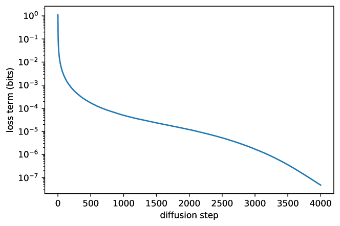

# 扩散模型中的噪声日程与参数化

扩散模型的很多讨论表面上在谈“模型结构”，但真正决定训练稳定性和采样行为的，往往是两个更底层的设计：

1. `噪声日程`
2. `参数化方式`

如果这两项没理解清楚，很多现象都会显得像经验调参；一旦把它们放回统一公式里，很多设计选择就会变得有逻辑。

下面这张 Improved DDPM 原论文图把训练损失拆到不同 diffusion step 上看：不同时间段贡献的学习压力并不均匀。低噪声区间更像“补纹理和边缘”，中噪声区间更像“学物体结构”，高噪声区间更像“从几乎看不见的信号里恢复语义”。

{ width="760" }

<small>图源：[Improved Denoising Diffusion Probabilistic Models](https://arxiv.org/abs/2102.09672)，Figure 2。原论文图意：分析 CIFAR-10 训练中 variational lower bound 各 timestep 项的贡献，显示不同 diffusion step 的损失权重和学习压力差异很大。</small>

!!! note "图解：为什么噪声日程不能只看 beta"
    图里的重点是不同 timestep 对训练目标的贡献并不平均。某些区间如果权重过大，模型会把容量集中到那段噪声水平；某些区间如果监督太弱，少步采样时就容易出现结构不稳、细节糊或语义弱。实际读噪声日程时，不要只看 \(\beta_t\) 是不是线性，真正影响训练的是 SNR 分布、loss weighting 和采样时选哪些 timestep。

!!! example "有趣例子：调节雾化玻璃"

    噪声日程像调一块可控雾化玻璃：低噪声时还能看清边缘，高噪声时只剩大概轮廓。训练材料如果总停在轻雾区，模型会擅长修细节；如果总停在浓雾区，模型会更会猜语义但容易丢纹理。

## 1. 噪声日程到底在决定什么

在离散扩散里，正向过程通常写成：

\[
q(x_t \mid x_{t-1}) = \mathcal{N}\left(x_t;\sqrt{1-\beta_t}x_{t-1}, \beta_t I\right)
\]

其中 \(\beta_t\) 的序列就是噪声日程。  
**它决定了**：

- 每一步加多少噪声
- 前期信号衰减多快
- 后期是否仍保留足够梯度信息

若展开到任意时刻 \(t\)，有：

\[
x_t = \sqrt{\bar{\alpha}_t}x_0 + \sqrt{1-\bar{\alpha}_t}\epsilon,\qquad \bar{\alpha}_t = \prod_{s=1}^{t}(1-\beta_s)
\]

因此从训练视角看，噪声日程其实是在塑造：

\[
\text{SNR}_t = \frac{\bar{\alpha}_t}{1-\bar{\alpha}_t}
\]

也就是说，它本质上在决定不同时间点的信噪比分布。

## 2. 为什么噪声日程会影响训练质量

直觉上，扩散训练就是在不同噪声水平下让模型学会去噪。  
如果日程设计不合理，就会出现：

- 低噪声阶段样本过多，模型过度关注细节但全局结构差
- 高噪声阶段过强，训练信号过于模糊，模型难学语义

### 一个直观例子：临摹一张照片

如果老师给你的训练材料里，90% 都是“只被轻微擦花”的图，你会很擅长修局部划痕，却不擅长从几乎全噪声中恢复对象结构。  
反过来，如果 90% 都是“几乎纯噪声”的图，你可能学会猜大概轮廓，却补不出细节。

噪声日程就是在平衡这两种学习压力。

## 3. 常见噪声日程

### 3.1 线性日程

最直接的做法是让 \(\beta_t\) 线性变化。  
**优点**：

- 简单
- 早期实现广泛使用

**缺点**：

- 对不同时间区间的 SNR 分布不总是理想
- 在少步采样或特定分辨率场景下未必最优

线性日程的最大优点，是它足够直接、足够容易实现，也因此成为很多早期工作和教学材料的起点。它给人一种“每一步都均匀增加一些噪声”的直观感，这对理解正向过程非常友好。

但问题在于，训练真正感受到的不是 \(\beta_t\) 本身，而是整个过程中 SNR 如何分布。线性变化的 \(\beta_t\) 并不意味着“信息难度线性变化”。在很多实际模型里，它会让某些时间区间过于拥挤，另一些区间又学得不够。

### 3.2 Cosine 日程

很多后来工作更偏好用 \(\bar{\alpha}_t\) 的余弦形式控制噪声衰减。  
直觉上，它试图让信号保留得更平滑，避免过早把图像彻底打成白噪声。

**这类日程的优点往往体现在**：

- 训练更平衡
- 少步采样更稳

Cosine 日程之所以常被偏好，不是因为“余弦形式更优雅”，而是因为它更像在直接塑造一个更平滑的信噪比衰减过程。这样模型在中高噪声区间通常能拿到更自然的训练分布，不会太早失去对有效结构的感知。

在很多实践里，Cosine 更适合作为“默认更稳”的起点，尤其当你关心少步采样、latent diffusion 或更复杂的条件控制时。它不一定在所有设置下都绝对更强，但更容易给出一个不那么极端的训练几何。

### 3.3 连续时间与 EDM 风格日程

在连续时间或 EDM 框架中，更常直接用噪声标准差 \(\sigma\) 参数化训练与采样区间。  
**这样做的好处是**：

- 更容易和 ODE/SDE 求解统一
- 更方便设计 sampler

一旦采用连续时间或 `sigma` 参数化，你对训练和采样的理解就会从“离散步编号”变成“在噪声尺度上移动”。这对后续的 solver 设计、少步推理和采样调度都很有帮助，因为系统不再被固定的离散网格束缚。

`EDM` 风格的重要性还在于，它把很多原本零散的经验重新写回设计空间：该在什么噪声范围训练，如何采样训练时间点，solver 如何沿噪声尺度推进。这样一来，日程、参数化和 sampler 就更容易放在同一张图里比较。

## 4. 参数化方式：模型到底在预测什么

这是扩散里最容易看似换符号、实则换优化几何的部分。  
**常见的目标有四类**：

### 4.1 预测噪声 \(\epsilon\)

\[
\hat{\epsilon} = \epsilon_\theta(x_t,t)
\]

这是最经典、最广泛使用的参数化。  
**优点**：

- 实现简单
- 训练稳定
- 与 DDPM 主线一致

很多基础教材默认从它开始讲，是合理的。

噪声预测的价值，在于它把训练目标直接对准“当前带噪图里混进来了多少噪声”。这让监督信号形式统一、实现简洁，也非常适合作为扩散主线的起点。很多经典 `DDPM` 与后续文生图系统，都是在这个参数化上建立起来的。

但它也有自己的倾向性。因为目标本身偏向噪声尺度，训练时不同 SNR 区间的梯度结构会受到较大影响。于是它是否好用，往往和日程、loss weighting、solver 以及 guidance 一起决定，而不是单独决定。

### 4.2 预测原图 \(x_0\)

\[
\hat{x}_0 = x_{0,\theta}(x_t,t)
\]

它的直觉最强，因为模型直接学“把当前带噪图还原成原图”。  
但它对不同噪声区间的尺度变化更敏感，因此并不总是比噪声预测更稳。

`x_0` 预测最吸引人的地方，是它非常符合人的直觉：既然目标是恢复干净图像，那就直接让模型去猜干净图像本身。这在某些编辑任务、重建导向任务和解释模型行为时都很有帮助。

问题在于，越高噪声的样本离真实 \(x_0\) 越远，直接回归原图的尺度压力就越大。于是它对时间权重和数据尺度通常更敏感，也更容易把训练难度集中到高噪声区间。

### 4.3 预测 score

\[
s_\theta(x_t,t) \approx \nabla_{x_t}\log p_t(x_t)
\]

这在 score-based SDE 路线中很自然。  
它的意义在于把扩散明确地连到 score matching 和连续时间动力学上。

score 参数化的最大价值，不在于它一定更容易工程落地，而在于它让“扩散为何成立”这件事有了更统一的理论语言。你不再只是把模型看成一个黑盒去噪器，而是把它看成估计当前噪声分布梯度方向的向量场。

一旦这个视角建立起来，很多 solver、连续时间路径和概率流 ODE 的讨论就会自然连起来。也正因此，score 路线常常是理论理解和方法统一的关键桥梁。

### 4.4 预测 velocity \(v\)

**常见定义是**：

\[
v = \alpha_t \epsilon - \sigma_t x_0
\]

**网络学习**：

\[
\hat{v} = v_\theta(x_t,t)
\]

这类参数化在 latent diffusion、少步采样和某些 guided 场景下经常更稳，因为它在不同 SNR 区间里平衡了 \(x_0\) 和 \(\epsilon\) 两种信息。

`v` 参数化的受欢迎，很大程度上来自它不像纯 \(\epsilon\) 那样过分偏向噪声，也不像纯 \(x_0\) 那样过分承受尺度变化。它更像在学习“当前状态沿着去噪轨迹应该怎么运动”，因此经常和少步 solver、latent 空间和 guidance 路线配合得更舒服。

这也是为什么很多近年的实践更愿意把它视为一个默认更平衡的坐标系，而不是只把它当成符号替换。

## 5. 这些参数化为什么本质上是等价又不等价

从信息论上看，只要你知道 \(x_t\)、\(t\) 并预测了其中一种量，往往可以解析恢复另外几种。  
例如已知 \(\hat{\epsilon}\) 时：

\[
\hat{x}_0 = \frac{x_t - \sqrt{1-\bar{\alpha}_t}\hat{\epsilon}}{\sqrt{\bar{\alpha}_t}}
\]

所以它们在“可表示的信息”上接近等价。  
但它们在优化过程中并不等价，因为：

- 损失尺度不同
- 不同时间步的梯度权重不同
- 对 guidance 和少步采样的适配不同

也就是说，它们像是在不同坐标系里优化同一个问题。

## 6. 为什么 velocity 参数化近年更常见

因为它在高 SNR 和低 SNR 两端都相对平衡。  
纯噪声预测在某些区间会让优化更偏向噪声分量，纯 \(x_0\) 预测则更容易受尺度影响。  
而 \(v\) 参数化在很多实践中表现为：

- 少步采样兼容性更好
- guided generation 更稳
- latent space 里更舒服

### 一个直观比喻

如果说噪声预测像只盯“照片里加了多少脏东西”，原图预测像只盯“干净照片应该长什么样”，那么 velocity 更像同时考虑“信号和噪声之间的混合运动方向”。

## 7. 损失重加权为什么重要

即便选定参数化方式，训练时仍常需要对不同时间点重加权。  
**可写作**：

\[
\mathcal{L} = \mathbb{E}_{t,x_0,\epsilon}\left[w(t)\cdot \|\text{target}(x_0,\epsilon,t)-f_\theta(x_t,t)\|_2^2\right]
\]

其中 \(w(t)\) 决定：

- 模型更重视低噪声细节
- 还是更重视高噪声语义恢复

这其实又回到了前面说的 SNR 平衡问题。

很多训练现象如果只看“总 loss”，会显得很玄学；一旦意识到不同时间点的损失其实在争夺模型容量，问题就会清楚得多。重加权不是装饰项，而是在明确告诉模型：你希望它把更多容量花在什么噪声区间、什么难度段上。

这也是为什么某些模型训练 loss 很漂亮，但采样质量并不理想。因为它可能只是把更容易优化的区间学得更好了，而不是把最终最影响视觉质量或少步稳定性的区间学得更好了。

## 8. 日程与参数化不是独立设计

这是最值得强调的一点。  
很多实现把它们写成两个可选开关，但从效果上看，它们高度耦合：

- 某种噪声日程在 \(\epsilon\)-prediction 下很稳，换成 \(x_0\)-prediction 未必
- 某种参数化在长链采样下好用，在少步 solver 下未必最好

因此合理做法不是“分别调最优”，而是把：

- 噪声日程
- 参数化
- loss weighting
- sampler

放在同一框架下考虑。

更直白地说，日程决定“样本在哪些噪声段被看到得更多”，参数化决定“模型用什么坐标系理解这些噪声段”，reweighting 决定“哪些段更值得认真学”，而 sampler 决定“这些训练成果最终如何被兑现”。它们像同一条链上的四个齿轮，只要有一个齿轮啮合不顺，整条链都会表现怪异。

## 9. 三个实践场景

### 9.1 高质量图像生成

**关注点**：

- 训练稳定
- 高频细节
- 文本对齐

**这里往往更在意**：

- 合理噪声日程
- 与 guidance 兼容的参数化

这类场景最在意的是全局语义、局部细节和条件贴合能否同时成立。噪声日程若过于偏某一段，模型就可能要么大结构好但细节虚，要么细节锐但整体构图不稳。参数化若和 guidance 不兼容，则常在高提示强度时暴露颜色过饱和、局部断裂或文本对齐抖动。

### 9.2 少步采样或实时场景

**关注点**：

- 与 solver 的匹配
- 极少步下的误差放大

这时参数化方式的影响会更明显，尤其在 latent 模型中。

因为步数一压缩，原来分布在多步里的误差会集中到少量更新中，训练坐标系是否合适就会被迅速放大。很多在长链采样里差异不大的设计，一到 4 步、8 步甚至一步附近，就会表现出完全不同的稳定性和细节保真度。

### 9.3 视频或长时序扩散

**关注点**：

- 多帧一致性
- 时间噪声分配
- 条件控制稳定性

此时日程设计常不再只是“图像单帧问题”，而要兼顾时序结构。

视频里最难的地方，是每一帧的去噪问题和跨帧一致性问题会相互干扰。某种日程或参数化在单帧上很好，不代表它在长时序上仍能稳住身份、动作和局部纹理。时间维一旦拉长，噪声如何在帧间分配、条件如何跨帧保留，都会让“单帧最优”失去意义。

## 10. 常见误区

### 误区 1：参数化方式只是换个符号

实际上它会显著改变优化几何与采样行为。

如果真只是符号变化，就不会在少步采样、latent diffusion 和高 guidance 下出现如此稳定的经验差异。参数化改变的是模型如何看待信号与噪声混合状态，也因此改变了不同时间点上的学习难度。

### 误区 2：噪声日程只是细枝末节

很多训练稳定性和少步采样表现都深受其影响。

日程一旦设得不合适，模型等于被迫在一个偏斜的课程表里学习去噪。它可能不是第一眼最显眼的开关，但常常是最深层地决定训练行为的开关之一。

### 误区 3：单看 loss 就能判断哪种设计更好

有时训练 loss 更低，但真实采样质量、文本对齐或少步表现反而更差。

这是因为总 loss 把很多不同噪声区间、不同难度段和不同下游目标全部揉在一起了。没有结合采样表现、条件遵守、少步稳定性和任务质量去看，loss 很容易给出一个过于乐观的信号。

## 11. 推荐跳转

- 看训练主线：[训练与表示](training.md)
- 看采样器与求解器：[采样与推理](inference.md)
- 看少步/一步路线：[蒸馏与整流](distillation.md)

## 12. 一个总判断

扩散模型里的噪声日程和参数化，作用有点像数值求解中的坐标系与步长安排。  
单看某一项都像“局部技巧”，但一旦和 sampler、guidance、蒸馏路线合起来看，它们其实处在整条扩散工程链的最底层。

## 快速代码示例

```python
import torch

def snr_weight(alpha_t, gamma=5.0, eps=1e-6):
    snr = alpha_t / (1.0 - alpha_t).clamp_min(eps)
    return snr.clamp(max=gamma) / snr

def weighted_mse(pred, target, alpha_t):
    w = snr_weight(alpha_t).view(-1, 1, 1, 1)
    return ((pred - target) ** 2 * w).mean()
```

这段代码给出一个常见的 **SNR reweighting** 训练写法：先由 `alpha_t` 计算每个时间步的权重，再对 MSE 做重加权。它的目的通常是平衡不同噪声区间的学习难度，避免训练被少数区间主导。


## 实践补充与检查

### 把 **扩散模型中的噪声日程与参数化** 放回扩散系统全景中

讨论 **扩散模型中的噪声日程与参数化** 时，如果只停留在公式或论文世代更替，读者很容易知道“这个词是什么”，却很难判断“什么时候它真正重要”。更扎实的理解方式是把它放回完整扩散系统中：训练阶段如何定义目标，推理阶段如何兑现质量与速度，控制阶段如何接住文本、图像、布局、视频或其他条件信号，部署阶段又如何处理显存、缓存和延迟。**扩散模型中的噪声日程与参数化** 真正有价值的地方，往往不在于它单独的数学形式，而在于它如何改变整个扩散链条里的约束关系。

就工程和研究共同视角来说，把噪声日程、参数化选择、损失权重和可训练性边界放到一起看。只要把这条主线抓住，很多看似零散的结论就会变得清楚：为什么某些方法在离线视觉指标上好看，却在控制性上没有收益；为什么某些少步路线在展示图里很亮眼，但一进真实部署就暴露出不稳定或细节丢失；为什么某些训练配方在单一分辨率上成立，到了视频、多条件或长链路生成时就需要重写。

### 从目标、数据、求解器到部署的一条因果链

围绕 **扩散模型中的噪声日程与参数化**，建议把问题按因果链来读：

1. **先看目标函数和参数化**，它决定模型到底在学什么分布、什么误差结构、什么尺度上的可逆性；
2. **再看数据制度**，例如分辨率、时序长度、条件信号稀疏度、合成数据比例、caption/布局/动作标注质量；
3. **再看求解器与采样路径**，这直接决定训练成果如何在有限步数和有限显存里兑现；
4. **最后看部署目标**，判断你是更追求画质、可控性、速度、视频稳定性，还是多模态接口的一致性。

只有这条因果链打通，**扩散模型中的噪声日程与参数化** 才不会被误读成“某个更强的新 trick”。实际上，大多数扩散方法真正的边界都埋在这条链里：训练目标稍变，最佳采样器会变；条件信号变复杂，guidance 代价会变；分辨率、视频长度和部署时延一变，所谓“最优方法”往往也跟着变。

### 更容易被忽略的失败模式

在扩散专题里，真正容易吃亏的不是“完全不会用”，而是把 **扩散模型中的噪声日程与参数化** 用在了不适合的场景。常见失败包括：把离线图像生成结论直接套到长视频；把少步采样收益当成无条件稳定收益；把蒸馏、整流或 consistency 带来的速度优势误当成对所有控制信号都同样成立；把高分辨率视觉细节的提升误当成结构一致性、物理一致性或下游任务收益。

再往深一点看，这类失败几乎都指向同一个问题：**没有把扩散方法放回真实任务接口中评估**。如果你的下游是视频编辑、文生图服务、世界模型、机器人感知或多模态交互，那么评测和部署边界就会和纯视觉论文完全不同。页面内容若不把这些差异写出来，读者很难真正形成方法判断力。

### 更像实践手册的验收方式

对 **扩散模型中的噪声日程与参数化**，更稳的验收通常至少同时看四层：

1. **基础生成层**：质量、稳定性、多样性、采样步数与速度；
2. **控制层**：条件是否真正被遵守，guidance 或控制模块是否带来副作用；
3. **系统层**：显存、吞吐、缓存、编译、部署与服务路径是否可承受；
4. **任务层**：它是否真正提升你的最终业务或研究目标，而不是只提升中间指标。

把这四层一起写进页面，**扩散模型中的噪声日程与参数化** 才会真正从一段方法介绍，升级成能指导训练、推理和部署决策的扎实内容。


### 和相邻页面的接口要怎么看

读 **扩散模型中的噪声日程与参数化** 时，一个更有用的做法是不断追问它和相邻页面的接口在哪里。对扩散专题来说，真正重要的不是一页页孤立成立，而是 参数化、loss reweighting、数据尺度和采样器的接口。只要把接口讲清楚，读者就能自然知道：这一页该和训练页一起看，还是该和采样、蒸馏、控制或多模态页一起看。

### 一条更实用的落地顺序

若要把 **扩散模型中的噪声日程与参数化** 从阅读变成实践，通常更稳的顺序是：先做最基础的目标和数据判断，再定推理预算，再看控制接口，最后才决定是否引入更激进的新方法。很多项目的问题不是方法不够先进，而是还没把基础目标和部署边界对齐，就过早引入高复杂度技术。

### 还值得继续深挖的问题

围绕 **扩散模型中的噪声日程与参数化**，后续最值得补强的常常不是再列更多论文，而是继续补：

1. 这类方法在不同下游任务上的真实收益差异；
2. 它和系统成本、缓存、编译、服务路径的耦合；
3. 它在长尾控制、长视频、复杂多条件场景里的真实边界；
4. 当它失败时，最先该回退到哪一层更稳的方案。
