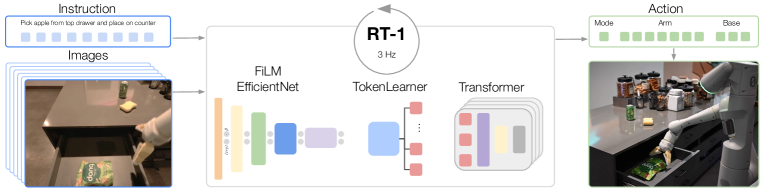

# 具身智能总览

**具身智能关注的是**：智能体不是只在文本里回答问题，而是在物理世界中感知、规划、行动并承担后果。它面对的不是“下一个 token 生成什么”这么单一的问题，而是一个闭环：

!!! tip "基础知识入口"
    具身智能会同时调用感知特征、序列建模、概率预测和系统闭环。建议把 [Transformer 与 Attention](../foundations/transformer-attention-and-tokenization.md)、[概率与潜变量](../foundations/probability-latent-variables-and-generative-models.md) 和 [优化与训练基础](../foundations/optimization-and-training-basics.md) 作为前置地图。

\[
o_t \rightarrow b_t \rightarrow p_t \rightarrow a_t \rightarrow o_{t+1}
\]

其中：

- \(o_t\) 是观测
- \(b_t\) 是内部信念或状态
- \(p_t\) 是计划
- \(a_t\) 是动作

只要其中任何一环不稳，系统都会在真实环境中迅速暴露脆弱性。

RT-1 原论文图很适合先建立具身智能闭环直觉：语言指令和相机观测进入模型，模型持续输出离散动作 token，机器人执行后又得到新的观测。

{ width="920" }

<small>图源：[RT-1: Robotics Transformer for Real-World Control at Scale](https://arxiv.org/abs/2212.06817)，Figure 1。原论文图意：RT-1 接收自然语言指令和图像历史，经过 tokenization 与 Transformer policy，以约 3Hz 输出机器人动作 token，驱动机械臂完成真实任务。</small>

!!! note "图解：RT-1 图展示的是闭环控制而不是静态识别"
    图的左侧是任务指令和相机历史，中间是把视觉与语言转成 token 后交给 Transformer policy，右侧是连续执行的机器人动作。关键不是模型“看懂了一张图”，而是每一步动作都会改变环境，下一帧观测又会反过来影响后续动作。如果一个方案只展示“看懂场景”或“输出动作”，但没有说明执行后的反馈、失败恢复和数据回流机制，它还不是完整具身系统。

## 1. 具身智能和“大模型智能体”有什么不同

**纯软件智能体的动作常是**：

- 发一句话
- 调一个 API
- 点一个按钮

具身智能体的动作则会真正改变物理世界。这意味着：

- 延迟更敏感
- 安全约束更硬
- 分布偏移更严重
- 错误代价更高

软件 agent 出错，常常是流程重试；具身 agent 出错，可能是撞到桌角、摔碎杯子、挡住人类通路，或者在危险边界继续尝试。

## 2. 一个直观例子：厨房机器人

机器人接到“把锅铲放回抽屉”任务时，需要同时解决：

- 识别锅铲和抽屉
- 理解“放回”意味着哪个目标位置
- 规划一条不碰撞的轨迹
- 控制夹爪抓取
- 在抽屉没有完全打开时动态修正动作

如果它只是“理解了这句话”，还远远不够。它必须在空间里、时间里、接触里都做对。也就是说，具身智能不是把 VLM 接一个机械臂那么简单，而是把语义理解、几何推理、控制稳定性和安全边界绑在了一起。

## 3. 具身智能的三层问题

### 感知与表征

看见什么、信什么、记住什么。

### 规划与控制

接下来怎么动，动作是否平滑、可执行、可恢复。

### 数据与迁移

仿真里学到的东西能不能迁到真实世界，失败样本能否持续回流。

这三层问题共同决定了为什么同一个机器人系统在 demo 里很聪明，在真实家庭或仓库里却常常变脆。

## 4. 为什么具身智能难得多

**因为它同时叠加了**：

- 多模态感知
- 时序决策
- 动力学约束
- 实时控制
- 安全问题
- 数据稀缺

也就是说，它既不是单纯的 VLM，也不是单纯的机器人控制，而是两者以上的耦合系统。你既要关心模型有没有看懂场景，也要关心动作输出是否能被低层控制器稳定执行，还要关心系统在失败时是否知道该怎么退。

## 5. 具身智能的任务谱系

具身任务并不只是一类。一个更有用的拆法是：

1. `桌面操作`：抓取、放置、开抽屉、插拔、堆叠；
2. `移动导航`：去某个房间、避障、找物、送物；
3. `移动操作`：先导航，再局部操作；
4. `人机协作`：递工具、协作装配、共享空间工作；
5. `长时家务流程`：整理房间、收纳餐具、清洁和分拣。

不同任务对感知、记忆、规划和安全的要求完全不同。很多“泛化能力强”的叙述，如果不说明任务谱系，通常都过于乐观。

## 6. 为什么数据是决定性瓶颈

和互联网文本不同，具身数据采集极贵。一个操作轨迹背后往往需要：

1. 真机硬件；
2. 操作员或遥操作系统；
3. 多传感器同步；
4. 环境重置；
5. 安全监管。

这意味着具身智能很难简单走“模型更大 + 数据更多”的路线。更多时候，真正值钱的是：

- 高价值失败样本；
- 恢复轨迹；
- 长尾场景；
- 高质量的任务分解与阶段标签。

## 7. 具身智能和 VLA、世界模型的关系

### 与 VLA 的关系

VLA 更像具身智能里的端到端策略接口之一。它回答的是：给定视觉观测和语言指令，模型能否直接给出动作或动作块。

### 与世界模型的关系

世界模型更像具身系统里的内部模拟器和前瞻模块。它回答的是：如果现在这样做，未来大概率会怎样变化。

### 与传统控制的关系

传统控制器并没有过时。相反，在很多真实系统里，具身智能真正稳定的形态往往是：

1. 高层由 VLM/VLA 或任务规划模块负责；
2. 中层由技能库和状态机负责；
3. 低层由经典控制器和安全约束负责。

## 8. 具身智能中的核心矛盾

几乎所有路线最终都会回到几组长期矛盾：

1. `通用性 vs 可靠性`
2. `端到端学习 vs 分层控制`
3. `仿真扩展性 vs 真实世界真实性`
4. `更强模型 vs 更稳数据与评测`
5. `更激进自治 vs 更保守安全`

真正成熟的系统，不是简单地站队某一边，而是根据目标场景决定哪一边应该更重。

## 9. 一个更实际的理解方式

如果把具身智能系统想成一位进入真实家庭或工厂的新员工，那么他至少要做到：

1. 看得明白；
2. 记得住刚刚发生了什么；
3. 知道下一步做什么；
4. 手脚协调；
5. 出错时别慌；
6. 不要伤人、不要砸物、不要把现场越弄越乱。

这六点缺一不可，而今天很多系统往往只在其中一两点上看起来很强。

## 10. 阅读建议

如果你刚进入具身方向，建议按下面顺序阅读：

1. [规划、控制与安全](planning-control-and-safety.md)
2. [Sim2Real 与数据引擎](sim2real-and-data-engines.md)
3. [任务谱系与 Benchmark](task-taxonomy-and-benchmarks.md)
4. [部署模式与安全案例](deployment-patterns-and-safety-cases.md)
5. [人机协作与交互评测](human-robot-interaction-and-evaluation.md)

如果你更偏机器人产品或部署视角，再补读：

1. [家庭机器人流程与失败模式](household-robotics-workflows-and-failure-patterns.md)
2. [VLA 总览](../vla/index.md)
3. [世界模型总览](../world-models/index.md)

## 11. 一个总判断

具身智能不是“把语言模型装到机器人上”的简单延伸，而是把感知、记忆、规划、控制、安全和数据闭环放进同一个真实物理系统里。它最难的地方，也正来自这种全链路耦合。理解这点之后，再看 VLA、世界模型、Sim2Real、恢复策略和安全部署，才会真正知道它们为什么都不是可有可无的附属模块。 

## 快速代码示例

```python
def closed_loop_step(robot, perception, planner, controller):
    state = perception(robot.sensors())
    plan = planner(state, goal=robot.goal)
    cmd = controller(plan, state)

    if not robot.safety_guard(cmd):
        cmd = robot.recover_cmd(state)     # 失败恢复 / 安全回退

    robot.execute(cmd)
```

这段代码把具身系统写成最小闭环：**感知 -> 规划 -> 控制 -> 安全检查 -> 执行**。关键点在于把 `safety_guard` 和 `recover_cmd` 放在主路径里，而不是异常路径里，这样系统在分布外场景下更可控。


## 学习路径与阶段检查

具身智能建议按“任务边界 -> 规划控制 -> 数据迁移 -> 部署安全 -> 人机协作”读。它的核心不是展示 demo，而是让闭环长期可靠。

| 阶段 | 先读 | 读完要能回答 |
| --- | --- | --- |
| 1. 任务谱系 | [任务谱系与 Benchmark](task-taxonomy-and-benchmarks.md) | 桌面操作、导航、移动操作、家庭流程和人机协作的评测口径为什么不同 |
| 2. 规划控制 | [规划、控制与安全](planning-control-and-safety.md) | 高层语义计划、技能库、低层控制器和安全约束如何分工 |
| 3. 数据迁移 | [Sim2Real 与数据引擎](sim2real-and-data-engines.md)、[家庭机器人流程与失败模式](household-robotics-workflows-and-failure-patterns.md) | 仿真、遥操作、失败样本和恢复轨迹如何共同支撑实机泛化 |
| 4. 部署协作 | [部署模式与安全案例](deployment-patterns-and-safety-cases.md)、[人机协作与交互评测](human-robot-interaction-and-evaluation.md) | 系统如何在人类共享空间里限制风险、解释状态、支持接管和回放 |

读完后建议回到 [VLA 总览](../vla/index.md) 和 [世界模型总览](../world-models/index.md)：前者负责动作接口，后者负责内部模拟和风险前瞻。一个具身方案如果没有把失败恢复和安全退出写进主路径，就还不能算学习闭环完整。
