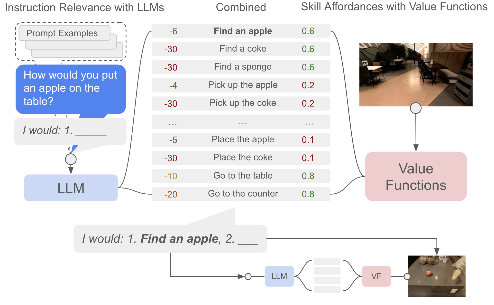

# 具身智能中的规划、控制与安全

**具身智能最容易被误解的一点是**：  
很多人把它想成“给机器人一个更聪明的大脑”。但现实里，机器人失败往往不是因为它不够会聊天，而是因为它没有在 200ms 内刹住车、没有在 3mm 误差内插进孔、没有在突然遮挡时稳定重规划。

**所以这一页强调的是**：高层智能很重要，但真正让系统站住脚的，仍然是规划、控制与安全。

SayCan 原论文图很适合解释高层语言规划为什么必须和低层可执行性绑定：LLM 可以判断某个技能是否符合指令，但 value function / affordance 才能判断当前场景里这个技能是否真的做得到。

{ width="920" }

<small>图源：[Do As I Can, Not As I Say: Grounding Language in Robotic Affordances](https://arxiv.org/abs/2204.01691)，Figure 3。原论文图意：LLM 给候选技能打“是否符合指令”的分数，value functions 给技能打“当前环境是否可执行”的 affordance 分数，二者组合后选择下一步机器人动作。</small>

!!! note "图解：SayCan 图里的 useful 和 possible"
    左侧 LLM 更像任务层：它知道“把苹果放到桌上”需要先找苹果、拿苹果、再放置；但它不知道当前机器人能不能够到苹果、夹爪是否可抓、桌子是否在附近。右侧 value function / affordance 更像执行层：它不理解完整语言目标，但能评估某个技能在当前观测下是否可行。中间 combined score 才是 SayCan 的核心：选择既符合指令又能执行的下一步。真实系统里，高层越自由，越需要低层控制、安全约束和人工接管边界兜底。

!!! note "初学者先抓住"
    具身系统不是“一个大模型直接控制所有电机”。更稳的结构通常是高层理解任务，中层规划轨迹，低层控制执行，安全层持续检查是否越界。

!!! example "有趣例子：新手司机"
    导航软件可以告诉你“前方左转”，但方向盘、刹车和避让行人必须由驾驶员实时控制。VLA 或大模型更像导航和副驾，底层控制器才是踩刹车和稳住车身的人。

## 1. 从任务到控制的分层结构

**一个典型具身系统常拆成三层**：

1. `任务层`：决定“做什么”，例如先找杯子、再抓取、最后放到水槽。
2. `规划层`：决定“怎么走”，把目标变成路径、阶段和候选动作。
3. `控制层`：决定“每个时刻如何施力和执行”，保证真实硬件稳定跟踪。

**可抽象为**：

\[
g \rightarrow p_{0:H} \rightarrow u_{0:H-1}
\]

其中：

- \(g\)：高层目标，描述任务想达到的状态。
- \(p_{0:H}\)：规划轨迹，给出未来一段路径或状态序列。
- \(u_{0:H-1}\)：控制输入，是真正下发给执行器的动作或力矩。

大模型更适合上层目标分解，例如“先打开柜门，再拿杯子，再放到水槽”。  
但真正执行时，系统仍需连续控制器来保证轨迹可行且安全。

## 2. 规划：先决定未来大致怎么走

**经典 MPC 目标可写成**：

\[
J = \sum_{t=0}^{H-1}\ell(x_t, u_t) + \ell_f(x_H)
\]

**约束为系统动力学**：

\[
x_{t+1}=f(x_t,u_t)
\]

**并求解**：

\[
u_{0:H-1}^\star = \arg\min_{u_{0:H-1}} J
\]

这里：

- \(x_t\)：系统状态，如机器人位姿、速度、关节角或物体位置。
- \(u_t\)：控制输入，如速度命令、关节力矩或末端位姿增量。
- \(\ell\)：瞬时代价，衡量当前偏离目标、碰撞风险或能耗。
- \(\ell_f\)：终端代价，衡量规划窗口末端是否接近目标。

**MPC 的关键思想是**：  
先优化未来一小段，但每次只执行第一步，然后重新观测、重新规划。

## 3. 为什么具身智能离不开重规划

**真实世界里有太多不确定性**：

- 动态障碍：人突然走过来，原路径需要立即更新。
- 目标偏差：物体没放在预期位置，抓取点和路径都要重算。
- 接触变化：夹爪接触后物体姿态变化，后续动作必须跟着修正。
- 动力学偏差：地面摩擦和仿真不一致，速度与制动距离会变化。

因此规划几乎不可能“一次算完就照着走到底”。  
**它更像一种滚动闭环**：

\[
\text{observe} \rightarrow \text{plan} \rightarrow \text{act} \rightarrow \text{observe again}
\]

### 一个直观例子：送餐机器人绕人

高层路径说“直行 8 米到 3 号桌”。  
但实际运行中，服务员从左侧穿出，小孩从右侧跑来，地上还有湿滑区域。  
这时真正工作的不是高层语言计划，而是：

- 局部避障：在高层目标不变的情况下绕开临时障碍。
- 速度重规划：根据行人、湿滑区域和安全距离调整速度。
- 低层稳定控制：让底盘或机械臂按新轨迹平稳执行。

## 4. 控制：把规划轨迹变成真实动作

假设规划层给出参考轨迹 \(x_t^{\text{ref}}\)，控制器目标是让真实状态跟随参考轨迹。  
**常见跟踪误差为**：

\[
e_t = x_t - x_t^{\text{ref}}
\]

**最简单的线性反馈可以写成**：

\[
u_t = -K e_t
\]

更一般的情况下，可使用非线性控制、MPC、阻抗控制等。

## 5. 接触任务为什么尤其难

视觉导航里，很多问题主要是几何。  
但机器人操作一旦涉及接触，问题就变成：

- 接触力：力过大会损坏物体，力过小又可能抓不住。
- 接触点稳定性：接触位置稍偏，物体就可能旋转或滑脱。
- 物体滑动：摩擦不足时，表面接触不等于真正固定。
- 末端卡死：姿态或路径微小偏差可能让工具卡在边缘。

这时光有几何轨迹还不够，还需要考虑接触力学和顺应性。

### 一个例子：插插头

从远处看，末端轨迹可能完全正确。  
但在最后 5mm，如果姿态有微小偏差，插头会顶在插座边缘上。  
这时高层规划看起来“对了”，低层控制却必须：

- 降速：接近接触点时降低冲击和损坏风险。
- 调整姿态：根据接触反馈微调角度，而不是硬插。
- 力反馈修正：允许小范围顺应，让末端沿可行方向滑入。

否则就会卡住甚至损坏设备。

## 6. 安全：不是附加功能，而是第一约束

**若定义安全集合**：

\[
\mathcal{C} = \{x \mid h(x)\ge 0\}
\]

则控制和规划应尽量保持系统始终在 \(\mathcal{C}\) 内。

**这可以表现为**：

- 碰撞距离约束：机器人与人、物体或环境保持最小安全距离。
- 关节角限幅：关节不能超过机械允许范围。
- 速度与加速度上界：限制突发动作和高速碰撞风险。
- 力矩约束：防止执行器输出过大力矩造成损坏或伤害。

### 安全投影

若模型给出候选动作 \(u_t\)，实际执行前可投影到安全集合：

\[
u_t^{\text{safe}} = \Pi_{\mathcal{U}_{\text{safe}}}(u_t)
\]

**这相当于说**：  
“你可以提建议，但最后发给执行器的动作必须经过安全过滤。”

## 7. 控制障碍函数的直觉

若用控制障碍函数描述安全边界，则目标是保证：

\[
h(x_t)\ge 0,\qquad \forall t
\]

并让控制输入满足某种前向不变条件。  
**直观理解是**：  
只要系统一直接受满足某约束的控制，它就不会离开安全区域。

### 一个直观例子：机械臂避人手

人手突然伸进机械臂工作区时，系统不需要先“思考完整任务目标”，而是应立即进入安全控制：

- 先减速：立刻降低接触风险和制动距离。
- 再后退或急停：优先让系统回到安全状态。
- 然后重新规划：确认环境安全后再考虑继续任务。

这类行为的优先级必须高于一切高层目标。

## 8. 高层大模型和低层控制怎么协作

**高层模型擅长**：

- 任务分解：把长指令拆成可执行阶段。
- 语义理解：识别目标、约束、优先级和用户意图。
- 工具和技能选择：在抓取、导航、开门、搜索等技能中选下一步。

**低层控制擅长**：

- 毫秒级闭环：用高频控制及时响应传感器变化。
- 动力学补偿：处理惯性、摩擦、负载和接触力。
- 跟踪与稳定：让真实状态贴近参考轨迹。
- 安全边界执行：把硬约束落实到每个控制周期。

**一个合理架构通常是**：

\[
\text{LLM/VLM planner} \rightarrow \text{skill policy / motion planner} \rightarrow \text{controller} \rightarrow \text{safety filter}
\]

这说明具身智能不是“经典控制被大模型替代”，而是“高层智能和低层控制明确分工”。

## 9. 三个现实场景

### 9.1 餐厅送餐机器人

目标是把热汤送到指定桌。  
系统不只要知道去哪，还要保证：

- 遇人减速
- 急转弯不洒汤
- 地面湿滑时控制更保守

这就是规划、控制与安全共同作用的例子。

### 9.2 家庭服务机器人拿玻璃杯

高层计划知道“打开橱柜，拿起玻璃杯，放到桌上”。  
**但执行时需要**：

- 控制开门力度
- 防止夹爪过紧捏碎杯子
- 放置时避免碰倒旁边盘子

这里任何一步都不只是语义问题，而是接触控制和安全约束问题。

### 9.3 仓储机械臂高速分拣

吞吐压力会逼系统提速，但提速会压缩安全裕量。  
**因此系统必须在**：

- 产能
- 稳定性
- 碰撞风险

之间动态折中。

## 10. 最常见的失败模式

### 10.1 高层计划正确，低层执行发散

任务逻辑没错，但跟踪控制不稳，机器人仍会失败。

### 10.2 安全规则写得太死

如果所有动作都被过度限制，系统虽然安全，却几乎什么都做不成。

### 10.3 规划器不懂真实动力学

规划出的轨迹几何上可行，动力学上却无法执行，例如急停距离不够、抓取时惯性过大。

### 10.4 安全层和任务层互相打架

高层一直要求前进，安全层一直要求减速，最终系统出现振荡或卡死。  
这通常说明层间接口定义不清。

## 11. 工程判断

高层大模型非常适合给目标、解释环境和调用技能。  
**但只要任务涉及**：

- 快速闭环
- 精密接触
- 人机共融
- 高代价失误

低层控制、安全过滤和状态估计都不能省。

## 12. 总结

具身智能真正难的地方，不在“模型是否懂世界”，而在“它能否在真实世界里稳定、及时、安全地行动”。  
规划告诉系统未来该往哪走，控制保证它真能走上去，安全则决定它在任何异常情况下都不把事情搞坏。  
缺了其中任何一层，机器人都很难从 demo 走向可靠部署。

## 快速代码示例

```python
def control_tick(state, planner, mpc, shield):
    ref_traj = planner.plan(state)             # 高层规划
    u = mpc.solve(state, ref_traj)             # 低层控制
    u_safe = shield.project(u, state)          # 安全投影
    return u_safe
```

这段代码强调分层控制接口：高层 `planner` 先给参考轨迹，低层 `mpc` 生成控制量，最后由 `shield` 做安全投影。这样能把任务性能与安全约束解耦，便于单独调参和审计。


## 实践补充与检查

### 用闭环任务重写 **具身智能中的规划、控制与安全**

涉及 VLM、VLA、世界模型和具身系统时，最容易出现的误区是：离线表征写得很完整，但真正和闭环任务、工具链、控制接口、风险治理放在一起时，内容支撑不够。围绕 **具身智能中的规划、控制与安全**，更扎实的组织方式应该首先回答：

1. **规划层、控制层、安全层、实时性、接管策略**。

这些坐标之所以关键，是因为这类系统通常横跨 **数据、模型、动作接口、在线约束和安全责任**。如果页面只讲模型结构，不讲这些接口，读者会很难判断一个方法是“研究上成立”还是“系统上可用”。

### 更实用的任务分解方式

围绕 **具身智能中的规划、控制与安全**，建议把问题拆成三层：

1. **理解层**：模型是否真的看懂了环境、界面、视频、状态或用户意图；
2. **决策层**：模型是否能基于这些理解做出正确下一步；
3. **闭环层**：一旦动作、工具或环境反馈回来，系统是否仍然稳定。

很多方法在第一层表现不错，但第二层和第三层并没有同步变强。页面若能把这三层明确拆开，读者就更容易看清楚：某些提升究竟是“更会看”，还是“更会做”，或者只是“更会在离线数据上得分”。

### 常见失败模式与误判

围绕 **具身智能中的规划、控制与安全**，真实失败常见于：

1. **规划和控制职责混淆**。
2. **安全只靠规则补丁**。
3. **延迟预算不明确**。

这些问题的共同点是：它们很少只靠平均准确率暴露出来，往往要靠 **回放、闭环任务、风险桶、人工抽检和高价值案例分析** 才能看清。也因此，这类页面尤其需要把“怎么验收”写得比“是什么方法”更扎实。

### 验收、上线与回流

对 **具身智能中的规划、控制与安全**，更合理的验收至少应覆盖：

1. **画清控制环层级**。
2. **把安全指标纳入主评测**。
3. **实机前做风险清单与演练**。

进一步地，建议把这类主题都放进统一闭环：

1. **离线评测** 负责判断基础能力是否成立；
2. **回放与 shadow** 负责判断真实链路是否稳；
3. **线上/实机观察** 负责判断高价值场景是否真正受益；
4. **失败样本回流** 负责让系统下一轮变得更强。

一旦这条链路写清楚，**具身智能中的规划、控制与安全** 就不再只是“某个热门方向”，而会真正成为可操作的系统设计知识。
