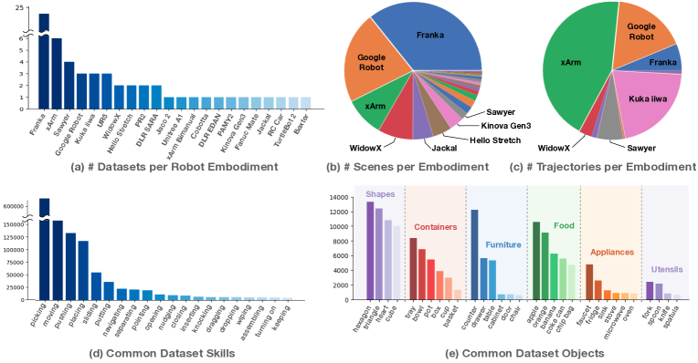

# Sim2Real 与数据引擎

**具身智能最终一定会撞上一堵墙**：  
仿真里一切顺利，真实世界里系统却开始抓空、打滑、误判、抖动、卡住。

这堵墙就是 `sim2real gap`。  
而真正把这堵墙慢慢填平的，往往不是某个单独模型，而是一整套数据引擎。

Open X-Embodiment 的数据集总览图很适合解释为什么具身智能需要数据引擎：不同机器人本体、场景、技能和物体分布差异很大，真实系统不能指望单一仿真或单一实验室数据覆盖所有长尾。

{ width="860" }

<small>图源：[Open X-Embodiment: Robotic Learning Datasets and RT-X Models](https://arxiv.org/abs/2310.08864)，Figure 1。原论文图意：统计 Open X-Embodiment 中不同 robot embodiment、scene、trajectory、skill 和 object category 的分布，展示跨机器人数据的异质性。</small>

!!! note "图解：数据引擎要处理跨本体和长尾分布"
    图里的柱状图和饼图说明，机器人数据不是一个均匀大表：不同机械臂、场景、技能和物体类别的覆盖差异很大。Sim2Real 不是“仿真一次训好，然后直接上真机”，而是仿真、真机验证、失败样本回流、参数校准和再训练组成的闭环。域随机化解决“别对单一仿真过拟合”，System ID 解决“把关键物理参数调准”，数据引擎解决“真实失败如何变成下一轮能力”，三者不要互相替代。

!!! note "初学者先抓住"
    具身数据引擎的价值不是收集更多随机轨迹，而是把真实失败变成下一轮训练材料。失败样本、恢复轨迹和参数校准往往比普通成功样本更值钱。

!!! example "有趣例子：练习投篮"
    只看进球录像，学不到为什么会投偏。教练更关心偏左、偏短、出手慢这些失败模式。Sim2Real 数据引擎也是把真实失败分类、回放、修正，再放回训练。

## 1. Sim2Real gap 到底是什么

设仿真环境分布为 \(p_{\text{sim}}\)，真实环境分布为 \(p_{\text{real}}\)。  
理想情况是训练和部署分布一致，但现实里往往：

\[
p_{\text{sim}}(o, a, s') \neq p_{\text{real}}(o, a, s')
\]

**差异来源很多**：

- 光照差异：仿真光源通常太干净，真实环境会有阴影、反光和色温变化。
- 材质反射差异：玻璃、金属、塑料等材质在真实相机里常出现仿真没覆盖的高光。
- 相机内外参偏差：焦距、畸变、相机位置或标定误差会改变视觉观测。
- 摩擦与刚度不准：接触、滑动和变形会让同一动作产生不同结果。
- 物体质量分布不对：真实物体重量和重心变化会影响抓取与搬运。
- 接触模型过于理想：仿真常低估卡住、打滑、碰撞弹性等复杂现象。

**这意味着**：  
即使策略在仿真分布上最优，到了真实分布也可能明显退化。

## 2. 域随机化：先承认你不可能把仿真调到完全真实

`Domain Randomization` 的核心不是“把仿真变真”，而是“让策略对仿真的不准确性不敏感”。

在仿真中随机化环境参数 \(\xi\)：

\[
\xi \sim p(\xi)
\]

**例如随机**：

- 光照强弱：让策略不依赖某一种固定亮度或阴影。
- 材质纹理：避免模型只记住仿真里过于干净的表面外观。
- 相机噪声：模拟模糊、压缩、曝光和传感器噪声。
- 摩擦系数：覆盖更滑或更涩的接触情况。
- 物体尺寸和质量：让动作对大小、重量和重心变化更稳健。
- 背景干扰：减少模型把背景纹理当成任务线索。

于是训练目标变成在一个参数分布上做鲁棒优化：

\[
\max_\pi \mathbb{E}_{\xi \sim p(\xi)} \left[ R(\pi; \xi) \right]
\]

直觉上，策略不是只适应“一间完美实验室”，而是适应一批略有差异的世界。

## 3. 一个直观例子：抓红色积木

**如果仿真里永远是**：

- 白色桌面：背景过于单一，模型容易把桌面颜色当成隐含条件。
- 固定顶灯：阴影和高光分布固定，真实光照变化会造成误判。
- 积木颜色纯正：颜色分布太干净，真实相机的偏色和反光没被覆盖。
- 相机无噪声：模型没有见过模糊、压缩和曝光异常。

那么策略会很容易学会一种“脆弱的成功”。  
一到真实世界里，下午阳光偏黄、桌面有反光、相机有运动模糊，它就开始失效。

做域随机化后，仿真里会主动给它制造：

- 偏暖色灯光：逼模型适应不同色温，而不是只认固定颜色。
- 桌面纹理变化：降低对单一背景的过拟合。
- 镜头模糊：模拟运动模糊、失焦或低质量传感器。
- 轻微位姿扰动：让抓取策略对物体和相机的小偏差更稳。

这样它学到的就更可能是真正稳健的视觉特征。

## 4. 域随机化并不只针对视觉

很多团队一提 sim2real 就只想到画面风格，但机器人里同样重要的是动力学随机化：

\[
m \sim p(m),\qquad \mu \sim p(\mu),\qquad c \sim p(c)
\]

这里：

- \(m\)：质量，影响搬运、加速度和抓取稳定性。
- \(\mu\)：摩擦系数，影响滑动、推拉和夹持是否可靠。
- \(c\)：接触或阻尼参数，影响碰撞、柔顺性和振动衰减。

如果这些参数在仿真里过于固定，策略会对一套理想动力学过拟合。  
真实部署时，只要物体重一点、滑一点，就可能失败。

## 5. System Identification：另一条路线是把仿真调准

与其随机到足够广，也可以尽量估计真实系统参数，让仿真更接近现实。  
**这类方法本质是在求**：

\[
\hat{\xi} = \arg\min_{\xi} \; \mathcal{D}\big(\tau_{\text{real}}, \tau_{\text{sim}}(\xi)\big)
\]

其中 \(\tau\) 是轨迹，\(\mathcal{D}\) 是某种轨迹差异度量。

现实中常常不是“只做域随机化”或“只做 system ID”，而是两者结合：

- 先做中心参数校准：用真实轨迹估计质量、摩擦、相机等关键参数。
- 再围绕中心随机化：承认真实世界仍有长尾变化，让策略保持鲁棒。

## 6. 仅靠仿真不够，必须有数据引擎

现代机器人系统往往不是一次性训练，而是闭环采数：

1. 线上部署
2. 收集失败案例
3. 重新标注与筛选
4. 回灌训练
5. 再部署验证

这就是数据引擎的基本循环。

**可以把它抽象为**：

\[
\mathcal{D}_{t+1} = \mathcal{D}_t \cup \mathcal{F}_t
\]

其中 \(\mathcal{F}_t\) 是本轮部署中收集到的高价值新样本，往往包含：

- 失败样本：真实暴露模型缺陷的轨迹，如抓空、碰撞、卡住。
- 边界样本：接近失败但尚未失败的情况，适合提前修补风险。
- 稀有场景：训练集中覆盖少但部署会遇到的长尾环境。
- 人类纠正轨迹：人工接管或遥操作修正，直接告诉模型该如何恢复。

## 7. 为什么失败样本比成功样本更值钱

如果系统只看成功演示，它会不断强化“在容易场景里成功”的能力。  
但真实部署中的瓶颈往往正是那些失败和近失败场景。

### 例子：分拣流水线

起初机器人总在透明塑料包装上抓空。  
如果你只继续收更多普通纸盒成功案例，模型提升有限。  
真正有用的是把这些失败样本回流，并有意识地补：

- 透明包装：补足视觉上边界不清、深度不可靠的物体。
- 高反光表面：覆盖强高光和误检边缘。
- 局部遮挡：训练模型在只看见部分物体时仍能规划。
- 塌陷或变形包装：让策略适应非刚体和不规则外形。

下一轮策略通常才会明显改进。

## 8. 数据引擎里最难的是“选什么回流”

不是所有线上样本都值得回流。  
若全量回流，数据很快被海量平庸样本淹没。  
更有效的是做主动筛选，例如优先回流：

- 低置信动作：模型自己也不确定的决策，通常信息价值高。
- 任务失败：直接暴露当前策略短板。
- 人工接管：说明风险已经超过自动系统可接受范围。
- 碰撞边缘：尚未出事但接近安全边界的样本。
- OOD 视觉场景：和训练分布明显不同的新环境、新物体或新光照。

**可把样本价值粗略记作**：

\[
v(x) = \alpha \cdot \text{failure}(x) + \beta \cdot \text{novelty}(x) + \gamma \cdot \text{uncertainty}(x)
\]

然后优先标注高 \(v(x)\) 样本。

## 9. Sim2Real 不只是训练问题，也是评测问题

如果评测集只来自实验室条件，系统会产生“已经很好”的错觉。  
**真正有价值的评测应覆盖**：

- 光照变化：覆盖色温、阴影、低照度和强反光。
- 物体材质变化：覆盖透明、反光、柔软、易碎等不同物性。
- 相机偏差：覆盖标定误差、视角变化、模糊和噪声。
- 背景杂乱：测试模型是否依赖干净实验室背景。
- 人类干扰：测试突然进入、遮挡或接管时系统是否保守。
- 接触异常：覆盖卡住、打滑、碰撞和力反馈异常。

### 一个直观例子：家庭机器人收纳

**实验室里**：

- 物品摆放规整
- 柜门开合角固定
- 地面无遮挡

**真实家庭里**：

- 玩具散落
- 透明盒子反光
- 柜门半开
- 桌角有阴影

如果评测不包含这些变化，你得到的上线置信度基本是虚的。

## 10. 四种常见数据来源

### 10.1 仿真数据

**优点**：

- 成本低：不需要每次占用真实机器人和人工场地。
- 可大规模生成：能快速覆盖大量物体、姿态和初始状态。
- 可自动标注：仿真能直接输出状态、深度、接触和成功信号。

**缺点**：

- 分布偏差不可避免：视觉、动力学和接触模型总会和真实世界有差距。

### 10.2 遥操作示范

**优点**：

- 质量高：人类示范通常更接近可执行轨迹。
- 任务语义清晰：语言目标、阶段动作和成功标准更容易对齐。

**缺点**：

- 成本高：采集、清洗和同步多传感器数据都很贵。
- 覆盖有限：很难系统覆盖长尾失败和大量场景变化。

### 10.3 自动运行日志

**优点**：

- 贴近真实部署：日志来自实际环境，分布最接近上线场景。
- 容易获得失败样本：碰撞、接管、卡住和低置信动作会自然暴露。

**缺点**：

- 噪声大：日志里混有无关片段、传感器异常和用户干扰。
- 需要筛选：全量回流会淹没真正有价值的长尾样本。

### 10.4 人工纠正与接管数据

**优点**：

- 错误指向明确：人工接管轨迹能直接反映“原策略错在哪里”。

**缺点**：

- 标注和回放链路复杂：需要同步原始观测、人工动作、失败原因和恢复结果。

## 11. 三个真实场景

### 11.1 家庭服务机器人

难点不在“拿杯子”这句话，而在：

- 杯子材质各异：玻璃、陶瓷、塑料的反光和受力完全不同。
- 桌面杂乱：路径规划要避开遮挡和易碎物。
- 光照随机变化：视觉识别不能只适应固定实验室灯光。
- 人随时可能插手：系统要能暂停、让行或切换接管。

这种场景极依赖数据引擎，而不是只依赖一套离线静态数据集。

### 11.2 仓储拣选

货物种类变化快，包装反光、遮挡、堆叠关系都在变。  
仿真可覆盖基础几何，但真正稳定上线，需要持续从真实流水线回流错误案例。

### 11.3 机械装配

这里 sim2real 的难点更多来自接触动力学。  
视觉随机化帮助有限，反而需要：

- 更准的力学参数：装配任务对摩擦、刚度和微小几何误差很敏感。
- 更高质量真实接触数据：接触过程往往是仿真最难逼真的部分。
- 更细粒度失败标签：要区分卡住、未对准、力过大和姿态错误。

## 12. 常见失败模式

### 12.1 仿真指标很好，真实几乎不可用

**通常说明**：

- 随机化范围不够：仿真变化没有覆盖真实长尾。
- 动力学模型过度理想化：真实接触、打滑和变形没有被模拟到。
- 视觉域差太大：相机、光照、材质和背景与真实环境差异过大。

### 12.2 数据回流很多，但能力不涨

**常见原因**：

- 回流样本价值低：大量普通成功片段占用训练容量，却不能修复短板。
- 标注噪声大：错误标签或不同步数据会让模型学到错误修正。
- 失败类型未区分：抓空、打滑、遮挡和规划错被混在一起，难以定向改进。

### 12.3 只做视觉随机化，不做动力学随机化

结果是看得更稳，但一接触就错。

### 12.4 只关注平均成功率

平均分上升，不代表那些最关键的长尾场景被解决了。

## 13. 工程判断

很多具身任务真正稀缺的不是模型，而是高质量、闭环、带失败标签的数据。  
如果没有持续回流和筛选机制，sim2real 几乎不可能靠一次训练彻底解决。

**更实用的路线通常是**：

1. 用仿真做冷启动
2. 用随机化拓宽鲁棒性
3. 用真实部署数据回流补长尾
4. 用评测集持续跟踪 sim2real gap

## 14. 总结

Sim2Real 不是一个单点技术问题，而是一条持续运营的问题链。  
域随机化帮助策略“别太脆”，system identification 帮助仿真“别太假”，而数据引擎负责把真实世界的失败不断带回训练环。  
真正强的具身系统，往往不是一开始就完美，而是能通过这套闭环越来越接近真实世界。

## 快速代码示例

```python
import random

def sample_sim_params():
    return {
        "friction": random.uniform(0.4, 1.2),
        "mass_scale": random.uniform(0.8, 1.2),
        "cam_exposure": random.uniform(0.7, 1.3),
    }

def replay_priority(sample):
    return 2.0 if sample.get("failed", False) else 1.0
```

这段代码示意了 Sim2Real 的两件基础工作：训练时做域随机化，回流时提升失败样本优先级。它对应“先让策略有鲁棒性，再让数据引擎把真实失败持续喂回训练”的闭环思路。


## 实践补充与检查

### 把 **Sim2Real 与数据引擎** 放回闭环系统里讨论

VLM、VLA、具身与世界模型类页面，最大的风险不是内容太少，而是内容只停留在“模型结构”和“离线指标”层。真正扎实的页面，必须把方法放回 **任务接口、数据制度、动作/工具链、风险治理和上线边界** 里讨论。围绕 **Sim2Real 与数据引擎**，更有价值的写法不是单纯列方法，而是明确说明它在闭环系统里到底负责哪一段能力。

更具体地说，从数据引擎、域随机化、实机校准和风险治理出发扩写。只有把这些接口真正讲明白，读者才会知道：某一条路线到底是在提升理解、提升决策、提升执行恢复、提升数据回流效率，还是只是在离线表征上更强。对这类系统而言，接口不清楚，比方法不够新更容易误导决策。

### 从离线能力到闭环能力的递进关系

围绕 **Sim2Real 与数据引擎**，更稳妥的分析方式是把能力分成三层：

1. **离线表征层**：模型是否真的提取到了任务相关信息；
2. **策略与计划层**：模型是否能基于这些信息做出正确下一步，而不是只是生成“看起来像对的输出”；
3. **闭环与恢复层**：当环境、界面、用户或机器人状态变化后，系统是否还能稳定继续。

很多页面容易把第一层和第二层混在一起，仿佛离线分数高就等于闭环更强。事实上，真实系统里最难也最贵的往往是第三层。无论是屏幕代理、VLA、世界模型还是具身部署，真正的差距经常出现在：模型是否能在失败后恢复、是否能在风险边界前收手、是否能在高价值任务上保持一致性，而不是单次离线预测是否好看。

### 更容易被忽略的失败与误判

这类主题里，最常见的误判通常包括：把静态评测当成闭环能力；把高保真生成误当成高价值决策；把多模态数据量增加误当成接口设计已经合理；把实机或线上失败都归因于“模型还不够大”。这些误判共同指向一点：**没有把任务链条拆开验收**。

因此，更扎实的内容应当把失败模式写细：哪些问题来自观测不全，哪些来自接口不稳，哪些来自动作粒度设计不对，哪些来自回流数据抓错重点，哪些来自评测桶没有覆盖真正高价值风险场景。只有这些被写透，读者才会真正理解为什么同一个模型结构，在论文和系统里会呈现出完全不同的表现。

### 更像系统手册的验收方式

对 **Sim2Real 与数据引擎**，推荐把验收至少写成四层：

1. **表征验收**：是否看懂、对齐对不对、关键状态是否保留；
2. **决策验收**：下一步动作、工具选择、计划输出是否可靠；
3. **闭环验收**：失败恢复、风险抑制、长任务稳定性是否成立；
4. **运营验收**：是否能被 replay、shadow、回流、灰度和审计系统接住。

页面只要把这四层真正写实，**Sim2Real 与数据引擎** 就会从“方向介绍页”变成“设计和落地都能用的页”。


### 和相邻页面的接口要怎么看

对 **Sim2Real 与数据引擎**，更扎实的扩写重点不是再堆概念，而是把 仿真资产、实机资产、风险样本和数据引擎的接口 真正讲清楚。因为这类系统天然跨页：数据页讲输入资产，方法页讲模型能力，评测页讲证据，部署页讲风险。若页面之间的接口没写出来，读者很容易看完每一页仍然不知道系统是怎么连起来的。

### 一条更实用的落地顺序

把 **Sim2Real 与数据引擎** 用到真实系统时，更稳的顺序通常是：先把任务接口和风险边界写清，再决定模型和数据方案；再做离线验证、回放和小规模闭环；最后才进入更大规模的部署或实机阶段。很多返工其实都源于顺序反了：先把模型训出来，后来才发现动作接口、回退逻辑或评测桶根本没准备好。

### 还值得继续深挖的问题

围绕 **Sim2Real 与数据引擎**，下一轮最值得继续加厚的，往往是这些内容：失败恢复怎么真正进入主逻辑；哪些高价值样本最值得回流；哪些闭环指标才真正决定可用性；以及一旦线上或实机表现和离线不一致，应该优先怀疑数据、接口、执行层还是评测口径。把这些补充写厚，页面就会更像系统设计手册而不只是综述页。
