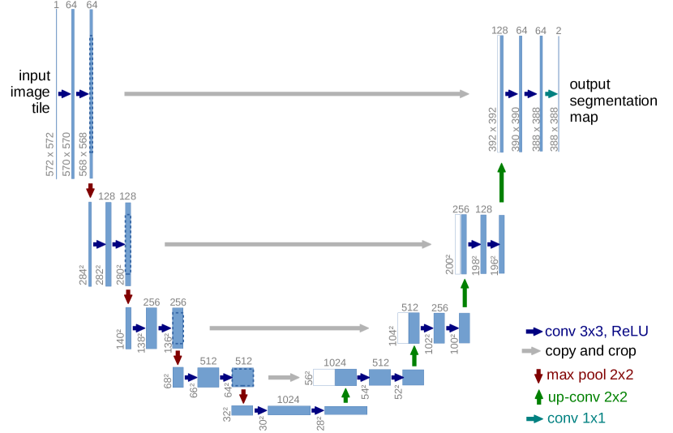

# 卷积、CNN 与特征提取

卷积是视觉模型里最经典的结构之一。即使 Transformer 很流行，卷积仍然是理解 CNN、UNet、视觉编码器和扩散模型的重要基础。

{ width="860" }

<small>图源：[U-Net: Convolutional Networks for Biomedical Image Segmentation](https://arxiv.org/abs/1505.04597)，Figure 1。原论文图意：U-Net 左侧 contracting path 逐步下采样并扩大上下文，右侧 expanding path 逐步上采样恢复分辨率，灰色箭头把高分辨率特征复制到对应解码层。</small>

!!! note "图解：U-Net 图里的编码器、解码器和跳连"
    左侧 contracting path 通过卷积和下采样逐步降低分辨率、扩大感受野，适合理解全局结构；右侧 expanding path 通过上采样逐步恢复空间分辨率，适合输出像素级细节。灰色横向箭头是 skip connection，会把早期高分辨率特征复制到对应解码层。卷积的核心不是“旧结构”，而是局部归纳偏置和多尺度表示；这也是扩散模型里 UNet 去噪网络能同时保全局构图和局部细节的原因。

!!! note "难点解释：为什么 U-Net 要有两条路径"
    下采样路径让模型看到更大范围，适合判断整体结构；上采样路径负责把低分辨率语义还原成高分辨率输出；skip connection 把早期的边缘、纹理和位置细节直接接回来。没有 skip，解码器容易只知道“是什么”，却丢掉“精确在哪里”。

!!! note "初学者先抓住"
    卷积最重要的不是公式，而是“小窗口反复看局部”。它默认图像里的相邻像素更相关，所以特别适合找边缘、纹理、角点和局部形状。

!!! example "有趣例子：拿放大镜看地图"
    Kernel 像一块小放大镜，在地图上滑动。它不是一次看完整张地图，而是每次看一个小区域，判断这里是不是路口、河流、建筑边缘。层数越深，相当于把很多局部判断拼成更大的城市理解。

!!! tip "学完本页你应该能"
    看到 CNN、UNet 或视觉编码器时，能解释局部特征、多尺度下采样、上采样和 skip connection 各自解决什么；读扩散或 VLM 页面时，能判断模型是在保局部细节、扩大感受野，还是压缩视觉 token。

## 1. 卷积在做什么

卷积可以理解为一个小窗口在图像上滑动。窗口里的参数叫 kernel，它会和局部像素相乘求和，得到输出特征。

\[
y_{i,j} = \sum_{u,v} k_{u,v} x_{i+u,j+v}
\]

直觉上，一个 kernel 可以学会检测：

- 边缘
- 角点
- 纹理
- 局部形状
- 重复模式

浅层卷积看局部纹理，深层卷积通过多层叠加看到更大的结构。

## 2. Stride、Padding 和 Channel

| 概念 | 作用 | 直观例子 |
| --- | --- | --- |
| `kernel size` | 每次看多大窗口 | 3x3、5x5 |
| `stride` | 每次移动多远 | stride=2 会下采样 |
| `padding` | 边界补多少 | 保持输出大小或减少边缘损失 |
| `channel` | 同时学习多少类特征 | 边缘、颜色、纹理、形状 |

如果 stride 变大，输出图会变小，模型计算更省，但细节也更容易丢。  
如果 channel 变多，模型能表达更多特征，但参数量和计算量也会上升。

## 3. Receptive Field：模型到底看到了多大范围

感受野指输出某个位置能看到输入的多大区域。单层 3x3 卷积只看很小范围，但多层叠加后感受野会扩大。

这解释了 CNN 的层级特征：

1. 浅层看边缘和纹理。
2. 中层看局部部件。
3. 深层看整体对象和语义。

在扩散模型的 UNet 中，这种多尺度结构非常重要：低分辨率层负责大构图，高分辨率层负责细节和边缘。

## 4. 为什么 UNet 常用于扩散模型

UNet 有两条关键设计：

1. **下采样路径**：逐渐压缩空间分辨率，扩大感受野，学习全局结构。
2. **上采样路径**：逐渐恢复分辨率，生成细节。
3. **skip connection**：把早期高分辨率细节直接传给后面，避免细节丢失。

因此 UNet 很适合做“输入一张带噪图，输出去噪结果”这类 dense prediction 任务。

## 5. 简化伪代码

```text
function ConvBlock(x):
    x = Conv2D(x, kernel=3, padding=1)
    x = Normalization(x)
    x = Activation(x)
    return x

function UNet(x):
    h1 = ConvBlock(x)
    h2 = Downsample(h1)
    h3 = ConvBlock(h2)
    y  = Upsample(h3)
    y  = Concat(y, h1)       # skip connection
    return ConvBlock(y)
```

这段伪代码展示了 UNet 的基本思想：先压缩，再恢复，同时把早期细节接回来。

## 6. 和后续专题的关系

- [扩散训练与表示](../diffusion/training.md)：理解 UNet 为什么适合预测噪声或 velocity。
- [扩散条件控制](../diffusion/guidance-and-conditioning.md)：理解 ControlNet 如何在卷积特征图上注入结构条件。
- [VLM 架构](../vlm/architecture-and-training.md)：理解视觉编码器如何把图像变成特征。

## 小结

卷积适合局部结构，UNet 适合多尺度重建。读扩散模型时，如果先理解卷积、下采样、上采样和 skip connection，后面看去噪网络会更自然。
