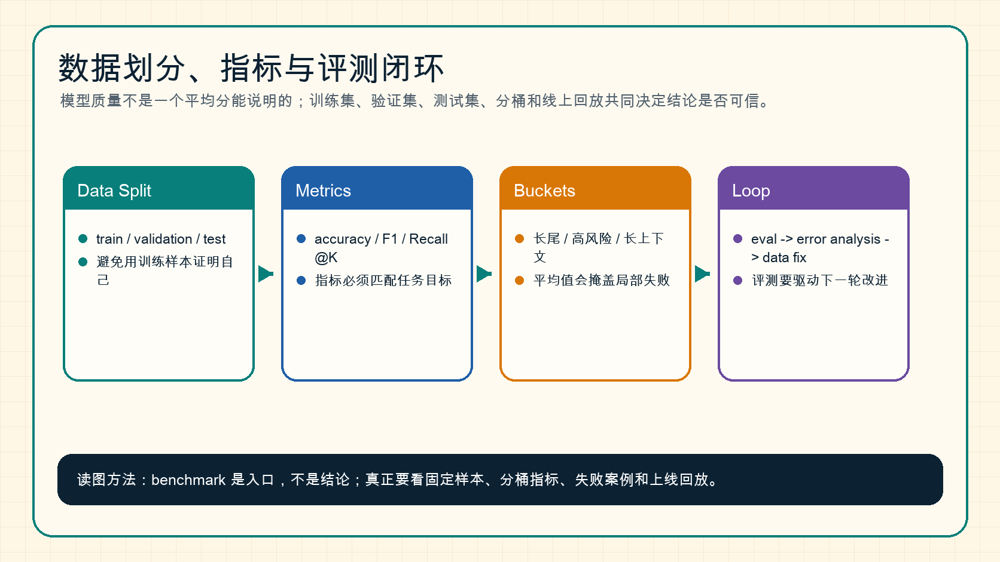

# 数据划分、指标与评测基础

模型训练不是只看 loss，模型能力也不是只看一个 benchmark 分数。要判断一个模型是否真的更好，必须把数据划分、指标选择、分桶评测和错误分析放在一起。

{ width="920" }

**读图提示**：benchmark 是入口，不是结论。真正能支撑迭代的是固定样本、分桶指标、失败案例和上线回放。

!!! note "初学者先抓住"
    评测不是给模型打一个总分，而是判断模型在哪些场景可靠、在哪些场景危险。平均分只能说明整体趋势，分桶和失败样本才能指导下一步怎么改。

!!! example "有趣例子：体检报告"
    一个模型的总分像体检里的“总体健康良好”，但真正有用的是血压、血糖、心率、肝功能这些分项。某一项异常被平均值盖住，到了线上就可能变成真实故障。

!!! tip "学完本页你应该能"
    看到一个 benchmark 提升时，能追问 train/validation/test 是否分清、是否有数据污染、提升集中在哪些桶、失败样本是否可回放。后续读 VLM、推理和论文复现时，这个习惯比记住单个指标更重要。

## 1. Train / Validation / Test

最基本的数据划分是：

| 数据集 | 用途 | 不能做什么 |
| --- | --- | --- |
| Train | 更新模型参数 | 不能用来证明泛化 |
| Validation | 调超参和选 checkpoint | 不能反复过拟合 |
| Test | 最终报告结果 | 不应参与调参 |

如果用 test 集反复调参，test 集就会被污染，分数会越来越像“适配测试集”，而不是代表真实泛化。

## 2. 指标必须匹配任务

不同任务需要不同指标：

| 任务 | 常见指标 | 注意点 |
| --- | --- | --- |
| 分类 | accuracy、F1 | 类别不均衡时 accuracy 可能误导 |
| 检索 | Recall@K、nDCG、MRR | 要看召回池和排序阶段 |
| 生成 | BLEU、ROUGE、human eval | 自动指标很容易漏掉事实性 |
| VLM | OCR 准确率、定位、问答正确率 | 图表、文档、屏幕应分桶 |
| 推理系统 | TTFT、TPOT、QPS、P99 | 平均延迟不代表线上体验 |

指标不是越多越好，而是要能回答当前问题。

## 3. 为什么要分桶

平均分会掩盖局部失败。比如一个 VLM 在普通图片问答上很强，但在发票、表格和小字体 OCR 上很弱。如果只看总分，问题可能完全被盖住。

常见分桶方式：

1. 按任务类型：问答、检索、代码、数学、OCR。
2. 按输入长度：短文本、长文本、超长上下文。
3. 按风险等级：普通样本、高价值样本、安全敏感样本。
4. 按模态：文本、图像、视频、动作。
5. 按失败类型：幻觉、格式错、召回漏、拒答错。

## 4. 错误分析比排行榜更重要

如果一个模型分数下降，只知道“下降了 2 分”没有太大价值。更重要的是知道：

1. 哪些样本错了；
2. 错误集中在哪些桶；
3. 是数据问题、模型问题、提示问题还是系统问题；
4. 能不能通过回放稳定复现；
5. 下一轮该补数据、改目标还是改系统。

## 5. 一个评测闭环伪代码

```text
for checkpoint in candidate_checkpoints:
    results = evaluate(checkpoint, eval_sets)
    report = bucketize(results)
    failures = collect_failures(report)

    if high_risk_bucket_regresses(failures):
        reject(checkpoint)
    else:
        promote_to_shadow_test(checkpoint)

analyze_failures()
update_data_or_training_recipe()
```

这段伪代码强调：评测不只是打分，而是要能决定 checkpoint 是否进入下一阶段，并驱动数据和训练策略调整。

## 6. 和 benchmark 的关系

公开 benchmark 很有用，但不能替代自己的任务评测。

公开 benchmark 适合：

- 横向比较模型大致能力；
- 找到领域常用指标；
- 复现论文和系统能力边界；
- 发现明显短板。

自建评测更适合：

- 业务真实样本；
- 高价值长尾；
- 线上失败回放；
- 特定格式和工具协议；
- 安全与合规边界。

## 7. 和后续专题的关系

- [训练评测与消融](../training/evaluation-and-ablation-methodology.md)：如何判断训练改动是否可信。
- [推理在线评测](../inference/observability-and-online-evaluation.md)：如何把离线评测接到线上观测。
- [对比学习评测](../contrastive-learning/evaluation-and-failure-modes.md)：embedding 和检索系统的分桶评测。
- [量化评测与部署清单](../quantization/evaluation-and-deployment-checklist.md)：量化掉点如何验收。

## 小结

评测的核心不是“拿一个分数”，而是建立可复现、可分桶、可回放、能驱动下一步行动的证据链。没有这条证据链，模型改动很难长期可信。
