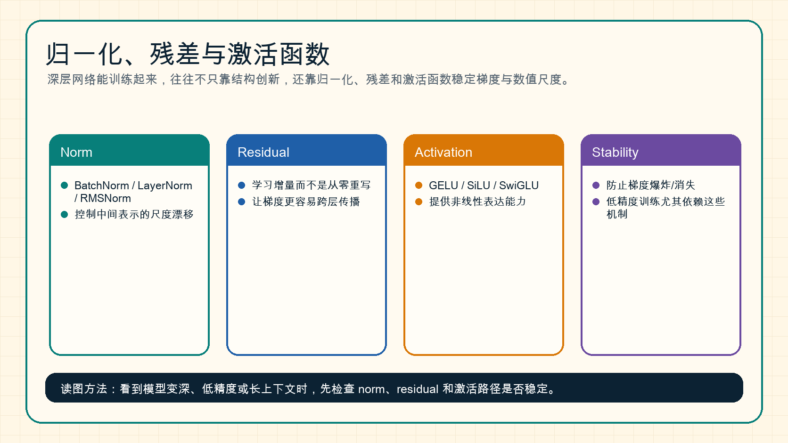

# 归一化、残差与激活函数

深层网络能稳定训练，不只靠模型结构，还靠一组看似基础但非常关键的组件：归一化、残差连接和激活函数。

{ width="920" }

**读图提示**：当模型变深、序列变长、精度变低时，数值稳定性会变成核心问题。Norm、residual 和 activation 是稳定训练的基本安全带。

!!! note "初学者先抓住"
    Norm 控制数值尺度，Residual 保留原始信息通路，Activation 提供非线性。三者合在一起，才让很深的网络既能表达复杂关系，又不容易在训练中数值崩掉。

!!! example "有趣例子：改稿而不是重写"
    Residual 像在原稿上做批注：每层只需要补充或修改一点内容，而不是从空白页重新写一篇文章。这样深层网络更容易保持信息连续，也更容易传回梯度。

!!! tip "学完本页你应该能"
    看到训练发散、低精度不稳或模型层数加深后变差时，能把问题先放到数值尺度、梯度通路和非线性表达里检查；读 QAT、FP8 训练或 Transformer 结构时，能解释 Norm 和 residual 为什么常是保守处理对象。

## 1. 归一化在解决什么

神经网络每层输出的数值尺度可能不断漂移。尺度过大，梯度可能爆炸；尺度过小，梯度可能消失。

归一化的作用是把中间表示拉回更稳定的范围。

常见归一化：

| 方法 | 常见位置 | 直觉 |
| --- | --- | --- |
| BatchNorm | CNN | 按 batch 统计均值和方差 |
| LayerNorm | Transformer | 按 token 内部 hidden 维统计 |
| RMSNorm | LLM | 只用均方根尺度，更简单高效 |

## 2. 残差连接为什么重要

残差连接写成：

\[
y = x + F(x)
\]

它让模型学习“在原输入上补一个变化”，而不是每层都从零重写表示。

直觉例子：修改文章时，如果每次都从空白页重写，很难保持一致；如果在原文上改动，工作会稳定得多。残差连接就是让深层网络在表示上“持续修改”，而不是不断重建。

## 3. 激活函数为什么不能省

如果网络只有线性层，那么多层线性叠加仍然等价于一个线性变换。激活函数提供非线性，让模型能表达复杂关系。

常见激活：

- `ReLU`
- `GELU`
- `SiLU`
- `SwiGLU`

现代 Transformer 常用 GELU 或 SwiGLU 变体，因为它们在表达能力和训练稳定性之间表现较好。

## 4. Pre-Norm 和 Post-Norm

Transformer 里常见两种写法：

```text
# Pre-Norm
x = x + Attention(Norm(x))
x = x + MLP(Norm(x))

# Post-Norm
x = Norm(x + Attention(x))
x = Norm(x + MLP(x))
```

很多大模型更偏好 Pre-Norm，因为深层训练更稳。Post-Norm 在某些设置下也有价值，但更容易遇到梯度稳定性问题。

## 5. 低精度训练为什么更依赖这些组件

当使用 FP16、BF16、FP8 或更激进低精度时，数值范围和舍入误差会更敏感。Norm 和 residual 能减少尺度漂移，激活函数和 MLP 结构则会影响异常值分布。

这也是为什么量化和低比特训练不能只看“把 dtype 改小”，还要看：

1. 哪些层保留高精度；
2. norm 是否稳定；
3. activation outlier 是否明显；
4. optimizer state 如何保存；
5. 梯度缩放和 clipping 是否合理。

## 6. 和后续专题的关系

- [训练稳定性](../training/stability-numerics-and-failure-triage.md)：排查 loss spike、NaN 和梯度异常。
- [量化激活离群值](../quantization/activation-outliers-and-calibration-strategies.md)：理解 SmoothQuant 和 activation outlier。
- [Transformer 基础](transformer-attention-and-tokenization.md)：理解 block 内 norm、residual 和 MLP 的位置。

## 小结

Norm 控制尺度，residual 保留路径，activation 提供非线性。深层模型的很多“高级能力”都建立在这些基础组件稳定工作的前提上。
