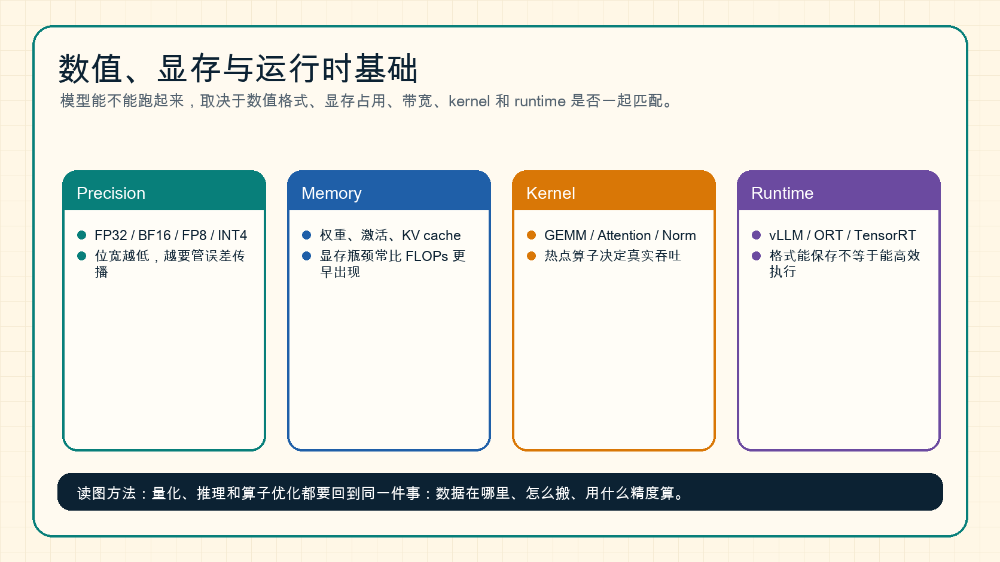

# 数值、显存与运行时基础

模型能不能真正部署，不只取决于算法，还取决于数值格式、显存、带宽、kernel 和 runtime 是否匹配。

{ width="920" }

**读图提示**：低精度格式能保存不等于能高效执行；模型文件变小也不等于线上更快。必须同时看数据在哪里、怎么搬、用什么 kernel 算。

!!! note "初学者先抓住"
    大模型系统里，“算得动”和“跑得快”不是一回事。真正速度常由 dtype、显存、带宽、kernel、runtime 和请求形态共同决定。

!!! example "有趣例子：搬家和做饭"
    FLOPs 像厨师切菜炒菜的能力，memory bandwidth 像厨房到仓库的传送带。如果食材一直送不过来，厨师再快也只能等。很多 kernel 慢，问题就在“搬数据”而不是“不会算”。

!!! tip "学完本页你应该能"
    看到“模型更小但没有更快”“FLOPs 低但延迟高”“量化后 P99 变差”时，能从 dtype、显存、带宽、kernel、runtime、batching 和请求画像中找解释，而不是只看参数量。

## 1. 数值格式：精度和范围的取舍

常见格式：

| 格式 | 常见用途 | 直观理解 |
| --- | --- | --- |
| FP32 | 高精度训练、参考路径 | 准但贵 |
| FP16 | 混合精度训练和推理 | 省显存但范围较窄 |
| BF16 | 大模型训练常用 | 范围接近 FP32，精度更低 |
| FP8 | 新硬件上的训练/推理加速 | 更省，但更依赖 scaling |
| INT8 / INT4 | 量化推理 | 压缩强，kernel 支持很关键 |

低精度的本质是牺牲部分表示能力，换取更低显存、更低带宽和更高吞吐。

## 2. 显存主要被谁占用

不同阶段显存构成不同：

| 阶段 | 主要显存 |
| --- | --- |
| 训练 | 权重、梯度、optimizer state、activation |
| 推理 | 权重、KV cache、临时 workspace |
| 长上下文 | KV cache 可能成为主瓶颈 |
| 多模态 | 图像/视频 token 和中间特征会显著增加内存 |

这解释了为什么同一个模型“能推理”不代表“能训练”，也不代表“能高并发服务”。

## 3. FLOPs、带宽和延迟

常见指标：

- `FLOPs`：算了多少浮点操作。
- `memory bandwidth`：数据搬运速度。
- `latency`：单次请求耗时。
- `throughput`：单位时间处理多少请求或 token。

一个算子可能不是算不动，而是数据搬不动。比如低算术强度算子经常受带宽限制，而不是算力限制。

## 4. Kernel 和 Runtime

Kernel 是实际在 GPU 或加速器上执行的底层计算程序。Runtime 负责把模型图、请求、batch、缓存和 kernel 组织起来。

例如：

- GEMM kernel 负责矩阵乘。
- Attention kernel 负责注意力计算。
- Fused kernel 把多个操作合并，减少中间读写。
- vLLM、SGLang、ONNX Runtime、TensorRT-LLM 负责更高层的执行调度。

## 5. 为什么“格式支持”不等于“性能收益”

一个 INT4 模型文件很小，但如果 runtime 没有 INT4 高效 kernel，可能会发生：

1. 先反量化成 FP16。
2. 再用普通 FP16 GEMM 计算。
3. 文件变小了，但计算没变快，甚至因为反量化更慢。

因此量化上线前必须确认：

- 目标 runtime 支持该格式；
- 目标硬件支持该低精度指令；
- 热点算子有对应 kernel；
- 端到端 TTFT、TPOT、吞吐和质量都改善。

## 6. 和后续专题的关系

- [量化总览](../quantization/index.md)：理解低精度格式和部署收益。
- [推理系统](../inference/index.md)：理解延迟、吞吐、KV cache 和服务调度。
- [算子与编译器](../operators/index.md)：理解 kernel、GEMM、attention 和 profiling。
- [训练稳定性](../training/stability-numerics-and-failure-triage.md)：理解混合精度和数值异常。
- [线性层、MLP 与 GEMM](linear-layers-mlp-and-gemm.md)：理解为什么矩阵乘是低精度和算子优化的主战场。

## 小结

数值格式决定误差和存储，显存与带宽决定瓶颈，kernel 和 runtime 决定收益能否兑现。理解这一层，才能把“模型方法”真正落到“能跑、跑快、跑稳”。
