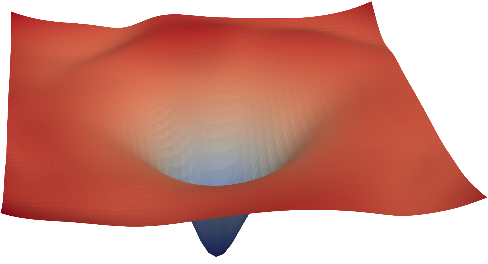

# 优化与训练基础

训练是把数据、模型、目标函数和优化器组织成一个闭环。模型不是一次性“学会”，而是在大量 batch 上反复计算 loss、回传梯度、更新参数。

{ width="820" }

<small>图源：[Visualizing the Loss Landscape of Neural Nets](https://arxiv.org/abs/1712.09913)，loss landscape visualization。原论文图意：通过 filter normalization 等方法可视化网络周围的 loss surface，帮助比较不同结构或训练配置下优化地形的平滑程度。</small>

!!! note "图解：优化是在复杂地形里走路"
    这张图把 loss 想象成一片地形：训练不是一次跳到最低点，而是优化器沿着梯度在地形上移动。学习率太大可能越过谷底，太小会走得很慢；batch、归一化、残差、初始化和优化器都会改变这条路是否平滑。训练问题先分层：是能力不够、目标不对、优化没走稳，还是系统数值/恢复出了问题，不要把所有异常都归因于模型结构。

!!! note "初学者先抓住"
    训练循环可以先记成四步：算预测、算 loss、反传 gradient、更新参数。后面所有复杂训练系统，本质上都是在让这四步更稳定、更高效、更可信。

!!! example "有趣例子：练投篮"
    Loss 像每次投篮偏离篮筐的距离，gradient 像教练告诉你手腕该往哪边调，learning rate 像每次调整动作的幅度。调太猛会过头，调太小进步很慢。

!!! tip "学完本页你应该能"
    看到训练曲线异常时，能先区分 loss 设计、学习率、batch、梯度裁剪、数据分布和系统恢复问题；读后训练、QAT 或分布式训练页面时，能判断“目标变了”和“优化没跑稳”不是同一件事。

## 1. Loss：模型错在哪里

Loss 是训练的方向盘。它定义模型输出和目标之间的差距：

\[
\mathcal{L} = \ell(f_\theta(x), y)
\]

不同任务有不同 loss：

- 分类：交叉熵
- 回归：MSE / L1
- 语言模型：next-token cross entropy
- 扩散模型：噪声、velocity 或 score 预测损失
- 对齐：DPO、RLHF、reward model loss

Loss 定义不清，训练再久也可能朝错误方向走。

## 2. Backprop：把错误传回参数

反向传播使用链式法则计算每个参数对 loss 的影响：

\[
\theta \leftarrow \theta - \eta \nabla_\theta \mathcal{L}
\]

这里 \(\eta\) 是学习率。学习率太大容易震荡或发散，太小则训练慢甚至停滞。

## 3. Optimizer：怎么走下一步

常见 optimizer：

| Optimizer | 特点 |
| --- | --- |
| SGD | 简单、稳定，但调参要求高 |
| Adam | 自适应学习率，深度学习常用 |
| AdamW | decoupled weight decay，LLM 训练常见 |

现代大模型训练通常还会配合：

- learning rate warmup：训练初期逐步升高学习率，避免参数还不稳定时被大步更新冲坏。
- cosine decay：训练后期平滑降低学习率，让优化从快速探索转向细致收敛。
- gradient clipping：限制梯度范数，减少 loss spike 或异常 batch 引发的发散。
- mixed precision：用 FP16/BF16/FP8 等低精度加速计算，同时保留必要的高精度状态。
- distributed optimizer：把参数、梯度或优化器状态分散到多卡，降低单卡显存压力。

## 4. 一个标准训练循环

```text
for step, batch in enumerate(dataloader):
    output = model(batch.input)
    loss = loss_fn(output, batch.target)

    loss.backward()
    clip_grad_norm(model.parameters())
    optimizer.step()
    scheduler.step()
    optimizer.zero_grad()

    if step % eval_interval == 0:
        run_eval()
    if step % save_interval == 0:
        save_checkpoint()
```

这段伪代码看起来简单，但真实训练里每一行都可能扩展成复杂系统：数据加载、混合精度、并行通信、checkpoint、评测和恢复语义。

如果你关心 `loss.backward()` 背后为什么要保存中间激活、为什么 activation checkpointing 能省显存，可以继续看 [自动微分、激活显存与 Checkpointing](autograd-activation-checkpointing-and-memory.md)。

## 5. 为什么 loss 下降不等于模型可用

Loss 是训练信号，但最终还要看任务指标。常见误判包括：

1. 训练 loss 下降，但评测集不提升。
2. 平均指标提升，但长尾任务下降。
3. 格式更像人类回答，但事实性变差。
4. 短上下文变好，长上下文变差。
5. 离线 benchmark 提升，线上延迟或成本不可接受。

因此训练系统必须绑定评测和回放，而不是只看 loss 曲线。

## 6. 和后续专题的关系

- [训练总览](../training/index.md)：进入完整训练生产线。
- [评测与消融方法学](../training/evaluation-and-ablation-methodology.md)：判断训练改动是否可信。
- [训练稳定性](../training/stability-numerics-and-failure-triage.md)：排查 loss spike、NaN、梯度异常。
- [量化训练](../quantization/qlora-and-quantized-training.md)：理解低精度训练为什么更难。
- [数据划分、指标与评测基础](data-splits-metrics-and-evaluation-basics.md)：理解为什么训练结论必须绑定分桶评测。

## 小结

训练不是“跑一个 loss”而是一个闭环系统：loss 决定方向，梯度推动参数，optimizer 控制步伐，评测决定结论是否可信。
