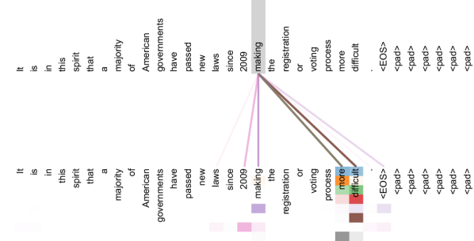

# 位置编码、Mask 与上下文

Attention 本身只计算 token 之间的相关性。它并不知道第一个 token 在前、第二个 token 在后，也不知道哪些 token 不应该被看见。位置编码和 mask 就是为了解决这两个问题。

{ width="700" }

<small>图源：[Attention Is All You Need](https://arxiv.org/abs/1706.03762)，Figure 3。原论文图意：Transformer encoder 的某些 self-attention heads 会关注长距离依赖，例如围绕 `making ... more difficult` 的依赖关系。</small>

!!! note "图解：attention head 为什么能连到远处词"
    这张图展示的是某些 self-attention head 在句子中捕捉长距离依赖，而不是简单关注相邻词。要做到这一点，模型必须同时知道 token 顺序、哪些 token 可见、以及不同位置之间的相对关系。长上下文问题不是单纯“放更多 token”：模型能否找到远距离依赖，取决于位置编码能否表达顺序、mask 是否限定了正确可见性、attention 成本和 KV cache 是否可承受。

!!! note "难点解释：为什么位置和 mask 是 attention 的前提"
    Attention 只会比较 token 表示本身；如果没有位置编码，`A 在 B 前面` 和 `B 在 A 前面` 很难区分；如果 mask 写错，模型可能偷看未来、看到 padding，或者看不到本该可见的图像/文本 token。论文图里 attention 能连到远处词，是因为模型既有顺序信息，也有正确的可见性规则。

!!! note "初学者先抓住"
    Transformer 本身像一袋 token，如果没有位置编码，它不知道顺序；如果没有 mask，它不知道哪些内容不该看。位置编码解决“谁在前谁在后”，mask 解决“谁能看谁”。

!!! example "有趣例子：考试遮答案"
    Causal Mask 就像考试时把后面的答案遮住。模型预测第 5 个 token 时只能看前 1-5 个 token，不能偷看第 6 个以后，否则 next-token 训练就失去意义。

!!! tip "学完本页你应该能"
    看到长上下文、packing、VLM 多图输入或 agent 历史记忆时，能先问位置编码是否支持、mask 是否正确、padding 是否泄漏、哪些 token 真的能互相看见。很多质量问题其实是可见性规则写错。

## 1. 为什么需要位置编码

如果没有位置编码，Transformer 对输入顺序不敏感。句子：

```text
猫追狗
狗追猫
```

包含的字相同，但意思完全不同。模型必须知道 token 的顺序。

常见位置机制包括：

| 方法 | 直观理解 | 常见场景 |
| --- | --- | --- |
| 绝对位置编码 | 给每个位置一个固定或可学习编号 | 早期 Transformer |
| 相对位置编码 | 关注 token 之间相对距离 | 长序列建模 |
| RoPE | 用旋转方式把位置信息注入 Q/K | 现代 LLM 常见 |
| ALiBi | attention 分数按距离加入偏置 | 长上下文扩展 |

## 2. Mask 决定谁能看谁

Mask 是 attention 里的可见性规则。

### Causal Mask

自回归语言模型只能看过去，不能看未来：

```text
token 1 -> 看 token 1
token 2 -> 看 token 1,2
token 3 -> 看 token 1,2,3
```

这样模型才能做 next-token prediction，不会偷看答案。

### Padding Mask

不同样本长度不一样，batch 时会补 padding。Padding token 不是有效内容，需要被 mask 掉。

### Block / Sliding Window Mask

长上下文模型有时只允许 token 看局部窗口，减少 \(L^2\) attention 成本。

## 3. Attention Mask 的伪代码

```text
scores = Q @ K.T / sqrt(d)

if causal:
    scores[future_positions] = -inf

if padding:
    scores[padding_positions] = -inf

weights = softmax(scores)
output = weights @ V
```

把某些位置设成 \(-\infty\)，softmax 后这些位置权重接近 0，也就相当于不可见。

## 4. 上下文长度为什么贵

标准 attention 需要计算 \(L \times L\) 的分数矩阵。序列长度 \(L\) 翻倍，attention 分数矩阵大约变成 4 倍。

推理时还会产生 KV cache：

\[
\text{KV cache size} \propto \text{layers} \times L \times D
\]

这解释了为什么长上下文系统会同时关心：

1. 上下文压缩；
2. KV cache 量化；
3. prefix cache；
4. sliding window attention；
5. 检索式外部记忆。

## 5. 多模态里的位置更复杂

图像和视频不只有一维顺序，还有二维空间和时间结构。

| 输入 | 位置问题 |
| --- | --- |
| 图像 patch | 行列位置、局部邻域 |
| 视频 token | 帧内位置 + 时间位置 |
| 文档图像 | OCR 文本位置 + 页面布局 |
| 机器人轨迹 | 时间步 + 空间状态 |

所以 VLM、视频模型和 VLA 不只是“把所有 token 拼起来”，还要设计位置编码和 mask，让模型知道哪些关系重要。

## 6. 和后续专题的关系

- [Transformer、Attention 与 Tokenization](transformer-attention-and-tokenization.md)：理解 Q/K/V 和 attention 主体。
- [推理系统](../inference/index.md)：理解 KV cache、长上下文和上下文压缩。
- [VLM 文档理解](../vlm/document-understanding-and-ocr.md)：理解页面布局、OCR 和视觉位置。
- [VLA](../vla/index.md)：理解动作序列和时序控制为什么依赖 mask 与位置。

## 小结

位置编码告诉模型“在哪里”，mask 告诉模型“能看谁”，上下文管理告诉系统“保留哪些信息”。三者共同决定 Transformer 是否能稳定处理长序列和多模态输入。
