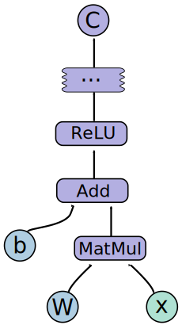

# 张量、Shape 与计算图

张量是深度学习里最基本的数据结构。模型看到的文本、图像、音频、动作轨迹，最终都会被组织成不同形状的张量，然后交给算子处理。

{ width="760" }

<small>图源：[TensorFlow: Large-Scale Machine Learning on Heterogeneous Distributed Systems](https://arxiv.org/abs/1603.04467)，Figure 2。原论文图意：一个简单计算图由输入、常量和算子节点组成，边表示张量在节点之间流动。</small>

!!! note "图解：计算图先看节点和边"
    图中的圆点/方块可以理解成算子或数据节点，箭头表示张量从一个节点流到下一个节点。很多模型问题不是公式错，而是 shape、dtype、device 或计算图接口错：例如上一层输出 `[B, L, D]`，下一层却以为输入是 `[B, D, L]`。读复杂模型前先把这条数据流画通，再看 attention、MLP、loss 或 backward，理解成本会低很多。

!!! note "初学者先抓住"
    读任何模型结构时，先不要急着看公式。先问三件事：输入张量是什么 shape，中间每一步 shape 怎么变，最后输出要交给谁。只要 shape 链条通了，大多数结构图都会突然变清楚。

!!! example "有趣例子：整理快递箱"
    Tensor 像一批快递箱，shape 像箱子的摆放规则：`[B, C, H, W]` 表示有多少箱、每箱有几层、每层多高多宽。模型算子就像流水线机器，只接受固定摆放规则；箱子摆错方向，机器不一定坏，但一定接不上。

!!! tip "学完本页你应该能"
    看到一个模型结构时，能写出输入、隐藏状态和输出的关键 shape；看到报错时，能先判断是 shape、dtype、device 还是计算图断开；读后续 VLM、训练和算子页面时，能把“接口不匹配”和“方法本身有问题”分开。

## 1. Tensor 到底是什么

可以把 tensor 理解成带维度的数字容器：

- 标量：一个数，例如 loss。
- 向量：一串数，例如一个 token embedding。
- 矩阵：二维表，例如线性层权重。
- 高维张量：图像 batch、视频 batch、KV cache 等。

常见符号：

| 符号 | 含义 | 例子 |
| --- | --- | --- |
| `B` | batch size | 一次训练多少样本 |
| `C` | channel | 图像通道或特征通道 |
| `H, W` | height, width | 图像高宽 |
| `L` | sequence length | token 数或时间步数 |
| `D` | hidden dimension | embedding 维度 |

例如一批图像常写成：

\[
x \in \mathbb{R}^{B \times C \times H \times W}
\]

一批文本 token embedding 常写成：

\[
x \in \mathbb{R}^{B \times L \times D}
\]

## 2. Shape 是接口契约

Shape 决定张量能不能进入某个模块。比如矩阵乘：

\[
(B, L, D) \times (D, D_{\text{out}}) \rightarrow (B, L, D_{\text{out}})
\]

如果最后一维不是 \(D\)，矩阵乘就无法进行。很多训练报错其实都来自这里。

一个实用习惯是：读任何模型结构时，都在纸上写出每一步 shape：

```text
image:      [B, 3, H, W]
patchify:   [B, N, P*P*3]
project:    [B, N, D]
attention:  [B, N, D]
head:       [B, num_classes]
```

这比直接看代码更容易发现接口问题。

## 3. 计算图是什么

计算图记录了张量如何从输入变成输出。训练时通常有两条路径：

1. **Forward**：输入经过模型，得到预测和 loss。
2. **Backward**：从 loss 开始，用链式法则把梯度传回每个参数。

伪代码如下：

```text
for batch in dataloader:
    y_pred = model(batch.x)          # forward
    loss = criterion(y_pred, batch.y)
    loss.backward()                  # backward
    optimizer.step()                 # update parameters
    optimizer.zero_grad()
```

## 4. 为什么显存会被计算图吃掉

训练时，反向传播需要用到前向中的中间激活。因此模型不只要存权重，还要存：

- layer input：反传时常要用输入计算权重梯度，不能只保存输出。
- attention 中间结果：Q/K/V、attention 权重或等价状态会占用大量显存。
- activation：非线性层和 MLP 的中间输出，反向传播要用它们算局部梯度。
- normalization 统计或中间量：均值、方差、RMS 或归一化后的值会影响梯度计算。
- optimizer state：Adam 一类优化器还要保存动量和二阶矩，训练显存远大于推理。

这解释了为什么推理能跑的模型，训练时可能显存不够。推理通常不需要保存完整计算图，而训练需要。

## 5. 和后续专题的关系

- [训练总览](../training/index.md)：理解 loss、反向传播、checkpoint 和显存。
- [算子与编译器](../operators/index.md)：理解 kernel 为什么要关心 shape bucket。
- [推理系统](../inference/index.md)：理解 batch、sequence length 和 KV cache 如何影响延迟。
- [量化](../quantization/index.md)：理解 dtype、scale 和张量误差如何传播。

## 小结

张量是数据，shape 是接口，计算图是训练链路。只要这三件事清楚，很多看起来很复杂的模型结构都会变成“张量经过一组模块变形和计算”的过程。
