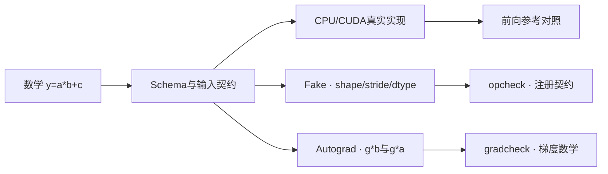
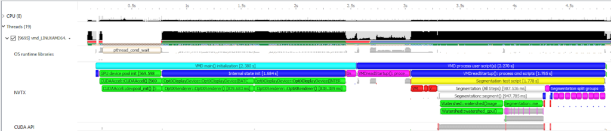

# 自定义乘加算子怎样接入 PyTorch

设要实现逐元素 $y=a\times b+c$，a与b是同shape tensor，c是标量。GPU kernel只负责算出值；PyTorch还需要知道这个操作的参数、返回shape、设备实现和反向公式，才能把它接进训练与编译图。

## Schema定义框架能依赖的事实

官方C++自定义算子教程用 `mymuladd(Tensor a, Tensor b, float c) -> Tensor` 声明接口，再分别注册CPU与CUDA实现。实现需检查shape、dtype、device与支持的layout。

若kernel会修改输入，schema必须准确标记mutation和alias关系，否则编译器可能按纯函数假设重排或消除操作。更快的设备代码无法补救错误的框架契约。

## Fake实现让编译器只看元数据也能推演

图编译时不一定执行真实数值。FakeTensor实现应依据输入shape、stride、dtype和device返回正确的输出元数据。对于本例，检查a/b同shape等条件后，返回相应空输出即可，不应读取tensor数据来决定结果。

`register_fake`不能取代CUDA实现；它只回答“结果会长什么样”。若真实kernel输出连续布局，fake实现却承诺另一种stride，编译器可能在后续推演中作出错误选择。

## 训练需要一个明确的反向公式

若上游梯度为g，则

$$
\partial L/\partial a=g\odot b,\qquad
\partial L/\partial b=g\odot a.
$$

本例c是普通标量参数，不作为可训练tensor返回梯度。若将c改为tensor并允许广播，反向还需要沿广播维求和，接口和公式都要一起变化。

官方教程通过 `register_autograd` 注册backward与保存上下文的方法。Backward使用框架理解的操作组合；若其中再调用自定义CUDA核，它也需要自己的注册边界。

<!-- systems-workflow-visual -->

```mermaid
flowchart LR
  M["数学 y=a*b+c"] --> S["Schema与输入契约"]
  S --> K["CPU/CUDA真实实现"]
  S --> F["Fake · shape/stride/dtype"]
  S --> A["Autograd · g*b与g*a"]
  K --> T["前向参考对照"]
  F --> O["opcheck · 注册契约"]
  A --> G["gradcheck · 梯度数学"]
```

前向、元数据和反向各有独立验证，opcheck不能替代梯度正确性检查。

## 三种验证回答三个不同问题

先把输出与 `a*b+c` 比较，覆盖尾部长度、非连续输入和极值，验证前向数学。再用手算或 `torch.autograd.gradcheck` 检验梯度，通常在适合数值差分的高精度小输入上进行。最后用 `torch.library.opcheck` 检查注册与框架协作。

`opcheck`不验证梯度公式是否数学正确，这是官方教程明确写出的边界。Eager能跑也不代表compile、autograd或图捕获都能跑，需要检查实际支持的调用环境。

## 接入后才有完整性能账

若wrapper为了兼容输入先调用 `contiguous()`，或返回前额外同步，这些成本属于完整算子。分别比较kernel耗时与算子端到端耗时，再测它在真实层里的占比。

一个只能处理连续输入的快路径可以保留，但必须明确拒绝或分流其他输入。比起让所有输入悄悄复制，显式适用条件更容易解释实际收益。

{ width="820" }

<small>图源：[NVIDIA Nsight Systems / NVTX 文档](https://docs.nvidia.com/nsight-systems/)。原图表达用 NVTX 标记把 kernel、CPU 调用和时间线串起来；读图重点是：自定义 op 是否真的进了热路径，需要 profiler、dispatch、fallback 和端到端 trace 一起验证。它不能证明某个 custom op 正确或更快，只说明验证入口应该在哪里。</small>

## 对照源码与延伸阅读

- [PyTorch mymuladd 的schema、fake、autograd和测试教程](https://github.com/pytorch/tutorials/blob/5672cd98a7671eda4d9122b10f8eec580f74d03e/advanced_source/cpp_custom_ops.rst)
