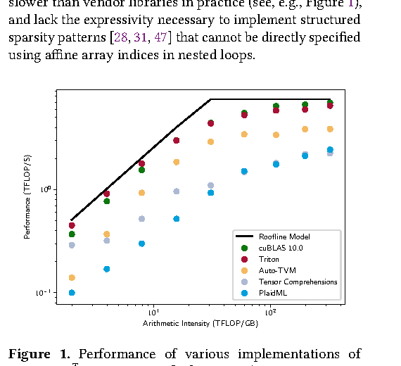

# CUTLASS、CuTe 与编译栈

AI kernel 工程里常见误解是：既然已有 `torch.compile`、Triton、cuBLAS、TensorRT，为什么还要理解 `CUTLASS`、`CuTe`、模板库、DSL 和图编译器？真正原因是，AI 系统不是单一抽象层能解决的。不同工具分别负责图级融合、库级高性能基元、模板级可组合 kernel，以及更低层的 layout、MMA、流水线和访存控制。

这页建立一张从模型图到 GPU 指令的中间栈地图。

!!! note "初学者先抓住"

    AI 编译和 kernel 栈不是单层工具链，而是从模型图一路降到硬件指令的多层协作。图编译擅长融合和调度，库擅长成熟热点，Triton/CUTLASS/CuTe 擅长写特化 kernel，PTX/SASS 用来验证底层结果。

!!! note "难点解释：为什么工具不会互相完全替代"

    图编译器适合稳定子图和小算子融合，但极致 GEMM、复杂 attention、不规则稀疏和硬件特化经常需要库或手工 kernel。成熟系统通常混合使用多层抽象，而不是押注一种工具解决全部问题。

## 从模型图到硬件执行

一个训练或推理系统从上到下大致经过：

1. Python / 框架前端；
2. 图捕获与图优化；
3. 中间表示与代码生成；
4. 库调用或自定义 kernel；
5. PTX / SASS；
6. GPU 硬件执行。

不同工具大致落在不同位置：

| 层级 | 代表工具 | 主要职责 |
| --- | --- | --- |
| 前端 | PyTorch eager、框架 runtime | 执行模型逻辑和调度 |
| 图编译 | `torch.compile`、Inductor、TensorRT | 捕获子图、融合、layout 传播、调度 |
| DSL/codegen | Triton | 张量块级 kernel 编写与生成 |
| 库级基元 | cuBLAS、cuDNN、NCCL | 成熟高性能计算与通信 |
| 模板构件 | CUTLASS、CuTe | GEMM/attention 类 kernel 的可组合构件 |
| 底层实现 | CUDA、PTX、SASS | 极致特化和硬件控制 |

成熟系统不会只押一种抽象，而是在这些层之间混合搭建。

{ width="520" }

<small>图源：[Triton: An Intermediate Language and Compiler for Tiled Neural Network Computations](https://doi.org/10.1145/3315508.3329973)，Figure 1。原论文图意：在矩阵乘 \(C=AB^T\) 上比较 cuBLAS、Triton、Auto-TVM、Tensor Comprehensions 和 PlaidML 相对 roofline model 的性能位置。</small>

!!! note "图解：Triton 的价值在 tile 级表达和编译优化"
    这张图不是说 Triton 永远比库更快，而是说明合适的 DSL 可以把自定义 kernel 拉近到成熟库的性能区间。对 AI kernel 来说，关键不是只把 Python 换成低层语言，而是让程序员直接表达 tile、block、memory access 和并行粒度，再由编译器做 layout、调度和代码生成。CUTLASS/CuTe 走的是模板化硬件构件路线，Triton 走的是块级张量 DSL 路线，二者都在解决“高层框架太粗、纯 CUDA 太重”的中间地带。

## 图编译器擅长什么

图编译器的核心不是“把 Python 变快”，而是识别稳定子图、消除 eager 开销、融合小算子、重写 layout，并把部分热点降到更高效的 kernel 后端。

它擅长：

1. elementwise 链融合；
2. layout 传播；
3. 消除中间张量；
4. 调度多个小算子；
5. 对稳定 shape 做 codegen。

它困难的地方包括动态 shape、复杂控制流、稀疏和不规则访存、极致 GEMM/attention 模板优化，以及跨节点通信与计算的全局协同。这也是图编译器和手工内核不会彻底互相替代的原因。

在 PyTorch 生态里，常见路径是 `torch.compile` 捕获图，Inductor 做变换和调度，部分子图生成 Triton kernel，另外一些热点仍调用库。

## CUTLASS 是什么

`CUTLASS` 可以理解为 CUDA 高性能线性代数与相关 kernel 的模板工具箱。它把高性能 GEMM 常见复杂模式做成可组合构件，例如：

1. tile decomposition；
2. warp-level MMA；
3. shared memory pipeline；
4. 数据布局与 iterator；
5. epilogue fusion；
6. 不同 dtype 和 Tensor Core 路径。

cuBLAS 更像成熟通用库接口；CUTLASS 更像构建高性能 GEMM 变体的工具箱。当你需要特殊 layout、特殊 epilogue、融合额外逻辑、固定 shape family 或自己控制流水线时，CUTLASS 的价值会变高。

## CuTe 的价值

CuTe 可以看成 CUTLASS 中更强调 layout algebra 和 tensor/tile 组合表达的一层。它尝试把高性能 kernel 中很多原本写死的几何关系抽象出来：

1. tile 如何映射到线程；
2. layout 如何映射到 memory transaction；
3. MMA pipeline 如何拼接；
4. swizzle、ldmatrix、fragment 等概念如何统一表达；
5. 新硬件特性如何进入可组合 kernel。

CuTe 的价值不是“更高级”本身，而是让复杂 GEMM、attention 和 Hopper/Blackwell 以后更复杂的 pipeline 能以更系统的方式表达和复用。

## Triton 与 CUTLASS 的分工

| 维度 | Triton | CUTLASS / CuTe |
| --- | --- | --- |
| 抽象 | 块级张量 DSL | 模板化硬件构件 |
| 优势 | 开发快、易融合、适合原型和中高频自定义算子 | 极致 GEMM/attention、复杂 layout、可复用 kernel 家族 |
| 典型场景 | norm、softmax、elementwise fusion、专用小算子 | GEMM、FP8 GEMM、attention、epilogue-rich matmul |
| 代价 | 极限性能和硬件新特性不一定最先覆盖 | 学习曲线和模板复杂度高 |

实际工作里常见分工是：图优化交给编译器，大量自定义融合用 Triton，核心矩阵类热点参考或构建在 CUTLASS/CuTe 思路上，极端特化再回到 CUDA/PTX。

## 什么时候信任库，什么时候自己写

优先用现成库的场景：

1. GEMM/conv/attention 形状常规；
2. 通用性要求高；
3. 性能已经够用；
4. 团队不是 kernel 团队；
5. 后续维护比极限性能更重要。

值得写自定义 kernel 的场景：

1. 默认实现明显慢；
2. 算子出现频率极高；
3. 有明显可融合空间；
4. 目标 GPU 和 shape 相对固定；
5. 业务收益足以覆盖维护成本；
6. 库实现无法表达目标 epilogue、layout 或调度。

值得用模板库而不是完全手写的场景，是你需要一整个 kernel 家族，而不是一个一次性特化点。

## 全栈约束

Kernel 设计不能脱离上层系统。一个很快的 kernel 也可能因为以下原因无法带来端到端收益：

1. 图编译器无法稳定捕获调用路径；
2. runtime dynamic batching 让 shape 过于分散；
3. layout 转换成本抵消了 kernel 收益；
4. kernel 与通信、KV 管理或调度无法重叠；
5. 低精度数值路径没有通过回归；
6. fallback 行为不稳定。

这就是为什么 AI system 需要全栈视角：硬件、编译器、框架、kernel、runtime 和服务形态必须一起看。

## 选型清单

做编译栈或 kernel 路线选择时，建议先回答：

1. 热点是否已由 profiling 证明；
2. shape 是否集中，能否做 bucket；
3. 是否需要特殊 epilogue、layout 或 dtype；
4. 图编译器能否稳定捕获并调用；
5. 现成库是否已经足够快；
6. Triton 能否以更低维护成本达到目标；
7. CUTLASS/CuTe 是否能复用成 kernel 家族；
8. 正确性、数值稳定和性能回归是否可自动化。

编译栈的核心判断不是“哪个工具更高级”，而是把问题放在合适抽象层解决。抽象层太高，可能无法控制性能；抽象层太低，维护成本会吞掉收益。
