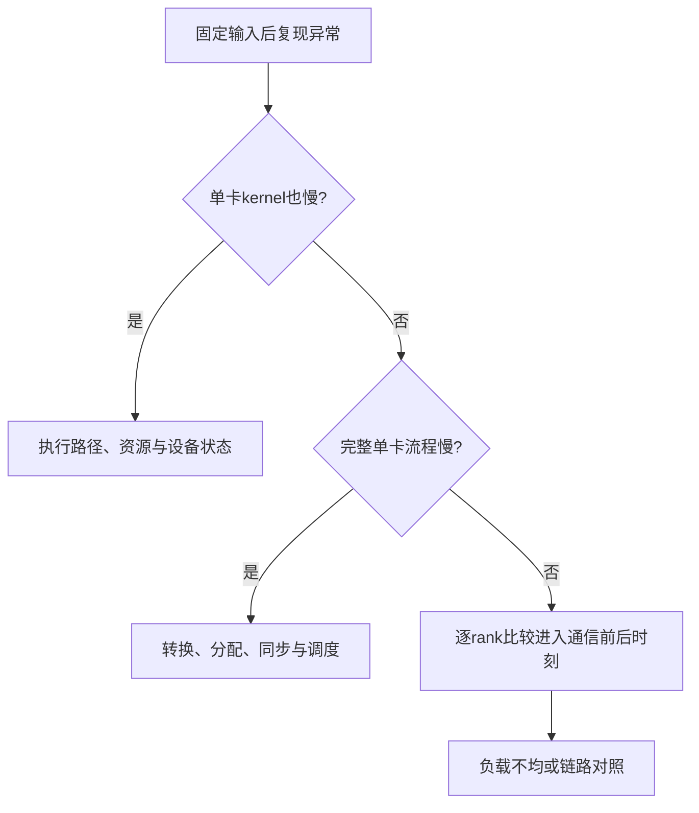

# GPU性能异常的分层排查

这个页面是诊断索引。先固定模型、输入shape、dtype和软件版本，再比较异常是否出现在单卡kernel、完整单卡流程，还是多卡执行中。没有这个分界，同一种“吞吐下降”可以被错误解释成完全不同的问题。

## 从最小复现确定范围

| 观察 | 可以支持的假设 | 下一项对照 |
| --- | --- | --- |
| 相同单卡kernel也变慢 | 设备状态、编译或执行路径变化 | 固定输入比较时钟、资源与实际kernel |
| 单kernel正常，完整层慢 | 转换、分配、同步、launch或图路径增加 | 同时记录wrapper与设备时间线 |
| 单卡正常，多卡慢 | 负载不均、通信或映射变化 | 对齐rank计算结束与collective完成时刻 |
| 只有部分shape慢 | 特化、尾块、stride或fallback | 比较桶边界及实际命中路径 |

这些是调查方向，不是由症状直接确定根因。单卡正常并不能排除多卡时的功率、共享带宽或计算负载变化。

<!-- systems-workflow-visual -->

```mermaid
flowchart TD
  S["固定输入后复现异常"] --> A{"单卡kernel也慢?"}
  A -->|"是"| K["执行路径、资源与设备状态"]
  A -->|"否"| B{"完整单卡流程慢?"}
  B -->|"是"| W["转换、分配、同步与调度"]
  B -->|"否"| R["逐rank比较进入通信前后时刻"]
  R --> D["负载不均或链路对照"]
```

每个分支只缩小调查范围，仍需通过控制变量确认根因。

## 带宽判断需要匹配实际数据流

先计算输入输出的最低字节量，再看缓存、重复读取、padding与转换是否增加了物理流量。接近HBM上限的kernel可优先考虑减少搬运；远低于上限时，还可能受不连续访问、并行度、依赖或小任务启动限制。

不要把逻辑GB/s与硬件计数器流量混为一谈。反复基准同一小tensor可能主要命中缓存，必须说明测量工作集与缓存条件。

## 对多卡先找最早落后的事件

如果某rank进入collective前已经迟到，检查其数据、计算和设备状态；如果进入时间相近而交换阶段拖长，再检查拓扑和实际链路。记录rank到GPU映射及GPU到NIC/NUMA关系，换设备位置做对照可以帮助定位。

温度、功率、时钟、ECC和驱动信息是上下文证据。出现相关指标异常后，仍需确认它与性能变化在时间和设备上对应，不能仅凭一条告警解释所有退化。

## 一次排查应留下可重复的最小记录

保留固定输入、旧新版本、计时范围、各rank关键时刻、实际kernel与设备状态。改变一个因素后，用相同工作负载复测，并检查数值输出。

如果怀疑FP8路径没有生效，先看cast/dequant和GEMM；如果怀疑KV瓶颈，先看真实历史长度和KV读取；如果怀疑JIT，区分首请求与预热后。这些分支对应[量化kernel](low-precision-and-quantized-kernels.md)、[服务attention](serving-attention-and-kv-kernels.md)和[dispatch](runtime-dispatch-and-kernel-selection.md)。

{ width="820" }

<small>图源：[NVIDIA Nsight Systems 文档](https://docs.nvidia.com/nsight-systems/)。原图表达 GPU 时间线中 CPU/GPU 等待和空洞如何暴露系统瓶颈；读图重点是把硬件排查从“猜 kernel 慢”改成先看带宽、occupancy、launch、同步和拓扑。它不能单独定位根因，只提供缩圈入口。</small>

## 对照源码与延伸阅读

- [可固定shape与配置的矩阵乘基准](https://github.com/triton-lang/triton/blob/cd2e01c6686d6503802e6cdfac56d5a5dfdb27a1/python/tutorials/03-matrix-multiplication.py)
- [实际配置和JIT观察入口](https://github.com/deepseek-ai/DeepGEMM/blob/5081f8513af57e61696de4f4f04b0e707ffb503e/README.md)
