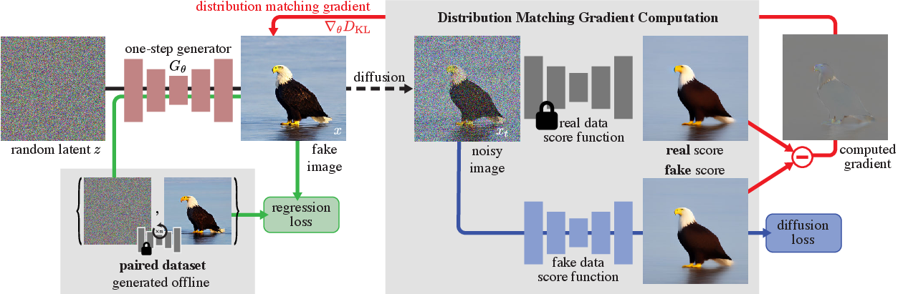
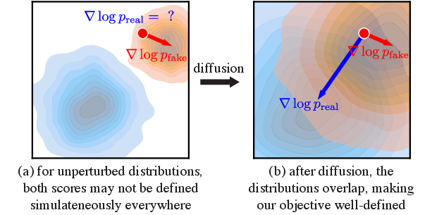
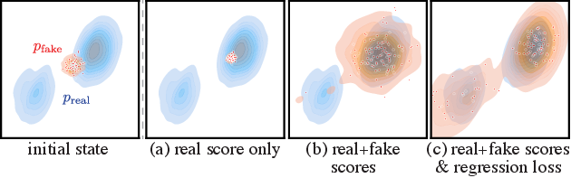
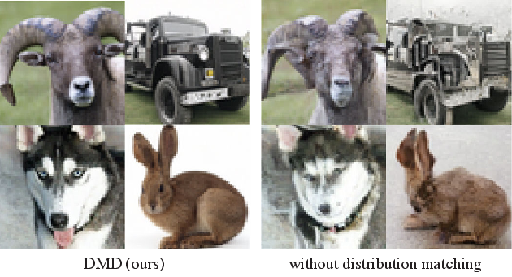
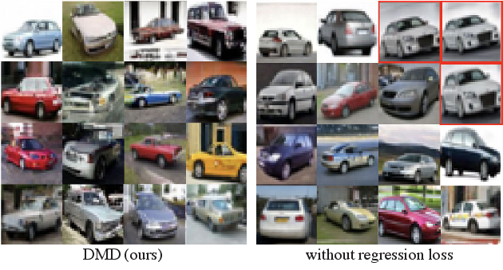
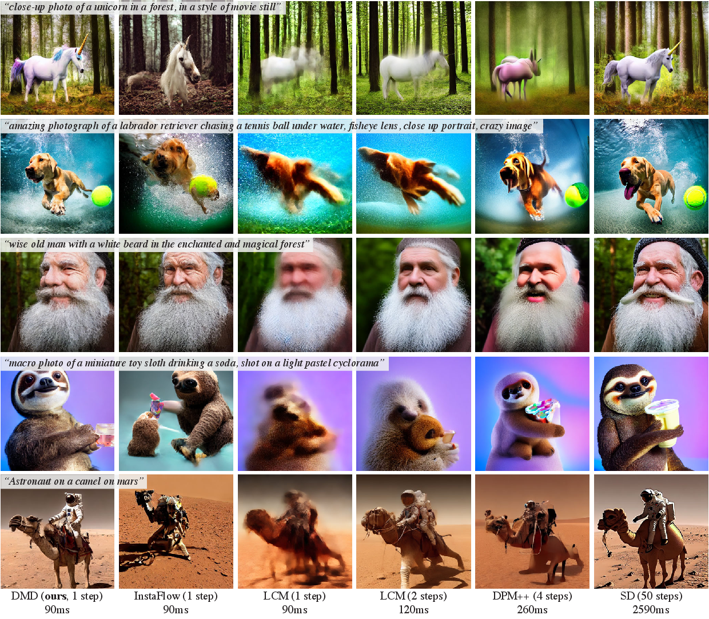

# DMD：用分布匹配把扩散模型蒸馏成一步生成器

!!! info "论文信息"
    - 论文：`One-step Diffusion with Distribution Matching Distillation`
    - 方法：`Distribution Matching Distillation`，简称 `DMD`
    - 链接：[arXiv:2311.18828](https://arxiv.org/abs/2311.18828)
    - 版本：2023-11-30 首次提交，2024-10-04 更新到 v4
    - 会议：CVPR 2024
    - 项目页：[DMD](https://tianweiy.github.io/dmd/)
    - 关键词：one-step diffusion、distribution matching、fake score、real score、reverse KL、regression loss、Stable Diffusion distillation

这篇论文是后来 DMD2、CausVid、Phased DMD 一系列少步扩散蒸馏方法的基础。它的核心思想很直接：**不要强迫学生模型逐步复刻 teacher 的采样轨迹，而是让学生的一步输出分布看起来像 teacher 的多步输出分布。**

论文把这个目标落成两个损失：

1. **Distribution Matching Loss**：用 real score 和 fake score 的差异近似 reverse KL 梯度，把生成器输出往真实扩散分布推；
2. **Regression Loss**：预先生成一批 noise-image pairs，用 LPIPS 让一步生成器保持 teacher 输出的大尺度结构，防止 mode collapse / mode dropping。

## 论文位置

传统扩散加速主要有两类：

| Route | Main idea | Limitation |
| --- | --- | --- |
| Fast samplers | keep the same pretrained denoiser and improve ODE/SDE integration | very few steps often collapse in quality |
| Trajectory distillation | train a student to mimic teacher noise-to-image trajectories | each target pair requires expensive teacher sampling, and exact trajectory matching is too hard |
| DMD | match output distribution with score difference, plus a regression regularizer | one-step model is fast, but training needs fake score model and paired teacher outputs |

DMD 的关键转向是：它不再问“同一个 noise 经过 teacher 50 步会到哪里，student 一步是否也到那里”，而是问“student 产生的一批图像整体上是否落在 teacher / real data 分布里”。这也是它和 [Phased DMD](phased-dmd.md) 的关系：Phased DMD 后来要解决的 SGTS 退化、SNR 子区间、MoE phase 等问题，都建立在 DMD 这套 real/fake score 差分框架上。

## 方法总览

{ width="920" }

<small>图源：`One-step Diffusion with Distribution Matching Distillation`，Figure 2。原论文图意：一步生成器 \(G_\theta\) 从随机噪声生成 fake image；一条支路用预计算 noise-image pairs 做 regression loss，另一条支路把 fake image 加噪后分别送入 real score diffusion model 和 fake score diffusion model，用两者差异形成 distribution matching gradient。</small>

!!! note "这张训练图怎么读"
    这张图最容易被误读成“DMD 只是给一步生成器加了一个扩散判别器”。更准确的读法是：它同时有一条**分布级路径**和一条**配对回归路径**。分布级路径从 generator 产生的 fake image 出发，加噪到 \(x_t\)，再分别送入 frozen real score model 和 trainable fake score model；两个 score 的差值给 generator 一个“往 teacher/data 分布移动”的方向。

    另一条 regression 路径则完全不同：它不关心一批样本整体像不像 teacher 分布，而是拿同一个 noise \(z\) 对齐 teacher deterministic sampler 生成的 \(y\)。这条路径像安全绳，防止纯 reverse-KL 分布匹配出现 mode dropping 或结构漂移。理解 DMD 时要把这两条信号分开：**score difference 负责真实感和分布对齐，regression loss 负责保住 teacher 对同一 noise 的大尺度语义映射**。

DMD 的训练图可以拆成四个对象：

| Object | Meaning | Updated? |
| --- | --- | --- |
| Base diffusion model \(\mu_{\text{base}}\) / \(\mu_{\text{real}}\) | pretrained diffusion teacher, estimates real score | frozen |
| One-step generator \(G_\theta\) | same denoiser architecture, no time conditioning, maps noise directly to image | trainable |
| Fake diffusion model \(\mu_{\text{fake}}^\phi\) | estimates score of current generator distribution | trainable |
| Paired dataset \(\mathcal D=\{z,y\}\) | noise \(z\) and deterministic teacher output \(y\) | precomputed |

最终训练时，生成器同时收到两类信号：

```text
distribution matching gradient:
  real score - fake score

regression loss:
  LPIPS(G(z_ref), y_ref)
```

这使 DMD 同时具备两种性格：distribution matching 让图像变真实，regression loss 让它不要丢掉 teacher 对同一 noise 的结构映射。

## 为什么不用纯轨迹回归

如果只用 teacher 采样得到的 \((z,y)\) 训练一步生成器，本质上是在学习一个复杂的 noise-to-image 映射：

\[
z \rightarrow y=\operatorname{ODE}(\mu_{\text{base}},z).
\]

这个映射非常难学。teacher 的多步采样轨迹在高维空间里很复杂，学生一步网络要同时学到全局构图、局部纹理、语义对齐和随机性，很容易输出模糊或结构不稳定的图像。

DMD 的判断是：轨迹回归可以做 regularizer，但不能作为唯一目标。真正决定视觉质量的是分布级约束：学生输出应该落在 teacher / real data 的高密度区域，而不是只和单个 teacher sample 做点对点拟合。

## DMD 的 Score 差分

设一步生成器输出：

\[
x = G_\theta(z),
\qquad z\sim \mathcal N(0,I).
\]

DMD 想最小化 fake distribution 到 real distribution 的 reverse KL：

\[
D_{KL}(p_{\text{fake}}\|p_{\text{real}})
=
\mathbb E_{x\sim p_{\text{fake}}}
\left[
\log \frac{p_{\text{fake}}(x)}{p_{\text{real}}(x)}
\right].
\]

对 \(\theta\) 求梯度时，会出现两个 score：

\[
\nabla_\theta D_{KL}
=
\mathbb E
\left[
-
\left(
s_{\text{real}}(x)-s_{\text{fake}}(x)
\right)
\frac{dG}{d\theta}
\right].
\]

其中：

\[
s_{\text{real}}(x)=\nabla_x\log p_{\text{real}}(x),
\qquad
s_{\text{fake}}(x)=\nabla_x\log p_{\text{fake}}(x).
\]

直觉上：

| Score | Effect |
| --- | --- |
| \(s_{\text{real}}\) | pulls fake samples toward high-density regions of real / teacher distribution |
| \(-s_{\text{fake}}\) | prevents all fake samples from collapsing into the same nearest real mode |
| \(s_{\text{real}}-s_{\text{fake}}\) | move toward realism while spreading across fake modes |

这个设计和 GAN 的判别器不同。DMD 不训练一个 binary discriminator，而是用 diffusion model 估计 noised distribution 的 score。

## 为什么要先加噪再算 Score

干净图像空间里，fake distribution 和 real distribution 很可能几乎不重叠。此时 \(p_{\text{real}}(x)\) 对 fake sample 可能接近 0，score 会不稳定。

DMD 的做法是把 fake sample 加噪：

\[
q_t(x_t\mid x)
\sim
\mathcal N(\alpha_t x,\sigma_t^2I).
\]

加噪后，real 和 fake 的分布会在 ambient space 里有更大重叠，score matching 才稳定。

{ width="780" }

<small>图源：`One-step Diffusion with Distribution Matching Distillation`，Figure 4。原论文图意：未加噪时 real / fake distributions 可能不重叠；经过 diffusion perturbation 后，distribution matching objective 在空间中更好定义。</small>

!!! note "图解：为什么要先把样本加噪再匹配"
    左侧直觉是 real distribution 和 fake distribution 在原始图像空间里可能几乎不重叠，这时直接比较梯度很容易得到不稳定或没意义的方向。加上 diffusion perturbation 后，两个分布被高斯噪声“抹宽”，在同一个 ambient space 里产生更大重叠，score difference 才能提供连续的移动方向。DMD 不是在原图上硬判真假，而是在不同噪声强度下比较 real score 和 fake score，让 generator 逐步靠近 teacher / data 分布。

real score 由冻结 teacher diffusion model 给出：

\[
s_{\text{real}}(x_t,t)
=
-
\frac{x_t-\alpha_t\mu_{\text{base}}(x_t,t)}{\sigma_t^2}.
\]

fake score 由动态训练的 fake diffusion model 给出：

\[
s_{\text{fake}}(x_t,t)
=
-
\frac{x_t-\alpha_t\mu_{\text{fake}}^\phi(x_t,t)}{\sigma_t^2}.
\]

生成器的 distribution matching 梯度近似为：

\[
\nabla_\theta D_{KL}
\simeq
\mathbb E
\left[
w_t\alpha_t
\left(
s_{\text{fake}}(x_t,t)-s_{\text{real}}(x_t,t)
\right)
\frac{dG}{d\theta}
\right].
\]

注意符号：实现里通常把这个方向写成一个可反传的 surrogate loss；核心仍然是 fake score 和 real score 的差。

## Fake Score 为什么要动态训练

fake distribution 会随着 \(G_\theta\) 更新不断变化。因此 \(\mu_{\text{fake}}^\phi\) 不能是固定模型，而要持续跟踪当前生成器输出。

它用标准 denoising objective 训练：

\[
\mathcal L_{\text{denoise}}^\phi
=
\left\lVert
\mu_{\text{fake}}^\phi(x_t,t)-x
\right\rVert_2^2,
\qquad x=G_\theta(z).
\]

这里的 clean target 不是真实数据，而是当前 generator 的 fake image。也就是说，\(\mu_{\text{fake}}\) 学的是“当前 fake distribution 被加噪后的 score”。这点后来在 DMD2、CausVid、Phased DMD 中都保留下来，只是训练对象从图像扩展到视频、因果学生或 SNR 子区间。

## Regression Loss 的作用

DMD 不能只靠 distribution matching。论文用二维 toy 分布说明了原因。

{ width="780" }

<small>图源：`One-step Diffusion with Distribution Matching Distillation`，Figure 3。原论文图意：只最大化 real score 会让 fake samples 塌到最近模式；有 distribution matching 但无 regression loss 时覆盖更好但仍会漏掉模式；完整目标加上 regression loss 后能恢复两个目标模式。</small>

!!! note "为什么这张 toy 图很关键"
    这张图不是为了证明二维 toy 分布本身，而是在解释 DMD 为什么还需要 regression loss。只用 real score 时，generator 会被拉向最近的高密度区域，结果很容易把多个 noise 都映射到同一个 mode。加入 fake score 后，目标变成 real/fake score difference，样本不再只是往最近真实 mode 冲，也会受到当前 fake 分布密度梯度的校正，因此 mode coverage 变好。

    但 reverse KL 仍然有 mode-seeking 倾向：它宁愿覆盖少数高质量 mode，也不一定主动覆盖所有 mode。regression loss 的作用是给每个 noise 一个 teacher anchor，让不同 noise 保持不同的输出结构。读这张图时可以记成三层约束：real score 提供真实方向，fake score 提供分布校正，paired regression 提供多样性锚点。

reverse KL 天然有 mode-seeking 倾向。即使 real/fake score 差分能改善纯 real score 的塌缩，它仍可能只覆盖一部分模式。DMD 因此预计算一批 teacher samples：

\[
\mathcal D=\{(z,y)\},
\]

其中 \(y\) 是 teacher diffusion model 用 deterministic ODE solver 从同一个 noise \(z\) 采样得到的图像。然后训练：

\[
\mathcal L_{\text{reg}}
=
\mathbb E_{(z,y)\sim\mathcal D}
\ell(G_\theta(z),y).
\]

论文默认 \(\ell\) 使用 LPIPS，最终生成器目标是：

\[
\mathcal L_G
=
D_{KL}
+
\lambda_{\text{reg}}\mathcal L_{\text{reg}},
\qquad
\lambda_{\text{reg}}=0.25
\]

除特别说明外使用 \(\lambda_{\text{reg}}=0.25\)。这个 loss 有两个作用：

1. 保留 teacher 对同一 noise 的大尺度结构和语义；
2. 抑制 distribution matching 的 mode dropping。

这也是 DMD 和普通 GAN-like distribution matching 的区别之一：它不是纯 unpaired 训练，而是混合了 unpaired distribution gradient 和 paired teacher regression。

## Classifier-Free Guidance 怎么蒸馏

text-to-image diffusion 通常依赖 CFG。DMD 的处理方式是：先用带 CFG 的 teacher 生成 paired dataset，再把 guided model 的 mean prediction 用作 real score。

具体做法：

| Part | Treatment |
| --- | --- |
| Paired dataset | generated by guided teacher with a fixed guidance scale |
| Real score | derived from guided model prediction |
| Fake score | same formulation as before |
| Generator | trained for a fixed guidance scale |
| Inference | no extra CFG needed if the generator has absorbed that guidance scale |

这点很重要：DMD 的文本模型不是在 inference 时再做 classifier-free guidance，而是在训练中把固定 guidance scale 蒸馏进一步生成器。优点是推理非常快；缺点是灵活性下降，用户不能自由调 guidance scale。

## 训练流程

论文 Algorithm 1 可以压缩成下面的训练循环。

```text
initialize G from real diffusion model
initialize mu_fake from real diffusion model

while train:
  sample random noise z
  sample paired teacher batch (z_ref, y_ref)

  x = G(z)
  x_ref = G(z_ref)

  update G:
    L_KL = distributionMatchingLoss(mu_real, mu_fake, x)
    L_reg = LPIPS(x_ref, y_ref)
    L_G = L_KL + lambda_reg * L_reg

  update mu_fake:
    sample timestep t
    x_t = forwardDiffusion(stopgrad(x), t)
    L_denoise = denoisingLoss(mu_fake(x_t,t), stopgrad(x))
```

在 LAION / Stable Diffusion 设置中，论文还会把 paired batch 生成的 \(x_{\text{ref}}\) 拼进 distribution matching 的 fake samples 里：

```text
x = concat(x, x_ref) if dataset is LAION else x
```

这个细节说明：text-to-image 蒸馏里，paired teacher 数据不只是回归分支的 regularizer，也参与了 distribution matching 的 fake image pool。

## 关键实现细节

论文附录给出了更接近代码的实现。distribution matching loss 的核心可以理解成：

```python
timestep = randint(min_dm_step, max_dm_step, [bs])
noise = randn_like(x)
noisy_x = forward_diffusion(x, noise, timestep)

with_grad_disabled():
    pred_fake_image = mu_fake(noisy_x, timestep)
    pred_real_image = mu_real(noisy_x, timestep)

weighting_factor = abs(x - pred_real_image).mean(dim=[1, 2, 3], keepdim=True)
grad = (pred_fake_image - pred_real_image) / weighting_factor
loss = 0.5 * mse_loss(x, stopgrad(x - grad))
```

fake score denoising loss 是：

```python
loss = mean(weight * (pred_fake_image - x) ** 2)
```

这里的 `weighting_factor` 和主文公式略有不同，是为了适配 mean prediction 实现。主文里的权重设计是：

\[
w_t
=
\frac{\sigma_t^2}{\alpha_t}
\frac{CS}{\lVert\mu_{\text{base}}(x_t,t)-x\rVert_1},
\]

其中 \(C\) 是通道数，\(S\) 是空间位置数。它的目的不是改变优化目标，而是让不同噪声水平下的梯度幅度更稳定。

## 训练配置细节

### CIFAR-10

| Item | Detail |
| --- | --- |
| Teacher | EDM `edm-cifar10-32x32-cond-vp` / `edm-cifar10-32x32-uncond-vp` |
| Noise schedule | \(\sigma_{\min}=0.002\), \(\sigma_{\max}=80\), 1000 bins |
| Paired dataset | 100K noise-image pairs for class-conditional, 500K for unconditional |
| Teacher sampler | deterministic Heun, 18 steps, \(S_{\text{churn}}=0\) |
| Optimizer | AdamW |
| Learning rate | `5e-5` |
| Weight decay | `0.01` |
| Adam betas | `(0.9, 0.999)` |
| Warmup | 500 steps |
| GPUs | 7 GPUs |
| Batch size | 392 |
| Regression batch | same number of noise-image pairs as generated batch |
| Regression loss | LPIPS with VGG backbone, images upsampled to `224 x 224` |
| \(\lambda_{\text{reg}}\) | 0.25 for class-conditional, 0.5 for unconditional |
| Loss weights | distribution matching = 1, fake denoising = 1 |
| Iterations | 300K |
| Gradient clipping | L2 norm 10 |
| Dropout | disabled |

### ImageNet-64

| Item | Detail |
| --- | --- |
| Teacher | EDM `edm-imagenet-64x64-cond-adm` |
| Noise schedule | \(\sigma_{\min}=0.002\), \(\sigma_{\max}=80\), 1000 bins |
| Paired dataset | 25K noise-image pairs |
| Teacher sampler | deterministic Heun, 256 steps |
| Optimizer | AdamW |
| Learning rate | `2e-6` |
| Weight decay | `0.01` |
| Adam betas | `(0.9, 0.999)` |
| Warmup | 500 steps |
| GPUs | 7 GPUs |
| Batch size | 336 |
| Regression loss | LPIPS with VGG backbone, images upsampled to `224 x 224` |
| \(\lambda_{\text{reg}}\) | 0.25 |
| Loss weights | distribution matching = 1, fake denoising = 1 |
| Iterations | 350K |
| Training precision | mixed precision |
| Gradient clipping | L2 norm 10 |
| Dropout | disabled |

### LAION-Aesthetic 6.25+

| Item | Detail |
| --- | --- |
| Teacher | Stable Diffusion v1.5 |
| Dataset | LAION-Aesthetic 6.25+, around 3M images |
| Paired dataset | 500K noise-image pairs |
| Teacher sampler | deterministic PNMS, 50 steps |
| Guidance scale | 3 |
| Optimizer | AdamW |
| Learning rate | `1e-5` |
| Weight decay | `0.01` |
| Adam betas | `(0.9, 0.999)` |
| Warmup | 500 steps |
| GPUs | 72 GPUs |
| Distribution matching batch | 2304 total |
| Regression batch | 1152 total |
| Regression VAE | Tiny VAE decoder for memory |
| Regression loss | LPIPS with VGG backbone |
| \(\lambda_{\text{reg}}\) | 0.25 |
| Loss weights | distribution matching = 1, fake denoising = 1 |
| Iterations | 20K |
| Memory optimizations | gradient checkpointing, mixed precision |
| Gradient clipping | L2 norm 10 |
| Wall-clock | around 36 hours on 72 A100 GPUs |

### LAION-Aesthetic 6+

| Item | Detail |
| --- | --- |
| Teacher | Stable Diffusion v1.5 |
| Dataset | LAION-Aesthetic 6+, around 12M images |
| Paired dataset | 12M noise-image pairs |
| Teacher sampler | deterministic PNMS, 50 steps |
| Guidance scale | 8 |
| Optimizer | AdamW |
| Learning rate | `1e-5` |
| Weight decay | `0.01` |
| Adam betas | `(0.9, 0.999)` |
| Warmup | 500 steps |
| Memory optimizations | gradient checkpointing, mixed precision |
| Gradient clipping | L2 norm 10 |
| Wall-clock | about 2 weeks on roughly 80 A100 GPUs |

论文还记录了 LAION-Aesthetic 6+ 的训练日志。这张表对理解 text-to-image 大规模蒸馏很有价值，因为它暴露了几个真实调参点：regression pairs 数量、regression weight、max distribution matching step、VAE 类型、DM batch 和 regression batch。

### Training Logs for the LAION-Aesthetic 6+ Dataset

表格按论文附录原始英文格式重绘。

| Version | #Reg. Pair | Reg. Weight | Max DM Step | VAE-Type | DM BS | Reg. BS | Cumulative Iter. | FID |
| --- | ---: | ---: | ---: | --- | ---: | ---: | ---: | ---: |
| V1 | 2.5M | 0.1 | 980 | Small | 32 | 16 | 5400 | 23.88 |
| V2 | 2.5M | 0.5 | 980 | Small | 32 | 16 | 8600 | 18.21 |
| V3 | 2.5M | 1 | 980 | Small | 32 | 16 | 21100 | 16.10 |
| V4 | 4M | 1 | 980 | Small | 32 | 16 | 56300 | 16.86 |
| V5 | 6M | 1 | 980 | Small | 32 | 16 | 60100 | 16.94 |
| V6 | 9M | 1 | 980 | Small | 32 | 16 | 68000 | 16.76 |
| V7 | 12M | 1 | 980 | Small | 32 | 16 | 74000 | 16.80 |
| V8 | 12M | 1 | 500 | Small | 32 | 16 | 80000 | 15.61 |
| V9 | 12M | 1 | 500 | Large | 16 | 4 | 127000 | 15.33 |
| V10 | 12M | 0.75 | 500 | Large | 16 | 4 | 149500 | 15.51 |
| V11 | 12M | 0.5 | 500 | Large | 16 | 4 | 162500 | 15.05 |
| V12 | 12M | 0.25 | 500 | Large | 16 | 4 | 165000 | 14.93 |

<small>表源：`One-step Diffusion with Distribution Matching Distillation`，Appendix Table 5。原论文表格要点：`Max DM Step` 是 distribution matching loss 注入噪声的最大 timestep；`Small` 表示 Tiny VAE decoder，`Large` 表示 SDv1.5 标准 VAE decoder；`DM BS` 和 `Reg. BS` 分别表示 distribution matching 和 regression loss batch size。</small>

!!! note "这张训练日志表怎么读"
    这张表不是普通 leaderboard，而是一次真实训练过程中逐步改 recipe 的记录。重点看三个变量：`Reg. Weight`、`Max DM Step` 和 VAE decoder。前半段把 regression weight 从 0.1 提高到 1，FID 快速下降，说明早期如果没有足够强的 teacher-path anchor，一步 generator 很难稳定学到语义结构。

    后半段把 `Max DM Step` 从 980 降到 500，再把 Tiny VAE decoder 换成标准 VAE decoder，说明 distribution matching 的噪声范围和解码器质量都会影响最终 FID。最后又逐步降低 regression weight 到 0.25，说明训练后期要释放分布匹配信号，让模型不被 deterministic teacher path 绑得太死。这张表实际给出了一条工程策略：**先用回归稳结构，再用分布匹配提质量**。

这张训练日志有几个工程信号：

1. `Reg. Weight` 从 0.1 提到 1，FID 大幅下降，说明早期需要强回归约束稳定 teacher 对齐；
2. `Max DM Step` 从 980 降到 500 后，FID 从 16.80 到 15.61，说明过高噪声并非总是最好，distribution matching 的 timestep range 需要调；
3. 从 Tiny VAE 换到标准 VAE 后，batch size 被迫下降，但 FID 继续改善；
4. 后期把 `Reg. Weight` 降回 0.25，FID 最好到 14.93，说明先强约束结构、后释放 distribution matching 是有用训练策略。

## 实验结果

### ImageNet-64

表格按论文原始英文格式重绘。

| Method | # Fwd Pass ↓ | FID ↓ |
| --- | ---: | ---: |
| BigGAN-deep | 1 | 4.06 |
| ADM | 250 | **2.07** |
| Progressive Distillation | 1 | 15.39 |
| DFNO | 1 | 7.83 |
| BOOT | 1 | 16.30 |
| TRACT | 1 | 7.43 |
| Meng et al. | 1 | 7.54 |
| Diff-Instruct | 1 | 5.57 |
| Consistency Model | 1 | 6.20 |
| **DMD (Ours)** | 1 | **2.62** |
| EDM† (Teacher) | 512 | 2.32 |

<small>表源：`One-step Diffusion with Distribution Matching Distillation`，Table 1。原论文表格要点：DMD 在 ImageNet-64 上以 1 forward pass 达到 2.62 FID，接近 512 forward pass 的 EDM teacher，并显著优于当时其他一步蒸馏方法。</small>

论文强调 DMD 和 teacher 的差距只有约 0.3 FID，但推理 forward pass 从 512 降到 1。这是它最强的 class-conditional 结果。

### Ablation Study

表格按论文原始英文格式重绘。

| Training loss | CIFAR | ImageNet |
| --- | ---: | ---: |
| w/o Dist. Matching | 3.82 | 9.21 |
| w/o Regress. Loss | 5.58 | 5.61 |
| **DMD (Ours)** | **2.66** | **2.62** |

| Sample weighting | CIFAR |
| --- | ---: |
| \(\sigma_t/\alpha_t\) | 3.60 |
| \(\sigma_t^3/\alpha_t\) | 3.71 |
| **Eq. 8 (Ours)** | **2.66** |

<small>表源：`One-step Diffusion with Distribution Matching Distillation`，Table 2。原论文表格要点：distribution matching 和 regression loss 都不可省；论文提出的 sample weighting 比 DreamFusion / ProlificDreamer 常用权重更稳。</small>

这张消融说明：

1. 没有 distribution matching，ImageNet FID 退化到 9.21，说明只靠 regression 不够真实；
2. 没有 regression，CIFAR FID 退化到 5.58，且容易 mode collapse；
3. 权重设计不是装饰项，它直接影响跨 timestep 梯度稳定性。

{ width="760" }

<small>图源：`One-step Diffusion with Distribution Matching Distillation`，Figure 5 上半部分。原论文图意：左侧为 DMD，右侧为去掉 distribution matching objective 的 baseline；后者 realism 和结构完整性明显较差。</small>

{ width="760" }

<small>图源：`One-step Diffusion with Distribution Matching Distillation`，Figure 5 下半部分。原论文图意：左侧为 DMD，右侧为去掉 regression loss 的 baseline；后者出现 mode collapse / diversity loss，例如大量灰色汽车。</small>

!!! note "图解：两组消融图分别暴露不同失败"
    ImageNet 图主要说明 distribution matching 不能删：没有它，样本会失去真实感和结构完整性，说明单纯回归 teacher pairs 不足以学好整体分布。CIFAR 图主要说明 regression loss 不能删：没有 paired anchor，generator 容易把多个 noise 映射到相似结果，表现为 mode collapse 或 diversity loss。把两张图合起来看，DMD 的核心不是某一个 loss 单独强，而是 distribution matching 管真实分布，regression 管 noise-to-image 的结构对应。

### MS COCO-30K, guidance scale 3

表格按论文原始英文格式重绘。

| Family | Method | Resolution ↑ | Latency ↓ | FID ↓ |
| --- | --- | ---: | ---: | ---: |
| Original, unaccelerated | DALL·E | 256 | - | 27.5 |
| Original, unaccelerated | DALL·E 2 | 256 | - | 10.39 |
| Original, unaccelerated | Parti-750M | 256 | - | 10.71 |
| Original, unaccelerated | Parti-3B | 256 | 6.4s | 8.10 |
| Original, unaccelerated | Make-A-Scene | 256 | 25.0s | 11.84 |
| Original, unaccelerated | GLIDE | 256 | 15.0s | 12.24 |
| Original, unaccelerated | LDM | 256 | 3.7s | 12.63 |
| Original, unaccelerated | Imagen | 256 | 9.1s | 7.27 |
| Original, unaccelerated | eDiff-I | 256 | 32.0s | **6.95** |
| GANs | LAFITE | 256 | 0.02s | 26.94 |
| GANs | StyleGAN-T | 512 | 0.10s | 13.90 |
| GANs | GigaGAN | 512 | 0.13s | **9.09** |
| Accelerated diffusion | DPM++ (4 step)† | 512 | 0.26s | 22.36 |
| Accelerated diffusion | UniPC (4 step)† | 512 | 0.26s | 19.57 |
| Accelerated diffusion | LCM-LoRA (4 step)† | 512 | 0.19s | 23.62 |
| Accelerated diffusion | InstaFlow-0.9B | 512 | 0.09s | 13.10 |
| Accelerated diffusion | UFOGen | 512 | 0.09s | 12.78 |
| Accelerated diffusion | **DMD (Ours)** | 512 | 0.09s | **11.49** |
| Teacher | SDv1.5† | 512 | 2.59s | 8.78 |

<small>表源：`One-step Diffusion with Distribution Matching Distillation`，Table 3。原论文表格要点：DMD 在 zero-shot MS COCO-30K 上以 0.09s latency 达到 11.49 FID，明显优于其他加速扩散方法，并比 SDv1.5 teacher 快约 30 倍。</small>

### MS COCO-30K, guidance scale 8

表格按论文原始英文格式重绘。

| Method | Latency ↓ | FID ↓ | CLIP-Score ↑ |
| --- | ---: | ---: | ---: |
| DPM++ (4 step)† | 0.26s | 22.44 | 0.309 |
| UniPC (4 step)† | 0.26s | 23.30 | 0.308 |
| LCM-LoRA (1 step)† | 0.09s | 77.90 | 0.238 |
| LCM-LoRA (2 step)† | 0.12s | 24.28 | 0.294 |
| LCM-LoRA (4 step)† | 0.19s | 23.62 | 0.297 |
| **DMD (Ours)** | 0.09s | **14.93** | **0.320** |
| SDv1.5† (Teacher) | 2.59s | 13.45 | 0.322 |

<small>表源：`One-step Diffusion with Distribution Matching Distillation`，Table 4。原论文表格要点：在高 guidance scale 8 设置下，DMD 仍能以一步 0.09s 达到 14.93 FID 和 0.320 CLIP-Score，接近 SDv1.5 teacher。</small>

这里尤其能看出“把 CFG 蒸馏进 generator”的价值。LCM-LoRA 一步速度相同，但 FID 非常差；DMD 在同样 0.09s 下保留了更接近 teacher 的图文对齐和视觉质量。

{ width="920" }

<small>图源：`One-step Diffusion with Distribution Matching Distillation`，Figure 6。原论文图意：对比 DMD、InstaFlow、LCM、DPM++ 和 Stable Diffusion 在相同 prompt 下的图像质量与延迟；DMD 一步 90ms，质量接近 50-step SD。</small>

!!! note "图解：质量对比图不要只看速度"
    这张图把 latency 和视觉质量放在同一处比较。DMD 的卖点不是“比所有方法都快”，而是在一步 90ms 的预算里尽量保住多步 Stable Diffusion 的语义结构、主体完整性和局部细节。读这种 qualitative comparison 时要同时看三点：同一 prompt 下是否遵循文本，复杂结构是否完整，失败样本是否集中在某类 prompt 上。单张好图不能证明上线可用，但它能帮你定位少步蒸馏最常牺牲的质量维度。

## CIFAR-10 补充结果

论文附录还报告 CIFAR-10。重点结论是：DMD class-conditional 达到 2.66 FID，unconditional 为 3.77 FID。

| Family | Method | # Fwd Pass ↓ | FID ↓ |
| --- | --- | ---: | ---: |
| Diffusion + Distillation | DMD (Ours) | 1 | 3.77 |
| Diffusion + Distillation | DMD-conditional (Ours)† | 1 | **2.66** |
| Diffusion | EDM† (Teacher) | 35 | 1.84 |

<small>表源：`One-step Diffusion with Distribution Matching Distillation`，Appendix Table 6 节选。原论文表格要点：DMD 在 CIFAR-10 一步生成上接近强扩散 teacher，并优于多数一步蒸馏基线；完整表还包含 GAN、fast sampler 和其他 distillation 方法。</small>

## 和 Phased DMD 的关系

| Dimension | DMD | Phased DMD |
| --- | --- | --- |
| Target | one-step generator | few-step generator |
| Main object | image generation, class-conditional and text-to-image | large image/video distillation |
| Generator structure | one denoiser-like generator, no time conditioning | multiple SNR phase experts / MoE-style generator |
| Fake score target | clean fake sample \(x_0=G(z)\) | intermediate phase sample \(x_s\), requiring subinterval score matching |
| Stability tool | regression loss and sample weighting | progressive phase training, subinterval score objective, optional SGTS |
| Main risk | mode dropping, high memory from fake score + generator | SGTS one-step degeneration, video motion loss |

DMD 是“score 差分 + regression regularizer”的原型。Phased DMD 保留了这套思想，但发现当目标变成 few-step、大视频模型和 MoE teacher 时，直接套用 DMD2 / SGTS 会损失动态和多样性，于是把 score matching 目标推广到 SNR 子区间。

## 最值得复用的设计经验

### 1. Distribution matching 需要 fake score

只用 teacher score 会把样本拉向最近 real mode，容易 collapse。fake score 提供“从当前 fake 分布里散开”的方向，这是 DMD 比单纯 score distillation 更完整的地方。

### 2. Regression loss 是防塌缩的结构锚点

DMD 不是纯分布匹配。paired teacher outputs 虽然数量不大，但能固定大尺度结构、保留 noise-to-image 的多样性，尤其对 one-step 生成很重要。

### 3. Timestep weighting 影响很大

DMD 的 score difference 来自不同噪声水平。若不同 timestep 的梯度幅度不平衡，训练会不稳定。论文提出的 weight 让梯度幅度更一致，带来可见 FID 改善。

### 4. CFG 可以被蒸馏，但会固定成一种风格

DMD 可以把 guidance scale 3 或 8 蒸馏进 generator，使推理无需额外 CFG。但这也意味着模型更像一个固定 guidance 的 fast preview model，而不是可自由调 guidance 的完整 diffusion pipeline。

### 5. 一步生成不是免费午餐

推理 0.09s 很快，但训练成本高：LAION text-to-image 需要 72 到 80 张 A100、预计算 50-step teacher outputs、同时训练 generator 和 fake diffusion model。DMD 是把推理成本前移到训练端。

## 局限与风险

1. **仍和 teacher 有质量差距**：论文自己也承认一步模型和更细采样路径的 teacher 仍有差距。
2. **训练显存重**：generator 和 fake score model 都要微调，训练时还要跑 real/fake denoisers，内存压力大。
3. **依赖 teacher 能力**：teacher 的文本、细节和小人脸问题会被学生继承。
4. **guidance scale 固定**：text-to-image 模型在特定 CFG 下训练，推理灵活性不如原始扩散模型。
5. **regression pairs 预计算成本高**：LAION 6+ 高 guidance 实验生成了 12M pairs，本身就是一笔很大的 teacher sampling 成本。
6. **主要验证图像，不是视频**：DMD 原论文不解决视频长时一致、动作动态和 causal rollout，这些问题后来才在 CausVid / Phased DMD 等工作里展开。

## 读完应该记住什么

DMD 的关键贡献是把扩散蒸馏从“学生复刻 teacher 轨迹”推进到“学生匹配 teacher 分布”。它用两个 diffusion score estimator 近似 reverse KL 梯度：

```text
real score: frozen pretrained diffusion model
fake score: dynamically trained diffusion model on generator outputs
generator update: fake-to-real score difference
regularizer: LPIPS regression to precomputed teacher outputs
```

如果只记一个工程结论，就是：**一步扩散生成器要同时有分布级 realism 信号和 teacher-pair structure 信号。缺前者会不真实，缺后者会掉模式。**

## 参考资料

1. Yin et al. [One-step Diffusion with Distribution Matching Distillation](https://arxiv.org/abs/2311.18828). arXiv:2311.18828.
2. 官方项目页：[DMD](https://tianweiy.github.io/dmd/).
3. 论文 HTML 版本：[ar5iv:2311.18828](https://ar5iv.labs.arxiv.org/html/2311.18828).
