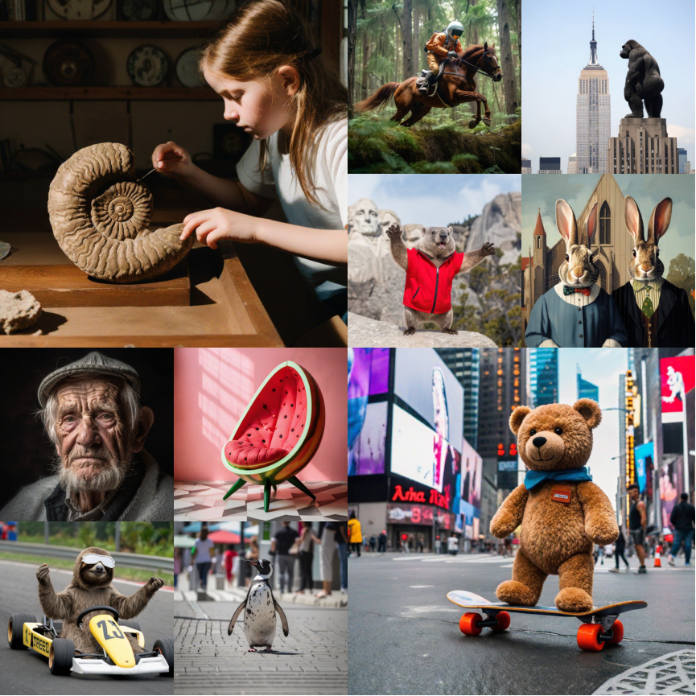
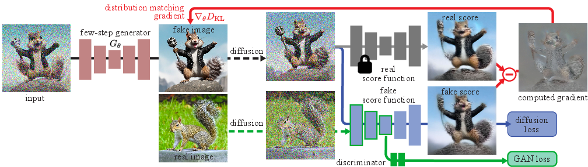
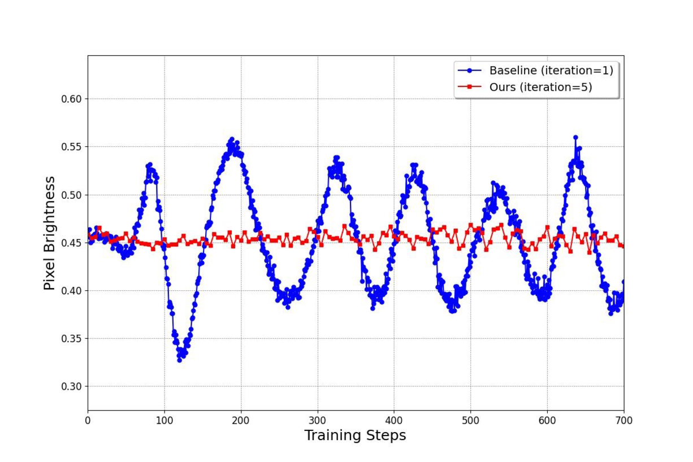
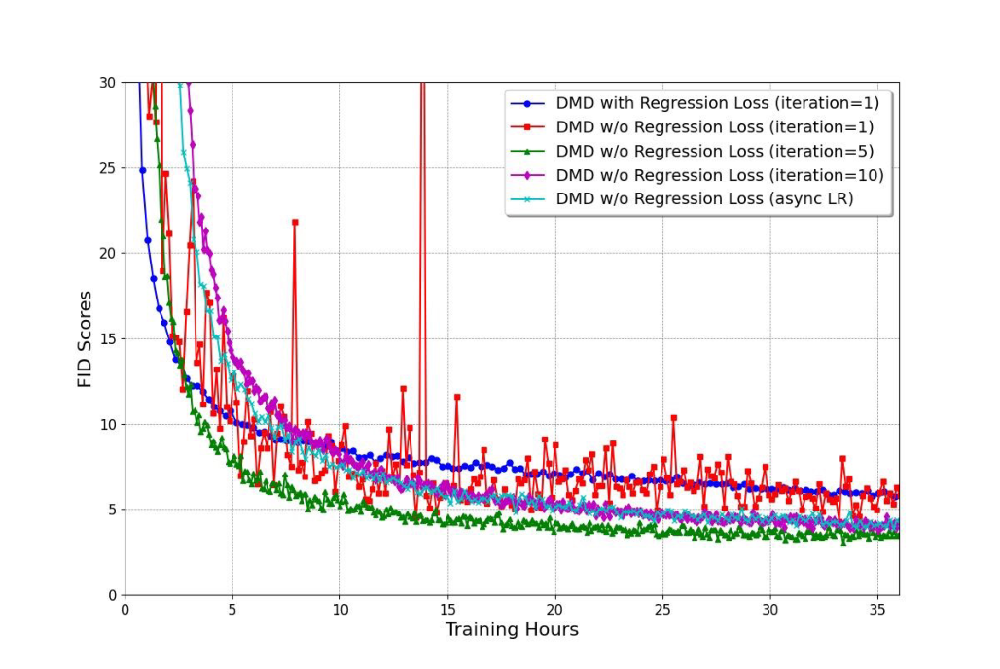
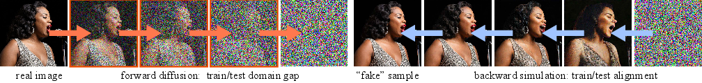
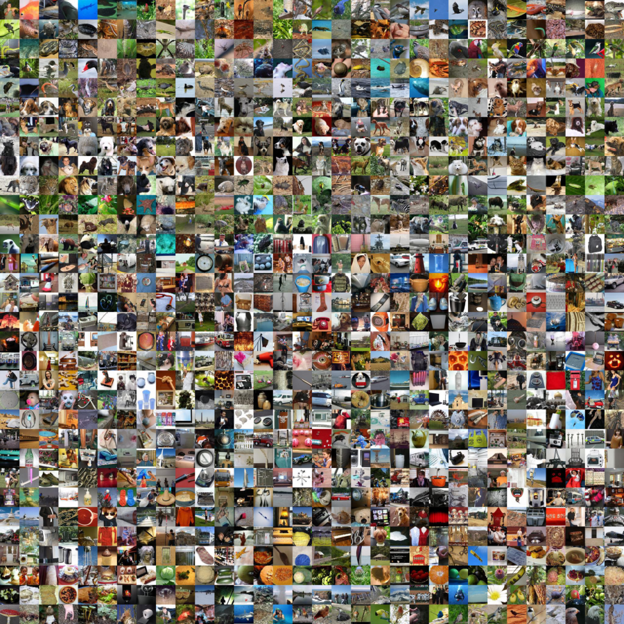
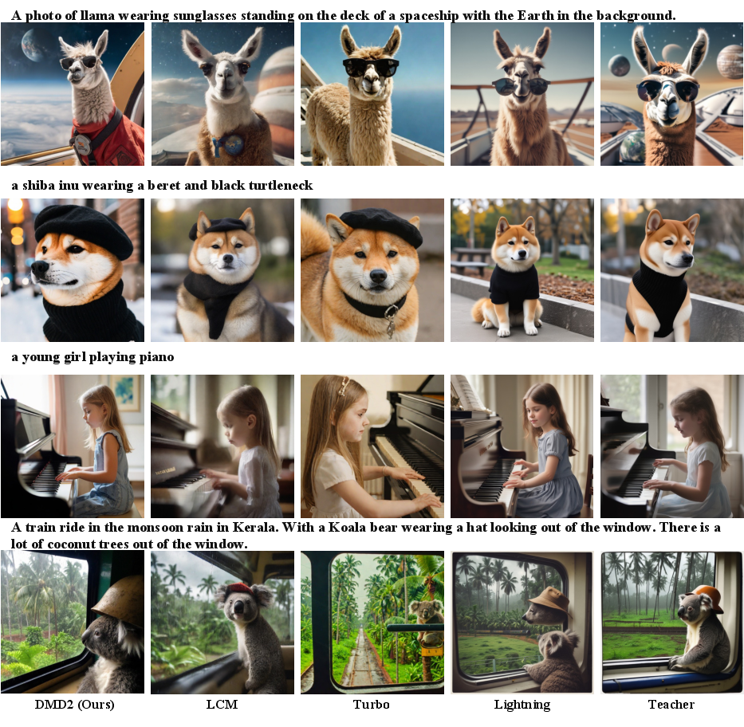
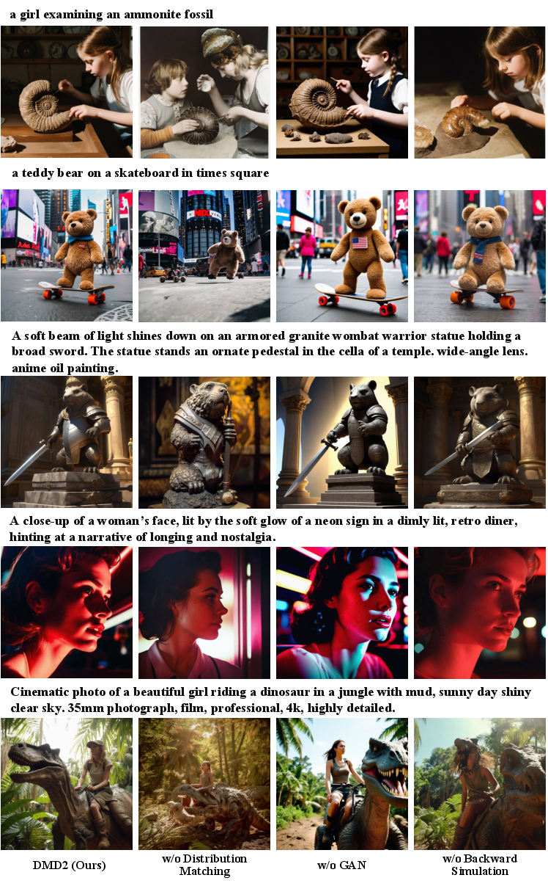
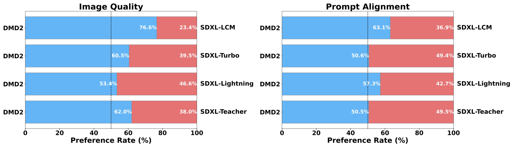

# DMD2：把分布匹配蒸馏推向更稳、更强的少步生成

!!! info "论文信息"
    - 论文：`Improved Distribution Matching Distillation for Fast Image Synthesis`
    - 方法：`DMD2`
    - 链接：[arXiv:2405.14867](https://arxiv.org/abs/2405.14867)
    - 版本：2024-05-23 首次提交，2024-05-24 更新到 v2
    - 会议：NeurIPS 2024 Oral
    - 项目页：[DMD2](https://tianweiy.github.io/dmd2/)
    - 代码：[GitHub](https://github.com/tianweiy/DMD2)
    - 关键词：distribution matching distillation、two time-scale update rule、fake diffusion critic、GAN loss、backward simulation、SDXL distillation

DMD2 是 [DMD](dmd.md) 的直接续作。它不是简单把 DMD 多训一会儿，而是正面修补 DMD 在大规模文生图蒸馏中的三个痛点：**回归配对数据太贵、fake score 跟不上 generator、一步模型容量不足以吃下 SDXL 这种大模型的复杂分布**。

一句话概括：DMD2 把 DMD 从“分布匹配 + paired regression regularizer”推进到“更纯的分布匹配 + fake critic 两时间尺度训练 + GAN 真实数据监督 + 多步 backward simulation”。

## 论文位置

DMD 原论文已经证明：不必让学生逐步复刻 teacher 轨迹，也可以用 real/fake score 差分把多步扩散 teacher 蒸馏成一步 generator。但 DMD 为了稳定训练，仍然保留了一项 regression loss，需要预先构造大量 noise-image pairs：

\[
(z,y), \qquad y=\text{TeacherODE}(z).
\]

这带来两个问题。第一，对 SDXL 这类大模型，预采样数据非常贵；论文估算为 SDXL 生成 1200 万个 LAION prompt 的 paired outputs 约需 700 A100-days。第二，regression loss 会把学生拉回 teacher 的 deterministic sampling path，削弱 DMD 原本的分布匹配优势。

| Method family | Training signal | Main bottleneck |
| --- | --- | --- |
| Progressive / trajectory distillation | match teacher trajectory or teacher outputs | hard to learn exact noise-to-image mapping |
| Original DMD | distribution matching plus paired regression | paired teacher data is expensive and constraining |
| GAN-based fast diffusion | real/fake discrimination on generated images | text guidance and diffusion prior integration can be weak |
| DMD2 | DMD score difference plus TTUR plus GAN plus backward simulation | more moving parts, still costly at SDXL scale |

DMD2 的核心判断是：DMD 真正有价值的是 distribution matching，不是 paired regression。要去掉 regression loss，就必须让 fake diffusion critic 更准确、更稳定地追踪当前 generator 分布。

{ width="860" }

<small>图源：`Improved Distribution Matching Distillation for Fast Image Synthesis`，Figure 1。原论文图意：DMD2 可将 SDXL 蒸馏成 4-step generator，并生成 1024 x 1024 结果。</small>

!!! note "图解：teaser 图先说明 DMD2 的目标尺度"
    这张 teaser 不是方法细节图，而是在告诉你 DMD2 的目标已经从小分辨率一步 toy setting 扩展到 SDXL 级 1024 x 1024 文生图。读它时关注两个信号：第一，student 只用很少 forward passes，因此每一步要承担更大的去噪跨度；第二，高分辨率结果要求模型同时保 prompt alignment、整体构图和局部纹理，不能只用单一 FID 解释质量。

## 方法总览

{ width="920" }

<small>图源：`Improved Distribution Matching Distillation for Fast Image Synthesis`，Figure 3。原论文图意：DMD2 交替训练 generator、fake score function 和 GAN discriminator；generator 接收 distribution matching gradient 与 GAN loss，fake score function 学当前 fake samples 的分布，GAN branch 区分 fake samples 与 real images。</small>

!!! note "这张方法图怎么读"
    DMD2 的图里有两个容易混在一起的“critic”。蓝色的 fake score function 不是 GAN 判别器，它负责估计当前 generator 分布的 diffusion score，进入 DMD 的 real/fake score difference。绿色的 GAN branch 才是在 noised real/fake images 上做分类，用真实图像给 generator 额外监督。

    训练时不要把它理解成“DMD loss + 一个独立 GAN”。更准确的是：fake diffusion critic 的主干同时服务两件事，一边做 denoising score matching，跟踪 \(p_{\text{fake}}\) 的 score；一边在中间特征上接 classification head，提供 adversarial signal。generator 更新时同时看 DMD gradient 和 GAN generator loss。这样 DMD2 既保留扩散 teacher 的条件控制和 CFG 蒸馏路径，又能用真实图像纠正 teacher score 的误差。

DMD2 的训练系统里有四个关键对象：

| Object | Role | Updated during training? |
| --- | --- | --- |
| Teacher diffusion model \(\mu_{\text{real}}\) | provides real score / teacher score | No |
| Generator \(G_\theta\) | one-step or few-step student | Yes |
| Fake diffusion critic \(\mu_{\text{fake}}\) | estimates score of generator distribution | Yes, more frequently than \(G_\theta\) |
| GAN classifier \(D\) | distinguishes noised real images and noised fake images | Yes |

对应的改动可以拆成四条：

1. 去掉 DMD 的 regression loss，不再依赖大规模 paired noise-image dataset；
2. 用 two time-scale update rule，让 fake diffusion critic 多更新几次再更新 generator；
3. 在 fake diffusion critic 的 bottleneck 上加 GAN classification head，引入真实图像数据；
4. 对 SDXL 这类大模型支持多步 generator，并用 backward simulation 消除训练-推理输入错配。

## 回到 DMD 的核心梯度

DMD 的目标是让 generator 输出分布 \(p_{\text{fake}}\) 贴近 teacher / real 分布 \(p_{\text{real}}\)。在加噪后的 timestep \(t\) 上，可以写成：

\[
\nabla\mathcal{L}_{\text{DMD}}
=
\mathbb{E}_t
\nabla_\theta
\operatorname{KL}(p_{\text{fake},t}\|p_{\text{real},t}).
\]

这个梯度可由两个 score 的差近似：

\[
\nabla\mathcal{L}_{\text{DMD}}
\approx
-
\mathbb{E}_t
\left[
\left(
s_{\text{real}}(F(G_\theta(z),t),t)
-
s_{\text{fake}}(F(G_\theta(z),t),t)
\right)
\frac{dG_\theta(z)}{d\theta}
\right].
\]

这里 \(F\) 是 forward diffusion，即给 clean sample 加噪；\(s_{\text{real}}\) 来自冻结 teacher，\(s_{\text{fake}}\) 来自动态训练的 fake diffusion critic。

这条式子的工程含义很具体：

| Term | What it does |
| --- | --- |
| \(s_{\text{real}}\) | pulls generated samples toward teacher / data high-density regions |
| \(s_{\text{fake}}\) | estimates the current generator distribution and corrects the reverse-KL gradient |
| \(s_{\text{real}}-s_{\text{fake}}\) | provides distribution-level supervision without matching individual teacher trajectories |

DMD2 认为原始 DMD 之所以还需要 regression loss，不是因为分布匹配思路错了，而是因为 \(\mu_{\text{fake}}\) 在在线训练里不够准。generator 每次更新都会改变 fake distribution，如果 fake critic 只跟着同频更新，它估计的 score 会滞后，生成器梯度就会带偏。

## 去掉 Regression Loss

原始 DMD 的 regression loss 是：

\[
\mathcal{L}_{\text{reg}}
=
\mathbb{E}_{(z,y)} d(G_\theta(z),y),
\]

其中 \(y\) 是 teacher 用 deterministic sampler 从同一个 noise \(z\) 生成的图像。它能稳定训练，也能保 mode coverage，但副作用很明显：

| Issue | Consequence |
| --- | --- |
| Large paired dataset construction | SDXL / LAION scale becomes expensive before training even starts |
| Pointwise teacher-path matching | student quality is tied to teacher sampling path |
| Less flexible conditioning | complex controls require new paired data generation |
| Conflicts with distribution matching | generator is encouraged to match paths instead of only matching distribution |

DMD2 的第一步就是删掉这项损失。删掉以后模型确实会不稳：论文观察到生成图像平均亮度等统计量会周期性波动，FID 变差。这说明 regression loss 在 DMD 中实际承担了“稳定 fake score 误差”的角色。

## TTUR：让 Fake Critic 追上 Generator

DMD2 的关键诊断是：不稳定来自 fake diffusion critic 对当前 fake distribution 的估计误差。因为 \(G_\theta\) 每次更新都会改变 fake samples 的分布，\(\mu_{\text{fake}}\) 需要更频繁地训练，才能接近当前 generator 的真实 score。

论文采用 two time-scale update rule：

```text
repeat:
  for k fake critic updates:
    sample z
    x_fake = stopgrad(G_theta(z))
    train mu_fake on denoising score matching
    train GAN branch on noised real/fake images

  sample z
  update G_theta with DMD score gradient plus GAN generator loss
```

在 ImageNet 上，论文发现 `5 fake diffusion critic updates : 1 generator update` 是稳定性和速度之间的较好平衡。1:1 会不稳，10:1 虽然更稳但训练慢。

{ width="820" }

<small>图源：`Improved Distribution Matching Distillation for Fast Image Synthesis`，Appendix Figure 7。原论文图意：去掉 regression loss 且只做 1 次 fake critic update 会造成平均亮度等统计量振荡；TTUR 用 5 次 fake critic update 可显著稳定训练。</small>

{ width="820" }

<small>图源：`Improved Distribution Matching Distillation for Fast Image Synthesis`，Appendix Figure 8。原论文图意：5 次 fake diffusion update 在稳定性与收敛速度上更均衡，也比带 regression loss 的原始 DMD 收敛更快。</small>

!!! note "TTUR 图表在证明什么"
    这两张图不是单纯展示“多训 critic 更好”，而是在定位去掉 regression loss 后的失稳来源。亮度曲线振荡说明 generator 的整体图像统计在训练中来回漂，通常意味着它收到的 score gradient 有系统偏差。DMD2 的解释是：fake diffusion critic 没有足够快地跟上 generator 分布，所以 \(s_{\text{fake}}\) 估错，real/fake score difference 就会把 generator 推向错误方向。

    收敛曲线进一步说明 update ratio 不是越大越好。1:1 不稳，10:1 稳但慢，5:1 是折中。这个结论可以迁移到很多在线蒸馏系统：当 generator 的 loss 依赖一个动态 critic 或 score estimator 时，critic 的“跟踪速度”本身就是主超参，不能只调 generator learning rate。

这点是 DMD2 最值得复用的训练经验：如果 loss 依赖一个在线估计器，不能只看 generator 的学习率；还要看估计器是否足够快地跟上 generator 分布变化。

## 为什么加 GAN Loss

删掉 regression loss 和加入 TTUR 后，DMD2 已经能达到原始 DMD 级别。但它还想超过 teacher。原因在于 DMD 的 real score 也只是 teacher diffusion model 的估计：

\[
s_{\text{real}}(x_t,t)
=
-
\frac{x_t-\alpha_t\mu_{\text{real}}(x_t,t)}{\sigma_t^2}.
\]

如果 teacher score 本身有误差，这个误差会通过 DMD 梯度传给 generator。原始 DMD 只看 teacher，不直接看真实图像，因此很难纠正 teacher 的 score approximation error。

DMD2 引入 GAN loss，把真实图像放进训练：

\[
\mathcal{L}_{\text{GAN}}
=
\mathbb{E}_{x\sim p_{\text{real}},t}[\log D(F(x,t))]
+
\mathbb{E}_{z,t}[-\log D(F(G_\theta(z),t))].
\]

实现上，GAN classifier 不是单独再训练一个大 discriminator，而是加在 fake diffusion denoiser 的 middle block / bottleneck 特征上。appendix 里给出的 classifier head 是一组 stride 2 的 \(4\times4\) convolutions、group normalization、SiLU，再下采样到 \(4\times4\)，最后用卷积池化和线性层输出分类。

| Design | Reason |
| --- | --- |
| Discriminate noised real/fake images | smooths distribution gap, similar to DiffusionGAN-style discriminator |
| Attach head to fake diffusion model | reuse representation instead of adding a full standalone discriminator |
| Train on real images | lets student move beyond teacher sampling errors |
| Keep DMD score loss | preserves diffusion prior and natural CFG distillation path |

这不是把 DMD2 变成普通 GAN。它仍然用 DMD 的 score difference 作为主干监督，GAN branch 负责补充真实数据分布信号，尤其改善锐度、局部质感和 teacher score 误差。

## 多步 Generator 与 Backward Simulation

一步生成在 ImageNet 和 SD v1.5 上表现强，但 SDXL 的高分辨率图像更复杂。DMD2 因此把 student 从 one-step 扩展到 few-step。

4-step generator 使用固定 timestep schedule：

```text
999 -> 749 -> 499 -> 249
```

推理时每一步交替做 denoising 和 noise injection：

\[
\hat{x}_{t_i}=G_\theta(x_{t_i},t_i),
\]

\[
x_{t_{i+1}}
=
\alpha_{t_{i+1}}\hat{x}_{t_i}
+
\sigma_{t_{i+1}}\epsilon,
\qquad
\epsilon\sim\mathcal{N}(0,I).
\]

这里最关键的是训练输入。很多多步蒸馏方法训练时让模型 denoise noised real images，但推理时第 2 步之后的输入并不是 noised real image，而是上一步 generator 自己生成的 \(\hat{x}_{t_i}\) 再加噪。这个错配会累积。

DMD2 的 backward simulation 是：训练时也跑当前 student 的少步生成过程，构造“推理时会看到的 synthetic intermediate inputs”，再对这些输入施加 DMD 和 GAN 监督。

{ width="920" }

<small>图源：`Improved Distribution Matching Distillation for Fast Image Synthesis`，Figure 4。原论文图意：常见训练方式用 forward diffusion 构造 intermediate inputs，会和推理时 generator-produced inputs 不一致；DMD2 用 backward simulation 在训练时模拟推理链路，降低 train-inference mismatch。</small>

!!! note "图解：backward simulation 在补训练-推理错配"
    左边的普通做法从真实图像加噪得到 intermediate input，但 few-step student 推理时看到的中间状态并不是“真实图像加噪”，而是“自己上一阶段生成结果再加噪”。右边的 backward simulation 先让当前 student 真的滚出这些 synthetic intermediate states，再在这些状态上训练。这个细节很关键：步数越少，模型自己的中间分布越偏离 teacher 的前向加噪分布；如果训练集不包含这种偏移，推理时误差会逐步累积。

这一点后来在视频扩散、流式生成和世界模型蒸馏里都很重要：少步模型的中间状态不再服从真实数据加噪分布，而是服从“模型自己滚出来的分布”。训练不看这个分布，推理就会出现 exposure bias。

## 训练细节

DMD2 的训练细节比方法名更重要，因为它有多个互相耦合的优化器、更新频率和数据来源。

### ImageNet-64

| Item | Detail |
| --- | --- |
| Teacher | EDM pretrained model |
| Student | one-step generator |
| Optimizer | AdamW |
| Learning rate | \(2\times10^{-6}\) |
| Weight decay | 0.01 |
| Betas | (0.9, 0.999) |
| Batch size | 280 |
| Hardware | 7 A100 GPUs |
| Standard training | 200K iterations, about 2 days |
| Fake critic updates | 5 per generator update |
| GAN loss weight | \(3\times10^{-3}\) |
| Longer training | 400K iterations without GAN, then resume best FID checkpoint |
| Longer training fine-tune | enable GAN, LR \(5\times10^{-7}\), 150K more iterations |
| Longer training time | about 5 days |

这个配置说明 TTUR 不是一个概念性 trick，而是直接写进训练预算：generator 更新次数减少，但 fake score 质量更好，整体收敛反而更快。

### SD v1.5

| Item | Detail |
| --- | --- |
| Teacher | Stable Diffusion v1.5 |
| Student | one-step generator |
| Prompt data | LAION-Aesthetic 6.25+ prompts |
| GAN real image data | 500K LAION-Aesthetic 5.5+ images |
| Filtering | remove images smaller than \(1024\times1024\) and unsafe content |
| Stage 1 | GAN disabled |
| Stage 1 LR | \(1\times10^{-5}\) |
| Stage 1 fake critic updates | 10 per generator update |
| Stage 1 guidance scale for real diffusion model | 1.75 |
| Stage 1 batch size | 2048 |
| Stage 1 hardware | 64 A100 GPUs |
| Stage 1 iterations | 40K |
| Stage 2 | enable GAN loss |
| Stage 2 GAN loss weight | \(10^{-3}\) |
| Stage 2 LR | \(5\times10^{-7}\) |
| Stage 2 iterations | 5K |
| Total training time | about 26 hours |

SD v1.5 用 10:1 的 fake critic update ratio，比 ImageNet 和 SDXL 更高。一个合理解释是：文生图条件更复杂，fake distribution 的移动更快，需要 critic 更保守地追踪。

### SDXL

| Item | Detail |
| --- | --- |
| Teacher | SDXL |
| Student | one-step and four-step generators |
| Prompt data | LAION-Aesthetic 6.25+ prompts |
| GAN real image data | 500K LAION-Aesthetic 5.5+ images |
| Filtering | remove images smaller than \(1024\times1024\) and unsafe content |
| Optimizer | AdamW |
| Learning rate | \(5\times10^{-7}\) |
| Weight decay | 0.01 |
| Betas | (0.9, 0.999) |
| Fake critic updates | 5 per generator update |
| Real diffusion guidance scale | 8 |
| Batch size | 128 |
| Hardware | 64 A100 GPUs |
| 4-step training | 20K iterations |
| 1-step training | 25K iterations |
| Total training time | about 60 hours |
| 1-step SDXL special fix | timestep shift, conditioning timestep 399 |
| 1-step initialization | short regression pretraining with 10K pairs |

注意最后两行。DMD2 主张去掉 regression loss，但 SDXL one-step 版本仍然用了小规模 regression pretraining 来缓解 block noise artifacts。这不影响论文主线：多步 SDXL 不需要这个修正；问题更像 SDXL one-step 的特殊 artifact，而不是 DMD2 必需的大规模 paired dataset。

## 实验结果

### ImageNet-64

| Method | # Fwd Pass (\(\downarrow\)) | FID (\(\downarrow\)) |
| --- | ---: | ---: |
| BigGAN-deep | 1 | 4.06 |
| ADM | 250 | 2.07 |
| RIN | 1000 | 1.23 |
| StyleGAN-XL | 1 | 1.52 |
| Progress. Distill. | 1 | 15.39 |
| DFNO | 1 | 7.83 |
| BOOT | 1 | 16.30 |
| TRACT | 1 | 7.43 |
| Meng et al. | 1 | 7.54 |
| Diff-Instruct | 1 | 5.57 |
| Consistency Model | 1 | 6.20 |
| iCT-deep | 1 | 3.25 |
| CTM | 1 | 1.92 |
| DMD | 1 | 2.62 |
| **DMD2 (Ours)** | 1 | **1.51** |
| **+ longer training (Ours)** | 1 | **1.28** |
| EDM (Teacher, ODE) | 511 | 2.32 |
| EDM (Teacher, SDE) | 511 | 1.36 |

<small>表源：`Improved Distribution Matching Distillation for Fast Image Synthesis`，Table 1 左侧。原论文表格要点：DMD2 一步生成在 ImageNet-64 上达到 1.28 FID，优于原始 DMD 和 EDM ODE teacher，接近 EDM SDE teacher。</small>

{ width="760" }

<small>图源：`Improved Distribution Matching Distillation for Fast Image Synthesis`，Appendix Figure 9。原论文图意：ImageNet 上一步 DMD2 generator 的 class-conditional samples，对应 FID 1.28 设置。</small>

!!! note "图解：ImageNet 样例图主要看覆盖面"
    这类 class-conditional 样例不是为了逐张评价审美，而是看一步 generator 是否能覆盖多类别、多纹理和多形状。若模型只会生成少数稳定模板，FID 可能还不错但类别多样性会变差；若局部纹理发糊或颜色统计异常，通常说明 fake critic、GAN branch 或训练比例还没有稳定。它和前面的 TTUR 曲线要一起读：稳定的 critic 更新频率应该最终反映到样例多样性和局部质量上。

### SDXL on COCO 2014

| Method | # Fwd Pass (\(\downarrow\)) | FID (\(\downarrow\)) | Patch FID (\(\downarrow\)) | CLIP (\(\uparrow\)) |
| --- | ---: | ---: | ---: | ---: |
| LCM-SDXL | 1 | 81.62 | 154.40 | 0.275 |
| LCM-SDXL | 4 | 22.16 | 33.92 | 0.317 |
| SDXL-Turbo | 1 | 24.57 | 23.94 | **0.337** |
| SDXL-Turbo | 4 | 23.19 | 23.27 | 0.334 |
| SDXL Lightning | 1 | 23.92 | 31.65 | 0.316 |
| SDXL Lightning | 4 | 24.46 | 24.56 | 0.323 |
| **DMD2 (Ours)** | 1 | **19.01** | 26.98 | 0.336 |
| **DMD2 (Ours)** | 4 | 19.32 | **20.86** | 0.332 |
| SDXL Teacher, cfg=6 | 100 | 19.36 | 21.38 | 0.332 |
| SDXL Teacher, cfg=8 | 100 | 20.39 | 23.21 | 0.335 |

<small>表源：`Improved Distribution Matching Distillation for Fast Image Synthesis`，Table 1 右侧。原论文表格要点：DMD2 的 4-step SDXL 在 patch FID 上超过 teacher，FID 和 CLIP 与 teacher 接近；1-step 版本 FID 更低但 patch FID 不如 4-step。</small>

这里要小心读指标。1-step DMD2 的整体 FID 是 19.01，比 4-step 更低；但 4-step 的 patch FID 是 20.86，更接近高分辨率局部细节质量，也优于 teacher cfg=6 的 21.38。论文更强调 4-step 在 megapixel image synthesis 上的视觉质量。

{ width="920" }

<small>图源：`Improved Distribution Matching Distillation for Fast Image Synthesis`，Figure 6。原论文图意：相同 prompt 和 noise 下比较 DMD2、SDXL teacher、LCM-SDXL、SDXL-Turbo 和 SDXL-Lightning；所有蒸馏模型用 4 steps，teacher 用 50 steps CFG。</small>

!!! note "图解：SDXL 横向对比图要看同 prompt、同 noise"
    这张图的公平点在于相同 prompt 和 noise 下比较不同少步方法，因此视觉差异更能暴露训练目标本身的偏差。读图时不要只问“哪张最好看”，而要看 DMD2 是否同时保住三件事：主体结构不崩，文本条件不跑偏，局部纹理不过度平滑或过饱和。teacher 用 50 steps CFG，蒸馏模型只用 4 steps，所以这里展示的是速度预算大幅减少后质量是否还能接近 teacher。

### SD v1.5 on COCO 2014

| Family | Method | Resolution (\(\uparrow\)) | Latency (\(\downarrow\)) | FID (\(\downarrow\)) |
| --- | --- | ---: | ---: | ---: |
| Original, unaccelerated | DALL-E | 256 | - | 27.5 |
| Original, unaccelerated | DALL-E 2 | 256 | - | 10.39 |
| Original, unaccelerated | Parti-750M | 256 | - | 10.71 |
| Original, unaccelerated | Parti-3B | 256 | 6.4s | 8.10 |
| Original, unaccelerated | Make-A-Scene | 256 | 25.0s | 11.84 |
| Original, unaccelerated | GLIDE | 256 | 15.0s | 12.24 |
| Original, unaccelerated | LDM | 256 | 3.7s | 12.63 |
| Original, unaccelerated | Imagen | 256 | 9.1s | 7.27 |
| Original, unaccelerated | eDiff-I | 256 | 32.0s | **6.95** |
| GANs | LAFITE | 256 | 0.02s | 26.94 |
| GANs | StyleGAN-T | 512 | 0.10s | 13.90 |
| GANs | GigaGAN | 512 | 0.13s | **9.09** |
| Accelerated diffusion | DPM++ (4 step) | 512 | 0.26s | 22.36 |
| Accelerated diffusion | UniPC (4 step) | 512 | 0.26s | 19.57 |
| Accelerated diffusion | LCM-LoRA (4 step) | 512 | 0.19s | 23.62 |
| Accelerated diffusion | InstaFlow-0.9B | 512 | 0.09s | 13.10 |
| Accelerated diffusion | SwiftBrush | 512 | 0.09s | 16.67 |
| Accelerated diffusion | HiPA | 512 | 0.09s | 13.91 |
| Accelerated diffusion | UFOGen | 512 | 0.09s | 12.78 |
| Accelerated diffusion | SLAM (4 step) | 512 | 0.19s | 10.06 |
| Accelerated diffusion | DMD | 512 | 0.09s | 11.49 |
| Accelerated diffusion | **DMD2 (Ours)** | 512 | 0.09s | **8.35** |
| Teacher | SDv1.5 (50 step, cfg=3, ODE) | 512 | 2.59s | 8.59 |
| Teacher | SDv1.5 (200 step, cfg=2, SDE) | 512 | 10.25s | 7.21 |

<small>表源：`Improved Distribution Matching Distillation for Fast Image Synthesis`，Appendix Table 3。原论文表格要点：DMD2 蒸馏 SD v1.5 后以 0.09s latency 达到 8.35 FID，优于原始 DMD，也略优于 50-step ODE teacher。</small>

这个结果最能体现 DMD2 的目标：不是只把 teacher 压快，而是在某些评测口径下超过 teacher 的 deterministic sampler。原因来自两部分：GAN branch 直接看真实数据，DMD 去掉大规模 regression 后不再被 teacher 采样路径强约束。

## 消融实验

### ImageNet 消融

| DMD | No Regress. | TTUR | GAN | FID (\(\downarrow\)) |
| --- | --- | --- | --- | ---: |
| Yes |  |  |  | 2.62 |
| Yes | Yes |  |  | 3.48 |
| Yes | Yes | Yes |  | 2.61 |
| Yes | Yes | Yes | Yes | **1.51** |
|  |  |  | Yes | 2.56 |
|  |  | Yes | Yes | 2.52 |

<small>表源：`Improved Distribution Matching Distillation for Fast Image Synthesis`，Table 2 左侧。原论文表格要点：直接去掉 regression loss 会让 FID 从 2.62 退化到 3.48；加入 TTUR 后回到 2.61；再加入 GAN 后到 1.51。</small>

这张表的结论非常清楚：

1. 只删 regression loss 不行；
2. TTUR 解决稳定性，基本恢复原始 DMD；
3. GAN loss 带来主要质量提升；
4. GAN alone 不如 DMD + TTUR + GAN，说明 diffusion score difference 仍然关键。

### SDXL 消融

| Method | FID (\(\downarrow\)) | Patch FID (\(\downarrow\)) | CLIP (\(\uparrow\)) |
| --- | ---: | ---: | ---: |
| w/o GAN | 26.90 | 27.66 | 0.328 |
| w/o Distribution Matching | **13.77** | 27.96 | 0.307 |
| w/o Backward Simulation | 20.66 | 24.21 | 0.332 |
| **DMD2 (Ours)** | 19.32 | **20.86** | **0.332** |

<small>表源：`Improved Distribution Matching Distillation for Fast Image Synthesis`，Table 2 右侧。原论文表格要点：w/o distribution matching 的 FID 最低但 CLIP 和视觉质量差；完整 DMD2 在 patch FID 和 CLIP 上最好，说明不能只看单一 FID。</small>

!!! note "为什么这张消融不能只看 FID"
    `w/o Distribution Matching` 的 FID 最低，看起来像是纯 GAN 更强，但它的 CLIP 分数明显下降，图像也更容易偏离 prompt。这说明 COCO FID 更像“生成图像整体分布像不像真实 COCO 图像”，并不能充分衡量文本条件是否被执行。

    DMD2 完整模型的价值在于平衡三件事：GAN branch 提供真实图像分布信号，DMD score loss 保留 teacher diffusion 的条件控制，backward simulation 让多步输入接近推理时的 synthetic intermediate states。读这张表时应该同时看 FID、Patch FID 和 CLIP：FID 低不等于文生图更可用，Patch FID 更反映高分辨率局部细节，CLIP 才对应 prompt alignment。

{ width="760" }

<small>图源：`Improved Distribution Matching Distillation for Fast Image Synthesis`，Figure 7。原论文图意：SDXL 消融显示，去掉 distribution matching 会伤害 text alignment 和 aesthetic quality；去掉 GAN 会产生过饱和、过平滑图像；去掉 backward simulation 会降低质量。</small>

!!! note "图解：SDXL 消融图在拆三种质量来源"
    `w/o Distribution Matching` 暴露的是条件控制退化：图像可能更像自然图片，但更不听 prompt。`w/o GAN` 暴露的是视觉真实感和局部质感不足：容易过饱和、过平滑。`w/o Backward Simulation` 暴露的是多步推理分布错配：中间状态没被训练好，最终质量下降。这张消融很适合提醒一个常见误读：FID 不是文生图唯一目标，DMD2 的价值在于同时保留扩散 teacher 的条件控制、GAN 的真实数据信号和 few-step 推理链路的一致性。

## 人类偏好评测

{ width="920" }

<small>图源：`Improved Distribution Matching Distillation for Fast Image Synthesis`，Figure 5。原论文图意：在 128 个 PartiPrompts 子集上做 pairwise human preference，对比 teacher 和 4-step distillation baselines；DMD2 在 image quality 与 prompt alignment 上均有较强偏好。</small>

!!! note "图解：人评图补的是自动指标看不到的部分"
    自动指标会把质量拆成 FID、Patch FID、CLIP 等近似量，但用户真正看到的是图像是否自然、prompt 是否被执行、细节是否可信。pairwise human preference 让评审在相同 prompt 下直接比较两张图，因此能补足“FID 低但不听 prompt”或“CLIP 高但画面差”的盲区。DMD2 在 image quality 和 prompt alignment 上同时被偏好，说明它不是只优化了某一个单指标。

人评的一个重要信息是：DMD2 不是只在自动指标上好看。论文报告 DMD2 在 24% 样本上被认为图像质量优于 teacher，同时保持相近 prompt alignment；而 teacher 使用更多 forward passes。

## 和 DMD、CausVid、Phased DMD 的关系

| Dimension | DMD | DMD2 | CausVid / Phased DMD |
| --- | --- | --- | --- |
| Core objective | real/fake score difference | stronger DMD objective with TTUR and GAN | adapt DMD/DMD2 to video or phased subintervals |
| Regression loss | large paired teacher outputs | removed for main training, except small SDXL one-step init | usually replaced by better initialization or phased objective |
| Fake critic | same update rhythm by default | more frequent fake critic updates | still needs careful score tracking |
| Real data | not directly used in main DMD loss | GAN branch uses real images | video methods may add adversarial or self-rollout signals |
| Sampling | mostly one-step | one-step and four-step | few-step / streaming / phased |
| Main lesson | match distribution, not teacher path | make distribution matching stable and sharper | expose train-test mismatch and phase-specific score quality |

DMD2 是后续很多 DMD 系路线的实际工程基线。CausVid 的 asymmetric DMD、LingBot-World 里提到的少步蒸馏、Phased DMD 对 SGTS 和 SNR 子区间的修正，都可以看成是在 DMD2 已经揭示的问题上继续扩展：fake score 要准，训练时要看到推理时的分布，少步模型不能只依赖真实数据加噪分布。

## 可复用经验

1. **在线 critic 要更快**：如果 generator 的 loss 依赖一个动态估计器，估计器的 update ratio 本身就是关键超参。
2. **少步生成要训练自己的中间分布**：多步 generator 的第 2 步以后输入来自自己，而不是 noised real image；backward simulation 是应对 exposure bias 的实用模板。
3. **真实数据监督能补 teacher score 误差**：GAN branch 的价值不只是锐化图像，也是在 teacher 分数不完美时提供额外锚点。
4. **不要只看 FID**：SDXL 消融里 w/o distribution matching 的 FID 最低，但 CLIP 和视觉对齐更差，说明自动指标需要结合 patch FID、人评和 prompt alignment。
5. **固定 guidance scale 是蒸馏模型的默认代价**：DMD2 把 CFG 效果蒸馏进 generator，推理快，但用户调 guidance scale 的自由度下降。

## 局限与风险

1. **训练仍然重**：虽然省掉大规模 paired teacher dataset，但 SDXL 仍需 64 A100、约 60 小时，且要同时维护 generator、fake critic 和 GAN branch。
2. **SDXL one-step 仍有特殊处理**：论文为了处理 block noise artifacts，对 one-step SDXL 用了 timestep shift 和 10K pairs 的短回归预训练。
3. **多样性略低于 teacher**：appendix 报告 DMD2 的 diversity score 接近但仍低于 SDXL teacher。
4. **固定 guidance scale 限制交互性**：和许多蒸馏模型一样，训练时固定 guidance scale，推理时不如原扩散模型灵活。
5. **GAN branch 增加训练调参面**：GAN loss weight、critic update ratio、真实图像过滤都会影响质量、对齐和稳定性。
6. **安全与偏见风险未由方法本身解决**：更快生成会降低滥用门槛，仍需要数据过滤、检测和部署策略。

## 阅读结论

DMD2 最值得记住的不是“DMD 加 GAN”，而是它把一步/少步扩散蒸馏的失败原因拆得更清楚：**DMD 的分布匹配梯度依赖 fake critic 的准确性；大模型少步采样依赖训练时模拟自己的推理分布；想超过 teacher 时，不能只相信 teacher score，还要引入真实数据监督。**

因此，DMD2 是理解后续少步扩散、视频扩散蒸馏和实时生成系统的重要节点。它把 DMD 的思想从 proof-of-concept 推成了更接近工程可用的训练配方。

## 参考

1. Yin et al. [Improved Distribution Matching Distillation for Fast Image Synthesis](https://arxiv.org/abs/2405.14867). arXiv:2405.14867.
2. 官方项目页：[DMD2](https://tianweiy.github.io/dmd2/).
3. 官方代码：[tianweiy/DMD2](https://github.com/tianweiy/DMD2).
