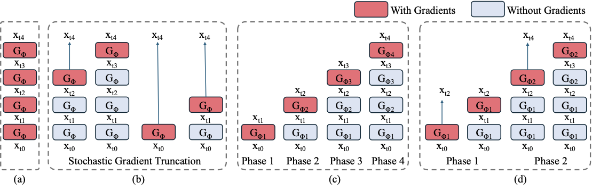
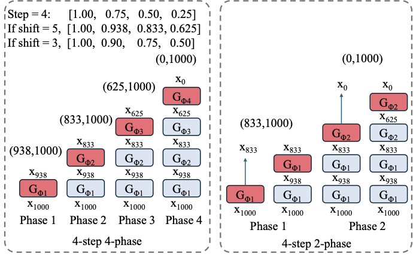

# Phased DMD：把 DMD 拆成分阶段的少步蒸馏

!!! info "论文信息"
    - 论文：`Phased DMD: Few-step Distribution Matching Distillation via Score Matching within Subintervals`
    - 链接：[arXiv:2510.27684](https://arxiv.org/abs/2510.27684)
    - 版本：2025-10-31 首次提交，2026-03-25 更新到 v3
    - 项目页：[Phased DMD](https://x-niper.github.io/projects/Phased-DMD/)
    - 代码与模型：[ModelTC/Wan2.2-Lightning](https://github.com/ModelTC/Wan2.2-Lightning)
    - 关键词：Distribution Matching Distillation、DMD、DMD2、SGTS、few-step diffusion、score matching、SNR subinterval、MoE、Wan2.2、Qwen-Image

这篇论文的核心价值是把 DMD 类少步蒸馏从“把整个反向过程一次性压到少数步”改成“沿 SNR 子区间逐段训练专家”。它要解决的不是普通采样器加速，而是一个更具体的问题：**DMD2 这类带随机梯度截断的少步蒸馏虽然省显存、稳定，但会把一部分训练迭代退化成近似一跳生成，进而损失图像多样性和视频运动强度。**

Phased DMD 的答案是两件事：

1. 用 **progressive distribution matching** 把生成过程拆成多个 SNR phase，每个 phase 只训练一个 expert；
2. 用 **score matching within subintervals** 修正中间 phase 的 fake score 训练目标，因为这些 phase 看不到干净样本 \(x_0\)。

## 论文位置

DMD / DMD2 的吸引力在于，它不要求学生模型逐步模仿 teacher 的完整采样轨迹，而是通过 teacher score 和 fake score 的差异做分布匹配。这样可以把多步扩散模型蒸馏成一到几步的生成器。

问题在于，扩散模型越大、视频越长，直接把 few-step backward simulation 全部放进计算图就越贵。DMD2 和 Self-Forcing 方向引入 stochastic gradient truncation strategy，简称 SGTS：训练时随机截断 backward simulation，只对最后一个 denoising step 记录梯度。它缓解了显存和稳定性问题，但也带来副作用。

| Route | Main idea | Strength | Failure mode |
| --- | --- | --- | --- |
| Vanilla few-step DMD | backprop through all generated steps | direct few-step distribution matching | deep computation graph, high memory, unstable on large video models |
| DMD2 / SGTS | randomly truncate backward simulation and train only final step | lower memory, better convergence | some iterations collapse to one-step distillation, reducing diversity and motion |
| Phased DMD | split SNR into phases and train experts progressively | keeps one recorded step per phase while preserving multi-step capacity | more system structure, multiple experts / LoRA weights to manage |

这篇论文适合接在 [CausVid](causvid.md) 后面读。CausVid 说明 DMD 可以把视频扩散变成少步流式生成器；Phased DMD 则继续追问：当 teacher 是 Wan2.2 / Qwen-Image 这样的大模型时，怎样避免少步 DMD 把模型压得太“窄”，尤其是视频动作变慢、图像多样性下降。

## 方法总览

{ width="920" }

<small>图源：`Phased DMD`，Figure 1。原论文图意：对比 vanilla few-step DMD、DMD2/SGTS、4-phase Phased DMD 和结合 SGTS 的 2-phase Phased DMD。红色表示记录梯度的 generator step，蓝色表示不记录梯度的 forward step。</small>

!!! note "这张图到底在比较什么"
    这张图的核心不是采样步数本身，而是**训练时梯度如何穿过少步生成链**。红色 step 表示这一段会进入反向传播，模型参数会因为这一步的 DMD loss 更新；蓝色 step 表示只是为了模拟当前少步 generator 的推理状态而向前跑，不记录梯度。换句话说，红色决定训练信号真正作用在哪里，蓝色决定训练样本来自什么中间分布。

    **Vanilla few-step DMD** 的做法最直接：如果推理是 4 步，训练时也把 4 个 generator step 都放进计算图，然后从最终样本上的 DMD loss 一路反传回前面每一步。这样理论上最贴近真实 4-step 推理链，因为每个 step 都知道最终质量会怎样影响自己。但代价也最大：计算图很深，显存随步数和视频长度快速增长；在 Wan2.2 这类大视频模型上，还会让优化非常不稳。

    **DMD2 / SGTS** 是为了解决这个显存问题。它会先用若干个蓝色 step 跑出一个中间状态，然后只把最后一个红色 step 放进计算图。这样训练时显存接近 one-step DMD，但仍然让模型看到一部分由自己生成出来的中间输入。这就是 SGTS 的好处：省显存，也比完全不用 backward simulation 更接近推理分布。问题在于，SGTS 的截断点是随机的；当截断停得很早时，红色 step 实际上要从接近纯噪声的位置直接承担全部生成任务，训练信号就退化成类似 one-step distillation。反复出现这种训练样本，会把 few-step 模型往“每一步都试图独自解决全部问题”的方向推，结果常见是多样性下降、视频运动变弱、不同 seed 的结构更相似。

    **4-phase Phased DMD** 的想法是把整条 SNR 路径拆开。每个 phase 只训练自己负责的子区间：前面的 phase 负责高噪声 / 低 SNR 区间里的全局结构和运动，后面的 phase 负责低噪声 / 高 SNR 区间里的纹理和细节。这样每个 expert 只需要解决一个更短的 denoising subproblem，而不是在每次训练中都被要求从纯噪声直接走到干净样本。它的训练目标也因此改变：中间 phase 的 fake score 不能再假设 clean target 是 \(x_0\)，而要估计“从当前中间状态继续加噪后”的子区间 score。

    **2-phase Phased DMD with SGTS** 是更工程化的折中。它不为 4 个采样 step 都单独训练一个 phase，而是把它们合并成两个 phase，并在每个 phase 内继续使用 SGTS 控制显存。这样既保留了 Phased DMD 的核心好处：不同 SNR 区间有不同 expert、不同 score matching 目标；又不至于引入过多专家和训练成本。论文在 Wan2.2 上采用这类设置，是因为 Wan2.2 本身有高噪声 / 低噪声 MoE 分工，2-phase 设计正好能和这种结构对齐。

这张图可以按四种训练图来读：

| Panel | Meaning | Key point |
| --- | --- | --- |
| (a) Vanilla few-step DMD | all denoising steps carry gradients | training graph grows with the number of steps |
| (b) DMD2 / SGTS | randomly stop at an intermediate step and backprop only one step | memory efficient, but can become one-step training when truncation stops early |
| (c) Phased DMD | train one expert per phase and match distribution at intermediate timesteps | each expert learns a smaller SNR subproblem |
| (d) Phased DMD with SGTS | use fewer phases than sampling steps | practical 4-step, 2-phase setting used to align with Wan2.2 MoE |

如果只看推理，Phased DMD 仍然是 4-step generator。真正变化发生在训练：每个 phase 的 fake diffusion model 不再被要求估计 \(p_{\text{fake}}(x_t)\) 从 \(x_0\) 出发的完整 score，而是估计从中间状态 \(x_s\) 继续加噪后的子区间 score。

## DMD 的核心机制

DMD 的目标是让生成分布 \(p_{\text{fake}}\) 靠近真实分布 \(p_{\text{real}}\)。生成器 \(G_\phi\) 从噪声 \(z\) 产生样本：

\[
x_0 = G_\phi(z),
\qquad z \sim \mathcal N(0,I).
\]

然后把 \(x_0\) 加噪到 \(x_t\)：

\[
x_t = \alpha_t x_0 + \sigma_t \epsilon.
\]

DMD 用两个 score estimator：

| Component | Trained? | Role |
| --- | --- | --- |
| Teacher score \(T_{\hat\theta}\) | frozen | approximate real data score |
| Fake score \(F_\theta\) | trainable | approximate score of current generator distribution |
| Generator \(G_\phi\) | trainable | updated by score difference |

生成器更新方向近似来自：

\[
\nabla_\phi D_{KL}
\approx
\mathbb E
\left[
w_t
\left(
T_{\hat\theta}(x_t,t)-F_\theta(x_t,t)
\right)
\frac{dG_\phi}{d\phi}
\right].
\]

直觉上，teacher score 告诉样本该往真实数据分布哪里走，fake score 则校正当前生成分布自己的密度梯度。两者的差异给生成器一个“从 fake 分布移向 real 分布”的方向。

DMD 能成立有两个关键前提：

1. \(F_\theta\) 要足够收敛，否则 fake score 会跟不上 generator；
2. \(F_\theta\) 的训练目标必须和 teacher score 属于同一种 score 参数化，否则 score difference 的方向会偏。

Phased DMD 主要解决第二点在中间 timestep 上会失效的问题。

## 为什么 SGTS 会退化

few-step DMD 假设一个 \(N\)-step scheduler：

\[
t_0=1 > t_1 > \cdots > t_N=0.
\]

生成过程是：

\[
x_{t_{i+1}}
=
\mathcal S
\left(
G_\phi(x_{t_i},t_i),x_{t_i},t_i,t_{i+1}
\right).
\]

如果训练时让梯度穿过全部 \(N\) 个步骤，显存和图深度都会随 \(N\) 增长。SGTS 的做法是随机采样一个停止 index \(j\)，只跑到 \(t_j\)，并且只对最后一步记录梯度。

这个技巧的问题在于：当 \(j=1\) 时，训练样本只经历一次 denoising step 就终止。这样的迭代等价于在训练一个 one-step generator。虽然 SGTS 的平均训练过程仍然覆盖多个 step，但它反复把模型推向“一步就要完成全部任务”的行为，容易导致：

1. text-to-image 里不同 seed 生成的构图更像；
2. video 里动作幅度被压小，运动变慢；
3. prompt-following 和复杂镜头控制变弱；
4. high-SNR 细节训练继续推进时，low-SNR 的结构和动态被改坏。

Phased DMD 的关键判断是：不要让每次训练都从纯噪声直接面向 \(x_0\)。应该让第 \(k\) 个 expert 只负责从 \(x_{t_{k-1}}\) 走到 \(x_{t_k}\)，并在对应的 SNR 子区间里做分布匹配。

## Progressive Distribution Matching

Phased DMD 把 few-step 采样过程拆成多个 phase。第 \(k\) 个 phase 产生的是中间样本：

\[
x_{t_k}
=
\operatorname{pipeline}_k(z).
\]

这里的 \(x_{t_k}\) 不是干净样本 \(x_0\)，而是反向生成过程中的一个中间状态。第 \(k\) 个 expert \(G_{\phi_k}\) 只需要把分布从 \(p(x_{t_{k-1}})\) 推向 \(p(x_{t_k})\)。

这带来三个好处：

| Design | Effect |
| --- | --- |
| one trainable expert per phase | each expert learns a smaller denoising subproblem |
| earlier low-SNR phases frozen before later phases | structure and motion are preserved while high-SNR details are refined |
| one gradient-recorded step per phase | memory cost remains close to one-step distillation |

这也是它和传统 progressive distillation 的区别。Progressive distillation 通常是把 teacher 的采样步数一轮轮减半；Phased DMD 不是在逐轮压缩 step 数，而是在固定少步目标下，把 SNR 范围切成训练阶段。

## 子区间 Score Matching

这里是论文最重要的技术细节。

普通 diffusion 训练知道干净样本 \(x_0\)，所以可以从：

\[
x_t = \alpha_t x_0 + \sigma_t \epsilon
\]

直接构造训练目标。但在 Phased DMD 的中间 phase，模型只拿到 \(x_s\)，其中 \(s=t_k>0\)。这时不能假装 \(x_s\) 就是 \(x_0\)，否则 fake score 会有偏。

论文从 Markov Gaussian diffusion 出发：

\[
p(x_t \mid x_s)
=
\mathcal N(\alpha_{t|s}x_s,\sigma_{t|s}^2I),
\]

其中：

\[
\alpha_{t|s}=\frac{\alpha_t}{\alpha_s},
\qquad
\sigma_{t|s}^2
=
\sigma_t^2-\alpha_{t|s}^2\sigma_s^2.
\]

于是中间样本继续加噪写成：

\[
x_t
=
\alpha_{t|s}x_s+\sigma_{t|s}\epsilon.
\]

对于 flow velocity prediction，子区间 fake score model 应该优化：

\[
\left\lVert
\psi(x_t,t)
-
\left(
\frac{\alpha_s^2\sigma_t+\alpha_t\sigma_s^2}
{\alpha_s^2\sigma_{t|s}}
\epsilon
-
\frac{1}{\alpha_s}x_s
\right)
\right\rVert^2.
\]

这个目标的意义是：虽然训练时没有 \(x_0\)，但 \(F_{\theta_k}\) 仍然可以在子区间 \((s,1]\) 上给出和完整 score matching 一致的无偏估计。

实际训练还要处理 \(t \to s\) 时 \(\sigma_{t|s}\to 0\) 的数值奇异。论文把 loss 改成带 clamp 的形式：

\[
\operatorname{clamp}
\left(
\frac{1}{\sigma_{t|s}^2}
\right)
\left\lVert
\sigma_{t|s}\psi(x_t,t)
-
\left(
\frac{\alpha_s^2\sigma_t+\alpha_t\sigma_s^2}{\alpha_s^2}\epsilon
-
\frac{\sigma_{t|s}}{\alpha_s}x_s
\right)
\right\rVert^2.
\]

其中 clamp 范围是 \([0,10]\)，用来避免靠近子区间边界时权重爆掉。

论文还给出 x-prediction 版本，适用于 EDM / SID / TDM / Self-Forcing 一类 sample prediction 设置：

\[
\left\lVert
\mu(x_t,t)
-
\left(
\frac{1}{\alpha_s}x_s
-
\frac{\alpha_t\sigma_s^2}
{\alpha_s^2\sigma_{t|s}}\epsilon
\right)
\right\rVert^2.
\]

这部分是 Phased DMD 和“经验性切区间训练”的边界。它不是简单把 timestep 切开再照旧训，而是明确改了 fake score 的目标，保证 DMD 的 A2 假设仍然成立。

## Toy 实验说明了什么

<table>
  <tr>
    <th>Full interval objective</th>
    <th>Correct subinterval objective</th>
    <th>Incorrect subinterval target</th>
  </tr>
  <tr>
    <td></td>
    <td></td>
    <td></td>
  </tr>
</table>

<small>图源：`Phased DMD`，Figure 2。原论文图意：在一维四点分布上比较完整区间训练、正确子区间训练和错误子区间目标。正确子区间目标能复现完整区间采样轨迹，错误目标会产生偏移。</small>

!!! note "图解：toy flow 图在验证子区间目标是否无偏"
    这个 toy 实验很小，但它支撑了论文的核心理论点。左图是完整区间目标，等价于不拆 phase；中图说明只训练正确子区间时，采样轨迹仍能复现完整区间方向；右图说明如果中间 phase 直接用 \(\epsilon - x_s\) 之类的 naive target，fake score 会偏，DMD 更新方向就不再可靠。正确的子区间目标能让模型在 \((s,1]\) 里学到和完整 score matching 一致的轨迹。

## 训练设置

论文验证的是大模型蒸馏，不是小 toy diffusion。teacher 包括：

1. `Wan2.1-T2V-14B`
2. `Wan2.2-T2V-A14B`
3. `Wan2.2-I2V-A14B`
4. `Qwen-Image-20B`

### Table 1: Overview of the experimental setup

表格按论文原始英文格式重绘。

| Base Model | Task | Vanilla DMD | DMD2 | Ours | Timesteps | Frame, Height, Width |
| --- | --- | --- | --- | --- | --- | --- |
| Wan2.1-T2V-14B | T2I | ✓ | ✓ | ✓ | 1000, 938, 833, 625 | 1, 720, 1280 |
| Wan2.2-T2V-A14B | T2I | × | ✓ | ✓ | 1000, 938, 833, 625 | 1, 720, 1280 |
| Wan2.2-T2V-A14B | T2V | × | ✓ | ✓ | 1000, 938, 833, 625 | 81, 720, 1280 |
| Wan2.2-I2V-A14B | I2V | × | ✓ | ✓ | 1000, 938, 833, 625 | 81, 720, 1280 |
| Qwen-Image-20B | T2I | × | ✓ | ✓ | 1000, 900, 750, 500 | 1, 1382, 1382 |

<small>表源：`Phased DMD`，Table 1。原论文表格要点：该表列出不同 teacher、任务、对照方法、采样 timestep 和训练分辨率。Wan2.2 与 Qwen-Image 都被蒸馏成 4-step 模型。</small>

### 统一训练配置

这部分细节值得认真记，因为它说明 Phased DMD 的收益不是靠轻量玩具设置得到的。

| Item | Detail |
| --- | --- |
| GPUs | 64 GPUs |
| Parallelism | PyTorch FSDP, gradient checkpointing |
| Video parallelism | context parallelism for T2V and I2V |
| Batch size | 64 |
| Fake diffusion model LR | \(4\times10^{-7}\) |
| Fake diffusion model training | full-parameter training |
| Generator LR | \(5\times10^{-5}\) |
| Generator adaptation | LoRA, rank = 64, alpha = 8 |
| Optimizer | AdamW |
| AdamW beta | \(\beta_1=0,\beta_2=0.999\) |
| Fake updates per generator update | 5 |
| Backward simulation solver | Euler solver |
| Main practical setting | 4-step, 2-phase |

几个判断点：

1. fake diffusion model 全参数训练，generator 用 LoRA，这说明 fake score 的准确性被放在很高优先级；
2. fake 每 generator 更新 5 次，延续 DMD2 的 TTUR 思路，目的是让 \(F_\theta\) 跟得上 generator 分布；
3. video 任务使用 context parallelism，否则 81 帧、720p / 480p 混合分辨率下很难稳定训练；
4. 4-step, 2-phase 是工程折中，不是理论上唯一设置；补充实验里 4-step, 4-phase 更强，但系统复杂度更高。

### 分辨率与 timestep shift

补充材料给出更细的训练分辨率：

| Model / Task | Resolution sampling |
| --- | --- |
| Wan2.x T2I | fixed `(1, 720, 1280)` |
| Wan2.2 T2V / I2V | `(81, 720, 1280)`, `(81, 1280, 720)`, `(81, 480, 832)`, `(81, 832, 480)` with probabilities `0.1, 0.1, 0.4, 0.4` |
| Qwen-Image T2I | uniform over `(1, 1382, 1382)`, `(1, 1664, 928)`, `(1, 928, 1664)`, `(1, 1472, 1104)`, `(1, 1104, 1472)`, `(1, 1584, 1056)`, `(1, 1056, 1584)` |

论文还使用 timestep shift：

| Base family | Shift |
| --- | ---: |
| Wan2.x | 5 |
| Qwen-Image | 3 |

{ width="760" }

<small>图源：`Phased DMD`，supplementary Figure 7。原论文图意：训练 phase 的 re-noising timestep 区间由采样 steps 和 timestep shift 决定。Wan 系列使用 shift 5，Qwen-Image 使用 shift 3。</small>

!!! note "图解：timestep interval 图要和 SNR 分工一起看"
    图里的 interval 不是随便切采样步，而是在规定每个 phase 训练时从哪些噪声强度重新加噪。高噪声 / 低 SNR 区间更负责全局结构、运动和大尺度布局，低噪声 / 高 SNR 区间更负责纹理、边缘和局部细节。timestep shift 会改变这些区间实际落点，所以 Wan 和 Qwen-Image 需要不同设置；这也是 Phased DMD 不能只说“训练几个 expert”而不说明 re-noising schedule 的原因。

对于 Wan2.2，第一阶段只使用 high-noise model，也就是 low-SNR expert。这里的命名容易混淆：**high-noise model 对应低 SNR 区间**，主要负责结构和动态。论文在第一阶段还限制 re-noising timestep：

| Task | Phase 1 re-noising clamp |
| --- | --- |
| T2V | `(0.875, 1)` |
| I2V | `(0.9, 1)` |

第二阶段会同时使用 high-noise 和 low-noise model，并训练三个组件：low-noise generator、high-noise fake model、low-noise fake model。teacher / fake model 的选择由 re-noising timestep 决定。

## 视频生成结果

视频实验关注的是 motion dynamics 和 camera control。论文用 220 个 T2V 文本 prompt、220 个 I2V 图文 prompt，每个 prompt 固定 seed 42 生成一个视频。base model 使用 40 steps、guidance scale 4；蒸馏模型使用 4 steps、guidance scale 1。

<table>
  <tr>
    <th>Base</th>
    <th>DMD2</th>
    <th>Phased DMD</th>
  </tr>
  <tr>
    <td></td>
    <td></td>
    <td></td>
  </tr>
</table>

<small>图源：`Phased DMD`，Figure 3 左侧。原论文图意：对比 Wan2.2-T2V-A14B base、DMD2 和 Phased DMD 在复杂 parkour 动作上的视频帧预览，Phased DMD 保留更强运动幅度。</small>

<table>
  <tr>
    <th>Base</th>
    <th>DMD2</th>
    <th>Phased DMD</th>
  </tr>
  <tr>
    <td></td>
    <td></td>
    <td></td>
  </tr>
</table>

<small>图源：`Phased DMD`，Figure 3 右侧。原论文图意：对比 base、DMD2 和 Phased DMD 在 camera-following prompt 下的镜头控制。DMD2 更容易收成近景，Phased DMD 更接近 base model 的镜头运动。</small>

!!! note "图解：视频对比图重点看 motion collapse"
    左侧 parkour 样例看的是动作幅度：DMD2 容易把少步模型压成更保守的运动，Phased DMD 则让低 SNR phase 继续承担大尺度动态。右侧 camera-following 样例看的是镜头控制：如果模型为了稳定而收成近景，说明它牺牲了原 teacher 的运动和视角变化。Phased DMD 这些图想证明的是“少步蒸馏不只损失画质，也会损失运动分布”，而分 phase 训练能缓解这种退化。

### Table 2: Quantitative comparison of video generation performance

表格按论文原始英文格式重绘。

| Method | T2V OF ↑ | T2V DD ↑ | T2V FID ↓ | T2V FVD ↓ | I2V OF ↑ | I2V DD ↑ | I2V FID ↓ | I2V FVD ↓ |
| --- | ---: | ---: | ---: | ---: | ---: | ---: | ---: | ---: |
| Base model | **10.26** | <u>79.55%</u> | **0.0** | **0.0** | <u>9.32</u> | <u>82.27%</u> | **0.0** | **0.0** |
| DMD2 | 3.23 | 65.45% | 55.70 | 763.1 | 7.87 | 80.00% | 18.45 | 370.0 |
| Phased DMD (Ours) | <u>9.30</u> | **82.27%** | <u>47.24</u> | <u>700.9</u> | **9.84** | **83.64%** | <u>17.47</u> | <u>334.7</u> |

<small>表源：`Phased DMD`，Table 2。原论文表格要点：`OF` 是 optical flow，`DD` 是 dynamic degree。Phased DMD 在 T2V/I2V 的运动强度和 FID/FVD 上都优于 DMD2，更接近 base model。</small>

这个表的关键不是 FID/FVD 的绝对值，因为它们是相对 base model 计算的；关键是 DMD2 的 optical flow 从 base 的 `10.26` 掉到 `3.23`，说明动作确实被压慢。Phased DMD 的 `9.30` 更接近 base，说明它没有把 few-step 蒸馏压成一类保守、低动态的生成器。

## 图像生成与多样性

图像实验主要验证另一个副作用：DMD2 的 SGTS 会让不同 seed 的生成更趋同。

论文构造 21 个短 prompt，每个 prompt 使用 seed 0 到 7 生成 8 张图。base model 使用 40 steps、guidance scale 4；所有蒸馏模型使用 4 steps、guidance scale 1。多样性指标包括：

| Metric | Direction | Meaning |
| --- | --- | --- |
| DINOv3 cosine similarity | lower is better | lower similarity means more semantic / composition diversity |
| LPIPS distance | higher is better | higher perceptual distance means more visual diversity |

### Table 3: Quantitative diversity evaluation

表格按论文原始英文格式重绘。

| Method | Wan2.1-T2V-14B DINOv3 ↓ | Wan2.1-T2V-14B LPIPS ↑ | Wan2.2-T2V-A14B DINOv3 ↓ | Wan2.2-T2V-A14B LPIPS ↑ | Qwen-Image DINOv3 ↓ | Qwen-Image LPIPS ↑ |
| --- | ---: | ---: | ---: | ---: | ---: | ---: |
| Base model | **0.708** | **0.607** | **0.732** | **0.531** | **0.907** | **0.483** |
| Vanilla DMD | 0.825 | 0.522 | - | - | - | - |
| DMD2 | 0.826 | 0.521 | 0.828 | 0.447 | <u>0.941</u> | 0.309 |
| Phased DMD (Ours) | <u>0.782</u> | <u>0.544</u> | <u>0.768</u> | <u>0.481</u> | 0.958 | <u>0.322</u> |

<small>表源：`Phased DMD`，Table 3。原论文表格要点：Phased DMD 在 Wan2.1 和 Wan2.2 上比 vanilla DMD / DMD2 更好保留生成多样性；Qwen-Image 上 LPIPS 略优于 DMD2，但 DINOv3 不占优，论文认为这和 base model 自身多样性有限有关。</small>

论文还展示了 Qwen-Image 蒸馏后的文字和图像能力：

<table>
  <tr>
    <td></td>
    <td></td>
    <td></td>
    <td></td>
  </tr>
</table>

<small>图源：`Phased DMD`，Figure 5。原论文图意：Qwen-Image 经 Phased DMD 蒸馏后的生成样例，展示文字渲染和复杂视觉生成能力仍被保留。</small>

!!! note "图解：Qwen-Image 样例图主要看复杂能力是否被蒸馏掉"
    文生图蒸馏很容易先保住简单主体，却丢掉文字渲染、复杂布局、多对象关系和细粒度风格。Qwen-Image 这组样例的读法是：少步 Phased DMD 不只要快，还要保留 teacher 在文字和复杂视觉生成上的能力。

## MoE 为什么在这里重要

论文给出的解释很实用：扩散反向过程里的不同 SNR 段承担不同功能。

| SNR range | Noise view | Main responsibility |
| --- | --- | --- |
| low SNR | high noise | global structure, object layout, motion dynamics |
| high SNR | low noise | texture, lighting, fine details |

这和 Wan2.2 的 MoE 设计正好匹配。high-noise expert 对应低 SNR，主要负责结构和动态；low-noise expert 对应高 SNR，主要负责细节。Phased DMD 把训练 phase 和这些 expert 对齐，就能让低 SNR expert 先把布局和运动建立起来，再冻结它，让高 SNR expert 继续修细节。

<table>
  <tr>
    <th>low-SNR only</th>
    <th>low-SNR + high-SNR</th>
  </tr>
  <tr>
    <td></td>
    <td></td>
  </tr>
</table>

<small>图源：`Phased DMD`，supplementary Figure 10。原论文图意：只用低 SNR / high-noise expert 时，视频已经具有全局结构和动态；再加高 SNR / low-noise expert 后，局部纹理和视觉细节被进一步补齐。</small>

!!! note "图解：低 SNR 和高 SNR expert 各补什么"
    左图只用 low-SNR / high-noise expert 时，视频已经有全局结构和主要动态，说明运动和粗布局是在高噪声阶段先确定的；右图加上 high-SNR / low-noise expert 后，局部纹理、边缘和视觉细节被补齐。这解释了为什么 Phased DMD 对视频运动尤其有效：视频里的动态不是最后几步细节补出来的，而是低 SNR 阶段先决定的。如果 SGTS 把训练反复压成一跳，低 SNR expert 的动态建模能力会被削弱，最终表现为 motion intensity 下降。

## 子区间选择：Reverse Nested Intervals

补充材料里有一组很关键的 ablation：每个 phase 的 re-noising timestep 到底应该只采样本 phase 的不重叠区间，还是应该一直覆盖到最高噪声端。

论文比较了：

| Strategy | Sampling range |
| --- | --- |
| Disjoint Intervals | \(t \sim \mathcal T(t_k,t_{k-1})\) |
| Reverse Nested Intervals | \(t \sim \mathcal T(t_k,1)\) |

<table>
  <tr>
    <th>Disjoint Intervals</th>
    <th>Reverse Nested Intervals</th>
  </tr>
  <tr>
    <td></td>
    <td></td>
  </tr>
</table>

<small>图源：`Phased DMD`，supplementary Figure 8。原论文图意：Disjoint Intervals 容易出现不自然色调和脸部结构退化；Reverse Nested Intervals 生成更正常。</small>

!!! note "图解：Reverse Nested Intervals 为什么更稳"
    Disjoint Intervals 让每个 phase 只看自己的不重叠区间，问题是训练初期 generator 分布和真实分布差距很大，高 SNR / 低噪声区间里 fake 样本很容易落在 teacher score 不可靠的位置。Reverse Nested Intervals 让每个 phase 都覆盖到高噪声端，低 SNR / 高噪声会把 fake 和 real 分布都模糊掉，重叠更大，teacher score 更可靠。图里的脸部结构和色调差异，就是 score 可靠性差异在视觉上的表现。

这个观察也解释了固定 timestep 的消融：

<table>
  <tr>
    <th>t = 0.357</th>
    <th>t = 0.882</th>
  </tr>
  <tr>
    <td></td>
    <td></td>
  </tr>
</table>

<small>图源：`Phased DMD`，supplementary Figure 9。原论文图意：在 Wan2.1 T2I 的 vanilla DMD 消融中，只在低噪声 timestep `t=0.357` 注入噪声会训练失败；高噪声 timestep `t=0.882` 可以得到正常结果。</small>

!!! note "图解：固定 timestep 消融说明高噪声更像安全训练区"
    理论上任意 \(0<t<1\) 的 noised KL 都能反映 clean KL，但实践上 teacher score 的可靠性和 fake / real 分布重叠程度不同。低噪声 `t=0.357` 时，fake 样本还保留很多 generator 自己的错误细节，teacher score 容易给出不稳定方向；高噪声 `t=0.882` 时，样本被充分扰动，real/fake 分布更重叠，训练更稳。这个消融解释了为什么 DMD 类训练经常不能只按理论随便采 timestep。

## 4-step 4-phase 的补充结果

主实验用的是 4-step, 2-phase，因为它和 Wan2.2 的两专家结构对齐，系统复杂度较低。补充材料显示，如果完全去掉 SGTS，做 4-step, 4-phase，视频结果还能更好。

### Table 4: Quantitative comparison without SGTS

表格按论文补充材料原始英文格式重绘。

| Method | OF ↑ | DD ↑ | FID ↓ | FVD ↓ |
| --- | ---: | ---: | ---: | ---: |
| Base model | **10.26** | 79.55% | **0.0** | **0.0** |
| DMD2 | 3.23 | 65.45% | 55.70 | 763.1 |
| Ours (4-step 2-phase) | 9.30 | <u>82.27%</u> | 47.24 | 700.9 |
| Ours (4-step 4-phase) | <u>9.43</u> | **83.18%** | <u>45.40</u> | <u>578.2</u> |

<small>表源：`Phased DMD`，supplementary Table 6。原论文表格要点：完全移除 SGTS 后，4-step 4-phase 在 motion dynamics 和 FID/FVD 上优于 4-step 2-phase，但需要更多 phase 和更多系统管理。</small>

这张表给出的工程结论很清楚：2-phase 是现实折中，4-phase 是更干净的算法形态。真正上线时应按模型结构、LoRA 管理成本、训练预算和推理部署复杂度选择。

## 和 CausVid / DMD2 / Self-Forcing 的关系

| Dimension | CausVid | DMD2 / SGTS | Self-Forcing | Phased DMD |
| --- | --- | --- | --- | --- |
| Main target | streaming causal video diffusion | few-step DMD stability | bridge train-test gap in autoregressive video diffusion | preserve diversity and motion in few-step DMD |
| Teacher-student relation | bidirectional teacher to causal student | teacher/fake score for generated samples | rollout-aware training | teacher/fake score within SNR subintervals |
| Key bottleneck | latency and causality | memory and convergence | autoregressive distribution shift | one-step degeneration and biased subinterval score |
| Main contribution | ODE init + asymmetric DMD + KV cache | SGTS | training under inference-like rollout | progressive distribution matching + subinterval score matching |
| Best use case | low-latency video generation | generic few-step distillation | AR video model post-training | large image/video model few-step distillation |

Phased DMD 不是 CausVid 的替代。CausVid 更关心视频生成系统如何变成 causal streaming；Phased DMD 更关心 few-step distribution matching 的训练目标和模型容量。两者可以组合：一个视频系统可以同时需要 causal rollout、KV cache、DMD 蒸馏，也需要避免 SGTS 带来的动作和多样性退化。

## 最值得复用的设计经验

### 1. 少步蒸馏不只是减少采样步

如果目标只是 4 steps，最简单的方法是让一个网络学会从高噪声直接到干净样本。但视频、文字渲染和复杂构图需要更高容量。Phased DMD 的 lesson 是：few-step generator 也应该保留阶段分工。

### 2. 中间状态不能乱用 \(x_0\) 目标

很多训练 trick 看起来只是在改 timestep sampling，但 DMD 里 fake score 的目标是否无偏会直接影响 generator 更新方向。只要 phase 不是从 clean sample 出发，就必须重写 score matching 目标。

### 3. 高噪声注入是 DMD 稳定器

训练早期 fake 分布很差时，高噪声会让 fake / real 分布更重叠，teacher score 更可靠。Reverse Nested Intervals 的收益来自这个朴素但很重要的事实。

### 4. 视频动态主要在低 SNR 阶段决定

如果少步蒸馏让 low-SNR / high-noise expert 变保守，最后输出会动作慢、镜头弱。后面的 high-SNR expert 再强，也更像修纹理，不能完全补回动态。

### 5. MoE 不只是省算力

在 diffusion 里，MoE 可以是沿 denoising trajectory 的功能分工。Phased DMD 把这种结构显式用于蒸馏，使每个 expert 对应一个可训练的 SNR phase。

## 局限与风险

1. **系统复杂度更高**：多 phase、多 expert、多 fake model 和 LoRA 权重管理会增加训练和部署工程量。
2. **4-step 2-phase 仍依赖 SGTS**：主实验为了对齐 Wan2.2 两专家结构，仍使用 Phased DMD with SGTS；补充结果显示完全去掉 SGTS 的 4-phase 更强。
3. **指标存在不一致**：补充材料指出部分 VBench 指标会把 base model 排得很低，这与人类观察相矛盾，因此视频质量不能只看自动指标。
4. **Qwen-Image 多样性提升有限**：在 Qwen-Image 上，Phased DMD 的 LPIPS 比 DMD2 好，但 DINOv3 不占优，说明不同 base model 的原生多样性会影响蒸馏收益。
5. **需要强 teacher 和大算力**：论文主验证在 20B / 28B 级 teacher 上完成，64 GPU 训练配置说明它不是低成本微调技巧。
6. **不是动作条件世界模型**：它改善视频动态和镜头控制，但本身不解决动作-后果对齐、闭环规划或交互世界模型评测。

## 读完应该记住什么

Phased DMD 的关键贡献是把 few-step DMD 里的“少步”重新解释成 **SNR phase 的专家分工**，而不是简单把多步扩散压成一个统一网络。它解决了 DMD2 / SGTS 的一个核心副作用：训练过程可能退化到 one-step 行为，导致图像多样性下降、视频运动变慢。

从工程角度看，这篇论文最值得带走的是一条训练路线：

```text
strong image/video diffusion teacher
  -> split SNR range into phases
  -> train one expert for each phase
  -> use correct subinterval score matching for fake model
  -> keep fake model updated more often than generator
  -> evaluate not only image quality, but also diversity and video motion
```

如果你在做大模型扩散蒸馏，这篇论文提醒你：**few-step distillation 的难点不是只把采样步数压下来，而是在压步数时保住模型容量、结构多样性和低 SNR 动态建模能力。**

## 参考资料

1. Fan et al. [Phased DMD: Few-step Distribution Matching Distillation via Score Matching within Subintervals](https://arxiv.org/abs/2510.27684). arXiv:2510.27684.
2. 官方项目页：[Phased DMD](https://x-niper.github.io/projects/Phased-DMD/).
3. 官方代码与模型：[ModelTC/Wan2.2-Lightning](https://github.com/ModelTC/Wan2.2-Lightning).
4. 论文 HTML 版本：[ar5iv:2510.27684](https://ar5iv.labs.arxiv.org/html/2510.27684).
