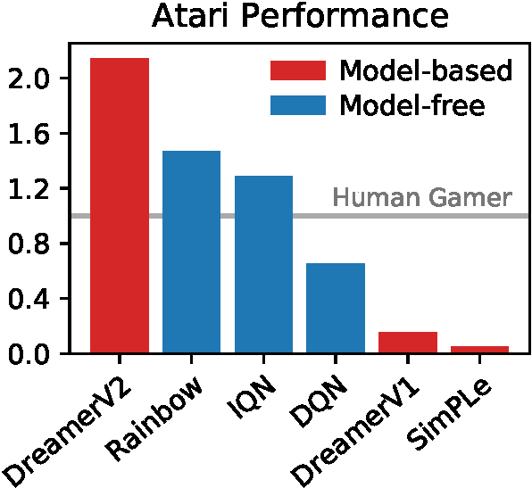
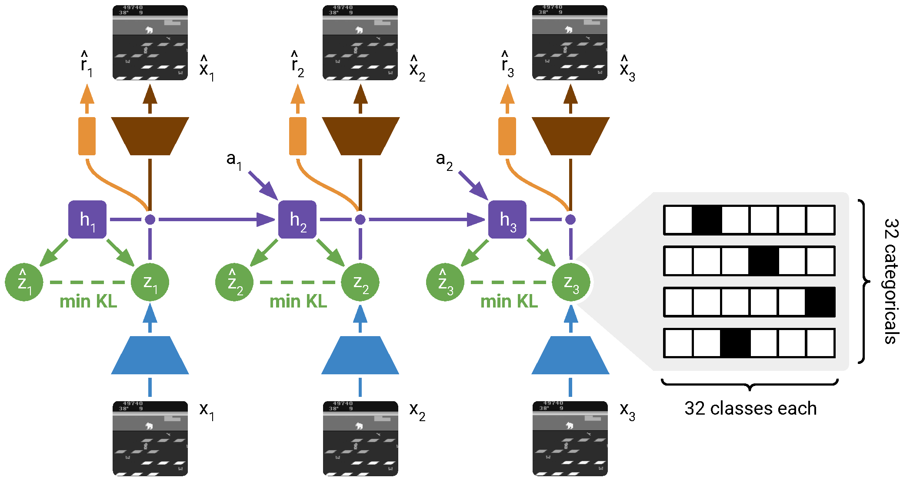
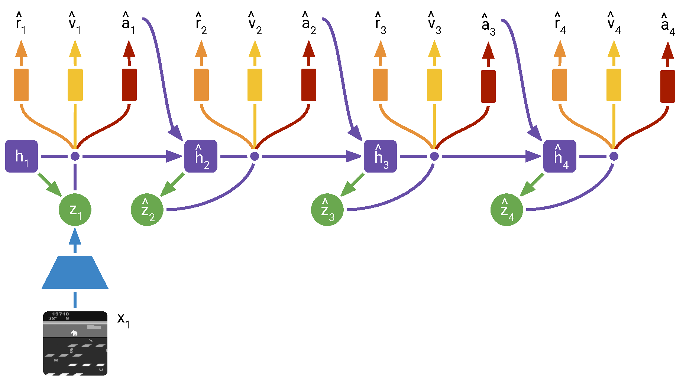
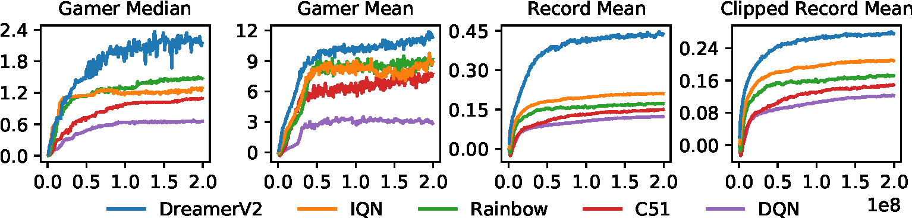
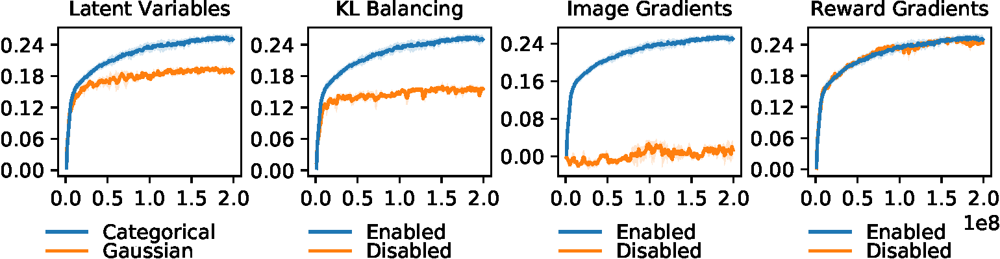

# DreamerV2：Mastering Atari with Discrete World Models

!!! info "论文信息"
    - 论文：`Mastering Atari with Discrete World Models`
    - 系统：`DreamerV2`
    - 链接：[arXiv:2010.02193](https://arxiv.org/abs/2010.02193)
    - 项目页：[danijar.com/dreamerv2](https://danijar.com/dreamerv2)
    - 关键词：DreamerV2、discrete world model、categorical latent、KL balancing、straight-through gradient、Atari、model-based RL

DreamerV2 是 [Dreamer](dreamer.md) 到 [DreamerV3](dreamerv3.md) 之间的关键版本。DreamerV1 已经证明了可以在 RSSM 的 latent imagination 中训练 actor-critic，但主要成功集中在连续控制。DreamerV2 把这条路线推进到 Atari 这种更成熟、更竞争激烈的离散动作视觉基准上。

这篇论文最重要的结论是：**一个单独训练的 world model，如果 latent dynamics 足够准确，也可以支撑 Atari 级别的 policy learning，而不只是服务连续控制或小规模视觉任务。**

## 论文位置

DreamerV2 的改动不大，但位置很重要。

| 阶段 | 代表 | 关键问题 | 核心变化 |
| --- | --- | --- | --- |
| Latent planning | PlaNet | 从像素学 world model 后怎么选动作 | CEM 在 latent space 在线规划 |
| Latent imagination | DreamerV1 | 如何避免每步规划成本 | 在 imagined trajectories 上训练 actor-critic |
| Discrete world model | DreamerV2 | world model 能否打 Atari | categorical latent、KL balancing、Atari policy gradients |
| Generalist world model RL | DreamerV3 | 如何跨域固定超参 | 更稳健的表示、reward/value 标定和训练 recipe |

DreamerV2 仍然属于交互轨迹驱动的 latent dynamics 世界模型路线。它不是从大规模视频生成模型出发，而是从 agent 收集到的 Atari 交互数据中学习：

```text
image x_t, action a_t, reward r_t, discount gamma_t
  -> discrete RSSM world model
  -> imagined latent trajectories
  -> actor-critic learning
  -> actor acts in real environment
```

{ width="520" }

<small>Figure source: `Mastering Atari with Discrete World Models`, Figure 1. 原论文图注要点：DreamerV2 在 55 个 sticky-action Atari games 的 gamer-normalized median score 上达到 human-level，并超过 Rainbow 和 IQN 等 single-GPU model-free baselines。</small>

## 核心问题

在 DreamerV2 之前，world model 路线在 Atari 上一直不够有说服力。原因有三点：

1. Atari 的视觉输入虽然低分辨率，但状态变化离散、非平滑，进入新房间、物体消失、敌人被击败等事件很难用连续 unimodal latent 表示。
2. Model-free Atari 方法已经非常成熟，DQN、Rainbow、IQN 形成了强基线，world model 必须在同等计算预算下比较。
3. 如果 learned dynamics 不够准，actor 会在 imagination 里学到模型漏洞，而不是可执行的游戏策略。

DreamerV2 的核心判断是：DreamerV1 的 Gaussian latent 对 Atari 这样的离散环境不是最合适。论文把 RSSM 的 stochastic state 换成多个 categorical variables，并配合 KL balancing，让 prior dynamics 更容易学准。

## 总体训练循环

DreamerV2 和 DreamerV1 的大框架一致：

```text
从环境收集 Atari 交互数据，写入 replay dataset
  -> 采样固定长度序列训练 world model
  -> 从 posterior states 启动 latent imagination
  -> actor 采样动作，RSSM prior rollout latent states
  -> reward/discount/critic 估计 lambda-return
  -> 更新 critic 和 actor
  -> actor 回到真实环境收集更多数据
```

区别在于 DreamerV2 面向 Atari 做了几个关键替换：

| Component | DreamerV1 | DreamerV2 |
| --- | --- | --- |
| Latent state | Gaussian stochastic latent | vector of categorical variables |
| Latent gradient | reparameterization | straight-through gradient |
| KL regularization | free nats | KL balancing |
| Action space | mostly continuous control | categorical action distribution for Atari |
| Actor gradient | dynamics backprop dominant in continuous control | Reinforce dominant for Atari |
| Exploration | external noise in continuous action | policy entropy regularization |

这说明 DreamerV2 不是简单把 DreamerV1 跑到 Atari 上，而是把 world model 表示、KL 训练方向和 policy gradient 估计都换成更适合离散环境的版本。

## World Model 训练

DreamerV2 的 world model 仍然是 RSSM，但随机状态不再是 Gaussian，而是多个 categorical variables。

{ width="920" }

<small>Figure source: `Mastering Atari with Discrete World Models`, Figure 2. 原论文图注要点：训练序列图像先由 CNN 编码；RSSM 维护 deterministic recurrent states \(h_t\)，每步计算看到当前图像的 posterior stochastic state \(z_t\)，以及不看当前图像、只靠历史预测的 prior stochastic state \(\hat z_t\)。DreamerV2 的 stochastic state 是多个 categorical variables，训练好的 prior 会在 imagination 中使用。</small>

!!! note "prior 和 posterior 为什么要分开看"
    图里的 posterior \(z_t\) 和 prior \(\hat z_t\) 是 DreamerV2 world model 的核心。训练时 posterior 可以看到当前真实图像 \(x_t\)，所以它负责把观测编码进 latent state；prior 不能看当前图像，只能根据历史 recurrent state 预测下一步 latent。推理和 imagination 时没有未来图像，因此真正被 rollout 使用的是 prior。

    KL loss 的作用就是让 prior 逐渐靠近 posterior：训练阶段借助真实观测校正状态，部署阶段靠 prior 自己往前想象。DreamerV2 把随机 latent 改成 categorical variables，是为了让 Atari 这类离散、事件驱动的环境更容易被 world model 表示。读这张图时要记住：posterior 是训练用的“带观测修正状态”，prior 是控制用的“无观测预测状态”。

### 数据与输入

world model 的训练数据来自 agent 不断增长的 replay dataset：

$$
(x_{1:T}, a_{1:T}, r_{1:T}, \gamma_{1:T})
$$

其中 \(x_t\) 是图像，\(a_t\) 是动作，\(r_t\) 是奖励，\(\gamma_t\) 是 discount factor。episode 内部 \(\gamma_t\) 等于固定超参，terminal step 设为 0。Atari 实验使用 sticky actions、action repeat 4、完整动作空间、单任务训练、每个游戏一个 agent。

论文特别强调 DreamerV2 不使用 frame stacking，因为 RSSM 的 recurrent state 会自己整合时间信息。原始 Atari 灰度图像为 \(84\times84\)，训练时下采样到 \(64\times64\)，以复用 DreamerV1 的卷积架构。

### 模型组件

DreamerV2 的 world model 包含：

$$
h_t = f_\phi(h_{t-1}, z_{t-1}, a_{t-1})
$$

$$
z_t \sim q_\phi(z_t \mid h_t, x_t)
$$

$$
\hat z_t \sim p_\phi(\hat z_t \mid h_t)
$$

$$
\hat x_t \sim p_\phi(\hat x_t \mid h_t,z_t)
$$

$$
\hat r_t \sim p_\phi(\hat r_t \mid h_t,z_t)
$$

$$
\hat\gamma_t \sim p_\phi(\hat\gamma_t \mid h_t,z_t)
$$

这里 \(q_\phi(z_t \mid h_t,x_t)\) 是 posterior，训练时能看到当前图像；\(p_\phi(\hat z_t \mid h_t)\) 是 prior，imagination 阶段只能用它往前 rollout。行为学习阶段不会生成图像，只使用 latent transition、reward predictor、discount predictor 和 critic。

### Discrete Latents

DreamerV2 的随机状态是 `32` 个 categorical variables，每个 categorical 有 `32` 个 classes。展平后相当于长度 `1024` 的 sparse binary vector，其中有 `32` 个 active bits。

这对 Atari 有几个潜在优势：

| 可能原因 | 解释 |
| --- | --- |
| 多模态 prior 更容易拟合 | mixture of categoricals 仍是 categorical，Gaussian prior 很难拟合多峰 posterior |
| 离散事件更匹配 | Atari 中进房间、物体消失、敌人被击败等状态跳变天然离散 |
| 稀疏表示有助泛化 | 32-of-1024 sparse binary representation 可能比 dense Gaussian 更适合游戏状态 |
| straight-through 优化更稳定 | 论文推测 ST estimator 忽略某些会缩放梯度的项，可能缓解梯度爆炸或消失 |

categorical sample 用 straight-through gradient 训练。实现思想是：forward 用 one-hot sample，backward 用 softmax probabilities 的梯度。

```text
sample = one_hot(draw(logits))
probs  = softmax(logits)
sample = sample + probs - stop_grad(probs)
```

这个技巧让离散 latent 在 forward 上保持离散，同时让自动微分系统把梯度传回 logits。

### World Model Loss

DreamerV2 联合训练 image predictor、reward predictor、discount predictor、transition predictor 和 representation model：

$$
\mathcal{L}(\phi)
=
\mathbb{E}_{q_\phi(z_{1:T}\mid a_{1:T},x_{1:T})}
\left[
\sum_{t=1}^{T}
-
\ln p_\phi(x_t\mid h_t,z_t)
-
\ln p_\phi(r_t\mid h_t,z_t)
-
\ln p_\phi(\gamma_t\mid h_t,z_t)
+
\beta\mathrm{KL}
\left[
q_\phi(z_t\mid h_t,x_t)
\|
p_\phi(z_t\mid h_t)
\right]
\right]
$$

各项作用如下：

| Loss term | Trains | Why it matters |
| --- | --- | --- |
| image log loss | visual representation | 让 latent state 学到一般环境状态，不只对已见 reward 过拟合 |
| reward log loss | reward prediction | 支撑 imagination 中的 return estimate |
| discount log loss | termination / continuation | 让 imagined rollout 能软处理 episode ends |
| KL loss | prior and posterior alignment | 让 prior 在没有未来图像时能预测 posterior |

论文的消融非常明确：image gradients 对 world model 至关重要；reward gradients 不是必须，甚至停止 reward gradients 在一些任务上更好。这和 MuZero 类只靠 reward/value/policy 学任务特定 representation 的路线不同。DreamerV2 更强调从图像重建信号中学习一般环境状态。

### KL Balancing

标准 KL 同时做两件事：

1. 训练 prior 逼近 posterior；
2. 正则 posterior 不要偏离 prior 太多。

问题是训练早期 prior 很弱，如果 KL 直接强压 posterior，posterior 可能为了贴近差 prior 而丢掉图像信息。DreamerV2 用 KL balancing 改变梯度方向权重：

$$
\alpha\cdot
\mathrm{KL}
\left[
\operatorname{sg}(q_\phi(z_t\mid h_t,x_t))
\|
p_\phi(z_t\mid h_t)
\right]
+
(1-\alpha)\cdot
\mathrm{KL}
\left[
q_\phi(z_t\mid h_t,x_t)
\|
\operatorname{sg}(p_\phi(z_t\mid h_t))
\right]
$$

Atari 中 \(\alpha=0.8\)。这相当于更快训练 prior，而不是主要通过增加 posterior entropy 来降低 KL。论文消融显示，KL balancing 对整体 Atari 表现贡献很大。

## Behavior Learning

DreamerV2 在 world model 的 latent space 中训练 actor 和 critic。world model 在 behavior learning 阶段固定，不让 actor/value gradients 改写 representation。这样做的原因很实际：world model 应该先成为相对稳定的 environment surrogate，否则 actor 和 dynamics 会互相追逐。

{ width="920" }

<small>Figure source: `Mastering Atari with Discrete World Models`, Figure 3. 原论文图注要点：训练好的 world model 用于在 compact latent space 中想象 trajectories；trajectory 从 model training 中计算出的 posterior states 出发，由 actor 采样动作并通过 prior rollout，critic 预测每个 state 的未来 reward sum。actor 可用 Reinforce、straight-through dynamics gradients 或两者组合训练。</small>

### Imagination MDP

imagined trajectory 从 world model 训练阶段得到的 posterior model state 出发。之后模型不再看真实图像：

$$
\hat a_t \sim p_\psi(\hat a_t\mid \hat z_t)
$$

$$
\hat z_{t+1}\sim p_\phi(\hat z_{t+1}\mid \hat z_t,\hat a_t)
$$

$$
\hat r_{t+1}\sim p_\phi(\hat r_{t+1}\mid \hat z_{t+1})
$$

$$
\hat\gamma_{t+1}\sim p_\phi(\hat\gamma_{t+1}\mid \hat z_{t+1})
$$

论文指出，DreamerV2 在单 GPU 上可以并行模拟约 `2500` 条 latent trajectories。因为 behavior learning 不生成图像，计算主要发生在 compact latent state 上。

### Critic

critic 预测从当前 imagined latent state 出发的 expected future rewards：

$$
v_\xi(\hat z_t)
\approx
\mathbb{E}_{p_\phi,p_\psi}
\left[
\sum_{\tau\ge t}
\hat\gamma^{\tau-t}\hat r_\tau
\right]
$$

目标使用 \(\lambda\)-target：

$$
V^\lambda_t
=
\hat r_t
+
\hat\gamma_t
\begin{cases}
(1-\lambda)v_\xi(\hat z_{t+1})+\lambda V^\lambda_{t+1} & t < H \\
v_\xi(\hat z_H) & t=H
\end{cases}
$$

critic 用 squared loss 回归 stop-gradient target，并使用 slow critic target network，每 100 个 gradient steps 更新一次。这一点相比 DreamerV1 更像常规 deep RL 稳定化技巧。

### Actor

DreamerV2 的 Atari actor 输出 categorical action distribution。actor loss 混合三类信号：

| Component | Meaning |
| --- | --- |
| Reinforce | unbiased but high-variance policy gradient |
| dynamics backprop | biased but low-variance straight-through gradient through world model |
| entropy regularizer | 鼓励可行位置的探索，同时允许需要精确动作时降低熵 |

论文最终设置对 Atari 很明确：`Reinforce only` 效果最好，因此使用 \(\rho=1\)、\(\eta=10^{-3}\)。对于 continuous control，情况相反，dynamics backprop 更好，因此设置 \(\rho=0\)。

这点很关键：DreamerV2 并没有教条地坚持“所有 actor 梯度都穿过 dynamics”。在离散 Atari 上，straight-through dynamics gradient 有偏，单独使用表现差；Reinforce 虽然方差高，但更适合最终 Atari policy optimization。

## 训练超参

论文给出的 Atari hyper parameters 如下，字段和值保留原格式。

| Name | Symbol | Value |
| --- | --- | --- |
| World Model |  |  |
| Dataset size (FIFO) | --- | \(2\cdot10^6\) |
| Batch size | \(B\) | 50 |
| Sequence length | \(L\) | 50 |
| Discrete latent dimensions | --- | 32 |
| Discrete latent classes | --- | 32 |
| RSSM number of units | --- | 600 |
| KL loss scale | \(\beta\) | 0.1 |
| KL balancing | \(\alpha\) | 0.8 |
| World model learning rate | --- | \(2\cdot10^{-4}\) |
| Reward transformation | --- | \(\operatorname{tanh}\) |
| Behavior |  |  |
| Imagination horizon | \(H\) | 15 |
| Discount | \(\gamma\) | 0.995 |
| \(\lambda\)-target parameter | \(\lambda\) | 0.95 |
| Actor gradient mixing | \(\rho\) | 1 |
| Actor entropy loss scale | \(\eta\) | \(1\cdot10^{-3}\) |
| Actor learning rate | --- | \(4\cdot10^{-5}\) |
| Critic learning rate | --- | \(1\cdot10^{-4}\) |
| Slow critic update interval | --- | 100 |
| Common |  |  |
| Policy steps per gradient step | --- | 4 |
| MPL number of layers | --- | 4 |
| MPL number of units | --- | 400 |
| Gradient clipping | --- | 100 |
| Adam epsilon | \(\epsilon\) | \(10^{-5}\) |
| Weight decay (decoupled) | --- | \(10^{-6}\) |

<small>表源：`Mastering Atari with Discrete World Models`，Appendix hyperparameters table。原论文表格要点：该表列出 DreamerV2 Atari 实验的 world model、behavior learning 和 common 超参；关键设置包括 `32 x 32` categorical latent、KL balancing \(\alpha=0.8\)、imagination horizon `15`、actor gradient mixing \(\rho=1\) 和 FIFO replay size \(2\cdot10^6\)。</small>

这些超参说明 DreamerV2 的训练重心很清楚：

1. world model 需要足够大的 discrete latent 容量；
2. prior learning 通过 KL balancing 被重点强化；
3. actor 在 Atari 上主要靠 Reinforce，而不是 dynamics backprop；
4. replay dataset 用 FIFO 限制到 \(2\cdot10^6\)，避免无限增长；
5. imagined states 数量远大于真实环境输入数量，论文报告 200M environment steps 中从 world model imagination 学习了 468B compact states。

## 实验结果

DreamerV2 在 55 个 Atari games 上评估，使用 sticky actions、200M environment steps、单 GPU、单 environment instance。论文把 DreamerV2 和 IQN、Rainbow、C51、DQN 对比。

{ width="920" }

<small>Figure source: `Mastering Atari with Discrete World Models`, Figure 4. 原论文图注要点：该图展示 200M steps 的 Atari 表现，并比较四种聚合指标。论文认为 gamer median 和 gamer mean 都可能被特定任务分布扭曲，因此推荐 clipped record normalized mean 作为更稳健的 Atari 汇总指标。</small>

Table 1 reports Atari performance at 200M steps.

| Agent | Gamer Median | Gamer Mean | Record Mean | Clipped Record Mean |
| --- | ---: | ---: | ---: | ---: |
| DreamerV2 | 2.15 | 11.33 | 0.44 | 0.28 |
| DreamerV2 (schedules) | 2.64 | 10.45 | 0.43 | 0.28 |
| IQN | 1.29 | 8.85 | 0.21 | 0.21 |
| Rainbow | 1.47 | 9.12 | 0.17 | 0.17 |
| C51 | 1.09 | 7.70 | 0.15 | 0.15 |
| DQN | 0.65 | 2.84 | 0.12 | 0.12 |

<small>表源：`Mastering Atari with Discrete World Models`，Table 1。原论文表格要点：该表用 gamer-normalized、record-normalized 和 clipped record-normalized 指标比较 DreamerV2 与 IQN、Rainbow、C51、DQN；DreamerV2 在 200M steps、单 GPU 设置下整体超过这些 model-free baseline。</small>

这张表支持三个结论。第一，DreamerV2 在四种聚合指标上都超过 model-free single-GPU baselines。第二，DreamerV2 schedules 可以提高 gamer median，但 clipped record mean 没变，所以论文主结果没有依赖复杂 schedule。第三，不同聚合方式会改变算法相对差距，因此论文建议用 clipped record mean 避免少数超高分游戏主导平均值。

## 消融实验

DreamerV2 的消融结果很适合理解“world model 到底靠什么训练成功”。

{ width="920" }

<small>Figure source: `Mastering Atari with Discrete World Models`, Figure 5. 原论文图注要点：该图展示 DreamerV2 的主要消融，包括 categorical vs Gaussian latent variables、KL balancing、image gradients 和 reward gradients。结果突出 categorical latents、KL balancing 和 image gradients 的重要性。</small>

Table 2 reports ablations to DreamerV2 measured by Atari performance at 200M frames.

| Agent | Gamer Median | Gamer Mean | Record Mean | Clipped Record Mean |
| --- | ---: | ---: | ---: | ---: |
| DreamerV2 | 1.64 | 11.33 | 0.36 | 0.25 |
| No Layer Norm | 1.66 | 5.95 | 0.38 | 0.25 |
| No Reward Gradients | 1.68 | 6.18 | 0.37 | 0.24 |
| No Discrete Latents | 1.08 | 3.71 | 0.24 | 0.19 |
| No KL Balancing | 0.84 | 3.49 | 0.19 | 0.16 |
| No Policy Reinforce | 0.69 | 2.74 | 0.16 | 0.15 |
| No Image Gradients | 0.04 | 0.31 | 0.01 | 0.01 |

<small>表源：`Mastering Atari with Discrete World Models`，Table 2。原论文表格要点：该表通过移除 layer norm、reward gradients、discrete latents、KL balancing、policy Reinforce 和 image gradients 来定位 DreamerV2 的关键设计；`No Image Gradients` 和 `No KL Balancing` 的明显退化说明视觉重建与 prior/posterior 对齐对 Atari world model 训练很重要。</small>

这张表的含义非常直接：

| Ablation | Interpretation |
| --- | --- |
| No Discrete Latents | categorical latent 是 Atari 表现提升的核心来源之一 |
| No KL Balancing | prior dynamics 学不准会直接伤害 imagination policy learning |
| No Policy Reinforce | Atari actor 主要依赖 Reinforce，而不是纯 dynamics backprop |
| No Image Gradients | world model 不能只靠 reward，图像重建提供了关键 representation signal |
| No Reward Gradients | reward-specific representation 不是必须，停止 reward gradients 几乎不伤害 clipped record mean |

最有启发的是 `No Image Gradients` 和 `No Reward Gradients` 的对比。DreamerV2 不是靠 reward 把 latent state 变成 task-specific representation，而是靠 image reconstruction 学一般环境状态，再在 latent imagination 中学习 policy。这个结论也解释了为什么 DreamerV2 和 MuZero 的世界模型训练哲学不同。

## 和 MuZero / SimPLe 的关系

论文还给出 conceptual comparison，字段和值保留原格式。

| Algorithm | Reward Modeling | Image Modeling | Latent Transitions | Single GPU | Trainable Parameters | Atari Frames | Accelerator Days |
| --- | --- | --- | --- | --- | --- | --- | --- |
| DreamerV2 | ✓ | ✓ | ✓ | ✓ | 22M | 200M | 10 |
| SimPLe | ✓ | ✓ | ✗ | ✓ | 74M | 4M | 40 |
| MuZero | ✓ | ✗ | ✓ | ✗ | 40M | 20B | 80 |
| MuZero Reanalyze | ✓ | ✗ | ✓ | ✗ | 40M | 200M | 80 |

<small>表源：`Mastering Atari with Discrete World Models`，conceptual comparison table。原论文表格要点：该表把 DreamerV2、SimPLe、MuZero 和 MuZero Reanalyze 按 reward modeling、image modeling、latent transitions、单 GPU 可训练性、参数量、Atari frames 和 accelerator days 对齐比较，用来说明 DreamerV2 处在 image-trained latent world model 路线。</small>

这个表很适合用来区分三条路线：

| Route | Representative | Key idea |
| --- | --- | --- |
| Full image world model | SimPLe | 在像素或图像空间建模环境，但效率和长期误差压力大 |
| Task-specific latent model | MuZero | 学 reward/value/policy 相关 latent dynamics，不做 image reconstruction |
| General image-trained latent world model | DreamerV2 | 用图像重建训练一般 latent state，再用 latent transitions 学 policy |

DreamerV2 的路线介于两者之间。它不像 SimPLe 那样在行为学习中依赖图像生成，也不像 MuZero 那样只从 reward/value/policy 信号学任务特定模型。它用图像预测塑造 latent representation，但 actor-critic 学习只在 compact latent space 中发生。

## 和 DreamerV3 的关系

DreamerV3 可以看作把 DreamerV2 的一些经验推广成更通用的跨域 recipe：

| Design | DreamerV2 | DreamerV3 |
| --- | --- | --- |
| Latent type | categorical latent | categorical latent 继续保留 |
| KL training | KL balancing | 拆成 dynamics / representation losses，并配合 free bits |
| Reward scale | tanh reward for Atari | symlog + twohot 处理跨域数值尺度 |
| Value learning | scalar critic with target network | distributional critic / twohot return target |
| Goal | solve Atari competitively | fixed hyperparameters across many domains |

所以 DreamerV2 的价值不只是 Atari 分数，而是证明了 discrete latent world model 是一条可行路线。DreamerV3 后续把这条路线从 Atari 扩展到更多环境，并解决跨域稳定性问题。

## 局限与风险

DreamerV2 仍有清楚的边界。

1. 单任务训练。每个 Atari game 都训练独立 agent，不是一个多任务或通用 Atari world model。
2. 仍依赖大量环境步数。200M environment steps 和 10 天单 V100 不是小成本，只是相对 MuZero 这类设置更可复现。
3. reconstruction loss 可能忽略关键小物体。论文特别提到 Video Pinball，关键 ball 只有一个像素，图像重建未必强迫 latent 表示关注它。
4. Atari actor 使用 Reinforce 为主，说明通过离散 world model 直接 dynamics backprop 训练 policy 仍有偏差问题。
5. 视觉世界复杂度仍有限。Atari 远不是开放真实世界，DreamerV2 不能直接代表视频世界模型路线。

## 阅读结论

DreamerV2 最值得记住的是三点：

1. categorical latent variables 是让 RSSM 更适合 Atari 离散动态的关键改动；
2. KL balancing 让 prior dynamics 更快追上 posterior，直接服务 imagination rollout；
3. image reconstruction gradients 对 world model representation 至关重要，而 reward gradients 不是核心。

一句话总结：DreamerV2 证明了交互轨迹驱动的 latent dynamics 世界模型不仅能做连续控制，也能在 Atari 这种强基准上训练出竞争力 policy。它把 DreamerV1 的 latent imagination actor-critic 推进到离散状态、离散动作和强 model-free baseline 对抗的阶段，为 DreamerV3 的通用化 recipe 铺好了路。
