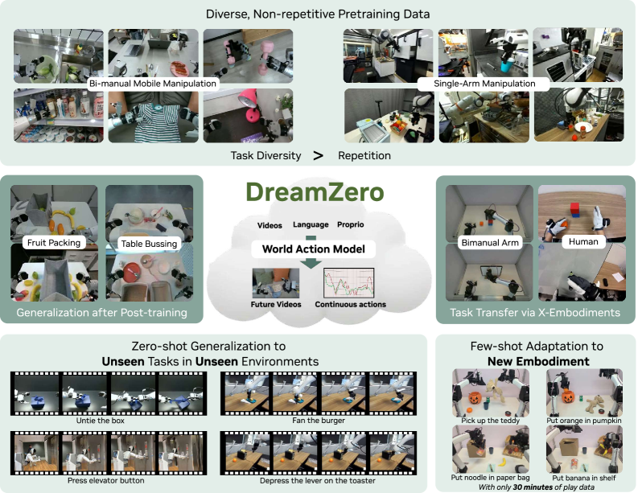
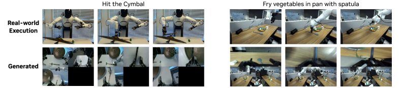
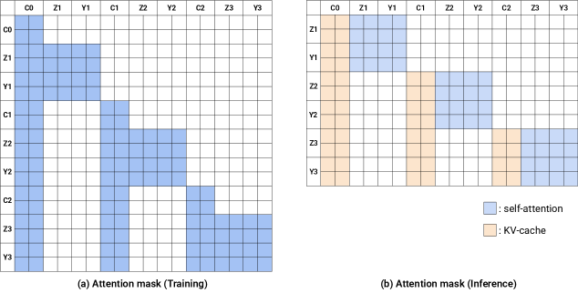
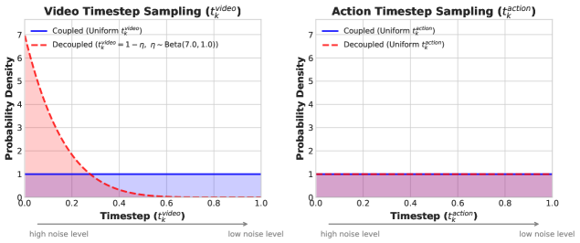
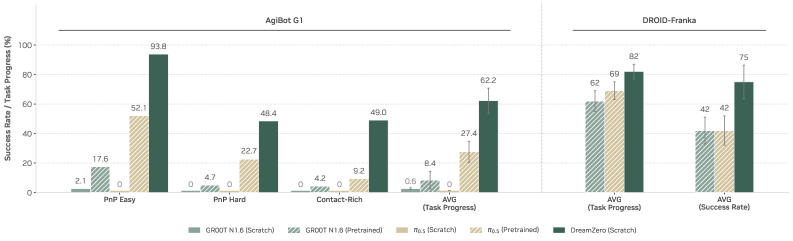
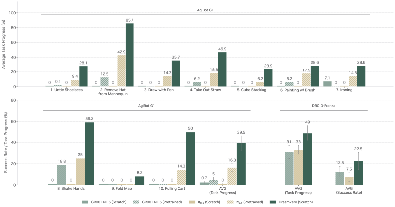
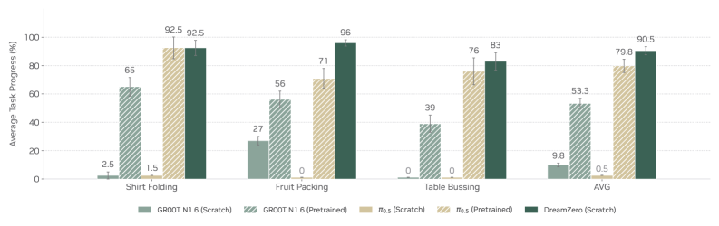
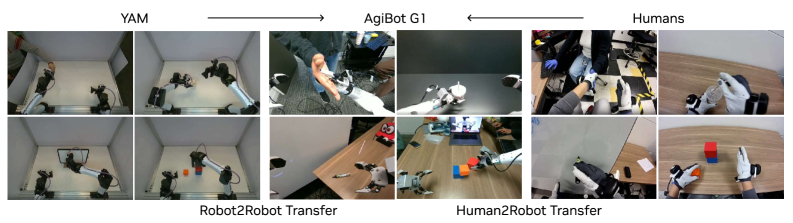
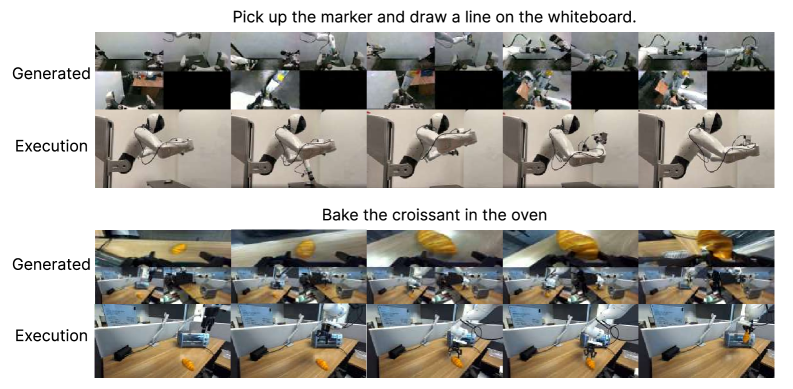

# DreamZero：World Action Models are Zero-shot Policies

!!! info "论文信息"
    - 论文：`World Action Models are Zero-shot Policies`
    - 系统：`DreamZero`
    - 链接：[arXiv:2602.15922](https://arxiv.org/abs/2602.15922)
    - 项目页：[dreamzero0.github.io](https://dreamzero0.github.io/)
    - 代码：[GitHub](https://github.com/dreamzero0/dreamzero)
    - 关键词：World Action Model、video-action prediction、robot policy、autoregressive DiT、real-time control、cross-embodiment transfer

这篇论文很适合接在 [LingBot-World](lingbot-world.md) 后面读。LingBot-World 更像“从视频生成模型出发的视觉世界模拟器”；DreamZero 则进一步问：如果模型同时预测未来视频和动作，世界模型本身能不能直接成为机器人 policy？

它的核心观点可以概括为一句话：

> World Action Model 不只是模拟器，也可以是 zero-shot policy。

## 论文位置

DreamZero 位于 `video world model`、`WAM` 和 `robot policy` 的交叉处。它不是经典 Dreamer 那种只在 latent state 中预测 reward 和 continuation 的 model-based RL，也不是普通 VLA 那种直接从视觉语言映射到动作。

它采用的是：

```text
video foundation model
  -> joint video-action prediction
  -> autoregressive WAM
  -> closed-loop robot policy
```

所以它比 LingBot-World 更靠近机器人执行，比传统 VLA 更强调未来视频和动作的一致性。它的训练目标不是只回答“我该做什么动作”，而是同时回答：

1. 未来画面会怎样变化；
2. 为了产生这样的未来，动作应该是什么；
3. 生成的视频和动作是否对齐。

{ width="920" }

<small>Figure source: `World Action Models are Zero-shot Policies`, Figure 1. 原论文图注要点：该图概览 WAM 通过联合预测视频和动作继承世界物理先验，从而支持异质数据学习、开放世界泛化、跨具身迁移和少样本新机器人适配。</small>

## 核心问题

传统 VLA 通常学习：

$$
\pi(a_t \mid o_{\le t}, q_t, c),
$$

其中 \(o\) 是视觉观测，\(q\) 是 proprioceptive state，\(c\) 是语言指令。这个形式直接预测动作，但它没有显式学习未来世界状态，因此很难充分利用高度异质、非重复的机器人数据。

DreamZero 则学习 joint video-action distribution：

$$
\pi_0(o_{l:l+H}, a_{l:l+H} \mid o_{0:l}, c, q_l).
$$

论文把它拆成两个互相耦合的部分：

$$
\pi_0(o_{l:l+H} \mid o_{0:l}, c, q_l)
\cdot
\pi_0(a_{l:l+H} \mid o_{0:l+H}, q_l).
$$

第一项像视频预测，第二项像 inverse dynamics model。DreamZero 的选择不是训练两个模型，而是用一个端到端模型联合预测视频和动作。论文认为这样能让动作和未来视觉变化更深地对齐。

{ width="920" }

<small>Figure source: `World Action Models are Zero-shot Policies`, Figure 2. 原论文图注要点：该图展示 DreamZero 同时生成未来视频和动作，并强调预测动作与生成视频在未见任务上保持对齐。</small>

## 方法结构

DreamZero 使用 Wan2.1-I2V-14B-480P 作为视频扩散 backbone。为了保留视频模型的泛化能力，论文只加入少量机器人相关模块：state encoder、action encoder 和 action decoder。

整体输入包括：

1. visual context：由 VAE 编码；
2. language instruction：由 text encoder 编码；
3. proprioceptive state：由 state encoder 编码；
4. noisy video latents 和 noisy action latents。

输出包括：

1. future video frames；
2. future action chunks。

{ width="920" }

<small>Figure source: `World Action Models are Zero-shot Policies`, Figure 4. 原论文图注要点：该图展示 DreamZero 架构，视觉上下文、语言指令和本体状态进入自回归 DiT；训练时联合去噪视频和动作 latent，推理时用真实观测回写 KV cache 降低误差累积。</small>

这张图有两个重点。第一，训练阶段模型同时 denoise video 和 action latent，而不是把视频预测和动作预测拆开。第二，推理阶段使用 closed-loop feedback：执行一个 action chunk 后，把真实观测重新写回 KV cache，替换掉模型自己预测的视频，以减少误差累积。

## WAM 训练细节

DreamZero 的训练可以理解成：把 image-to-video diffusion model 改造成 joint video-action flow matching model。它不是在视频模型旁边简单挂一个 action head，而是让 video latent 和 action latent 在同一个 DiT 主干里联合去噪。

### 训练样本如何切块

论文把一条机器人轨迹切成多个 chunk。每个 chunk 包含固定数量的视频 latent frames 和对应的 action horizon。

关键设置如下：

1. 每个 chunk 默认包含 \(K=2\) 个 latent frames；
2. 默认使用 \(M=4\) 个 chunks；
3. AgiBot 视频按 5 FPS 采样，动作按 30Hz 采样；
4. AgiBot action horizon 为 \(H=48\)，所以每个 chunk 覆盖 1.6 秒；
5. DROID 视频同样按 5 FPS 采样，动作按 15Hz 采样；
6. DROID action horizon 为 \(H=24\)，同样覆盖 1.6 秒；
7. 最大 context 为 8 个 latent frames，对应约 33 个 raw frames，约 6.6 秒视觉上下文。

这些数字很重要，因为它说明 DreamZero 当前仍是短上下文 WAM。它能做 real-time policy，但还不是分钟级长记忆世界模型；长时任务仍需要外部 planner 或更长 context。

### Flow matching 目标

DreamZero 沿用视频扩散/flow matching 训练范式，但把训练对象从 video latent 扩展到 video-action latent。

对第 \(k\) 个 chunk，设 clean video latent 为 \(z_1^k\)，clean normalized action 为 \(a_1^k\)，随机噪声为 \(z_0^k, a_0^k\)。在 timestep \(t\) 上插值得到：

$$
z_t^k = t_{vid} z_1^k + (1 - t_{vid}) z_0^k,
$$

$$
a_t^k = t_{act} a_1^k + (1 - t_{act}) a_0^k.
$$

模型输入是 \([z_t^k, a_t^k]\)，条件包括 clean previous chunks、language instruction、proprioceptive state 和 timestep。目标是预测从 noise 到 clean 的 velocity：

$$
v^k = [z_1^k, a_1^k] - [z_0^k, a_0^k].
$$

训练损失是 velocity matching：

$$
\mathcal{L} = \| v_{\text{pred}} - v^k \|^2.
$$

从世界模型角度看，这个目标有两层含义。视频部分学习“未来世界长什么样”，动作部分学习“与该未来一致的动作是什么”。二者共享 DiT 主干，因此动作不是独立 BC head，而是和未来视觉变化绑定在一起。

### Teacher forcing 和自回归训练

训练时，DreamZero 使用 clean previous chunks 作为上下文，让模型 denoise 当前 chunk。这类似语言模型训练中的 teacher forcing：

```text
clean history chunks
  + noisy current video/action chunk
  + language/state condition
  -> velocity of current video/action chunk
```

推理时则变成 autoregressive loop：模型根据当前真实观测和 KV cache 生成下一段 video-action chunk；机器人执行动作后，系统把新的真实观测写回上下文，替代模型预测帧。

这个设计解决了一个关键矛盾：如果完全依赖自己生成的视频，误差会累积；如果完全只预测动作，又失去世界模型目标。DreamZero 的折中是“训练时联合预测视频和动作，部署时用真实观测刷新世界状态”。

### 动作、状态和多视角如何进入模型

DreamZero 只对视频 foundation model 做最小结构改造。论文新增：

1. state encoder：编码 proprioceptive state；
2. action encoder：把 action 变成可与 latent 对齐的表示；
3. action decoder：从 DiT 输出解码 action chunk。

对于多视角机器人数据，论文没有改 backbone，而是把多视角拼接成单帧输入。这是一个很工程化的选择：它牺牲了一部分结构优雅性，但避免重新设计视频模型架构，最大程度复用预训练视频模型。

### 哪些参数更新，哪些冻结

DreamZero 的 pretraining 不是只训练 adapter。论文使用 Wan2.1-I2V-14B-480P 作为 backbone，并更新：

1. all DiT blocks；
2. state encoder；
3. action encoder；
4. action decoder。

同时冻结：

1. text encoder；
2. image encoder；
3. VAE。

这个选择和 LingBot-World 的 action adapter 微调不同。DreamZero 要把视频模型改造成真正的 robot WAM，因此需要更新 DiT 主干来学习 video-action alignment；但仍冻结编码器和 VAE，以保留基础视觉/语言表示和 latent 空间稳定性。

### DreamZero-Flash 的训练差异

标准 DreamZero 对 video 和 action 使用 coupled timestep，也就是 \(t_{vid}=t_{act}\)。这样训练初期收敛更快，因为两个模态处于同一噪声尺度。

DreamZero-Flash 则使用 decoupled noise schedule：

1. \(t_{vid} \sim \mathrm{Beta}(7,1)\)，让视频更偏向 high-noise states；
2. \(t_{act} \sim \mathcal{U}(0,1)\)，动作仍保持 uniform。

这背后的动机是：实时 policy 最需要 clean action，未必需要每一步都生成高质量 clean video。通过让模型从更 noisy 的 visual context 中预测动作，DreamZero-Flash 可以用更少 denoising steps 保留较强动作质量。

## 为什么采用 autoregressive WAM

论文专门比较了 bidirectional 和 autoregressive WAM。DreamZero 选择 autoregressive，原因主要有三个：

1. 可以用 KV cache 加速推理；
2. 能保留原始视频帧率，减少 video-action-language 对齐问题；
3. 在闭环控制中，每次真实观测回来后可以刷新上下文，降低视频预测误差向后传播。

这点和 LingBot-World 的因果化思路相似，但落点不同。LingBot 是为了让视觉模拟器流式生成未来；DreamZero 是为了让 WAM 成为可执行 policy。

{ width="860" }

<small>Figure source: `World Action Models are Zero-shot Policies`, Figure 14. 原论文图注要点：该图说明 DreamZero 的注意力策略，训练时当前视频与动作 token 可看历史条件帧，推理时先缓存条件帧 KV，再拼接生成动作和未来帧，并用真实观测替换推理上下文。</small>

## 实时执行

视频扩散模型直接做机器人 policy 会遇到一个硬约束：机器人控制需要几十毫秒到几百毫秒级反应，而原始 14B DiT 多步扩散很慢。

论文将问题称为 `reactivity gap`。朴素实现需要约 5.7 秒生成一个 action chunk，无法闭环控制。DreamZero 用三层优化把它推进到实时：

1. system-level：asynchronous execution、CFG parallelism、DiT caching；
2. implementation-level：torch.compile、CUDA Graphs、kernel/scheduler optimizations、NVFP4 quantization；
3. model-level：DreamZero-Flash，用 decoupled noise schedules 减少 denoising step。

Table 1 reports cumulative inference speedups, where each row includes all optimizations above it.

| Optimization | H100 | GB200 |
| --- | --- | --- |
| Baseline | 1× | 1.1× |
| System-level + CFG Parallelism | 1.9× | 1.8× |
| + DiT Caching | 5.5× | 5.4× |
| Implementation-level + Torch Compile + CUDA Graphs | 8.9× | 10.9× |
| + Kernel & Scheduler Opts. | 9.6× | 14.8× |
| + Quantization (NVFP4) | — | 16.6× |
| Model-level + DreamZero-Flash | — | 38× |

<small>表源：`World Action Models are Zero-shot Policies`，Table 1。原论文表格要点：该表按累积优化顺序报告 DreamZero 推理加速，从 system-level CFG parallelism、DiT caching，到 torch compile/CUDA Graphs、kernel scheduler、NVFP4 量化和 DreamZero-Flash；核心结论是仅靠系统优化不够，模型级少步化才把 GB200 上速度推到 `38×`。</small>

{ width="860" }

<small>Figure source: `World Action Models are Zero-shot Policies`, Figure 5. 原论文图注要点：该图对比 coupled 与 decoupled noise schedules，DreamZero-Flash 让视频更偏高噪声、动作保持均匀噪声，从而训练模型在 noisy visual context 下预测 clean actions。</small>

DreamZero-Flash 的关键是 decoupled noise schedule：动作噪声保持 uniform，视频噪声偏向 high-noise states。直觉是让模型从 noisy visual context 中预测 clean actions，从而在少步 denoising 下保住动作质量。

Table 3 reports DreamZero-Flash evaluation on table bussing with different denoising steps.

| Method | Denoising steps | Task Progress | Inference speed | Speed up |
| --- | --- | --- | --- | --- |
| DreamZero | 4 | 83% ± 6.1% | 350ms | 1 |
| DreamZero | 1 | 52% ± 10.2% | 150ms | 2.33× |
| DreamZero-Flash | 1 | 74% ± 10.1% | 150ms | 2.33× |

<small>表源：`World Action Models are Zero-shot Policies`，Table 3。原论文表格要点：该表比较 DreamZero 与 DreamZero-Flash 在 table bussing 上的 denoising steps、task progress 和 inference speed；DreamZero-Flash 用 1-step 推理把延迟降到 `150ms`，同时比普通 1-step DreamZero 明显保住更多任务进展。</small>

## 数据与训练配置

DreamZero 的数据策略和很多 VLA 不同。VLA 常依赖结构化、重复性强的 task-focused demonstrations；DreamZero 则强调 diverse, non-repetitive data，因为 WAM 的 video-action objective 可以利用异质数据里的动态信息。

论文使用两类机器人数据：

1. AgiBot G1：约 500 小时 teleoperation data，覆盖 22 个真实环境，包括 homes、restaurants、supermarkets、coffee shops 和 offices；
2. DROID-Franka：用于验证 WAM 在公开异质机器人数据上的有效性和可复现性。

训练设置包括：

1. backbone：Wan2.1-I2V-14B-480P；
2. AgiBot pretraining：100K steps，global batch size 128；
3. DROID pretraining：100K steps，global batch size 128；
4. 更新 DiT blocks、state encoder、action encoder 和 action decoder；
5. 冻结 text encoder、image encoder 和 VAE；
6. 默认动作表示为 relative joint positions。

这里的训练目标和普通 VLA 的差异在于，VLA 只需要从当前观测和语言中回归动作，而 DreamZero 的每个训练样本都要求模型同时解释未来视觉和未来动作。论文认为这使模型能从更异质的数据中学习，因为即使动作标签本身很 noisy，未来视频仍然提供了动作后果的监督。

Post-training 阶段用于验证 WAM 是否能在具体任务上继续提升。论文收集了三类 downstream task 数据：

| Task | Data | Goal |
| --- | --- | --- |
| Shirt folding | 33 hrs | Fold a flattened t-shirt through 5 sequential stages |
| Fruit packing | 12 hrs | Pack 10 fruits from a table into a bag |
| Table bussing | 40 hrs | Clear trash and dishware into target bins |

每个任务 post-train 50K steps，参数更新策略和 pretraining 一致：更新除 text encoder、image encoder 和 VAE 以外的参数。

## 主要实验结论

论文主结果围绕四个问题展开。

第一，WAM 是否更适合从 diverse, non-repetitive data 中学习。Figure 8 显示 DreamZero 在 seen tasks 的 zero-shot environment / unseen object 设置下明显优于 VLA baselines。论文报告 AgiBot G1 上 DreamZero 平均 task progress 为 62.2%，高于最强 pretrained VLA baseline 的 27.4%。

{ width="920" }

<small>Figure source: `World Action Models are Zero-shot Policies`, Figure 8. 原论文图注要点：该图展示 seen task evaluation，DreamZero 能从多样数据中学习并泛化到新环境，在各任务类别上优于 VLA baselines。</small>

第二，WAM 是否能泛化到 unseen tasks。Figure 9 覆盖 10 个训练中不存在的任务，包括 untying shoelaces、ironing、painting with a brush 和 shaking hands。论文报告 AgiBot G1 上 DreamZero 达到 39.5% average task progress，高于 pretrained VLA baseline 的 16.3%。在 DROID-Franka 上，DreamZero 也高于 GR00T N1.6 和 π0.5 baselines。

{ width="920" }

<small>Figure source: `World Action Models are Zero-shot Policies`, Figure 9. 原论文图注要点：该图展示 unseen task 的 zero-shot generalization，DreamZero 在训练未出现的 10 个任务上取得非平凡进展，而 VLA 在两种具身上都更困难。</small>

第三，WAM 是否能保留 post-training 后的泛化能力。Figure 10 显示，在 shirt folding、fruit packing 和 table bussing 这些 downstream tasks 上，DreamZero post-training 后仍保持较强结果。

{ width="920" }

<small>Figure source: `World Action Models are Zero-shot Policies`, Figure 10. 原论文图注要点：该图展示 post-training 结果，WAM 在三个下游任务上获得更强表现，并说明 DreamZero 的环境泛化能力在后训练后仍能保留。</small>

第四，WAM 是否支持 cross-embodiment transfer。论文探索 robot-to-robot 和 human-to-robot transfer，在 unseen tasks 上用少量 video-only demonstration data 改善结果。

{ width="920" }

<small>Figure source: `World Action Models are Zero-shot Policies`, Figure 11. 原论文图注要点：该图展示 cross-embodiment transfer，覆盖 robot-to-robot 和 human-to-robot 两种形式，用于提升未见任务表现。</small>

Table 2 reports cross-embodiment transfer results on unseen tasks.

| Method | Task Progress |
| --- | --- |
| DreamZero | 38.3% ± 7.6% |
| DreamZero + Human2Robot Transfer | 54.3% ± 10.4% |
| DreamZero + Robot2Robot Transfer | 55.4% ± 9.5% |

<small>表源：`World Action Models are Zero-shot Policies`，Table 2。原论文表格要点：该表评估 unseen tasks 上的 cross-embodiment transfer；在 DreamZero 基础上加入 human-to-robot 或 robot-to-robot video-only transfer 都把 task progress 从约 `38%` 提升到 `54%` 以上。</small>

## 模型与数据消融

Table 4 reports model and data ablations on PnP Easy tasks.

| Architecture | Model Size | Data | Task Progress |
| --- | --- | --- | --- |
| Q1. Data Diversity |  |  |  |
| DreamZero (AR) | 14B | Repetitive | 33% ± 4.2% |
| DreamZero (AR) | 14B | Diverse | 50% ± 6.3% |
| Q2. Model Scale |  |  |  |
| DreamZero (AR) | 5B | Diverse | 21% ± 4.2% |
| DreamZero (AR) | 14B | Diverse | 50% ± 6.3% |
| VLA | 5B | Diverse | 0% ± 0.0% |
| VLA | 14B | Diverse | 0% ± 0.0% |
| Q3. Architecture (Bidirectional vs. AR) |  |  |  |
| DreamZero (BD) | 14B | Diverse | 50% ± 14.4% |
| DreamZero (AR) | 14B | Diverse | 50% ± 6.3% |

<small>表源：`World Action Models are Zero-shot Policies`，Table 4。原论文表格要点：该表从 data diversity、model scale 和 bidirectional vs. autoregressive architecture 三个问题消融 DreamZero；结果显示 diverse data 和 14B scale 对 WAM 成功率很关键，而 AR 与 BD 在进展相近时更适合闭环执行。</small>

这张表支持三个判断。第一，diverse data 比 repetitive data 更有利于 WAM generalization。第二，WAM 对 model scale 更敏感，14B 明显优于 5B。第三，BD 和 AR 的 task progress 接近，但 AR 在速度、KV caching 和动作平滑性上更适合 closed-loop execution。

## 和 LingBot-World 的关系

DreamZero 和 LingBot-World 都从视频模型获得时空先验，但两者目标不同。

| 维度 | LingBot-World | DreamZero |
| --- | --- | --- |
| 核心定位 | interactive world simulator | WAM as zero-shot policy |
| 主要输出 | future video / visual world | future video + action chunks |
| 动作角色 | 控制生成未来视觉世界 | 和未来视频联合预测，直接用于执行 |
| 推理重点 | long-horizon interactive simulation | real-time closed-loop robot control |
| 关键风险 | 视觉合理但不一定可规划 | 视频预测错，机器人会忠实执行错误计划 |

可以把 LingBot-World 看成“视频世界模型向可交互模拟器发展”，把 DreamZero 看成“视频世界模型向机器人 policy 发展”。二者共同说明：视频 foundation model 正在从生成内容的模型，变成建模未来和动作后果的系统组件。

## 主要贡献

这篇论文的贡献可以概括为五点：

1. 提出 World Action Model 可以作为 zero-shot robot policy；
2. 用 joint video-action prediction 替代单纯 observation-to-action 的 VLA 目标；
3. 采用 autoregressive WAM，并在闭环中用真实观测刷新 KV cache；
4. 通过系统、实现和模型层优化把大视频扩散模型推进到实时控制；
5. 在 diverse data、unseen tasks、post-training 和 cross-embodiment transfer 上展示优势。

## 局限与风险

论文也清楚暴露了 WAM 路线的几个限制。

1. **推理成本仍高**：即使优化后达到 7Hz，仍比许多轻量 VLA 更昂贵。
2. **失败常来自视频生成错误**：模型会忠实执行自己生成的视频计划，如果视频未来错，动作也会跟着错。
3. **长时记忆仍短**：当前视觉记忆约为数秒级，复杂长任务仍需要 planner 或更长上下文。
4. **高精度任务仍难**：key insertion、fine assembly 等亚厘米级任务需要更密集、更精确的数据。
5. **数据规模与开放性仍有限**：AgiBot 数据暂非完整公开，公开复现主要依赖 DROID checkpoint 和 inference code。

{ width="920" }

<small>Figure source: `World Action Models are Zero-shot Policies`, Figure 16. 原论文图注要点：该图展示 generated video 与 executed action 的失败配对，说明当视频预测失败时，机器人会执行与错误视频计划一致的动作。</small>

Figure 16 很关键，因为它说明 DreamZero 的失败不是“动作头随机失控”，而是 generated video 和 executed action 对齐得太好：当视频预测失败时，机器人会执行错误视频里的计划。这既是 WAM 的优点，也是风险。

## 阅读结论

DreamZero 最值得关注的地方，是它把世界模型和 policy 的边界往前推了一步。传统世界模型通常先预测未来，再由 planner 或 policy 使用；DreamZero 直接把未来视频和动作联合生成，让 WAM 自身成为可执行 policy。

因此，它不是单纯的 VLA，也不是纯粹的 latent dynamics model。更准确地说，它是一条 hybrid route：以视频 foundation model 为时空先验，用机器人交互轨迹学习 video-action alignment，再通过 autoregressive inference 和 closed-loop feedback 进入真实机器人控制。

如果 LingBot-World 回答的是“视频生成器如何变成世界模拟器”，DreamZero 回答的是“世界动作模型如何直接变成 policy”。
