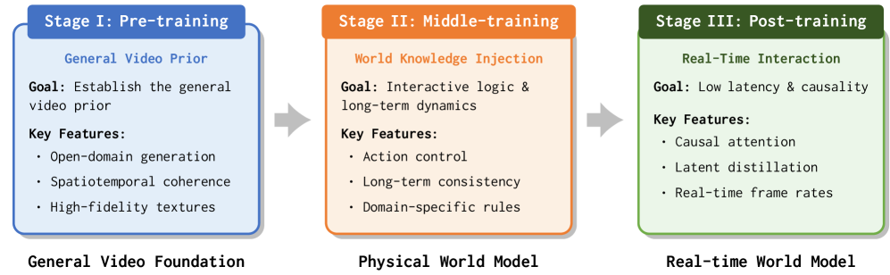
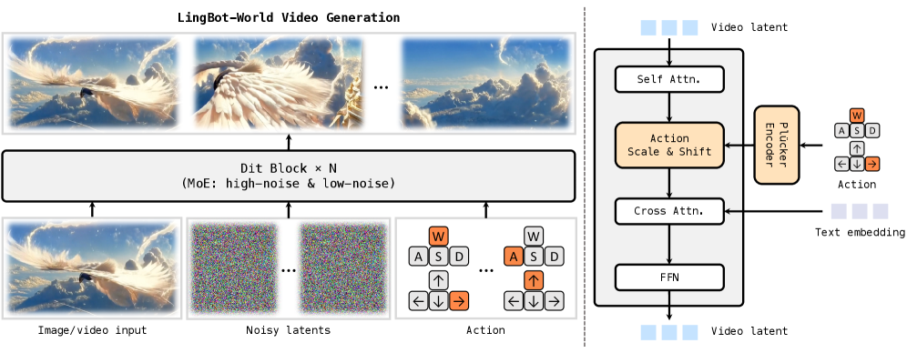
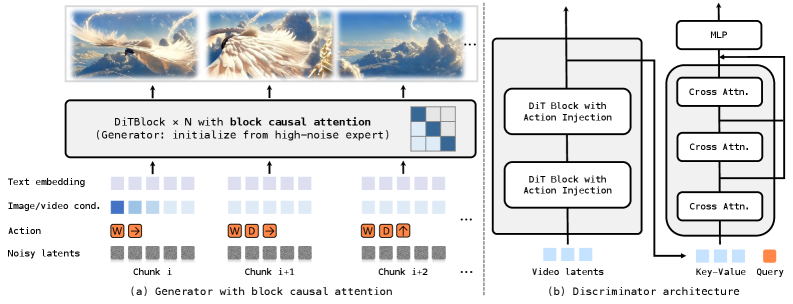
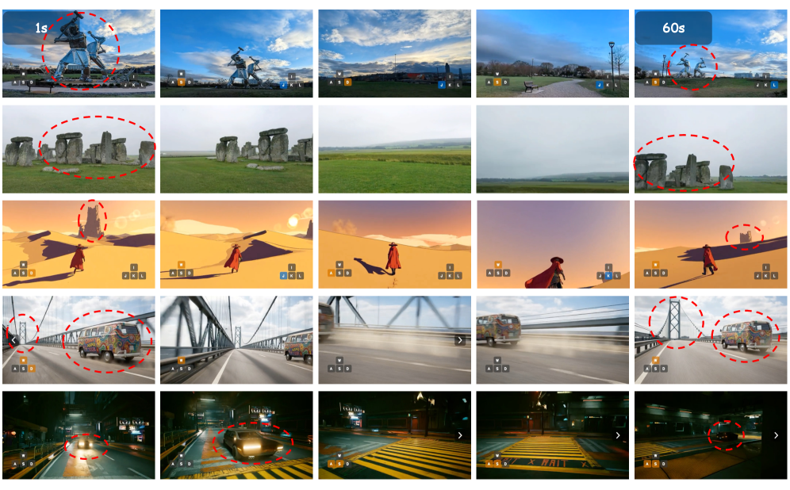

# LingBot-World：从视频生成到开源世界模拟器

!!! info "论文信息"
    - 论文：`Advancing Open-source World Models with Video Generation Models`
    - 系统：`LingBot-World`
    - 链接：[arXiv:2601.20540](https://arxiv.org/abs/2601.20540)
    - 代码与模型：[GitHub](https://github.com/robbyant/lingbot-world)
    - 关键词：视频世界模型、交互模拟器、动作条件生成、长时记忆、因果化、少步蒸馏

这篇论文的核心价值不是提出一个全新的世界模型定义，而是给出了一条很现实的工程路线：**先继承视频生成模型的视觉和时序先验，再通过交互数据、动作条件训练、因果化和蒸馏，把视频生成器改造成可实时交互的世界模拟器。**

## 论文位置

过去很多视频模型回答的是“接下来的视频看起来是否合理”。世界模型要回答的问题更强：在同一个历史状态下，如果执行不同动作，未来是否会发生可区分、可验证、对规划有用的变化。

这篇论文把这个差异落到了系统实现上。它不是从零训练一个世界模型，而是以开源视频生成模型为底座，继续做三件事：

1. 扩充和标注可交互数据，让模型看到“动作改变世界”的样本；
2. 进行长序列中程训练，让模型具备更强的时序一致性和场景记忆；
3. 把离线视频生成模型改造成可流式、低延迟、可交互的模拟器。

因此，它更像一篇“视频基础模型如何产品化为世界模型”的系统论文，而不是单纯的视频生成论文。

论文 Table 1 对近期交互世界模型做了横向定位，重点比较 domain、generation horizon、dynamic degree、resolution、real-time 和 open-source 等维度。

|  | Matrix-Game 2.0 [he2025matrix] | Yume-1.5 [mao2025yume15] | HY-World 1.5 [sun2025worldplay] | Mirage 2 [mirage2] | Genie 3 [genie3] | Ours |
| --- | --- | --- | --- | --- | --- | --- |
| Domain | Game | General | General | General | General | General |
| Generation Horizon | Short | Short | Medium | Long | Long | Long |
| Dynamic Degree | Low | Low | Low | Medium | Medium | High |
| Resolution | 480p | 480p | 720p | 480p | 720p | 720p |
| Real-time | ✓ | ✗ | ✓ | ✓ | ✓ | ✓ |
| Open-source | ✓ | ✓ | ✓ | ✗ | ✗ | ✓ |

<small>表源：`Advancing Open-source World Models with Video Generation Models`，Table 1。原论文表格要点：该表把近期交互世界模型放在 domain、generation horizon、dynamic degree、resolution、real-time 和 open-source 六个维度下比较，用来突出 LingBot-World 同时追求通用域、长 horizon、高动态、实时和开源。</small>

这张表的重点不是每个标签的绝对定义，而是论文想强调的定位：LingBot-World 试图同时满足通用域、长 horizon、高动态、实时和开源几个约束。

## 核心问题

普通视频生成模型通常学习：

$$
p(v_{t+1:t+H} \mid v_{\le t}, c),
$$

其中 \(v\) 是视频帧或视频 latent，\(c\) 是文本、首帧或其他条件。它学到的是在给定上下文后补全一个合理未来。

世界模型需要学习：

$$
p(v_{t+1:t+H} \mid v_{\le t}, a_{t:t+H-1}, c),
$$

其中 \(a\) 是动作、相机控制、键盘输入或更高层交互事件。这个目标要求模型不仅“会续写视频”，还要对动作分叉敏感。

如果动作条件很弱，模型会倾向于生成平均未来。例如在游戏场景里，不管输入是左转还是右转，模型都可能靠画面惯性继续向前补帧。这样的模型视觉上可能很像视频，但不能用于规划。LingBot-World 想解决的正是这个断层：把视觉生成能力转成动作条件下的可交互模拟能力。

## 总体方案

论文的整体路线可以压缩成一条链：

```text
视频生成基础模型
  -> 交互数据引擎
  -> 长序列中程训练
  -> 动作条件适配
  -> 因果化改造
  -> 少步蒸馏
  -> 实时交互世界模拟器
```

这条链路强调一个关键点：世界模型不是在视频模型上“多加一个动作 token”就结束，而是要同时修改数据、训练目标、注意力结构、推理方式和评测标准。

更具体地说，系统由三层构成：

| 层级 | 作用 | 对世界模型的意义 |
| --- | --- | --- |
| 数据引擎 | 收集、合成、筛选和标注视频及交互轨迹 | 让模型不只看被动视频，还能看到动作和后果 |
| 训练框架 | 在视频基础模型上做长序列、动作条件和多任务训练 | 把视频先验转成可 rollout 的动态先验 |
| 推理改造 | 因果注意力、KV cache、少步蒸馏和自回归 rollout | 让模型从离线生成器变成可交互模拟器 |

这条路线说明：当前视频世界模型的训练并不是简单地“多喂视频”，而是要同时改数据、目标函数、注意力结构和推理路径。

{ width="920" }

<small>图源：`Advancing Open-source World Models`，Figure 4。原论文图注要点：该图概览 LingBot-World 的多阶段训练 pipeline，从 foundation video generator 出发，经过 pre-training、middle-training 和 post-training 演进为可交互世界模拟器。</small>

!!! note "这张训练路线图怎么读"
    这张图的主线是“先保视频生成能力，再逐步加入世界模型能力”。pre-training / foundation stage 让模型继承开放域视频生成先验；middle-training 更关注长序列、空间记忆和多任务视频续写；post-training 才引入动作条件、因果化、少步蒸馏和系统优化。

    关键点是这些阶段不能简单互换。动作条件太早加入，模型可能还没有稳定的视频和长时记忆能力；实时化太早做，少步蒸馏会先损伤质量；只做视频训练不做动作和因果化，又只能得到离线生成器。LingBot-World 的图实际表达了一条工程路线：世界模型不是视频模型加一个动作 token，而是数据、训练目标、注意力结构和推理接口一起改。

## 数据引擎

LingBot-World 的数据部分很关键，因为世界模型的能力上限很大程度取决于它看到过什么交互。

论文把数据来源分成几类：

1. 通用视频：提供开放域视觉、物体外观、运动和场景变化先验；
2. 游戏视频：提供相对干净的交互环境、长时导航轨迹和动作控制信号；
3. 合成数据：通过可控引擎生成带视角、轨迹和事件标注的数据；
4. 相机轨迹伪标签：为没有显式动作的视频补上运动和视角变化信号。

这一步的关键不是“数据越多越好”，而是让数据覆盖三种世界模型需要的信号：

| 信号 | 为什么重要 |
| --- | --- |
| 场景静态结构 | 模型要记住建筑、房间、道路、物体位置，而不是每几秒重造一个世界 |
| 动态事件 | 模型要理解角色移动、物体出现、遮挡、碰撞和交互后果 |
| 控制信号 | 模型要知道动作如何改变相机、位置和未来画面 |

论文还强调了数据 profiling 和多层 caption。单纯给视频一个全局标题不够，因为世界模型需要同时知道“场景是什么”“镜头如何运动”“哪些对象在发生变化”。因此更有用的是分层标注：场景级描述、时间片段描述、运动描述和动作或相机轨迹描述。

## 训练路线

### 从视频训练框架到世界模型训练

普通视频生成框架通常已经具备四个组件：视频数据、视频 tokenizer 或 VAE、扩散/Flow/自回归生成器，以及图生视频或文生视频条件。它能学到“在给定条件下生成一段合理视频”，但这和世界模型训练仍有明显距离。

更准确地说，视频模型训练解决的是：

$$
p(v_{1:T} \mid c),
$$

其中 \(c\) 可以是文本、首帧、参考图或短历史视频。世界模型训练要解决的是：

$$
p(v_{t+1:t+H}, r, e, u \mid v_{\le t}, a_{t:t+H-1}, c),
$$

这里除了未来视频，还可能包括风险 \(r\)、事件 \(e\)、不确定性 \(u\)。关键变量从“条件 \(c\)”扩展到“历史、动作、状态和任务约束”。因此训练框架要发生六层变化：

| 改造层 | 视频模型里通常怎么做 | 世界模型需要补什么 |
| --- | --- | --- |
| 数据 | 被动视频、文本 caption、首帧条件 | 交互轨迹、动作、相机位姿、事件、长序列状态 |
| 目标 | 去噪、视频续写、重建或 token 预测 | 动作条件未来、长期一致性、反事实分叉和风险事件 |
| 表示 | 主要保留视觉质量和运动连续性 | 还要保留空间记忆、对象身份、可控状态和任务相关变量 |
| 架构 | 常用整段视频双向建模 | 训练可双向，交互推理必须因果化并支持缓存 |
| 推理 | 离线生成固定长度视频 | 按动作流式 rollout，延迟和显存进入核心约束 |
| 评测 | FVD、VBench、人眼质量 | 动作敏感性、闭环收益、长期漂移、风险校准 |

这六层里，最容易被低估的是数据和评测。没有动作或相机轨迹，模型只能学习“常见未来”；没有固定历史下的动作对照评测，模型是否真的理解动作后果也很难判断。

### 为什么不是简单加动作标签

如果只把动作标签拼到条件里，模型可能出现三种失败：

1. **动作被忽略**：视频惯性太强，模型继续生成最常见未来；
2. **动作只影响镜头，不影响世界**：画面方向变了，但对象状态和事件逻辑没变；
3. **短期可控、长期漂移**：前几秒跟动作，时间一长场景结构和对象身份开始重置。

所以动作条件训练至少要满足三个要求。第一，数据里同一类状态必须覆盖足够多动作后果，否则模型无法学到分叉。第二，动作注入位置要足够接近生成主干，LingBot-World 采用 action embedding 加 AdaLN/adapter 的方式，让动作调制 DiT block 的特征。第三，评测要固定历史、改变动作，检查未来是否真的产生可解释差异。

### LingBot-World 的具体拓展方式

LingBot-World 采用的是“先保视频能力，再逐步加世界能力”的路线。

| 阶段 | 具体做法 | 解决的问题 |
| --- | --- | --- |
| 视频底座 | 使用 Wan2.2 image-to-video diffusion 作为预训练模型 | 继承开放域视觉质量、对象持久性和短中程运动先验 |
| Fundamental world model | 保留 MoE 扩散结构，用 5 秒到 60 秒 curriculum 做长序列训练 | 让模型从短视频生成扩展到长期一致和空间记忆 |
| 多任务训练 | 同时做 image-to-video 和 video-to-video continuation | 支持从单帧或历史片段预测未来世界状态 |
| Action-conditioned model | 用 Plücker embedding 表示相机旋转，用 multi-hot 表示离散键盘动作 | 同时处理连续视角变化和离散交互控制 |
| 参数高效适配 | 冻结主 DiT，主要训练 action adapter 和 AdaLN 参数 | 保住基础视频质量，降低动作数据不足导致的遗忘 |
| 系统并行 | FSDP2 切参数/优化器状态，Ulysses context parallel 切长序列 | 让 28B MoE 和一分钟级视频训练可承受 |
| 因果化 | 用 high-noise expert 初始化 causal student，换成 block causal attention | 把双向离线视频模型改成可流式 rollout 的模型 |
| 少步蒸馏 | 用 self-rollout、DMD 和对抗优化减少采样步数 | 降低交互延迟，并缓解自回归长期漂移 |

这里有一个很重要的分工：中程训练阶段更像“把视频生成器变成懂长期世界的双向模拟器”，后训练阶段才把它变成“可实时交互的因果模拟器”。前者解决能力，后者解决部署形态。

### 第一阶段：继承视频基础模型

LingBot-World 的现实选择是站在视频生成模型上继续训练，而不是从零开始。这样做的原因很直接：视频基础模型已经学到了大量视觉和短中程时序先验，包括纹理、风格、物体形状、场景布局、运动连续性和常见交互模式。

这一步带来的能力是“世界看起来像真的”。但这还不是世界模型，因为模型可能只是在做视觉续写。它尚未被迫学习：同一个状态下，不同动作会把世界带向不同未来。

### 第二阶段：中程训练与长时一致性

中程训练的目标是把视频生成器推向长序列 world rollout。论文强调长时记忆，因为交互模拟器不能只生成几秒钟看起来合理的片段。它需要在几十秒甚至更长时间里维持场景结构、对象身份和运动连续性。

这一步通常包含几类训练设计：

1. 从短视频逐步扩展到更长视频，降低长序列训练的不稳定性；
2. 混合图生视频、视频续写、视频到视频等任务，保持基础生成能力；
3. 让模型处理更长的上下文，学习跨片段记忆；
4. 使用多专家或高低噪声分工，兼顾生成质量和训练效率。

从世界模型角度看，中程训练解决的是“模型能不能记住同一个世界”。如果长序列中场景布局、物体身份和方向感不断漂移，模型就无法成为可靠模拟器。

{ width="920" }

<small>图源：`Advancing Open-source World Models`，Figure 5。原论文图注要点：该图左侧展示图像/视频、噪声 latent 和用户动作如何共同生成具备空间记忆、长时一致性和动作跟随的视频；右侧展示 DiT block 中 self-attention、Plücker action embedding、adaptive normalization 与 text cross-attention 的组织方式。</small>

!!! note "动作条件为什么要进 DiT block"
    这张系统图右侧比左侧更重要。左侧说明输入有历史图像/视频、噪声 latent 和用户动作；右侧说明动作不是只作为 prompt 拼在外面，而是通过 action embedding、Plucker camera representation、adaptive normalization / adapter 等机制调制 DiT block 内部特征。

    这样做的原因是动作要改变未来动态，而不只是改变文本语义。如果动作只在浅层条件里出现，模型很容易忽略它，继续生成“最常见未来”。把动作调制接近生成主干，可以让相机旋转、移动方向、键盘输入等控制信号影响每个 denoising block 的时空表示。读这张图时要抓住一句话：**世界模型的动作条件必须进入动力学生成路径，而不是停留在 caption 级条件**。

### 第三阶段：动作条件适配

动作条件是视频模型变成世界模型的分水岭。LingBot-World 引入相机运动、键盘控制或离散交互动作，让模型学习：

$$
\text{历史视频} + \text{动作序列} \rightarrow \text{未来视频}.
$$

这一步的工程难点在于，动作形式并不天然统一。游戏里可能是 `WASD`、鼠标、跳跃、交互键；机器人里可能是末端位姿或关节角；自动驾驶里可能是轨迹点、转角和速度。论文中的做法更偏向导航和交互模拟，因此动作接口主要服务于相机运动和第一人称环境控制。

这一阶段最重要的验收方式不是视频质量，而是动作敏感性：

1. 固定历史，改变动作，未来是否明显不同；
2. 固定动作，改变场景，模型是否生成符合场景约束的后果；
3. 连续多步动作后，模型是否保持方向感和空间记忆；
4. 错误动作是否会导致合理的失败或偏离，而不是被模型自动“修正”成常见视频。

### 第四阶段：因果化与流式 rollout

视频扩散模型通常面向离线生成：给定条件后一次性生成一个视频块。交互世界模型则需要流式运行：用户或 agent 每一小段时间输入动作，模型马上生成下一段观测。

因此论文做了因果化改造。直觉上，它要把“整段视频一起看、一起生成”的模型，改成“只能依赖过去和当前 chunk，逐步向前 rollout”的模型。

这一步和大语言模型的自回归推理很像：过去的状态应该能缓存，未来的生成不能偷看后面的帧。否则离线评测可能很好，但一旦进入交互循环就会暴露训练和推理不一致。

因果化的意义有三点：

1. 支持连续交互，而不是一次性生成固定长度视频；
2. 支持 KV cache 复用，降低长序列推理成本；
3. 减少训练时看全局、推理时只看过去造成的分布偏移。

{ width="860" }

<small>图源：`Advancing Open-source World Models`，Figure 6。原论文图注要点：该图说明 causal generator adaptation 和 discriminator architecture，前者用 block causal attention 支持流式自回归生成，后者在长时训练中通过 GAN classification head 与 cross-attention 缓解累积漂移。</small>

!!! note "这张因果化图在解决什么"
    离线视频扩散模型通常可以看完整个 clip，训练和推理都偏 bidirectional；交互世界模型不能这样做，因为未来动作和未来观测还不存在。causal generator adaptation 的作用，是把模型改成只能依赖历史和当前 chunk，同时保留 chunk 内局部一致性。

    图里的 discriminator / GAN branch 则针对另一个问题：自回归 rollout 时间一长，错误会累积，视频可能漂移、模糊或变得不真实。用长时训练和对抗分类头，可以给生成序列整体质量一个额外约束。读这张图时要把两件事分开：causal attention 解决部署形态，discriminator 解决长期 rollout 质量。

### 第五阶段：少步蒸馏与实时化

即使模型已经能动作条件生成，如果每次 rollout 仍需大量扩散采样步，也无法成为交互模拟器。论文因此加入少步蒸馏，把多步生成压缩到更少采样步。

这一步解决的是系统成本，而不是建模定义。它说明一个关键事实：世界模型要真正被 agent 或用户调用，不仅要“会预测”，还要“预测得足够快”。如果一次未来模拟延迟过高，它只能做离线数据生成，不能进入交互闭环。

## 和视频模型训练的关系

这篇论文最值得记住的点，是它把视频模型训练和世界模型训练的关系讲得很清楚：两者共享基础设施，但目标不同。

| 维度 | 视频模型训练 | 世界模型训练 |
| --- | --- | --- |
| 主要目标 | 生成视觉合理、时序连贯的视频 | 预测动作条件下的未来后果 |
| 数据重点 | 大规模视频、文本描述、首帧条件 | 交互轨迹、动作标签、相机轨迹、长序列状态 |
| 训练压力 | 画面质量、运动自然、语义一致 | 动作敏感、长时记忆、因果 rollout、风险事件 |
| 推理方式 | 离线生成固定长度视频 | 按动作逐步流式生成未来观测 |
| 评测重点 | FVD、VBench、人眼质量 | 动作一致性、闭环可用性、延迟、长期漂移 |

因此，视频预训练更像世界模型的“视觉和时序底座”。真正把它变成世界模型的，是后续的交互数据、中程训练、因果推理和系统评测。

## 实验与应用结论

论文展示的结果主要支持三个结论。

第一，强视频基础模型确实可以作为世界模拟器的底座。经过中程训练后，模型能生成更长、更一致的开放世界视频，不再只是短片段补全。

第二，动作条件训练可以把模型推向交互模拟。用户或 agent 能通过控制信号影响未来画面，使模型从被动视频续写变成可控环境。

第三，因果化和少步蒸馏让世界模型更接近可用系统。论文展示了交互式探索、promptable event、action agent 和 3D 重建等用法，这些都说明视频世界模型可以成为数据、规划和 embodied agent 的接口。

不过要注意，论文中的很多展示仍然偏开放域模拟和第一人称导航。它证明了“视频生成模型可以被改造成交互模拟器”这条路线可行，但还不能直接说明它已经能替代真实机器人或自动驾驶中的高精度物理模拟。

从 Table 2 看，LingBot-World 最明显的提升不是所有指标全面碾压，而是在 `Dynamic Degree` 上拉开差距：论文报告 LingBot-World 为 0.8857，高于 Yume-1.5 的 0.7612 和 HY-World 1.5 的 0.7217。这个结果和论文主张是匹配的：它更强调开放世界中的动态程度、长时生成和交互能力，而不是只追求静态画面质量。

Table 2 reports VBench quantitative comparisons against Yume-1.5 and HY-World 1.5.

| Model | Imaging Quality | Aesthetic Quality | Dynamic Degree | Motion Smooth | Temporal Flickering | Overall Consistency |
| --- | --- | --- | --- | --- | --- | --- |
| Yume-1.5 [mao2025yume15] | 0.5838 | 0.5185 | 0.7612 | 0.9709 | 0.9545 | 0.1994 |
| HY-World 1.5 [sun2025worldplay] | 0.6512 | 0.5487 | 0.7217 | 0.9897 | 0.9773 | 0.2016 |
| Ours | 0.6683 | 0.5660 | 0.8857 | 0.9895 | 0.9648 | 0.2178 |

<small>表源：`Advancing Open-source World Models with Video Generation Models`，Table 2。原论文表格要点：该表用 VBench 指标比较 Yume-1.5、HY-World 1.5 和 LingBot-World；LingBot-World 最突出的优势在 `Dynamic Degree`，同时在 imaging/aesthetic/overall consistency 上也略有提升。</small>

{ width="920" }

<small>图源：`Advancing Open-source World Models`，Figure 12。原论文图注要点：该图展示 emergent memory capability，包括静态地标离开视野 60 秒后仍保持结构、一段时间不可见的桥梁距离变化，以及车辆在视野外继续运动等案例。</small>

这张图对应世界模型里很关键的一点：模型不能只生成下一段视频，还要在看不见目标的时间里维持隐藏状态。否则 agent 一转身，场景就被“重新生成”，规划器就无法依赖它做长期决策。

## 主要贡献

这篇论文的贡献可以概括为五点：

1. 给出开源视频世界模型系统，降低了复现和二次开发门槛；
2. 展示从视频基础模型继续训练成世界模型的可行路径；
3. 强调数据引擎、动作标注和长时训练对世界模型的重要性；
4. 用因果化和少步蒸馏把离线生成模型推向实时交互；
5. 把视频世界模型连接到 agent、3D 重建和开放世界模拟应用。

从研究价值看，最重要的是第二点和第四点。它们说明未来很多世界模型可能不会从零训练，而是从视频基础模型出发，再补交互、因果和实时化能力。

## 局限与风险

这篇论文也暴露了当前视频世界模型的几个边界。

1. **动作空间仍然偏窄**：导航、相机和游戏控制比真实机器人操作简单，真实接触、力反馈、物体形变和工具使用仍然更难。
2. **视觉真实不等于物理正确**：模型可能生成看似合理但物理错误的接触、碰撞或遮挡结果。
3. **长时记忆仍可能漂移**：即使能生成长视频，也不代表空间拓扑、对象身份和任务状态始终稳定。
4. **评测还不够闭环**：视频指标和交互 demo 不能完全替代真实 agent 成功率、风险率和恢复率。
5. **合成数据有自我污染风险**：如果把模型生成的轨迹直接回流训练，可能强化模型自身幻觉。
6. **实时化会牺牲一部分生成质量**：少步蒸馏提升速度，但可能带来细节和多样性损失。

因此，这篇论文适合被看作视频世界模型工程路线的强信号，而不是世界模型问题的终点。

## 对项目的启发

如果要把这篇论文转成项目决策，可以提炼出几条经验。

1. 先明确世界模型的使用位置：离线数据生成、交互模拟、规划前瞻还是 agent 训练；
2. 不要只训练视频续写，要尽早加入动作条件和反事实验证；
3. 数据管线要记录动作、相机、场景、事件和时间片段，而不是只有视频文件；
4. 长时一致性要单独评测，不能被短视频质量指标掩盖；
5. 如果要交互使用，因果化和推理蒸馏是主路径，不是最后优化项；
6. 合成 rollout 必须进入门禁系统，不能无条件回流训练。

最直接的判断标准是：固定同一段历史，系统性改变动作，模型是否能给出合理分叉；把这些分叉交给 planner 或 agent 后，是否真的提升决策质量。如果这两点不成立，模型仍更接近视频生成器，而不是世界模型。

## 阅读结论

LingBot-World 最值得放进世界模型专题，不是因为它单独解决了所有动力学问题，而是因为它把当前视频世界模型的训练路径讲得很完整：**视频基础模型提供世界外观和时序先验，交互数据提供动作后果，长序列训练提供记忆，因果化提供在线 rollout，少步蒸馏提供可交互速度。**

这条路径也解释了为什么“视频模型”和“世界模型”会越来越接近，但不会完全等价。视频模型负责让未来看起来合理；世界模型必须让未来对动作、风险和规划有用。
