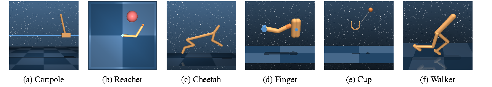
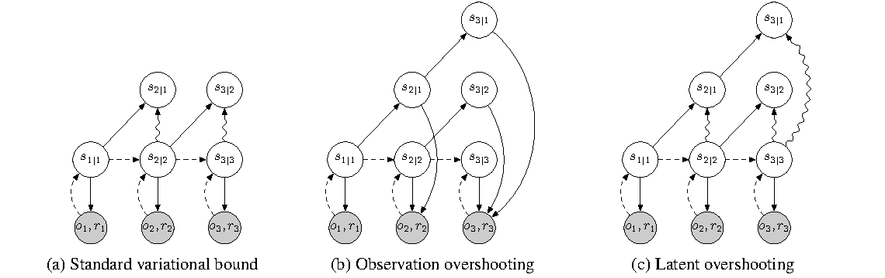
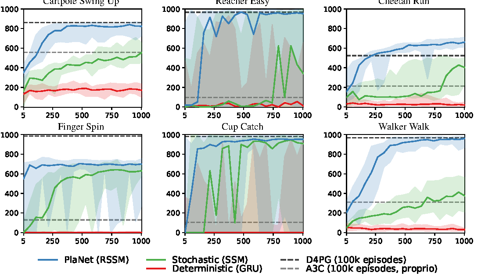
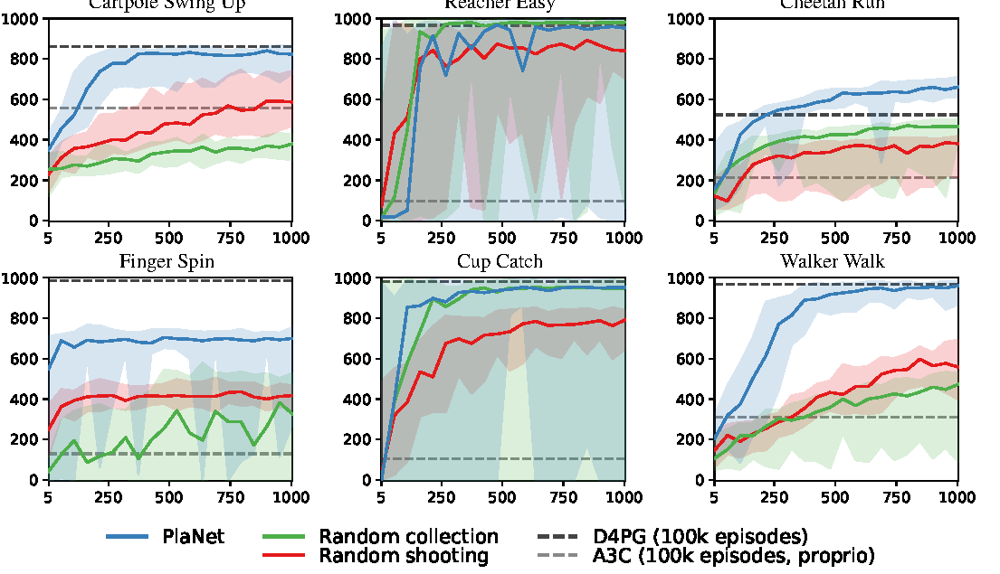
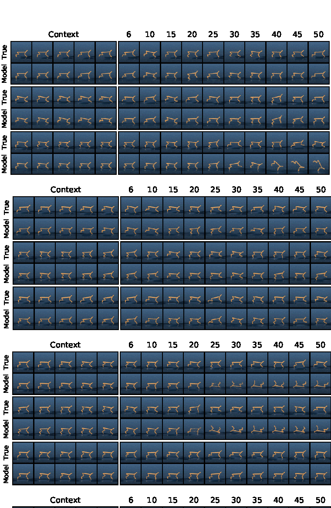

# PlaNet：Learning Latent Dynamics for Planning from Pixels

!!! info "论文信息"
    - 论文：`Learning Latent Dynamics for Planning from Pixels`
    - 系统：`PlaNet`
    - 链接：[arXiv:1811.04551](https://arxiv.org/abs/1811.04551)
    - 项目页：[danijar.com/planet](https://danijar.com/planet)
    - 关键词：PlaNet、RSSM、latent dynamics、latent overshooting、model-based RL、CEM planning、MPC

这篇论文是 Dreamer 系列之前非常关键的一步。它提出的问题很直接：如果只有像素观测，能否先学习一个 latent dynamics model，再完全在 latent space 里做在线规划，而不是训练 model-free policy。

PlaNet 的答案是：

```text
image observation + action + reward trajectories
  -> Recurrent State-Space Model (RSSM)
  -> latent-space CEM planning
  -> execute first action
  -> receive next observation and replan
```

它和 [DreamerV3](dreamerv3.md) 属于同一条“交互轨迹驱动的 latent dynamics 世界模型路线”，但接口不同：PlaNet 每一步用 CEM 做 model-predictive control；Dreamer 则在 world model 的 imagined rollout 上训练 actor-critic，把规划成本摊到 policy 学习里。

## 论文位置

PlaNet 的历史位置可以这样理解：

| 阶段 | 代表 | 关键变化 |
| --- | --- | --- |
| 早期像素 model-based RL | PlaNet | 从像素学习 RSSM，并直接在 latent space 中规划 |
| policy learning from imagination | Dreamer | 不再每步 CEM 搜索，而是在 imagined latent trajectories 上训练 actor-critic |
| 鲁棒跨域 world model RL | DreamerV3 | 固定超参数、离散 latent、symlog/twohot/free bits 等稳定化技巧 |

所以 PlaNet 最值得放进世界模型专题的原因，不是它今天仍是最强控制算法，而是它把后续 Dreamer 路线的两个核心概念打牢了：**RSSM latent state** 和 **action-conditioned latent rollout**。

{ width="920" }

<small>Figure source: `Learning Latent Dynamics for Planning from Pixels`, Figure 1. 原论文图注要点：该图展示六个像素控制任务，覆盖固定视角部分可观测、稀疏奖励、接触动力学、较大状态动作空间和平衡控制等挑战。</small>

## 核心问题

传统 planning 在已知动力学里很强，但未知环境中必须先学 dynamics。困难在于像素输入下的 dynamics learning 很容易失败：

1. 单帧图像不是完整状态，任务本质是 POMDP；
2. 模型如果只会一步预测，规划时多步 rollout 会迅速漂移；
3. planner 会主动寻找模型漏洞，导致 model exploitation；
4. 如果在像素空间生成每个候选未来，计算成本太高。

PlaNet 的设计选择是把视觉复杂性和规划复杂性拆开。视觉重建用于训练 latent state，但规划时不生成图像，只在 latent state 上预测 reward 并评估 action sequence。

这使它的世界模型回答的是：

$$
h_t, s_t, a_t \rightarrow h_{t+1}, s_{t+1}, r_{t+1}
$$

而不是简单回答：

$$
o_t \rightarrow o_{t+1}
$$

这正是 PlaNet 和普通视频预测模型的根本区别。

## 总体训练循环

PlaNet 的 agent 没有 policy network，也没有 value network。它的行为完全来自在线 planning：

```text
用随机动作收集少量 seed episodes
  -> 从 replay data 训练 RSSM world model
  -> 当前观测通过 encoder 得到 latent belief
  -> CEM 在 latent space 搜索未来 action sequence
  -> 执行第一个动作并加入少量探索噪声
  -> 收集新 episode，继续更新 world model
```

每次环境 step 后都会重新规划，所以这是典型的 MPC 风格：规划一个 horizon，但只执行当前动作。新观测回来后，先用 encoder 修正当前 latent belief，再重新搜索动作序列。

这个循环里有两个关键约束：

1. world model 必须能在没有未来图像的情况下多步 rollout；
2. reward head 必须足够准确，因为 planner 只看 latent reward prediction，不看生成图像。

## RSSM World Model

PlaNet 使用 `Recurrent State-Space Model`。RSSM 把状态拆成两部分：

| State component | Role |
| --- | --- |
| deterministic state \(h_t\) | 通过 RNN 记住历史，承载长时记忆 |
| stochastic state \(s_t\) | 表达当前不确定性，支持多未来预测 |

论文对比了三种 latent dynamics 设计。

{ width="860" }

<small>Figure source: `Learning Latent Dynamics for Planning from Pixels`, Figure 2. 原论文图注要点：该图比较 RNN、SSM 和 RSSM。RNN 只有确定性路径，SSM 只有随机状态，RSSM 同时保留确定性记忆和随机状态，以更稳健地预测多个未来。</small>

RSSM 的 generative model 可以写成：

$$
h_t = f(h_{t-1}, s_{t-1}, a_{t-1})
$$

$$
s_t \sim p(s_t \mid h_t)
$$

$$
o_t \sim p(o_t \mid h_t, s_t), \quad
r_t \sim p(r_t \mid h_t, s_t)
$$

训练时，模型还需要一个 encoder / inference model：

$$
q(s_t \mid h_t, o_t)
$$

直觉上，\(q\) 是看到真实图像后的 posterior belief；\(p\) 是没有未来图像时的 prior dynamics。训练阶段可以用真实图像修正 \(s_t\)，但 planning 阶段只能从当前 belief 出发，用 prior 自己往前滚。

这就是为什么 RSSM 的结构很重要。纯 RNN 容易给 planner 一个确定但错误的未来；纯 SSM 难以记住长时历史；RSSM 用 \(h_t\) 负责记忆，用 \(s_t\) 负责不确定性，兼顾部分可观测和多未来。

## 训练目标

PlaNet 的基本训练目标是变分序列模型的 evidence lower bound。简化理解可以分成三项：

| Loss term | What it trains |
| --- | --- |
| observation reconstruction | latent state 是否包含足够视觉信息 |
| reward prediction | latent state 是否包含决策相关信息 |
| KL regularization | prior dynamics 是否能预测 posterior belief |

写成概念式：

$$
\mathcal{L}
=
-\log p(o_t \mid h_t, s_t)
-\log p(r_t \mid h_t, s_t)
+\mathrm{KL}\left(q(s_t \mid h_t,o_t)\,\|\,p(s_t \mid h_t)\right)
$$

这里的核心矛盾是：标准 KL 主要训练一步 prior。如果模型只在 \(t \rightarrow t+1\) 上准确，但 planning 需要连续 rollout 十几步，那么一小点误差会在 CEM 搜索里被放大。

### Latent Overshooting

为了解决多步预测问题，论文提出 `latent overshooting`。

{ width="860" }

<small>Figure source: `Learning Latent Dynamics for Planning from Pixels`, Figure 3. 原论文图注要点：该图比较 standard variational bound、observation overshooting 和 latent overshooting。latent overshooting 不解码所有多步预测图像，而是在 latent space 里约束多步 prior 接近对应 posterior。</small>

标准目标只约束：

$$
p(s_t \mid s_{t-1}, a_{t-1}) \approx q(s_t \mid o_{\le t}, a_{<t})
$$

latent overshooting 进一步约束多步 prior：

$$
p(s_t \mid s_{t-d}, a_{t-d:t-1}) \approx q(s_t \mid o_{\le t}, a_{<t})
$$

这里的 \(d\) 是 overshooting distance。它的意义是让模型从更早的 latent state 出发，经过多步 transition 后仍能落到真实 posterior 附近。

这和 observation overshooting 的区别很关键。observation overshooting 会把多步预测都解码成图像再做 reconstruction loss，在像素任务中很贵。latent overshooting 只在 latent space 做 KL 约束，避免大量额外图像解码。

需要注意一个细节：论文实验中，RSSM 本身已经比较稳健，latent overshooting 对 RSSM 的主结果不是唯一决定因素；但它明显揭示了 model-based RL 的关键训练压力：**规划需要的是多步 latent dynamics，而不是只会一步重建的视觉模型**。

## Latent Planning

PlaNet 的 planning 使用 `Cross-Entropy Method`。流程如下：

```text
当前 belief: q(s_t | o_{\le t}, a_{<t})
  -> 初始化未来 action sequence 的 Gaussian distribution
  -> 采样 J 条候选 action sequences
  -> 用 RSSM prior rollout 每条候选序列
  -> 累加 reward head 预测的 mean rewards
  -> 选择 top K sequences
  -> 重新拟合 Gaussian
  -> 重复 I 次
  -> 执行当前步 mean action
```

论文使用的典型 planner 设置是：

| Hyperparameter | Value | Meaning |
| --- | --- | --- |
| \(H\) | 12 | planning horizon |
| \(I\) | 10 | CEM optimization iterations |
| \(J\) | 1000 | sampled action sequences |
| \(K\) | 100 | elite sequences used for refitting |

最重要的工程点是：candidate action sequences 的评估完全在 latent space 里完成。模型不需要为每条候选序列生成未来图像，只需要预测 latent state 和 reward。这就是 PlaNet 能在每个环境 step 在线规划的原因。

它也解释了 PlaNet 和视频世界模型的差别。视频世界模型通常重视未来画面质量；PlaNet 只把像素重建当成训练信号，推理时真正服务 planning 的是 latent dynamics 和 reward head。

## 实验结论

PlaNet 在 DeepMind Control Suite 的六个像素控制任务上评估。论文重点不是最终分数绝对最高，而是样本效率：PlaNet 使用 1,000 episodes，从 pixels 训练；A3C 和 D4PG 对照结果使用 100,000 episodes。

{ width="920" }

<small>Figure source: `Learning Latent Dynamics for Planning from Pixels`, Figure 4. 原论文图注要点：该图比较 PlaNet、model-free baselines 和不同 dynamics model 设计；结果强调 RSSM 比纯 GRU 或纯 SSM 更适合从像素学习可规划的 dynamics。</small>

Table 1 reports comparison of PlaNet to model-free algorithms and true-simulator CEM planning.

| Method | Modality | Episodes | Cartpole Swing Up | Reacher Easy | Cheetah Run | Finger Spin | Cup Catch | Walker Walk |
| --- | --- | ---: | ---: | ---: | ---: | ---: | ---: | ---: |
| A3C | proprioceptive | 100,000 | 558 | 285 | 214 | 129 | 105 | 311 |
| D4PG | pixels | 100,000 | 862 | 967 | 524 | 985 | 980 | 968 |
| PlaNet (ours) | pixels | 1,000 | 821 | 832 | 662 | 700 | 930 | 951 |
| CEM + true simulator | simulator state | 0 | 850 | 964 | 656 | 825 | 993 | 994 |
| Data efficiency gain PlaNet over D4PG (factor) |  |  | 250 | 40 | 500+ | 300 | 100 | 90 |

<small>表源：`Learning Latent Dynamics for Planning from Pixels`，Table 1。原论文表格要点：该表比较 PlaNet、model-free baselines 和真实 simulator CEM 在 DeepMind Control Suite 六个任务上的分数；重点是 PlaNet 用 `1,000` episodes 从 pixels 学习，就能接近或超过若干使用 `100,000` episodes 的 model-free 结果。</small>

这张表支持两个判断。第一，PlaNet 在 1,000 episodes 下接近或超过强 model-free baseline 的部分结果，尤其 Cheetah Run 上 PlaNet 高于 D4PG。第二，真实 simulator 上的 CEM 上界说明，planner 本身在这些任务中可行，关键瓶颈是 learned dynamics 是否足够准确。

{ width="920" }

<small>Figure source: `Learning Latent Dynamics for Planning from Pixels`, Figure 5. 原论文图注要点：该图比较 PlaNet、random collection 和 random shooting，说明在线数据收集与 CEM 迭代优化都对任务表现有贡献。</small>

Figure 5 的结论更偏系统设计：如果只用 random actions 收集数据，模型很难看到任务相关状态；如果只做 random shooting 而不用 CEM 迭代优化，动作序列搜索也不够强。PlaNet 的效果来自两个闭环同时成立：

1. planning 让数据收集更接近任务分布；
2. 新数据让 world model 更适合后续 planning。

## Open-Loop Prediction

论文还用 open-loop video prediction 检查 latent dynamics 是否真的能往前滚。

{ width="760" }

<small>Figure source: `Learning Latent Dynamics for Planning from Pixels`, Figure 9. 原论文图注要点：该图展示测试 episode 上的 open-loop video predictions，前 5 列是 reconstructed context frames，后续帧由模型 open-loop 生成，用于观察不同 dynamics model 的长期预测质量。</small>

这张图不应该被理解成“PlaNet 是视频生成模型”。PlaNet 的视频预测主要是诊断工具和训练约束。真正用于控制的是 latent state 和 reward prediction。换句话说，PlaNet 需要视觉预测足够好来塑造状态，但部署时不依赖生成未来视频给 planner 看。

## 和 DreamerV3 的关系

PlaNet 和 DreamerV3 的共同点是：

| 维度 | PlaNet | DreamerV3 |
| --- | --- | --- |
| 世界模型 | RSSM | RSSM 变体 |
| 数据 | environment interaction trajectories | environment interaction trajectories |
| 核心变量 | latent state, action, reward | latent representation, action, reward, continuation |
| rollout 空间 | latent space | latent space |
| 视觉重建 | 用于训练 latent state | 用于训练 latent representation |

它们的关键区别是 action selection：

| 维度 | PlaNet | DreamerV3 |
| --- | --- | --- |
| 控制方式 | 每个 step 用 CEM 在线规划 | 用 imagined rollout 训练 actor-critic |
| 推理成本 | 高，需要大量候选 action rollout | 低，actor 直接输出动作 |
| 策略网络 | 无 | 有 |
| 价值网络 | 无 | 有 |
| 主要瓶颈 | planning latency 和短 horizon 搜索 | model bias 与 actor-critic 稳定性 |

可以把 Dreamer 看成对 PlaNet 的一次关键工程升级：把在线规划变成离线 amortized policy learning。PlaNet 每一步都问“现在搜索哪条 action sequence 最好”；Dreamer 则训练一个 actor，让它学会在类似 latent state 下直接给出动作。

## 和视频世界模型路线的关系

PlaNet 和 LingBot-World 这类视频世界模型都涉及未来预测，但研究目标完全不同。

| 维度 | PlaNet | 视频生成型世界模型 |
| --- | --- | --- |
| 输入数据 | 交互轨迹：observation, action, reward | 大规模视频、文本、图像、动作或相机轨迹 |
| 训练目标 | 重建观测、预测 reward、约束 latent dynamics | 生成未来视频、动作条件续写、长时视觉一致性 |
| 推理输出 | 当前动作 | 未来视频或可交互视觉场景 |
| planning 接口 | CEM 在 latent reward 上搜索 | 通常需要额外 policy/planner 接入 |
| 强项 | 决策相关 dynamics 明确 | 视觉真实感、开放域场景、多样性 |

因此，PlaNet 是 `interaction-trajectory-based latent dynamics world model` 的早期代表。它不追求开放域视觉真实感，而是追求一个能让 planner 使用的低维世界状态。

## 局限与风险

PlaNet 的局限也很清楚。

1. **在线规划成本高**：每个环境 step 都要采样和评估大量 action sequences，难以直接扩展到高频真实机器人控制。
2. **planning horizon 有限**：CEM 在高维长 horizon action space 中搜索困难，太长的 horizon 反而会降低表现。
3. **依赖 reward signal**：PlaNet 需要 reward head 服务规划，不像纯视频模型那样可以只用互联网视频预训练。
4. **模型误差会被 planner 利用**：如果 learned dynamics 有系统性漏洞，CEM 会主动搜索这些漏洞。
5. **实验环境仍偏模拟控制**：DeepMind Control Suite 是重要基准，但还不是开放真实世界交互。

这些限制解释了为什么后续 Dreamer 系列会转向 actor-critic imagination：它保留 PlaNet 的 latent world model，但避免每一步都做昂贵的 CEM 搜索。

## 阅读结论

PlaNet 的核心贡献可以概括为三点：

1. 提出用 RSSM 从像素学习 action-conditioned latent dynamics；
2. 证明 planner 可以只在 latent space 里评估 reward，而不必生成未来图像；
3. 用 latent overshooting 强调 world model 训练必须关注多步 rollout，而不是只优化一步重建。

一句话总结：PlaNet 是“世界模型用于控制”的经典原型。它把世界模型从视频预测器推进成一个可供规划器调用的 latent simulator，也为后续 DreamerV3 这类 imagined rollout policy learning 铺好了路线。
