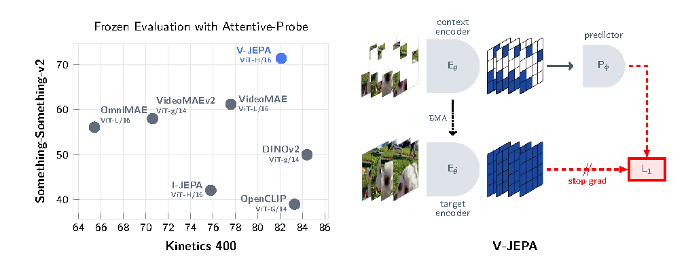
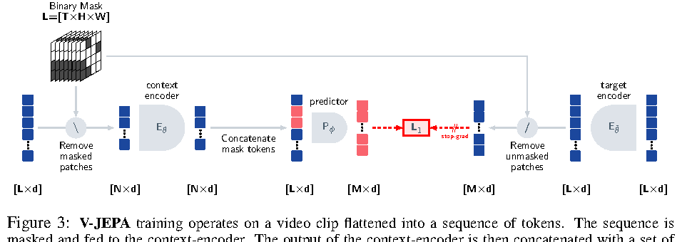
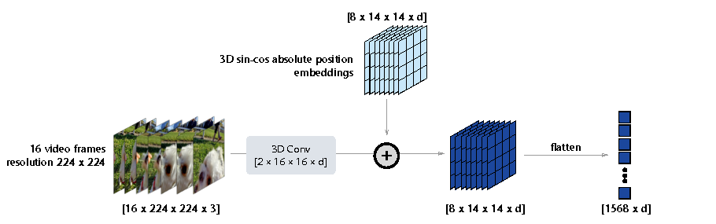
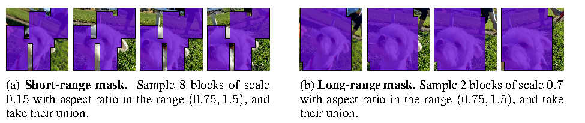
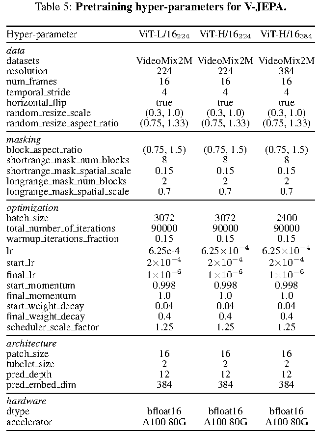
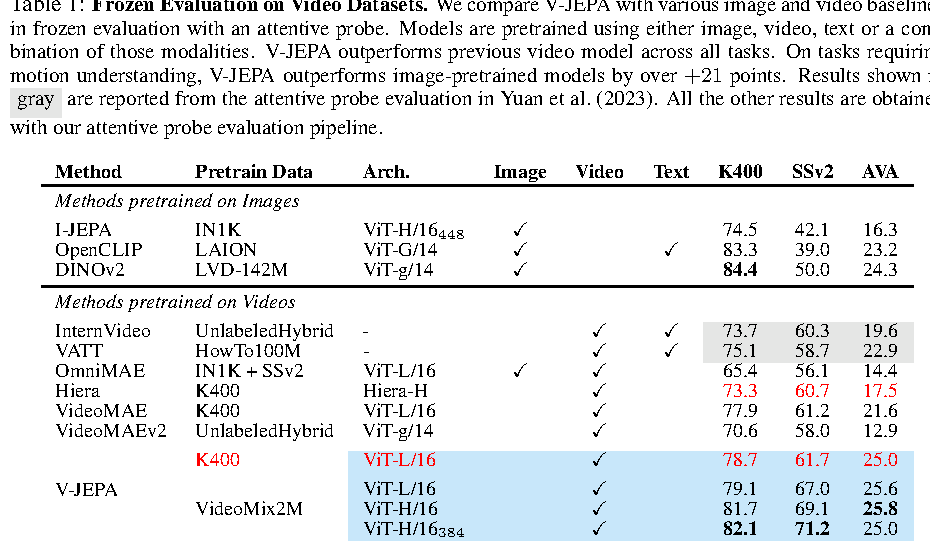
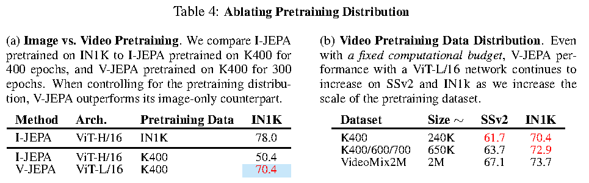

# V-JEPA：Latent Video Prediction for Visual Representation Learning

!!! info "论文信息"
    - 论文：`V-JEPA: Latent Video Prediction for Visual Representation Learning`
    - 链接：[OpenReview](https://openreview.net/forum?id=WFYbBOEOtv)
    - 会议：`ICLR 2024`
    - 关键词：V-JEPA、latent video prediction、masked video modeling、representation learning、3D Multi-Block Masking、frozen evaluation

这篇论文把 JEPA 从静态图像扩展到视频。它的核心不是生成未来视频，而是训练一个视频 encoder：给定被遮挡的视频上下文，在 learned latent space 中预测被遮挡时空区域的目标表示。

放在世界模型谱系里，V-JEPA 更适合被看作“表征型世界模型”的基础模块：它学习视频中的时空结构、运动线索和对象动态，但还没有动作条件、奖励预测、规划接口，也不会像 LingBot-World 那样直接生成可交互视频画面。

## 论文位置

JEPA 的原则是：不要预测所有像素细节，而要预测抽象表示。V-JEPA 把这个原则落到视频上：

```text
masked video context
  -> context encoder
  -> predictor
  -> target representation of masked spatio-temporal regions
```

它和视频生成模型的区别很直接。VideoMAE 等方法通常预测像素或低层视觉 token，V-JEPA 预测 target encoder 的 latent representation。因此，模型不必重建毛发、纹理、光照这类难预测但未必有用的细节，而可以把学习压力集中到更语义化、更时序相关的表示上。

{ width="920" }

<small>Figure source: `V-JEPA: Latent Video Prediction for Visual Representation Learning`, Figure 1. 原论文图注要点：左侧展示 V-JEPA 在 frozen evaluation 下同时适用于 motion-based task 和 appearance-based task；右侧展示 V-JEPA 通过预测 masked spatio-temporal regions 的 latent representation 来训练视觉 encoder。</small>

从世界模型角度看，这篇论文回答的是一个前置问题：**如果未来世界不直接用像素表示，那么视频里的 latent state 应该怎么通过自监督方式学出来？**

## 核心问题

视频自监督学习有两类常见路线。

第一类是生成式或重建式 masked video modeling。它把视频切成 patch 或 token，遮掉一部分，再让模型重建像素、token 或 VAE latent。这类方法的优点是目标清晰，缺点是容易把大量容量花在局部纹理和低层细节上。

第二类是对比或弱监督路线，例如用文本、音频、字幕或多视角增强学习表示。这类方法可以获得强表征，但会引入外部监督、负样本设计或手工增强的 inductive bias。

V-JEPA 想走第三条路：

$$
\text{masked video} \rightarrow \text{predict missing latent representation}
$$

也就是只用视频本身做自监督，但预测目标不是 raw pixels，而是 target encoder 产生的 latent features。

这对世界模型有意义，因为世界模型真正需要的是可预测的状态表示，而不是每一帧的完整 RGB 细节。如果一个模型能从上下文预测被遮挡时空区域的抽象表示，它至少学到了某些关于对象、运动和场景连续性的动态规律。

## 方法结构

V-JEPA 有三个网络：

| Module | Role |
| --- | --- |
| Context encoder \(E_\theta\) | 只处理 masked video 中未遮挡的 context tokens |
| Target encoder \(E_{\bar{\theta}}\) | 处理完整 unmasked video，产生 target representations |
| Predictor \(P_\phi\) | 结合 context tokens 和 mask tokens，预测 masked regions 的 target representations |

target encoder 不直接反向传播，而是 context encoder 的 exponential moving average。这样做有两个作用：一是给 predictor 一个相对稳定的预测目标，二是通过 stop-gradient 避免 encoder 直接坍缩成常数表示。

{ width="920" }

<small>Figure source: `V-JEPA: Latent Video Prediction for Visual Representation Learning`, Figure 3. 原论文图注要点：V-JEPA 将视频 clip 展平成 token sequence；context encoder 只处理 masked sequence，predictor 接收 context output 和 learnable mask tokens，target encoder 处理完整 unmasked token sequence，最后用 \(L_1\) loss 回归对应 masked tokens 的 target encoder output。</small>

训练损失可以写成：

$$
\mathcal{L}
= \frac{1}{M}\sum_{k \in \{i_1,\ldots,i_M\}}
\lVert \hat{s}_k - s_k \rVert_1
$$

其中 \(M\) 是 masked patches 数量，\(\hat{s}_k\) 是 predictor 输出，\(s_k\) 是 target encoder 对完整视频中第 \(k\) 个 token 的表示。注意这里不是像素级重建，而是 patch-level representation regression。

## 视频 token 化

V-JEPA 使用标准 ViT 风格的视频 backbone。输入视频先变成一维 token 序列：

1. 从视频中采样 `16` 帧；
2. 帧间 temporal stride 为 `4`，所以覆盖约 `64` 帧，约等于 30fps 视频中的 `2` 秒；
3. 输入分辨率通常为 `224 x 224`，高分辨率模型用 `384 x 384`；
4. 用 `3D Conv` 做 patch embedding，kernel 为 `2 x 16 x 16`；
5. temporal stride 为 `2`，spatial stride 为 `16`；
6. 对 `224` 分辨率，得到 `8 x 14 x 14 = 1568` 个 tokens。

{ width="860" }

<small>Figure source: `V-JEPA: Latent Video Prediction for Visual Representation Learning`, Figure 4. 原论文图注要点：输入 `16 x 224 x 224 x 3` 视频 clip 经 `2 x 16 x 16` 的 3D convolution、3D sin-cos absolute position embeddings 和 flatten 后，变成形状为 `1568 x d` 的一维 token sequence。</small>

这个设计很关键。V-JEPA 没有在 frame-level 上单独编码每帧，而是把时间和空间一起 patch 化。这样 masked region 不是二维图像块，而是三维时空块，训练目标天然包含 motion 和 temporal consistency。

## 3D Multi-Block Masking

论文最重要的训练设计之一是 `3D Multi-Block Masking`。视频有很强的时空冗余，如果只遮很小的随机 patch，模型可能靠邻近像素或相邻帧直接补出来，学不到抽象动态。

V-JEPA 使用两种 mask：

1. `Short-range mask`：采样 `8` 个较小块，spatial scale 为 `0.15`；
2. `Long-range mask`：采样 `2` 个较大块，spatial scale 为 `0.7`；
3. 两种 mask 的 aspect ratio 都在 `(0.75, 1.5)` 中随机采样；
4. mask 在时间维度上延展，形成 3D spatio-temporal mask；
5. 有效 masking ratio 约为 `90%`，context encoder 通常只需要处理不到 `10%` 的视频 tokens。

{ width="920" }

<small>Figure source: `V-JEPA: Latent Video Prediction for Visual Representation Learning`, Figure 2. 原论文图注要点：V-JEPA 在预训练中使用 short-range masks 和 long-range masks 两种 3D Multi-Block masking 策略，促使模型捕捉视频中的不同类型特征。</small>

这种 mask 比普通 MAE 式随机遮挡更接近世界模型训练里的“局部不可见未来”。模型不能简单从临近像素复制答案，而要从上下文推断被遮挡区域可能对应的对象状态、运动趋势和场景关系。

## 预训练配方

论文的预训练数据叫 `VideoMix2M`，由公开学术视频数据组合而来，主要包括：

1. `Kinetics-400/600/700`；
2. `HowTo100M`；
3. `Something-Something-v2`；
4. 去除了出现在 Kinetics 和 Something-Something-v2 validation sets 中的视频。

总体规模约 `2M` videos。所有 V-JEPA 模型都训练 `90,000` iterations。`ViT-L/16_224` 和 `ViT-H/16_224` 使用 batch size `3072`，`ViT-H/16_384` 使用 batch size `2400`。

{ width="700" }

<small>表源：`V-JEPA: Latent Video Prediction for Visual Representation Learning`，Table 5。原论文表格要点：该表列出 V-JEPA 预训练的 data、masking、optimization、architecture 和 hardware 超参数，包括 `VideoMix2M`、`90000` iterations、EMA momentum 从 `0.998` 到 `1.0`、predictor depth `12`、predictor embedding dim `384`、`bfloat16` 和 `A100 80G`。</small>

几个训练细节值得单独记：

| Design | Detail | Why it matters |
| --- | --- | --- |
| Target encoder | Initialized identically to context encoder, then EMA updated | Provides stable latent targets and avoids collapse |
| Stop-gradient | Loss does not backpropagate through target encoder output | Prevents trivial co-adaptation |
| Predictor | Narrow ViT, `12` transformer blocks, embed dim `384` | Keeps prediction head lighter than backbone |
| Multi-mask | Two masks per clip, target representation computed once | Amortizes target encoder cost |
| Scheduler | Schedules computed for `112500` iterations but training stops at `90000` | Avoids overly aggressive final scheduler phase |
| Precision | `bfloat16` on `A100 80G` | Standard large-scale video pretraining setup |

## 和 JEPA 的关系

V-JEPA 可以看作 JEPA 原则的一次视频化实现。

| 维度 | JEPA | V-JEPA |
| --- | --- | --- |
| 输入 | \(x, y\) 两个相关视图或状态 | video context 和 masked spatio-temporal target |
| 预测对象 | target representation \(s_y\) | masked video tokens 的 target encoder representation |
| 训练目标 | representation prediction + collapse prevention | \(L_1\) latent regression + EMA target encoder + stop-grad |
| 主要问题 | 如何预测抽象状态而不是像素 | 如何从视频中学到 motion-aware latent visual features |
| 世界模型意义 | 给出 representation-space prediction 原则 | 给出可落地的视频 latent prediction 训练 recipe |

V-JEPA 没有显式建模 action，也不预测 reward 或 termination。因此它不是 Dreamer 那类完整 model-based RL world model。但它非常适合作为世界模型的视觉状态 encoder：先把视频中的时空结构压成更可预测的 latent，再在其上训练 action-conditioned dynamics 或规划模块。

## 和视频生成世界模型的关系

LingBot-World 这类路线会训练模型输出未来视频：

$$
p(v_{t+1:t+H} \mid v_{\le t}, a_{t:t+H-1}, c)
$$

V-JEPA 训练的是：

$$
\hat{s}_{\text{masked}} =
P_\phi(E_\theta(v_{\text{visible}}), m)
$$

其中 \(s_{\text{masked}}\) 是 target encoder 对完整视频中 masked region 的 latent representation。

这两者关注点不同：

| 维度 | 视频生成世界模型 | V-JEPA |
| --- | --- | --- |
| 输出 | future frames / video latents | masked region representations |
| 目标 | 生成可观看、可交互的未来画面 | 学习可迁移的视频表征 |
| 动作条件 | 通常需要加入 action/camera/control | 原论文没有动作输入 |
| 推理用途 | rollout、模拟、交互 | frozen encoder + downstream probe |
| 优势 | 可直接可视化未来 | 避免像素重建，训练更聚焦语义和运动 |
| 局限 | 容易被视觉细节牵引 | 不能直接生成画面或闭环模拟 |

因此，如果要把 V-JEPA 用到真正的世界模型训练里，更合理的路径是：

```text
V-JEPA-style video pretraining
  -> motion-aware visual state encoder
  -> action-conditioned latent dynamics
  -> reward / cost / termination heads
  -> planning or policy learning
```

也就是说，V-JEPA 更像“状态表示层”的训练方法，而不是完整的“世界模拟器”。

## 实验结论

论文采用 frozen evaluation：预训练 encoder 冻结，只训练轻量 probe。这样做是为了评估表征本身，而不是让全模型通过下游 fine-tuning 适配某个任务。

在视频任务上，V-JEPA 的核心结论是：视频 latent prediction 对 motion understanding 很有帮助，尤其在 Something-Something-v2 这类动作依赖时序和物体运动关系的任务上，比只用静态图像预训练的 DINOv2、OpenCLIP 更强。

{ width="920" }

<small>表源：`V-JEPA: Latent Video Prediction for Visual Representation Learning`，Table 1。原论文表格要点：该表比较 image/video/text 预训练方法在 K400、SSv2 和 AVA 上的 frozen attentive probe 结果；V-JEPA 在 video-pretrained baselines 中整体表现最好，特别是在 SSv2 上体现出视频预训练对 motion understanding 的优势。</small>

几个关键数字：

1. `ViT-H/16_384` 的 V-JEPA 在 `K400` 上达到 `82.1`；
2. 在 `SSv2` 上达到 `71.2`，明显超过 DINOv2 的 `50.0` 和 OpenCLIP 的 `39.0`；
3. 在 `AVA` 上达到 `25.8`，优于多数 frozen video baselines；
4. `K400` 更偏 appearance + action classification，SSv2 更强调 motion 和对象交互，因此 SSv2 的提升更能说明视频时序预训练的价值。

论文还做了数据分布消融，说明 V-JEPA 的收益不仅来自架构，也依赖视频数据规模和分布。

{ width="900" }

<small>表源：`V-JEPA: Latent Video Prediction for Visual Representation Learning`，Table 4。原论文表格要点：左侧比较 image vs. video pretraining；右侧在固定计算预算下扩大 video pretraining dataset，V-JEPA 在 SSv2 和 IN1K 上随数据规模增加而持续提升。</small>

这个结论对世界模型训练很重要：如果目标是学习动态世界表示，视频数据分布不能只追求数量，还要覆盖足够多的运动、对象交互和场景变化。

## 对世界模型训练的启发

V-JEPA 对世界模型训练有四个直接启发。

第一，预测 latent representation 可以作为像素重建和视频生成之间的中间路线。它比 pixel reconstruction 更少受低层细节牵引，又比纯对比学习更直接地利用时空预测信号。

第二，高 masking ratio 是逼迫模型学习全局时空结构的有效手段。约 `90%` mask 让模型不能靠局部复制解决任务，必须从可见上下文推断缺失时空块。

第三，EMA target encoder + stop-gradient 是 collapse prevention 的核心。世界模型如果只最小化预测误差，容易学出无信息表示；V-JEPA 的 teacher-style target encoder 给了一个稳定但不断演化的预测目标。

第四，V-JEPA 的 frozen evaluation 思路适合检查 world model encoder 是否真的可迁移。如果一个视觉状态 encoder 只能在预训练目标上表现好，但冻结后无法支持动作识别、定位或控制相关 probe，它就不适合作为世界模型的状态基础。

## 局限与不可外推结论

V-JEPA 不是完整世界模型。它没有 action、reward、done、cost，也没有 latent rollout policy learning。因此不能直接回答：

$$
s_t, a_t \rightarrow s_{t+1}, r_{t+1}
$$

它回答的是：

$$
v_{\text{visible}} \rightarrow s_{\text{masked}}
$$

这两者差别很大。前者是 agent 可以拿来规划的 action-conditioned dynamics，后者是视频表征预训练。

另一个局限是，V-JEPA 不生成未来视频。它可以学到 motion-aware features，但不能直接作为可视化 simulator 使用。如果工程目标是 LingBot-World 这类实时交互世界模拟器，还需要 decoder/generator、causal rollout、action conditioning 和长时一致性训练。

最后，V-JEPA 的实验主要证明“latent video prediction 能学到强视频表征”。把它迁移到机器人、自动驾驶或游戏世界模型时，还需要额外验证表示是否保留任务关键状态，例如接触、可操作物体、小目标、障碍物、风险事件和长期空间记忆。
