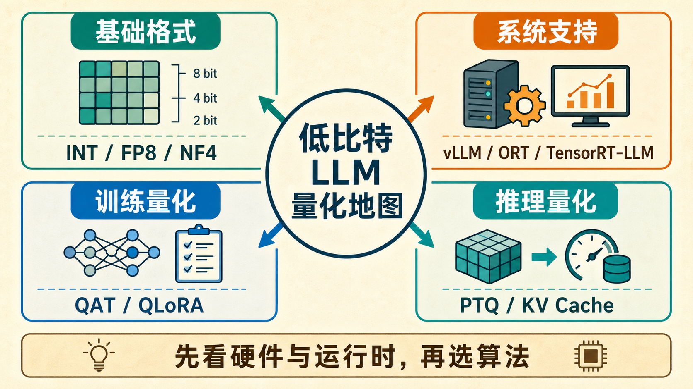

# 量化总览

量化的目标，是用更少的比特表示权重和激活，从而降低显存、带宽和推理成本。

{ width="920" }

**读图提示**：低比特量化不是单一算法，而是“数值格式、训练策略、推理策略、系统支持”共同决定的部署能力。真正落地时，先看硬件和 runtime 是否支持，再讨论 GPTQ、AWQ、QAT 或 KV cache 量化是否值得做。

!!! tip "基础知识入口"
    量化里的 `FP8`、`INT4`、显存、带宽、kernel 和 runtime 都可以先看 [数值、显存与运行时基础](../foundations/numerics-memory-and-runtime-basics.md)。如果涉及 QAT 或低比特训练，再补看 [优化与训练基础](../foundations/optimization-and-training-basics.md)。

## 1. 一个统一数学骨架

把浮点数 \(x\) 映射到整数 \(q\)：

\[
q = \text{round}\left(\frac{x}{s}\right) + z
\]

**反量化为**：

\[
\hat{x} = s(q-z)
\]

其中：

- \(s\) 是 scale
- \(z\) 是 zero-point

这看起来只是数值压缩，但真正要保住的是模型输出：

\[
Wx \approx \hat{W}\hat{x}
\]

也就是说，量化真正关心的不是单个参数值，而是最终算子的误差传播。

## 2. 为什么量化在大模型时代变成核心工程问题

因为大模型部署的成本主要集中在：

- 权重显存
- KV cache
- 带宽
- 推理吞吐

如果不做量化，一个 7B 或 13B 模型很快就会撞上部署门槛。

### 一个直观例子：7B 模型显存

若 7B 参数模型用 FP16 存储，权重约占：

\[
7 \times 10^9 \times 2 \text{ bytes} \approx 14 \text{ GB}
\]

若改成 INT4，则理论上只需约 3.5GB 左右，再加上量化元数据，整体仍会显著下降。这就是为什么“能不能量到 4bit 且还能用”在工程上这么重要。

## 3. 量化真正解决的不是压缩，而是部署边界

从研究视角看，量化像在研究数值逼近；从工程视角看，它更像在回答：

1. 模型能不能塞进目标硬件；
2. 并发能不能提高；
3. 带宽和显存是否不再是第一瓶颈；
4. 能否在不牺牲关键业务质量的前提下降本。

因此量化从来不是“压得越低越先进”，而是“在目标场景里压到多低仍然划算”。

## 4. 量化的三条主线

### 后训练量化 PTQ

模型训练完后再量化。优点是便宜、快、适合现成模型。

### 量化感知训练 QAT

在训练中显式模拟量化误差。优点是效果通常更稳，但训练成本更高。

### 量化底座上的适配训练

如 `QLoRA`。目标不是只部署，而是让量化模型还能继续做高效微调。

### 4.1 还有一条现实系统主线：混合精度

很多上线系统并不会全模型统一到同一比特，而是：

1. 权重量化；
2. 某些敏感层保留高精；
3. 激活维持更保守精度；
4. KV cache 单独做折中。

这条混合精度路线往往比“最小比特挑战”更接近真实工程。

## 5. 权重和激活是两个不同问题

### 权重量化

静态、离线、相对容易控制。

### 激活量化

动态、分布变化大、易受离群值影响。

很多系统先做权重量化，再视硬件和任务决定是否推进激活量化。

### 5.1 为什么激活更难

**因为激活分布会随**：

1. 输入长度；
2. prompt 类型；
3. 多模态输入结构；
4. 工具返回结果；
5. 长上下文记忆状态

持续变化。所以很多离线看起来稳定的量化方案，一到线上复杂请求就暴露问题。

## 6. 多模态和长上下文为什么让量化更复杂

**一旦系统进入**：

- 文档理解
- 图表与表格
- 屏幕代理
- 视频理解
- 机器人动作

量化的挑战就不再只是“平均精度掉多少”，而是：

1. 细粒度定位是否还准；
2. 数字一致性是否还在；
3. 长时动作是否更抖；
4. 长上下文和 KV cache 是否成为新瓶颈。

这也是为什么量化在多模态和具身系统里需要更谨慎的混合精度与专项评测。

## 7. 一个够用的理解方式

**量化本质上是在做一件事**：把不可避免的数值误差，尽量安排到模型最不敏感的地方去。

**这也是为什么后面会出现**：

- GPTQ
- AWQ
- SmoothQuant
- FP8
- 混合精度服务

这些方法其实都在回答同一个问题：

**误差到底该落在哪，才最不伤输出。**

## 8. 量化在系统中的位置

量化不是孤立模块，它会和下面几件事强耦合：

1. kernel 实现；
2. serving runtime；
3. KV cache 管理；
4. batching 和路由；
5. 目标硬件；
6. 线上评测与回退。

因此看量化方案时，不能只看论文压到几 bit，还要问：

1. 运行栈是否支持；
2. 系统是否真的更快；
3. 线上是否有可回退路径；
4. 高风险任务是否被保护。

## 9. 用低比特 LLM 综述补一层分类

arXiv:2409.16694 对低比特大语言模型量化做了一个很实用的整理：不要只按算法名字记，而要按**基础格式、系统支持、训练量化、推理量化**四条线来看。这个框架适合工程选型，因为它把“论文方法”和“能不能跑起来”放在同一张图上。

### 9.1 基础格式：先问数字怎么表示

基础格式回答的是“低比特数值本身长什么样”。常见选项包括：

1. `INT8 / INT4`：整数格式，工程生态成熟，适合权重和部分激活量化；
2. `FP8`：更接近浮点表达，常和新 GPU 的张量核心、混合精度服务结合；
3. `NF4`：常见于 QLoRA 等训练/微调场景，目的是让 4bit 更贴合权重分布；
4. block-wise / group-wise scale：把一大块张量拆成小组分别缩放，减少极值拖累。

这里最容易犯的错，是只比较 bit 数。`INT4` 的理论压缩率更高，但如果 scale 元数据、dequant 开销和 kernel 支持不理想，端到端收益未必比 `FP8` 或 `INT8` 更好。

### 9.2 系统支持：再问谁能高效执行

系统支持回答的是“这个低比特模型由谁跑”。同一个 `AWQ` 或 `GPTQ` checkpoint，在不同 runtime 里可能表现完全不同。你至少要确认：

1. runtime 是否原生支持该格式；
2. GEMM、attention、KV cache 是否有对应 kernel；
3. 目标硬件是否支持对应低精度指令；
4. batching、prefix cache、LoRA 和多模型调度是否仍然兼容。

这也是为什么本专题单独增加了 [量化运行时与框架](quantization-runtimes-and-frameworks.md)：`vLLM`、`SGLang`、`LightLLM`、`TensorRT-LLM`、`ONNX Runtime` 并不是“论文方法”，而是把量化收益兑现到服务系统里的关键层。

### 9.3 训练量化：让模型提前适应误差

训练量化包括 `QAT`、`QLoRA` 和一些量化友好的继续训练策略。它们关心的不是“能不能离线压缩”，而是：

1. 训练时是否显式模拟量化误差；
2. 量化底座上能否继续做任务适配；
3. 低资源微调是否仍能稳定收敛；
4. 高风险任务是否需要保留部分高精层。

如果业务质量门槛很高，单纯 PTQ 掉点不可接受，训练量化通常比继续硬压 bit 数更有价值。

### 9.4 推理量化：把在线瓶颈拆开处理

推理量化不只压权重，还可能压：

1. activation；
2. KV cache；
3. attention 中间张量；
4. MoE expert 权重；
5. 多模态 projector 或动作头。

一个很现实的例子是长上下文服务：权重量化后，模型也许已经能放进显存，但并发仍然上不去，因为 KV cache 随上下文长度线性膨胀。此时继续纠结 `W4A16` 和 `W8A8`，不如直接评估 KV cache 量化、prefix cache 和上下文裁剪。

## 10. 阅读建议

**建议顺序是**：

1. [PTQ 与权重量化](ptq-gptq-awq-smoothquant.md)
2. [QLoRA 与量化训练](qlora-and-quantized-training.md)
3. [QAT、Kernel 与 KV Cache](qat-kernels-and-kv-cache.md)
4. [激活离群值与校准策略](activation-outliers-and-calibration-strategies.md)
5. [服务栈与硬件权衡](serving-stacks-and-hardware-tradeoffs.md)
6. [量化运行时与框架](quantization-runtimes-and-frameworks.md)
7. [量化评测与部署清单](evaluation-and-deployment-checklist.md)

如果你关心多模态和具身，再补读：

1. [多模态与 VLA 模型量化](quantization-for-multimodal-and-vla-models.md)
2. [FP8 与混合精度服务](fp8-and-mixed-precision-serving.md)

## 11. 一个总判断

量化的真正价值，不在于把模型变成一个更小的文件，而在于把“原本难以部署、难以扩并发、难以降成本的系统”推回可运营区间。它既是数值近似问题，也是服务架构问题，更是业务取舍问题。理解量化，不能只盯住 bit 数，而要同时盯住误差传播、系统瓶颈和最终可交付收益。 

## 12. 延伸阅读

1. *A Survey of Low-bit Large Language Models: Basics, Systems, and Algorithms*：<https://arxiv.org/abs/2409.16694>
2. [量化运行时与框架](quantization-runtimes-and-frameworks.md)

## 快速代码示例

```python
import torch
from transformers import AutoModelForCausalLM, AutoTokenizer, BitsAndBytesConfig

model_id = "Qwen/Qwen2.5-7B-Instruct"
quant_cfg = BitsAndBytesConfig(
    load_in_4bit=True,
    bnb_4bit_quant_type="nf4",
    bnb_4bit_compute_dtype=torch.bfloat16,
)

tokenizer = AutoTokenizer.from_pretrained(model_id)
model = AutoModelForCausalLM.from_pretrained(
    model_id, quantization_config=quant_cfg, device_map="auto"
)
print("model footprint (GB):", model.get_memory_footprint() / 1024**3)
```

这段代码演示了 `bitsandbytes` 的 4bit 加载流程：`nf4` 用于权重量化，`bf16` 用于计算类型，最后用 `get_memory_footprint` 快速估算显存占用。部署前还应补充任务精度回归，确认压缩收益可接受。


## 学习路径与阶段检查

量化专题建议从“数值表示 -> 误差来源 -> 训练适配 -> runtime 兑现 -> 上线验收”推进。

| 阶段 | 先读 | 读完要能回答 |
| --- | --- | --- |
| 1. 数值和 PTQ | [PTQ 与权重量化](ptq-gptq-awq-smoothquant.md)、[激活离群值与校准策略](activation-outliers-and-calibration-strategies.md) | 权重、激活、scale、zero-point、离群值和 calibration 各自影响什么 |
| 2. 训练适配 | [QLoRA 与量化训练](qlora-and-quantized-training.md)、[QAT、Kernel 与 KV Cache](qat-kernels-and-kv-cache.md) | 什么时候 PTQ 不够，什么时候需要 QLoRA、QAT 或继续训练 |
| 3. 低精度服务 | [FP8 与混合精度服务](fp8-and-mixed-precision-serving.md)、[服务栈与硬件权衡](serving-stacks-and-hardware-tradeoffs.md)、[量化运行时与框架](quantization-runtimes-and-frameworks.md) | 量化格式、kernel、runtime 和硬件路径是否真的把显存收益转成吞吐收益 |
| 4. 场景验收 | [多模态与 VLA 模型量化](quantization-for-multimodal-and-vla-models.md)、[评测与部署清单](evaluation-and-deployment-checklist.md) | 长上下文、多模态、agent、动作控制和高价值任务桶是否单独验收 |

真正可上线的量化方案必须同时给出四件事：压缩对象、目标硬件和 runtime、端到端收益、回退边界。只报告 bit 数或平均 benchmark，通常不足以支撑部署决策。
