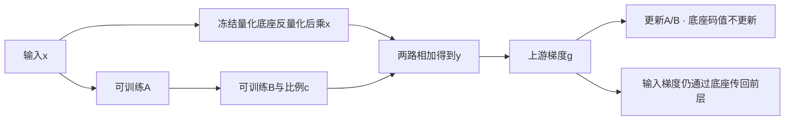

# QLoRA 中，冻结的 4-bit 权重怎样参与训练

一个线性层有4096个输入和4096个输出，共约1678万个权重。仅用 BF16 保存，就需要32 MiB；若每个权重只存4 bit，码值占8 MiB，还要另加尺度等元数据。QLoRA 利用这个差别保存冻结底座，再训练一个较小的低秩增量。

## 先写出前向计算

设底座权重 $W_0\in\mathbb R^{d_{out}\times d_{in}}$，量化码与元数据记为 Q，反量化结果为 $\hat W_0=D(Q)$。LoRA 使用 $A\in\mathbb R^{r\times d_{in}}$、$B\in\mathbb R^{d_{out}\times r}$，对列向量输入 x 计算

$$
y=\hat W_0x+cBAx,\qquad c=\alpha/r.
$$

Q 在训练中冻结，A、B 可以更新。底座低比特存储、矩阵乘的计算 dtype、累加 dtype 是不同选择。QLoRA 的官方脚本通过 `BitsAndBytesConfig` 分别设置4-bit加载、量化类型、double quant和计算dtype，再用 PEFT 加入 LoRA 层。

对于4096×4096、r=8的例子，A与B合计 $8(4096+4096)=65536$ 个参数，只占原矩阵参数量的约0.39%。这部分还需要梯度和优化器状态，激活也仍占显存，所以整次训练不会简单缩到原来的四分之一。

{ width="760" }

<small>图源：[QLoRA: Efficient Finetuning of Quantized LLMs](https://arxiv.org/abs/2305.14314)，Figure 1。原图表达：对比 32-bit/16-bit 全量微调、LoRA 与 QLoRA 的显存组织；QLoRA 将冻结底座量化存储，只训练 adapter，并用 paged optimizer 缓解峰值。读图重点：看哪些参数“会训练”，哪些只是“低比特常驻”。</small>

## 冻结权重仍然要传递输入梯度

令上游梯度 $g=\partial L/\partial y$。链式法则给出

$$
\frac{\partial L}{\partial B}=cg(Ax)^\top,\qquad
\frac{\partial L}{\partial A}=c(B^\top g)x^\top,
$$

$$
\frac{\partial L}{\partial x}=(\hat W_0+cBA)^\top g.
$$

冻结底座表示不更新 $W_0$，并不表示梯度在这一层被截断。输入梯度还要穿过底座的线性映射，才能训练更早层的 adapter。这里的导数使用反量化后的近似权重，不需要对冻结的离散码值求梯度。

取 r=1、$A=[1,0]$、B初始全零、$x=[2,3]^\top$，c=1。此时 Ax=2，$\partial L/\partial B=2g$，但 $\partial L/\partial A=0$。第一步先让B离开零，后续A才能从这条路径获得非零梯度。这解释了常见“一侧随机、另一侧置零”初始化为何初始输出不变且仍能开始学习；若A和B都置零，则两边梯度都会卡住。

<!-- systems-workflow-visual -->

```mermaid
flowchart LR
  X["输入x"] --> W["冻结量化底座反量化后乘x"]
  X --> A["可训练A"] --> B["可训练B与比例c"]
  W --> Y["两路相加得到y"]
  B --> Y
  Y --> G["上游梯度g"] --> U["更新A/B · 底座码值不更新"]
  G --> DX["输入梯度仍通过底座传回前层"]
```

冻结参数与截断输入梯度是不同操作。QLoRA保留经过底座的输入梯度。

## NF4、double quant 与分页各减少哪一项

NF4 使用适配近似正态权重分布的非均匀码本。4-bit 数字表示码本索引，反量化需要查表并乘上块尺度，不能套用一个均匀整数格距解释全部码值。

Double quantization 进一步压缩量化尺度等统计量。它影响元数据存储，不能被理解为把模型连续做两次任意量化。Paged optimizer 借助分页内存机制处理优化器状态的内存压力；数据发生迁移时仍有开销，也不意味着激活显存无需考虑。

官方脚本还把部分 norm 模块转为 FP32，并按配置处理 adapter dtype。这说明“4-bit训练”不足以描述完整计算图。实际实验应记录量化类型、计算dtype、LoRA目标模块、rank、序列长度与checkpoint设置。

## 保存 adapter 后，推理要装回哪个底座

A、B是在固定的 $\hat W_0$ 上学习到的。换成另一个底座版本、不同量化格式或不同tokenizer，即使adapter文件能加载，也可能改变函数。保存时应记录底座身份与量化配置。

如果部署选择把增量合并为 $\hat W_0+cBA$，再重新量化，得到的是一个新近似。原先分开执行的结果与重新打包后的结果未必一致，需要重新比较输出和任务质量。若保持独立adapter，则runtime要支持对应低比特底座与adapter路径。

读[QAT](qat-kernels-and-kv-cache.md)时可用这个区别定位目标。QLoRA优化的是冻结近似底座上的增量；QAT会在训练前向模拟离散误差，让可训练参数适应目标量化路径。

## 对照源码与延伸阅读

- [QLoRA 官方加载、dtype 与 LoRA 注入实现](https://github.com/artidoro/qlora/blob/7f4e95a68dc076bea9b3a413d2b512eca6d004e5/qlora.py)
