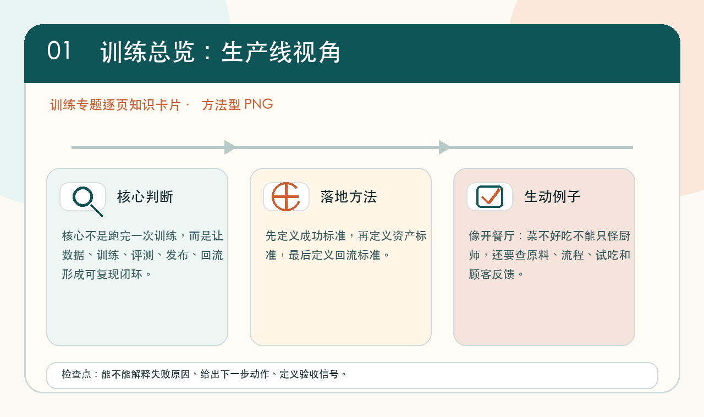
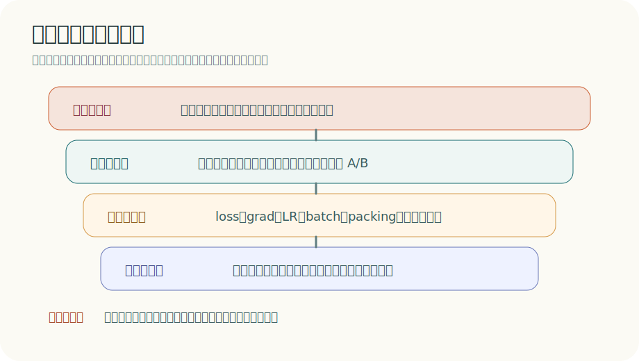

# 训练总览

<div class="atlas-hero">
  <div class="atlas-kicker">Training Systems</div>
  <p class="atlas-lead">这一专题围绕大模型训练的完整生产线展开：从预训练、SFT、对齐，到 Megatron-LM、DeepSpeed、输入管线、稳定性、checkpoint 与评测方法学。</p>
  <div class="atlas-chip-row">
    <span class="atlas-chip">预训练</span>
    <span class="atlas-chip">系统栈</span>
    <span class="atlas-chip">数据配方</span>
    <span class="atlas-chip">稳定性</span>
  </div>
</div>

## 专题定位

<div class="atlas-meta-grid">
  <div>
    <strong>核心问题</strong>
    <p>如何在给定数据、模型和算力预算下，把训练做成稳定、可恢复、可解释且能迁移到真实任务的系统。</p>
  </div>
  <div>
    <strong>适合读者</strong>
    <p>适合正在做预训练、后训练、数据治理、分布式训练或训练基础设施的人。</p>
  </div>
  <div>
    <strong>阅读方式</strong>
    <p>建议先读总览与系统栈页，再进入数据、优化器、并行、评测和回流体系。</p>
  </div>
</div>

## 推荐入口

<div class="atlas-card-grid">
  <a class="atlas-card" href="pretraining-finetuning-alignment/">
    <strong>预训练、微调与对齐</strong>
    <p>先建立训练阶段分工，明确哪些问题该回看底座，哪些问题该回看 SFT 与偏好对齐。</p>
  </a>
  <a class="atlas-card" href="mtp-and-speculative-decoding/">
    <strong>MTP 与投机解码</strong>
    <p>把多 token 预测当成训练目标来理解，并判断它何时能真正换回推理收益。</p>
  </a>
  <a class="atlas-card" href="low-bit-training-and-numerics/">
    <strong>低比特训练与训练数制</strong>
    <p>把 FP8、FP4、MXFP、NVFP、activation、optimizer states 和 kernel 放回训练稳定性里看。</p>
  </a>
  <a class="atlas-card" href="page-by-page-visual-guide/">
    <strong>逐页通俗图解</strong>
    <p>按训练专题每一页做白话解释、生活化例子和配图入口，适合先建立直觉再看细节。</p>
  </a>
  <a class="atlas-card" href="megatron-lm-deepspeed-and-open-training-stacks/">
    <strong>Megatron-LM、DeepSpeed 与训练系统栈</strong>
    <p>理解 TP、PP、ZeRO、FSDP、CP 等系统栈如何决定训练规模上限。</p>
  </a>
  <a class="atlas-card" href="input-pipelines-packing-and-throughput-governance/">
    <strong>输入管线、Packing 与吞吐治理</strong>
    <p>快速定位 GPU 为什么吃不满，以及有效 token 利用率为什么经常比显存更早出问题。</p>
  </a>
</div>

## 图解预览

如果你只是打开了“训练总览”页，之前新增的大部分图片都在 [逐页通俗图解](page-by-page-visual-guide.md) 里。这里先放几张总览图，方便确认图片资源是否正常加载。

{ width="920" }

{ width="920" }

{ width="920" }

**训练的核心是**：给定数据、模型和算力预算，如何让损失稳定下降，并最终迁移到真实任务。

**一个统一抽象是经验风险最小化**：

\[
\min_\theta \mathbb{E}_{(x,y)\sim \mathcal{D}}[\ell(f_\theta(x), y)]
\]

但在大模型时代，训练从来不只是目标函数。真正影响结果的，是一整套系统：

1. 数据清洗；
2. 采样混合；
3. 优化器与学习率；
4. batch 组织与 packing；
5. 分布式训练与容错；
6. 后训练与对齐；
7. 算子、kernel 与编译栈。

也就是说，训练不是“把样本喂给模型”这么简单，而是把能力目标、数据生产线、优化过程和系统资源组织成一条长期运转的生产线。

!!! tip "基础知识入口"
    如果你对 loss、backprop、optimizer、mixed precision 或 checkpoint 的角色还不稳，先看 [优化与训练基础](../foundations/optimization-and-training-basics.md) 和 [自动微分、激活显存与 Checkpointing](../foundations/autograd-activation-checkpointing-and-memory.md)。如果问题涉及显存、带宽和 kernel，再接着看 [数值、显存与运行时基础](../foundations/numerics-memory-and-runtime-basics.md)。

## 1. 训练要解决的不是一个问题，而是三层问题

### 能力问题

模型能不能学到足够强的基础表示。

这一层讨论的是模型的**知识边界、抽象能力和迁移上限**。它通常和预训练数据覆盖、tokenizer、上下文长度、模态接口、参数规模以及训练 token 总量直接相关。一个模型如果在代码补全、长文档理解、跨语言迁移或多模态对齐上始终上不去，很多时候不是“回答风格不对”，而是底层表示空间本身还没有长出足够好的结构。

能力问题还有一个特点：它往往**不能靠局部修饰补回来**。SFT 可以把已有能力组织得更像样，对齐可以把行为边界收得更稳，但如果底层世界知识、结构先验或长程依赖能力本来就弱，后训练通常只能做有限修补。

### 行为问题

模型会不会按任务要求输出。

这一层更关注**能力如何被调动出来**。同样一个底座模型，可以因为提示格式、SFT 数据风格、偏好目标、拒答策略和工具调用协议不同，而表现出截然不同的外部行为。也就是说，行为问题不一定意味着模型“不会”，也可能意味着它**不会以你希望的方式表现出来**。

这也是为什么很多团队会把“模型答非所问”“格式不稳定”“工具调用漏步”“拒答过多或过少”归到 SFT 和对齐阶段去处理。行为问题的关键，不是继续堆更多无差别预训练，而是把任务接口、期望输出和风险边界写清楚，再用更贴近任务的数据和目标去塑形。

### 系统问题

训练能不能稳定、可复现、高吞吐地跑完。

这层决定的是**训练资产能否成立**。一个模型即使目标函数合理、数据也不错，如果吞吐波动极大、checkpoint 语义不清、恢复后统计口径变了、低精度数值路径频繁出错，最终得到的结论也很难信。大规模训练里，很多最贵的问题并不是 loss 没降，而是花了很多 GPU 小时之后才发现实验其实不可比。

系统问题还决定了团队能否进行有效迭代。只有当数据版本、配置版本、并行策略、恢复逻辑和评测流水线足够稳定时，训练结果才会从“偶然跑成一次”变成“可复验、可迁移、可复用的能力生产线”。

**这三层分别对应后面常见的**：

1. 预训练；
2. SFT / 对齐；
3. 数据、优化与分布式系统。

### 1.1 为什么这三层必须拆开看

因为很多问题表面相似，但成因完全不同。比如“模型表现不好”可能来自：

1. 基础表示没学够；
2. 后训练行为边界没立住；
3. 数据混合比有偏；
4. 训练中 packing、去重或 checkpoint 恢复导致隐藏偏差；
5. 分布式训练配置和 kernel 路径让你根本没有高效看到足够有效 token。

如果不先拆层，优化方向很容易跑偏。

一个很常见的误区是，把所有问题都抽象成“再加一点数据”“再训久一点”或者“再做一轮对齐”。但现实中，不同层的问题对应的证据完全不同。能力问题更看重预训练损失、跨任务迁移和长上下文/新领域泛化；行为问题更依赖任务样本、拒答样本、格式约束和 judge 评测；系统问题则需要看吞吐、稳定性、重试率、恢复一致性和资源效率。证据链不同，解决方式也必然不同。

因此，训练分析最重要的习惯之一就是**先分层再归因**。只要这一步做得不稳，后面无论是加数据、改目标还是换并行策略，都容易在错误层面上用力。

## 2. 一个直观例子：训练代码模型

真正影响效果的往往不只是 loss 公式，还有：

1. GitHub 代码去重是否干净；
2. 文档和代码比例是否合理；
3. 长文件是否被截断；
4. 指令数据是否会破坏代码风格；
5. loader 是否能高效处理大文件；
6. 分布式训练是否允许足够长上下文。

这说明“训练效果”常常是数据工程和优化工程共同作用的结果。

### 2.1 再看一个多模态例子

训练文档 VLM 时，效果不仅取决于模型架构，还取决于：

1. OCR 是否稳定；
2. 文本与图像是否对齐；
3. 表格与图表是否被正确保留；
4. 合成数据是否引入模板偏差；
5. 后训练是否过度追求对话流畅而损伤结构准确性；
6. 多模态 batch 和 packing 是否高效。

这说明训练并不是“换个 backbone”就能解释的单变量问题。

## 3. 从大图景看训练流程

**很多现代模型训练可以概括成**：

\[
\text{Pretraining} \rightarrow \text{SFT} \rightarrow \text{Preference Alignment}
\]

**同时整条链路又依赖**：

\[
\text{Data} + \text{Optimization} + \text{Systems}
\]

也就是说，训练不是一个阶段，而是一条生产线。

### 3.1 这条生产线为什么越来越长

因为模型不再只是“学会预测下一个 token”，而是被要求：

1. 会对话；
2. 会遵循格式；
3. 会调用工具；
4. 会拒答高风险问题；
5. 会在特定领域表现稳定；
6. 会在真实系统里以合理成本运行。

这些能力无法只靠单一预训练阶段自然长出来。

## 4. 一个够用的判断框架

当模型出现问题时，可以先问它属于哪一层：

1. **能力边界不够**：多半回看预训练；
2. **输出格式和行为不对**：多半回看 SFT；
3. **风格、保守性、拒答边界异常**：多半回看对齐；
4. **loss、吞吐、稳定性异常**：多半回看优化和数据系统；
5. **大规模训练成本太高**：多半回看并行、checkpoint、kernel 与通信。

### 4.1 再往下追问三件事

对每个问题，再继续问：

1. 这是数据问题，还是目标函数问题？
2. 这是训练阶段问题，还是评测口径问题？
3. 这是模型能力问题，还是系统实现问题？

很多“模型不行”的结论，经不起这三问。

## 5. 为什么训练里最难的是资源分配

训练系统最终总会落回“有限资源如何分配”：

1. 算力分给更大模型还是更长训练；
2. 数据预算分给更多样本还是更高质量标注；
3. 系统工程时间分给吞吐优化还是评测重建；
4. 后训练时间分给偏好对齐还是工具使用；
5. 算子优化时间分给主干 GEMM、attention，还是 loader 和数据系统。

这也是为什么训练方向总和实验经济学、数据治理和服务成本紧紧绑定。

## 6. 为什么这组文档要拆成多页

因为训练里至少有四块逻辑明显不同：

### 训练阶段逻辑

预训练、SFT、DPO 等，是“模型学什么”。

这部分回答的是能力和行为如何被分阶段塑造。预训练负责打底，SFT 负责让模型更贴近任务接口，偏好对齐负责在多种候选输出之间学会“更像人想要的那一种”。把这些阶段拆开，不是为了制造流程复杂度，而是为了避免把不同目标硬塞进同一个损失里，最后谁都学不好。

### 优化与系统逻辑

batch、packing、学习率、checkpoint、并行、恢复，是“训练怎么跑”。

这一层更偏执行语义。模型同样大、数据同样多，训练曲线和最终能力也可能因为 batch 组织、effective token 利用率、恢复语义、梯度缩放和分布式通信策略而显著不同。很多“方法创新”最后之所以能跑出来，前提恰恰是系统层先把吞吐和稳定性做对了。

### 数据与评测逻辑

去重、混合、回流、ablation、judge、数据版本，是“训练凭什么可信”。

训练不是把样本倒进去就结束，真正困难的是决定**哪些样本应该进来、按什么比例进来、出了问题该回流什么**。而评测则决定团队能否分辨“看起来更好了”和“实际上更有用了”之间的差别。没有数据与评测逻辑，训练很容易变成一组无法解释的曲线和 checkpoint。

### 算子与实现逻辑

kernel、通信、Triton、CUDA、量化与编译栈，是“训练为什么能跑得动”。

这层经常被误以为只是底层细节，但在大规模训练里，它直接影响能否开更长上下文、能否压低显存、能否把 overlap 做实，以及能否在同样预算下看到更多有效 token。很多训练设计之所以成立，并不是因为论文公式更优雅，而是因为底层算子和运行时真的支撑住了它。

把这几块混在一起，会让很多工程判断失真。

## 7. 训练文档在本知识库里的位置

这里的训练章节不是只讲神经网络教科书，而是专门围绕基础模型和系统化训练问题组织。你会看到：

1. 预训练、微调与对齐之间的关系；
2. `MTP` 这类辅助训练目标如何与投机解码、服务时延和模型结构联动；
3. `FP8 / FP4 / MXFP / NVFP` 这类低比特训练路线如何影响 activation、梯度、优化器状态和 kernel；
4. `Megatron-LM`、`DeepSpeed`、`ZeRO`、TP/PP/CP 等训练系统栈如何支撑大规模训练；
5. 集群运维、实验管理与成本治理如何决定研究效率和复现可信度；
6. 输入管线、packing 与 token 利用率如何决定真实吞吐；
7. 训练稳定性、低精度路径和故障排查如何避免高代价失败；
8. 数据系统与优化如何影响最终能力；
9. scaling、课程学习与数据混合如何塑造能力结构；
10. 分布式训练、checkpoint 与容错为何是主问题；
11. 后训练数据引擎和 judge 如何影响行为质量；
12. 评测与消融为什么决定训练结论是否可信；
13. 这些训练决策最终如何落到算子、编译器和推理服务上。

## 8. 和“算子与编译器”专题是什么关系

新补进去的算子专题，并不是和训练专题平行无关的一组低层笔记。它解决的是训练里一个经常被忽略的问题：

1. 为什么某些训练吞吐上不去；
2. 为什么某些量化路径训练不稳；
3. 为什么分布式 overlap 做了仍然不快；
4. 为什么长上下文训练最后卡在 attention 和内存系统。

也就是说，训练专题回答“为什么要这样训”，算子专题回答“为什么这套训练系统能跑起来”。

二者之间最重要的接口，其实是**训练目标最终会被执行路径重写**。例如你以为自己在比较两套优化器，真实差异可能来自 fused optimizer kernel；你以为自己在比较不同上下文长度，真正卡住的是 attention kernel 和显存布局；你以为自己在比较不同并行策略，性能差距却是由 all-reduce overlap、通信拓扑和 runtime dispatch 决定的。

因此，把训练和算子拆成两个专题，只是为了让逻辑更清楚，不代表它们彼此独立。成熟的训练分析，最终一定会追到 kernel、编译器和通信；成熟的算子优化，也一定要回到训练目标、训练负载和训练闭环里看价值。

## 9. 推荐阅读顺序

**建议先读**：

1. [预训练、微调与对齐](pretraining-finetuning-alignment.md)
2. [MTP 与投机解码](mtp-and-speculative-decoding.md)
3. [低比特训练与训练数制](low-bit-training-and-numerics.md)
4. [Megatron-LM、DeepSpeed 与开放训练系统栈](megatron-lm-deepspeed-and-open-training-stacks.md)
5. [集群运维、实验管理与成本治理](cluster-operations-and-experiment-management.md)
6. [输入管线、Packing 与吞吐治理](input-pipelines-packing-and-throughput-governance.md)
7. [训练稳定性、数值异常与故障排查](stability-numerics-and-failure-triage.md)
8. [数据系统与优化](data-systems-and-optimization.md)
9. [Scaling、课程学习与数据混合](scaling-curriculum-and-data-mixture.md)
10. [目标函数、优化器与学习率日程](objectives-optimizers-and-schedules.md)
11. [分布式训练与 Checkpoint](distributed-training-and-checkpointing.md)
12. [评测与消融方法学](evaluation-and-ablation-methodology.md)

如果你关注部署前的数据闭环，再继续看：

1. [数据质量、去重与治理](data-quality-dedup-and-governance.md)
2. [后训练数据引擎与 Judge 模型](post-training-data-engines-and-judge-models.md)
3. [Scaling Law 与实验经济学](scaling-laws-and-experiment-economics.md)

如果你开始关心训练为什么会被硬件和 kernel 塑形，就继续看：

1. [算子与编译器总览](../operators/index.md)

## 10. 一个总判断

训练不是“把数据喂给模型”那么简单，而是把能力目标、数据结构、优化过程和系统资源组织成一条长期运转的生产线。真正成熟的训练体系，不只是能把 loss 跑下去，而是能解释为什么它会下去、为什么它值得相信，以及为什么它最终能转化成真实系统中的能力与收益。

而一旦规模足够大，这条生产线就会自然延伸到更底层的问题：并行、通信、kernel、量化、编译器、缓存和部署。理解训练，最终一定会理解系统；理解系统，也反过来会帮助你重新理解训练。

## 快速代码示例

```python
import deepspeed

ds_config = {
    "train_micro_batch_size_per_gpu": 2,
    "gradient_accumulation_steps": 8,
    "bf16": {"enabled": True},
    "zero_optimization": {"stage": 2},
}

engine, optimizer, _, _ = deepspeed.initialize(
    model=model,
    model_parameters=model.parameters(),
    config=ds_config,
)

for batch in train_loader:
    loss = engine(**batch).loss
    engine.backward(loss)
    engine.step()
```

这段代码展示了 DeepSpeed 的标准训练环：`initialize` 注入并行与 ZeRO 配置，循环中用 `engine.backward/step` 管理梯度与参数更新。相比原生 PyTorch，它把通信、分片和混合精度细节统一封装到 engine 内。


## 学习路径与阶段检查

训练专题建议按“阶段 -> 系统 -> 数据评测 -> 经济学”的顺序读，不要一开始就陷入单个框架或超参。

| 阶段 | 先读 | 读完要能回答 | 下一站 |
| --- | --- | --- | --- |
| 1. 训练阶段 | [预训练、微调与对齐](pretraining-finetuning-alignment.md)、[目标函数、优化器与学习率日程](objectives-optimizers-and-schedules.md) | 能力、行为、对齐分别由哪些数据和目标塑造 | [评测与消融方法学](evaluation-and-ablation-methodology.md) |
| 2. 系统执行 | [Megatron-LM、DeepSpeed 与开放训练系统栈](megatron-lm-deepspeed-and-open-training-stacks.md)、[分布式训练与 Checkpoint](distributed-training-and-checkpointing.md) | TP/PP/DP/ZeRO/FSDP、checkpoint 和恢复语义如何影响可复现性 | [算子与编译器总览](../operators/index.md) |
| 3. 数据闭环 | [数据质量、去重与治理](data-quality-dedup-and-governance.md)、[输入管线、Packing 与吞吐治理](input-pipelines-packing-and-throughput-governance.md)、[后训练数据引擎与 Judge 模型](post-training-data-engines-and-judge-models.md) | 数据版本、混合比例、packing 和 judge 是否支撑同一套能力目标 | [推理总览](../inference/index.md) |
| 4. 成本与稳定性 | [训练稳定性、数值异常与故障排查](stability-numerics-and-failure-triage.md)、[Scaling Law 与实验经济学](scaling-laws-and-experiment-economics.md)、[低比特训练与训练数制](low-bit-training-and-numerics.md) | 一次训练失败是数值、数据、并行、硬件还是实验设计问题 | [量化总览](../quantization/index.md) |

读完训练模块后，最重要的不是记住某个训练框架，而是能把一次实验写成可复验资产：数据快照、配置、并行策略、checkpoint 恢复口径、评测桶、回滚条件和上线前转换路径都要能对上。
