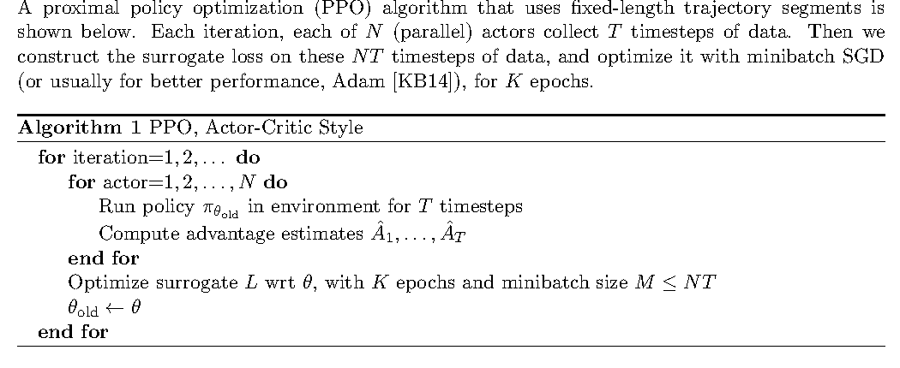
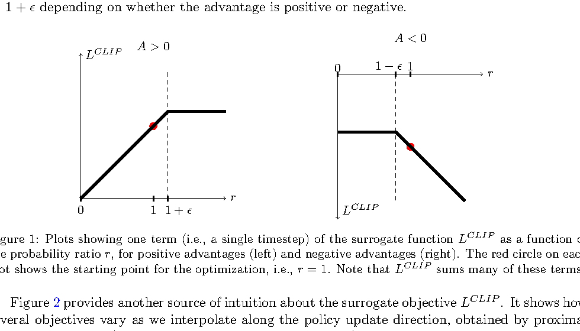
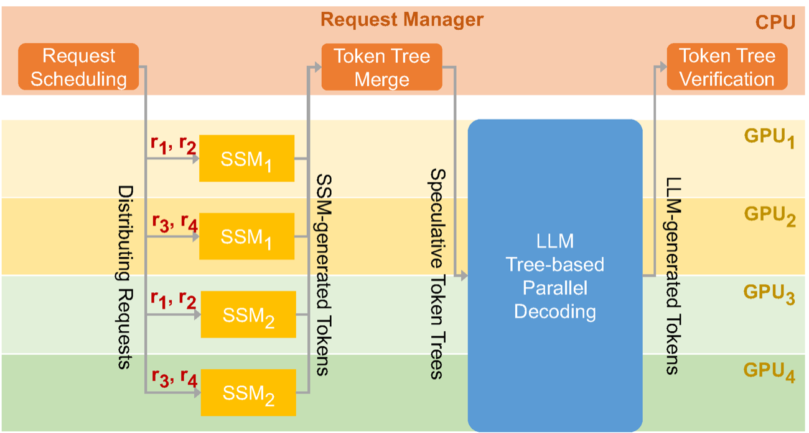
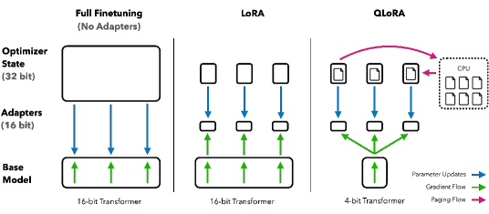
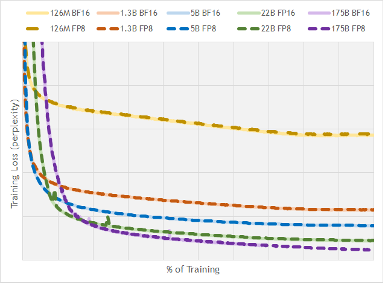
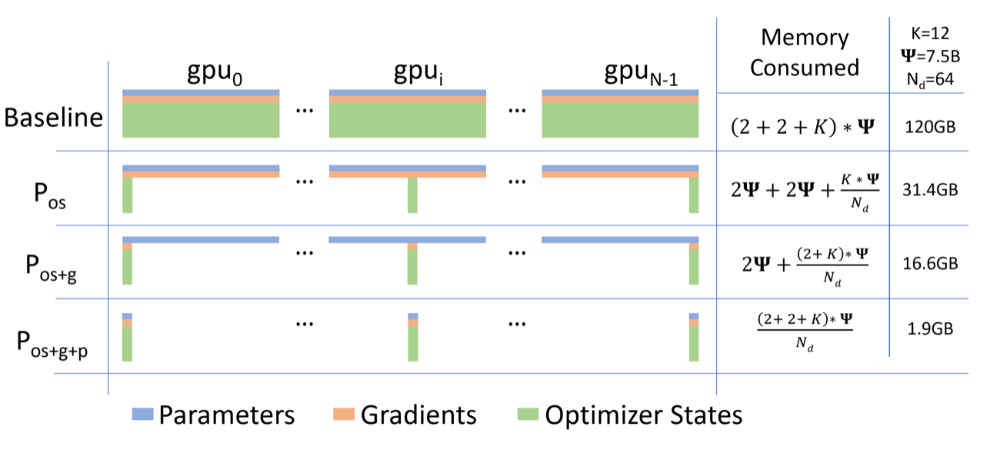
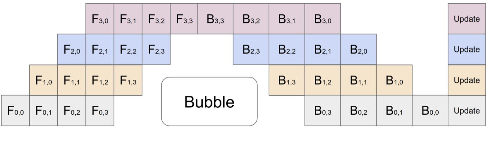
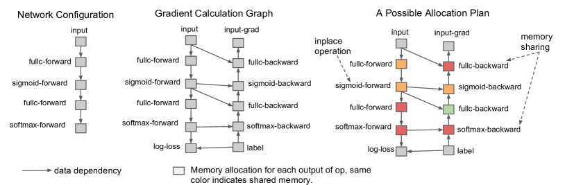
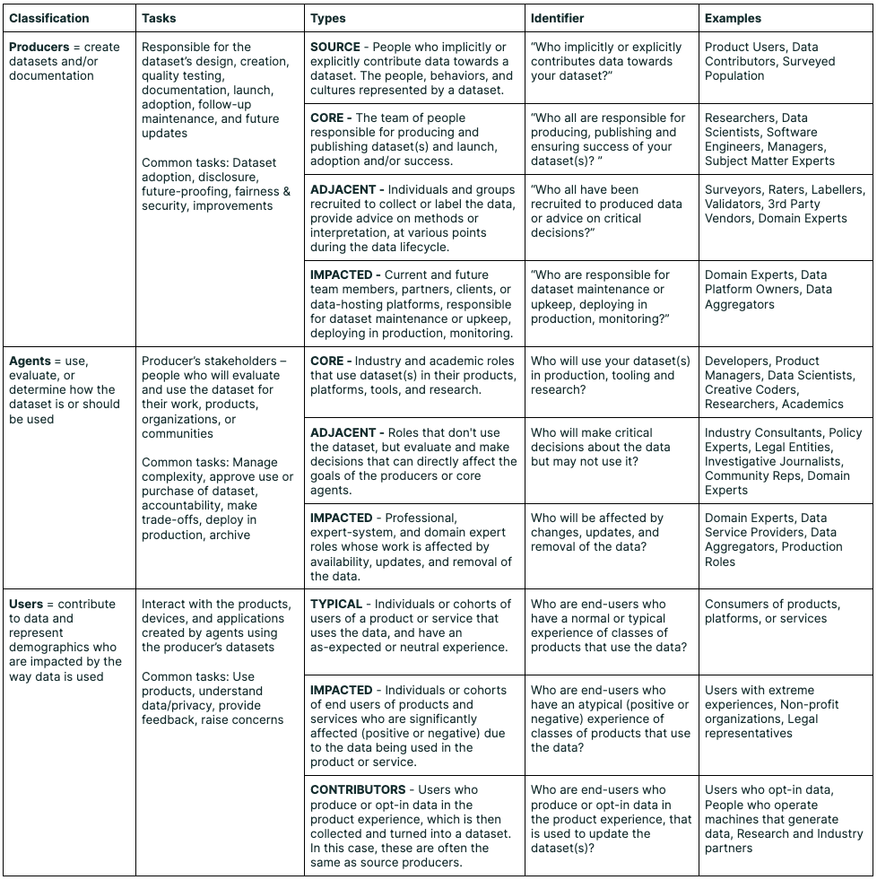

# 训练专题论文原图阅读索引

这页原来承担“逐页图解”的作用。现在统一改成论文原图索引：只保留来自论文、论文项目页或公共学术资料的图，并在每张图下解释它对应训练专题里的哪类知识点。

读法很简单：先看图，再回到对应页面。训练专题很多问题都可以归到四条主线：

1. 算力预算：参数、token、训练 FLOP 怎么配平。
2. 训练阶段：预训练、SFT、偏好建模、RLHF 各自解决什么。
3. 系统约束：显存、并行、pipeline、checkpoint 和恢复。
4. 数值与验证：低精度、稳定性、评测、数据质量和消融。

!!! note "为什么不用概括插图"
    概括图适合快速沟通，但容易把论文里的关键假设画平。训练系统尤其依赖原始图表里的坐标轴、实验条件和对照对象，所以这里优先使用论文图。没有足够贴合的论文图时，页面宁可只保留文字清单，也不再用概括插图补位。

## 1. 训练预算与 scaling law

对应页面：[训练总览](index.md)、[Scaling Law 与实验经济学](scaling-laws-and-experiment-economics.md)、[集群运维与实验管理](cluster-operations-and-experiment-management.md)。

{ width="920" }

<small>图源：[Training Compute-Optimal Large Language Models](https://arxiv.org/abs/2203.15556)，Figure 4。原论文图意：固定 FLOP 预算时，不同模型大小会对应不同最终 loss；曲线谷底给出该预算下更合适的参数量，并外推出参数和 token 的 scaling 关系。</small>

!!! note "图解：预算不是只给参数"
    这张图是训练专题最重要的入口图。它告诉你：在固定算力下，模型太小会容量不足，模型太大又会因为 token 不够而欠训练。数据配方、packing、吞吐治理和实验经济学，本质上都在服务同一个问题：有限 GPU 小时应该怎样分配给参数规模和有效 token。

{ width="620" }

<small>图源：[Training Compute-Optimal Large Language Models](https://arxiv.org/abs/2203.15556)，Figure 15。原论文图意：在固定训练 FLOP 预算下，三种估计方法给出相近的最优 token 数和参数量关系。</small>

!!! note "图解：实验经济学要有 Stop/Go 标准"
    如果小规模趋势已经显示 token 不足、数据质量不稳或 loss 曲线外推不合理，就不应该只靠“更大规模可能会好”继续烧预算。Scaling law 图的价值不是鼓励盲目扩规模，而是把扩规模变成可审查的经济决策。

## 2. 预训练、SFT、偏好与 RLHF

对应页面：[预训练、微调与对齐](pretraining-finetuning-alignment.md)、[后训练数据引擎与 Judge](post-training-data-engines-and-judge-models.md)、[偏好数据与对齐陷阱](preference-data-and-alignment-pitfalls.md)。

{ width="920" }

<small>图源：[Training language models to follow instructions with human feedback](https://arxiv.org/abs/2203.02155)，Figure 2。原论文图意：展示 InstructGPT 的三步训练流程：收集 demonstration data 做 SFT，收集模型输出排序训练 reward model，再用 PPO 按 reward model 优化 policy。</small>

!!! note "图解：SFT、RM、RLHF 不是同一份数据做三遍"
    Step 1 的 demonstration data 教模型“应该怎样回答”；Step 2 的 comparison data 教 reward model 判断“哪个回答更好”；Step 3 的 PPO 用 reward model 给 policy 提供优化信号。偏好数据页讨论的很多坑，例如标注口径、奖励黑客、过度拒答和能力回退，都发生在 Step 2 和 Step 3 的接口处。初学者要先分清：SFT 数据是示范，偏好数据是比较，RLHF 是用比较学出的奖励来更新策略。

{ width="860" }

<small>图源：[Training language models to follow instructions with human feedback](https://arxiv.org/abs/2203.02155)，Appendix Figure 19(b)。原论文图意：标注者在同一个 prompt 下比较多个模型输出，并把它们从最好到最差排序；这种排序数据用于训练 reward model。</small>

!!! note "图解：偏好数据是比较出来的"
    初学者容易把 reward 想成客观分数，但 InstructGPT 的 reward model 训练首先来自人类排序。它学到的是“同一问题下哪个回答更好”的相对偏好，而不是绝对真理。排序标准一旦偏向长答案、保守答案或固定格式，reward model 和后续 PPO 都会把这种偏差放大。

{ width="760" }

<small>图源：[Proximal Policy Optimization Algorithms](https://arxiv.org/abs/1707.06347)，Algorithm 1。原论文图意：多个 actor 用旧策略收集固定长度轨迹，计算 advantage estimates，再用若干个 minibatch epoch 优化 surrogate objective，最后把旧策略更新为当前策略。</small>

!!! note "图解：PPO 是用奖励做小步策略更新"
    在 RLHF 里，actor 可以理解成当前语言模型对一批 prompts 采样回答；advantage 表示某次回答相对预期好多少；surrogate objective 用来更新 policy。PPO 的重点不是“奖励越高改得越猛”，而是通过旧策略、概率比率、clip 和 KL 约束让更新保持在可控范围内。

{ width="760" }

<small>图源：[Proximal Policy Optimization Algorithms](https://arxiv.org/abs/1707.06347)，Figure 1。原论文图意：展示 clipped surrogate objective 中单个 timestep 项如何随概率比率 \(r\) 变化；当 advantage 为正或负时，clip 会限制策略概率变化带来的收益。</small>

!!! note "图解：clip 防止模型被奖励牵着跑太远"
    概率比率 \(r\) 表示新策略相对旧策略把同一动作概率改了多少。advantage 为正时，模型倾向提高该动作概率；advantage 为负时，倾向降低。clip 会限制这种变化带来的优化收益。放到 RLHF 里，它和 KL 约束一起防止模型为了讨好 reward model 而突然远离 SFT/reference 模型。

## 3. MTP、投机执行与推理联动

对应页面：[MTP 与投机解码](mtp-and-speculative-decoding.md)、[推理缓存、路由与投机执行](../inference/caching-routing-and-speculative.md)。

{ width="920" }

<small>图源：[SpecInfer: Accelerating Generative Large Language Model Serving with Speculative Inference and Token Tree Verification](https://arxiv.org/abs/2305.09781)，Figure 3。原论文图意：多个小型 speculative models 先生成 token tree，request manager 合并候选树，再由大模型做 tree-based parallel decoding 和 verification。</small>

!!! note "图解：训练目标和上线收益要用 acceptance 连接"
    MTP 让模型训练时学习多个未来 token，投机执行让服务系统用便宜路径先猜、大模型再验证。两者能不能结合，不取决于“平均能多预测几个 token”，而取决于分桶 acceptance、verify 开销、KV 生命周期和 p95/p99 延迟。SpecInfer 图里的 token tree 很适合提醒你：推理加速不是只看模型结构，还要看调度器如何合并候选、验证和回退。

## 4. 低比特训练与数值稳定

对应页面：[低比特训练与训练数制](low-bit-training-and-numerics.md)、[数值、显存与运行时基础](../foundations/numerics-memory-and-runtime-basics.md)。

{ width="720" }

<small>图源：[QLoRA: Efficient Finetuning of Quantized LLMs](https://arxiv.org/abs/2305.14314)，Figure 1。原论文图意：QLoRA 冻结量化底座，只训练 adapter，并用分页优化器缓解训练时的显存峰值。</small>

!!! note "图解：低比特训练先拆显存账"
    低比特训练不只是把权重压小。底座权重、adapter、optimizer states、activation、paged optimizer 峰值都会影响是否能训、能训多大 batch、能否稳定恢复。QLoRA 图适合建立一个实用直觉：训练显存由多类状态叠加而来，压低某一类状态后，还要看其他状态是否变成新瓶颈。

{ width="760" }

<small>图源：[FP8 Formats for Deep Learning](https://arxiv.org/abs/2209.05433)，Figure 1。原论文图意：比较不同规模 GPT 模型在 BF16 与 FP8 训练下的 loss/perplexity 曲线，展示 FP8 在合适 scaling 与训练配置下可以接近 BF16 收敛行为。</small>

!!! note "图解：数制是否可用要看收敛曲线"
    FP8、FP4、NVFP4 这类格式不能只按 bit 数判断。真正要看 loss spike、梯度范数、activation percentile、scale 饱和率、NaN/Inf 和下游 benchmark。图里 FP8 接近 BF16，是一套 scale、累加和训练配置共同工作的结果，不等于任意模型直接切 FP8 都安全。

## 5. 分布式训练、并行和 Checkpoint

对应页面：[分布式训练与 Checkpoint](distributed-training-and-checkpointing.md)、[Megatron-LM、DeepSpeed 与训练系统栈](megatron-lm-deepspeed-and-open-training-stacks.md)。

{ width="860" }

<small>图源：[ZeRO: Memory Optimizations Toward Training Trillion Parameter Models](https://arxiv.org/abs/1910.02054)，Figure 1。原论文图意：比较普通数据并行和 ZeRO-DP 三个阶段的单设备模型状态显存；\(\Psi\) 表示参数量，\(K\) 表示优化器状态的显存倍数，\(N_d\) 表示数据并行度。</small>

!!! note "图解：ZeRO 解决的是重复保存"
    普通数据并行会在每张卡上保存完整参数、梯度和优化器状态。ZeRO Stage 1 分片优化器状态，Stage 2 分片梯度，Stage 3 分片参数。它减少的是每卡常驻状态，而不是免费减少训练复杂度；代价是 gather/scatter、通信、manifest 和 checkpoint 恢复语义都会变复杂。

{ width="860" }

<small>图源：[GPipe: Efficient Training of Giant Neural Networks using Pipeline Parallelism](https://arxiv.org/abs/1811.06965)，Figure 2(c)。原论文图意：将 mini-batch 拆成多个 micro-batch，使不同 accelerator 能同时处理不同 micro-batch 的不同模型分段，并在末尾同步应用梯度。</small>

!!! note "图解：GPipe 解决的是设备空转"
    ZeRO 图解释“状态放在哪里”，GPipe 图解释“设备什么时候空转”。Pipeline parallelism 通过 micro-batch 填流水线，但会影响激活保存、反向时序、梯度累积和优化器更新。checkpoint 设计也必须知道这些并行维度，否则恢复时可能权重读回来了，数据顺序和训练轨迹却已经不连续。

{ width="760" }

<small>图源：[Training Deep Nets with Sublinear Memory Cost](https://arxiv.org/abs/1604.06174)，Figure 1。原论文图意：通过只保存部分 activation 并在反向传播时重计算中间节点，把训练显存从线性增长压到更低量级。</small>

!!! note "图解：activation checkpointing 是用时间换显存"
    大模型训练显存不只来自参数和 optimizer states，activation 往往也很大。Sublinear memory 图说明了 checkpointing 的基本交换：少存中间激活，反向时局部重算。它会改变前后向时序，并和 ZeRO/FSDP、pipeline、长上下文 attention 共同影响峰值显存。

## 6. 数据质量、数据治理与评测

对应页面：[数据质量、去重与治理](data-quality-dedup-and-governance.md)、[数据系统与优化](data-systems-and-optimization.md)、[评测与消融方法](evaluation-and-ablation-methodology.md)。

{ width="760" }

<small>图源：[Data Cards: Purposeful and Transparent Dataset Documentation for Responsible AI](https://arxiv.org/abs/2204.01075)，Typology figure。原论文图意：用 stakeholder typology 说明数据集文档应服务不同角色，包括数据创建者、模型开发者、决策者和受影响群体。</small>

!!! note "图解：数据治理不是只给训练脚本看的"
    数据页讨论 dedup、过滤、采样、许可和评测分桶时，不能只看“这批数据能不能让 loss 降”。数据文档需要让训练、评测、法务、产品和受影响用户都能理解数据来源、适用边界和风险。很多训练问题表面是模型问题，根因其实是数据定义、数据文档和评测桶没有对齐。

{ width="920" }

<small>图源：[Training language models to follow instructions with human feedback](https://arxiv.org/abs/2203.02155)，Figure 2。这里复用流程图说明偏好数据如何从人类排序进入 reward model，再影响 policy 更新。</small>

!!! note "图解：评测和数据回流要接在一起"
    后训练数据引擎、judge model 和偏好数据不是三套独立系统。人类排序训练 reward model，reward model 再指导 policy；线上失败样本、人工接管和低置信样本又会回流到下一轮数据。评测页面里的消融和分桶，应该直接服务这个闭环：找到哪些数据、哪些任务桶、哪些标注口径正在改变模型行为。

## 7. 优化器、稳定性与实验排查

对应页面：[目标函数、优化器与学习率](objectives-optimizers-and-schedules.md)、[训练稳定性与故障排查](stability-numerics-and-failure-triage.md)。

{ width="820" }

<small>图源：[Visualizing the Loss Landscape of Neural Nets](https://arxiv.org/abs/1712.09913)，ResNet loss landscape figure。原论文图意：通过二维切片可视化不同网络结构或优化设置下的 loss landscape，展示优化路径和曲面形态差异。</small>

!!! note "图解：优化器问题不能只看一个 step"
    学习率、warmup、weight decay、batch size 和归一化会共同改变优化轨迹。Loss landscape 图适合提醒读者：训练稳定性不是单点超参问题，而是“更新路径在损失地形里怎么走”。如果出现 loss spike、grad norm 异常或 eval 回退，应该把数据批次、数值格式、优化器状态和并行恢复一起排查。

## 8. 子页面到论文图的快速对应

| 训练子页 | 优先看的论文图 | 主要解释 |
| --- | --- | --- |
| 训练总览 | Chinchilla IsoFLOP、ZeRO、GPipe | 预算账、显存账、时间账 |
| 预训练 / SFT / 对齐 | InstructGPT RLHF pipeline | demonstration、comparison、reward、policy 的接口 |
| MTP 与投机解码 | SpecInfer workflow | draft、token tree、verification、acceptance |
| 低比特训练 | QLoRA、FP8 Formats | 显存状态拆分和收敛曲线 |
| 分布式训练与 checkpoint | ZeRO、GPipe、Sublinear Memory | 状态分片、pipeline、重计算与恢复语义 |
| 数据质量与数据系统 | Data Cards、Chinchilla | 数据文档、token 预算和有效样本 |
| 后训练数据引擎 | InstructGPT pipeline | 偏好数据如何进入 reward 和 policy |
| 优化器与稳定性 | Loss Landscape、FP8 Formats | 优化路径和低精度稳定性 |
| Scaling 与实验经济学 | Chinchilla Figure 4/15 | 小实验外推、Stop/Go 和预算分配 |

后续如果新增训练子页，原则保持一致：先找该方法的原论文图、表或官方项目图；如果找不到足够贴切的来源，就用文字解释，不再补概括插图。
