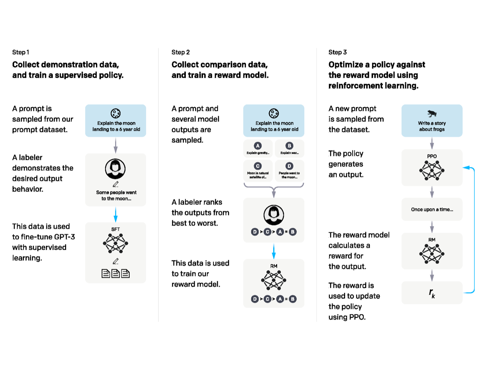
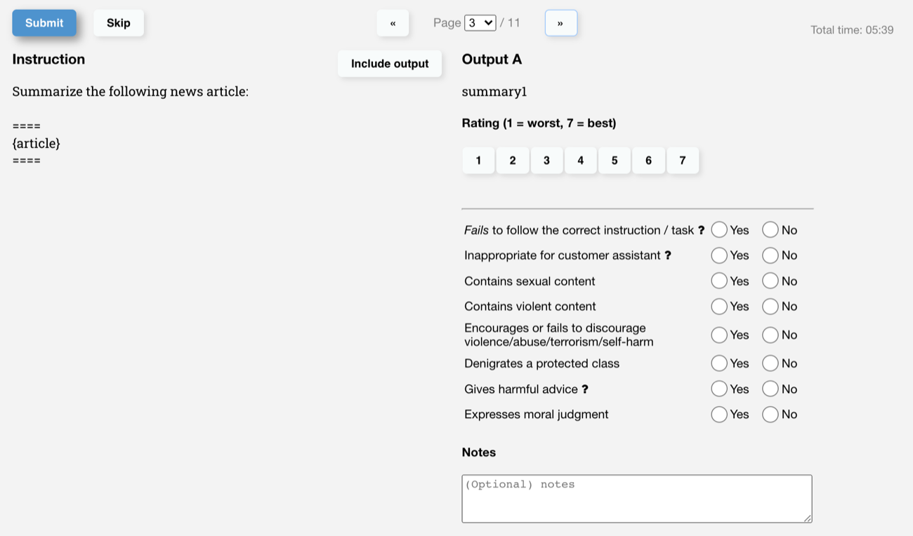
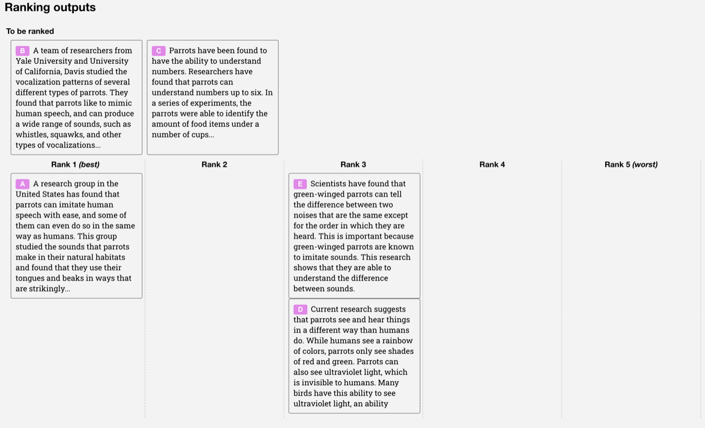
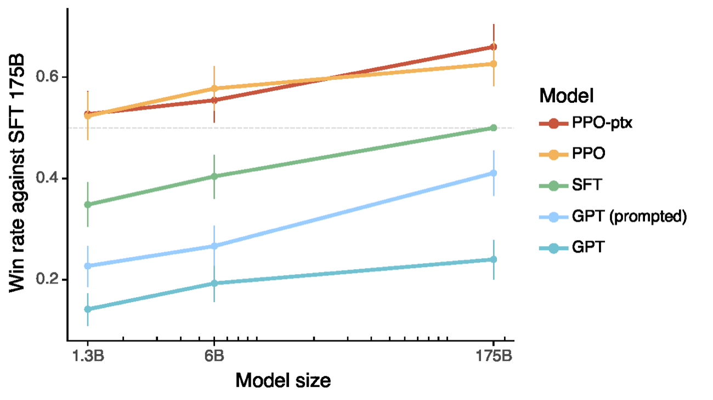
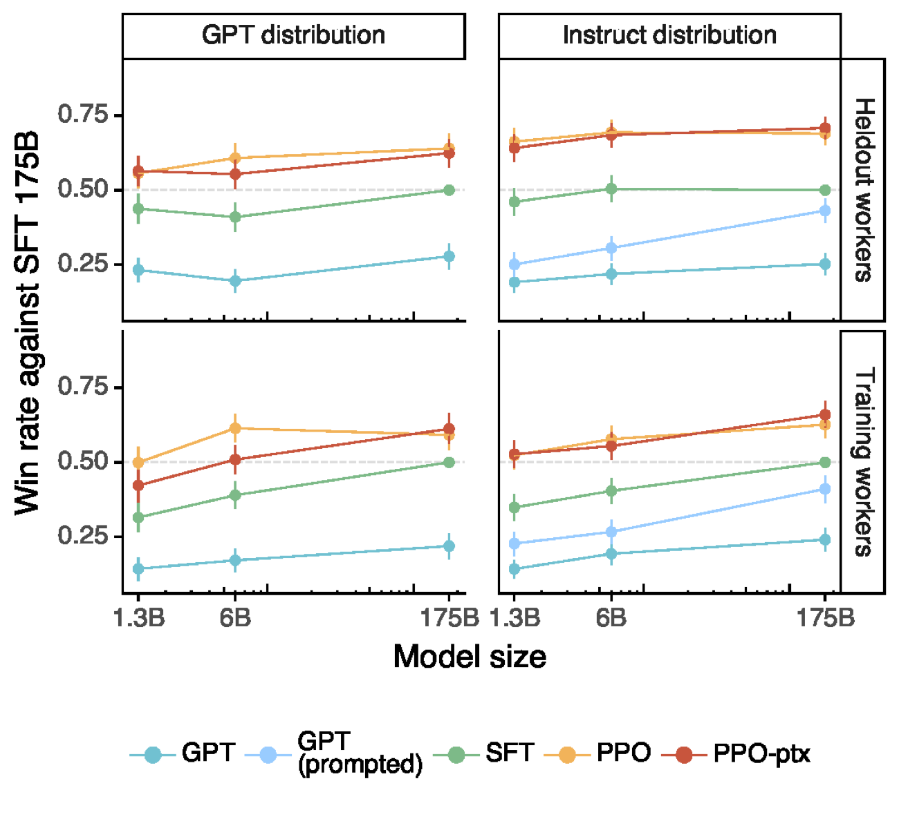

# 偏好数据与对齐失效模式

很多团队在做对齐时，会把注意力集中在 `RLHF`、`DPO`、`IPO`、`ORPO` 这样的算法名字上。  
但现实里更决定结果的，往往是：

- 偏好数据长什么样
- 偏好标签是否一致
- 对齐目标是否和真实业务一致
- 奖励或偏好目标到底在塑造什么行为

这页重点讨论偏好数据本身，以及对齐过程中最常见的失效模式。  
**核心观点很简单**：

**对齐首先是数据设计问题，其次才是优化算法问题。**

!!! note "初学者先抓住"

    偏好对齐不是给模型灌新知识，而是在已有能力上调整“更应该怎么回答”。如果底座不会解题，偏好数据很难凭空造出数学能力；如果底座会解题但风格、风险边界和格式不好，偏好数据才更容易发挥作用。

!!! example "有趣例子：两个都对的客服回答"

    “可以退款”和“我理解你的困扰，下面按三步帮你发起退款”可能事实都对。偏好数据要决定的是哪种语气、步骤、风险承诺和业务边界更符合产品目标，而不是只判断真假。

## 0. 先用 InstructGPT 图建立全局流程

如果你没有强化学习基础，先不要从 PPO 公式开始。先看 InstructGPT 原论文这张流程图：它把 RLHF 拆成三件相对朴素的事。

{ width="920" }

<small>图源：[Training language models to follow instructions with human feedback](https://arxiv.org/abs/2203.02155)，Figure 2。原论文图意：展示 InstructGPT 的三步训练流程：收集 demonstration data 做 SFT，收集模型输出排序训练 reward model，再用 PPO 按 reward model 优化 policy。</small>

!!! note "图解：这张图要按数据流读"
    左栏是 SFT：人类写示范回答，模型学会基本指令跟随。中栏是 reward model：同一个 prompt 下生成多个候选，标注者把 A/B/C/D 排序，reward model 学会预测“哪个更像人类偏好”。右栏才是 PPO：新 prompt 输入当前 policy，policy 生成回答，reward model 给分，PPO 用这个分数更新 policy。强化学习部分不是凭空出现的，它吃的是前两步做出来的 SFT 初始策略和 reward model。

InstructGPT 论文还给了标注界面的截图。它们很适合理解“偏好数据”到底长什么样，而不是把它想成一个抽象公式。

{ width="860" }

<small>图源：[Training language models to follow instructions with human feedback](https://arxiv.org/abs/2203.02155)，Appendix Figure 19(a)。原论文图意：标注者先对单个模型输出做 Likert 质量评分，并标注输出是否有帮助、真实、无害、是否遵循指令等元信息。</small>

!!! note "图解：单条评分用于拆解质量维度"
    这张界面不是简单问“好不好”，而是把 helpfulness、truthfulness、harmlessness、instruction following 等维度拆开。这样做的价值是：当模型变差时，你能知道是事实性下降、拒答过度、格式错误，还是安全边界问题。偏好数据如果只保留一个总分，后续排查会非常困难。

{ width="860" }

<small>图源：[Training language models to follow instructions with human feedback](https://arxiv.org/abs/2203.02155)，Appendix Figure 19(b)。原论文图意：标注者在同一个 prompt 下比较多个模型输出，并把它们从最好到最差排序；这种排序数据用于训练 reward model。</small>

!!! note "图解：reward model 学的是相对偏好"
    排序界面的关键是“同题多答”。它不要求标注者发明一个绝对完美答案，而是比较几个候选谁更好。reward model 因此学到的是相对顺序：在同一个输入下，什么特征让一个回答比另一个更值得偏好。DPO、RLHF、RLAIF 的许多差别都在优化形式上，但它们共同依赖这类偏好关系是否稳定、可解释、覆盖真实失败模式。

最终，论文用人类偏好胜率来验证后训练是否真的改变了用户侧体验。

{ width="760" }

<small>图源：[Training language models to follow instructions with human feedback](https://arxiv.org/abs/2203.02155)，Figure 1。原论文图意：在 API prompt 分布上比较不同模型输出相对 175B SFT baseline 的人类偏好胜率，展示 InstructGPT/RLHF 后训练相对 GPT-3 和 SFT baseline 的偏好提升。</small>

!!! note "图解：偏好胜率不是训练 loss"
    这张图的纵轴是人类更喜欢哪个输出，而不是 reward model loss 或 next-token loss。它提醒你：对齐训练的最终证据应该来自人类偏好、任务成功率和关键风险桶，而不是只看优化目标下降。一个 reward model 可以在验证集上看起来不错，但如果标注指南、候选分布或线上任务变了，真实偏好胜率仍可能不升反降。

{ width="860" }

<small>图源：[Training language models to follow instructions with human feedback](https://arxiv.org/abs/2203.02155)，Figure 4。原论文图意：按 prompt 来源和 labeler 分组比较不同模型相对 175B SFT baseline 的偏好胜率，用来检查偏好提升是否跨分布稳定。</small>

!!! note "图解：偏好结果也要分桶"
    这张图比单个总胜率更接近真实评测习惯：同样是 InstructGPT，不同 prompt 分布、训练标注者和 held-out 标注者的偏好结果都要看。如果只看一个平均胜率，可能掩盖“训练标注者喜欢、held-out 标注者不喜欢”或“某类 prompt 有提升、另一类 prompt 退化”的问题。偏好对齐上线前，也应该按任务类型、风险等级、语言、长度和用户群体做类似分桶。

## 1. 偏好数据在塑造什么

设输入为 \(x\)，两个候选回答为 \(y^+, y^-\)。  
偏好数据告诉模型的不是世界真理，而是：

- 哪种风格更好
- 哪种风险更可接受
- 哪种答法更符合人类期望
- 哪些边界绝不能越过

**所以偏好数据本质上是在塑造**：

\[
\text{style} + \text{risk preference} + \text{helpfulness boundary},
\]

而不是直接注入知识。

这一点非常关键。  
如果一个底座模型根本不会做微积分、不会阅读合同、不会多步代码修复，那么再多偏好数据也很难“对齐出”这种能力。  
偏好对齐更像是在已有能力之上塑形，而不是凭空造能力。

## 2. 一个更形式化的直觉：偏好在学习排序

以 DPO 风格目标为例，常见形式可以写成：

\[
\mathcal{L}_{\text{DPO}}
=
- \log \sigma
\Big(
\beta
\big[
\log \pi_\theta(y^+|x) - \log \pi_\theta(y^-|x)
- \log \pi_{\text{ref}}(y^+|x) + \log \pi_{\text{ref}}(y^-|x)
\big]
\Big).
\]

**这里真正被学到的是**：

- 在给定输入 \(x\) 时，模型应该更偏向哪一类输出；
- 这种偏向相对于参考模型要加强多少。

所以偏好优化的核心对象是**排序关系**，不是绝对真值。  
这也解释了为什么偏好数据一旦带着系统性偏差，模型就会很稳定地学偏。

### 2.1 RLHF 和 DPO 的区别先这样记

`RLHF + PPO` 是显式两段式：

1. 先用排序数据训练 reward model；
2. 再让 policy 生成回答，用 reward model 打分；
3. PPO 根据 reward、value、advantage 和 KL 约束更新 policy。

`DPO` 则把 reward model 和 PPO 更新压缩成一个偏好优化目标：直接用 \((x,y^+,y^-)\) 更新 policy，让优选回答相对 reference model 更可能，劣选回答相对更不可能。

两者不是“一个有偏好数据，一个没有偏好数据”。它们都依赖偏好数据。区别在于：RLHF 显式学一个可复用的 reward model，再做强化学习；DPO 不显式训练 reward model，训练流程更直接，但同样会受 reference model、\(\beta\)、偏好噪声和候选分布影响。

!!! note "难点解释：为什么 RLHF 需要 KL，DPO 也需要 reference"
    偏好信号只告诉模型某些回答更受欢迎，不保证这些回答保持底座全部能力。KL 或 reference 项相当于“不要离原模型太远”的约束。没有这个约束，模型可能为了赢偏好样本而牺牲事实性、多样性、长上下文能力或代码能力；约束太强，又学不到足够偏好变化。因此对齐不是单纯追高 reward，而是在偏好收益和能力保持之间找平衡。

## 3. 好的偏好数据长什么样

**理想偏好数据至少应具备**：

- 区分度明确
- 标注标准一致
- 与真实任务接近
- 覆盖关键失败模式
- 对安全、帮助性和风格有可分解定义

如果偏好对差异太模糊，模型很难学到稳定方向。

### 3.1 区分度明确

最好能回答“为什么 A 比 B 好”。  
如果标注者自己都只能说“感觉这个更顺眼”，那么模型学到的往往是高噪声风格偏好。

### 3.2 标注标准一致

同类任务如果今天重准确、明天重礼貌、后天重篇幅，模型最终会学成一种折中但不稳定的行为。

### 3.3 与真实任务接近

如果偏好样本大多来自人工构造的“教材式问题”，但线上真实流量充满上下文缺失、模糊需求、长文档和工具调用，那么离线偏好再漂亮，线上也很可能错位。

### 3.4 覆盖关键失败模式

真正有价值的偏好样本，不只是“普通问题的两个回答谁更好”，而是：

- 容易产生幻觉的问题
- 容易过度拒答的问题
- 容易啰嗦的问题
- 高风险领域的边界问题
- 需要结构化输出的复杂问题

## 4. 一个直观例子：客服场景

对于用户投诉退款，两个回答可能都是“对的”，但偏好数据会告诉模型：

- 更礼貌的更优
- 更直接给出解决路径的更优
- 更少绕圈、更少说教的更优
- 更能安抚情绪但不夸大承诺的更优

这说明偏好对齐的价值常常体现在“体验层”，而不是“会不会”。

如果把同一个问题放在不同业务目标下，偏好顺序甚至会发生变化：

- 在高端客服场景，礼貌和解释充分可能更重要。
- 在紧急故障处理场景，直接给出操作步骤可能更重要。
- 在高风险金融投诉场景，合规措辞和准确边界更重要。

**这再次说明**：  
偏好不是普世真理，而是任务化、业务化的选择。

## 5. 偏好数据最常见的噪声来源

### 5.1 标注员偏好不一致

有人偏爱简洁，有人偏爱详尽；  
有人认为“保守更安全”，有人认为“给出尽量多可行信息更有帮助”。

如果没有细化指南，模型最后学到的是标注团队的平均人格，而不是产品想要的人格。

### 5.2 标注准则过于模糊

例如只写“选更好的回答”，但没有具体定义：

- 什么叫更好？
- 当准确性和礼貌冲突时谁优先？
- 当简洁和完整冲突时谁优先？
- 什么时候应拒答，什么时候应部分回答？

这会导致同类样本打标风格漂移。

### 5.3 偏好数据与业务目标错位

例如标注强调礼貌，但真实业务更需要准确和结构化。  
或者标注数据大多是英文开发者问答，而线上核心用户是中文企业客服。

### 5.4 候选回答分布太单一

如果偏好数据里的两个候选都来自同一种模型、同一种 prompt 模板，差异会很窄。  
模型最后学到的也许只是微弱措辞偏好，而不是对严重错误的识别能力。

### 5.5 奖励黑客式样本不足

如果数据里缺少“看起来很安全但其实没帮助”“看起来很专业但实际上是幻觉”的样本，模型很容易学会表面最优策略。

## 6. 对齐失效模式总览

下面这些失效模式在真实系统里非常常见，而且经常不是算法单独导致的。

### 失效 1：过度保守

**模型变得**：

- 会拒答本该回答的问题
- 输出很安全，但很空
- 遇到稍微不确定的问题就回避

这种失效在医疗、法律、金融等高风险场景尤其常见。  
团队为了压低风险，偏好数据大量奖励“保守表达”，结果模型把“谨慎”学成了“缩手缩脚”。

### 失效 2：模板化严重

模型学会一种“看起来很对齐”的风格，例如：

- 先道歉
- 再提醒风险
- 再给笼统建议
- 最后建议咨询专业人士

这种模板在单条样本上看似不错，但一旦频繁出现，帮助性会快速下降。

### 失效 3：能力被压制

过强对齐可能让原本的推理和探索能力变弱。  
**典型表现包括**：

- 复杂问题回答开始缩短
- 模型不愿进行假设分析
- 代码修复更保守
- 多步推理中途提前收手

### 失效 4：只在离线偏好集上好看

真实用户流量中，问题类型和容错边界并不相同。  
离线偏好集若过于干净、短小和可控，就会造成明显的 offline-online gap。

### 失效 5：风格变好了，事实性变差了

有些偏好训练会让模型更礼貌、更像“好助手”，但却更容易在事实不确定时编出完整答案。  
因为偏好数据奖励了“像样的回答”，却没有足够惩罚“漂亮的错答”。

### 失效 6：局部安全策略与全局任务目标冲突

**例如在企业运维助手里**：

- 偏好数据奖励“谨慎，不轻易给危险命令”
- 但真实业务又要求紧急情况下快速给出准确修复动作

如果没有细分风险等级，模型会在关键场景里反而显得不够有用。

## 7. 一个很实际的分解：偏好对齐在同时优化哪些维度

**可以把偏好目标粗略写成**：

\[
R(y|x)
=
\lambda_1 R_{\text{helpful}}
 + \lambda_2 R_{\text{safe}}
 + \lambda_3 R_{\text{style}}
 + \lambda_4 R_{\text{format}}
 + \lambda_5 R_{\text{truthfulness}}.
\]

**现实困难在于**：

- 这些子目标彼此会冲突；
- 不同业务下 \(\lambda_i\) 完全不同；
- 标注过程往往并没有显式告诉模型这些权重。

于是模型只能从偏好样本里“猜测”团队想要什么。  
如果样本设计不清楚，最终输出就会变成一种难以解释的折中。

## 8. 为什么对齐问题常常不是算法问题

现实中很多失败，并不是 `DPO` 比 `RLHF` 差，或者反过来，而是：

- 偏好数据质量不够
- 标注标准不清
- 业务目标没拆清楚
- 候选回答分布过窄
- 高风险长尾样本太少

所以做对齐时，算法只是最后一层，前面偏好数据设计更关键。

**这也是为什么很多团队会发现**：

- 换了新算法，提升有限；
- 但一旦重做偏好指南、补关键失败样本、引入线上反馈，效果会立刻改善。

## 9. 三个典型业务例子

### 9.1 编程助手

如果偏好数据过度偏爱“保守不执行”，模型会：

- 更少给出具体修复
- 更喜欢说“需要更多信息”
- 更少主动提出合理假设

这会直接伤害开发者体验。

### 9.2 企业知识库问答

如果偏好数据过度奖励“看起来完整”，模型可能在检索证据不足时仍然给出过度肯定的结论。  
正确的做法应是把“证据约束”纳入偏好标准。

### 9.3 青少年教育助手

**这里的偏好重点可能是**：

- 正向引导
- 解释清晰
- 避免危险建议
- 用词温和

这和企业运维、法律助手、研究助手的对齐目标显然完全不同。

## 10. 如何设计更好的偏好标签结构

一个更稳的办法，不是只给二元偏好，而是给分解标签，例如：

- 准确性
- 帮助性
- 安全性
- 风格
- 结构化程度
- 引用证据是否充分

即使最终训练时仍然会合成一个总目标，分解标签也有三大好处：

1. 更容易发现标注冲突来自哪里。
2. 更容易在不同业务里调整权重。
3. 更方便做错误分析和回放。

## 11. 偏好数据采集时的实践建议

### 11.1 候选回答要足够多样

不要只从一个模型采两条回答。  
**最好混合**：

- 基座模型回答
- SFT 模型回答
- 当前线上模型回答
- 加不同 prompt 模板后的回答

这样偏好数据才真正覆盖“风格差异”和“错误差异”。

### 11.2 把代表性失败样本单独建池

例如：

- 容易幻觉的问题
- 用户表达模糊的问题
- 需要结构化输出的问题
- 极易过度拒答的问题

这些样本的训练价值常常远高于普通样本。

### 11.3 在线反馈一定要回流

如果只依赖离线标注，偏好目标很容易逐渐脱离真实用户体验。  
尤其产品迭代后，用户任务结构可能会明显变化。

## 12. 一份对齐项目的检查清单

在真正启动偏好训练前，建议至少确认：

1. 我们到底想优化准确、帮助、安全、风格中的哪几项？
2. 这些目标有无优先级？
3. 标注指南能否清楚处理冲突情形？
4. 偏好样本是否覆盖高风险长尾？
5. 是否保留了线上失败样本？
6. 离线评测是否覆盖过度拒答、事实性、结构化输出等维度？
7. 上线后是否有持续反馈闭环？

## 13. 一个总判断

偏好对齐最难的，从来不是把公式写出来，而是决定“你到底想让模型更像什么样的人”。  
一旦这个目标没拆清楚，再漂亮的对齐算法也很难稳定成功。

更准确地说，偏好对齐的真正难点是把下面三件事同时做好：

- 把业务目标拆成可标注的偏好维度；
- 把长尾失败模式稳定送进训练集；
- 把离线排序收益转成线上真实帮助性提升。

只要这三件事没打通，对齐就很容易停留在“回答更像助手了”，却没有真正变得更有用。

## 实践补充与检查

### 把 **偏好数据与对齐失效模式** 当成训练平台的一部分

训练页面很容易被写成方法综述，但真正把模型训起来时，**偏好数据与对齐失效模式** 通常并不是一个孤立决策，而是和数据、并行、恢复、评测、成本一起联动的。更实用的读法是先把它放回训练平台语境中：

1. **偏好采样、judge 偏差、pair 构造、长度偏差、风格漂移**。

一旦缺少这种平台视角，团队就容易把很多跨层问题都简化成“改超参”“加数据”或者“再堆 compute”。这在小实验里也许还能蒙对，在大规模训练、长上下文、多模态和后训练阶段几乎一定会反复返工。

### 更稳妥的设计与试验顺序

围绕 **偏好数据与对齐失效模式**，建议把设计过程拆成四步：

1. **先明确能力目标**。是为了基础建模、长上下文、对齐、还是某类专项能力；
2. **再明确预算边界**。包括 token 预算、GPU 小时、可接受的吞吐下降和恢复复杂度；
3. **然后设计数据与状态接口**。哪些样本进入、哪些状态要版本化、哪些评测桶负责判断收益；
4. **最后才做参数微调**。把超参调整放在系统设计之后，而不是之前。

这套顺序能避免一种常见错误：先调出一个看起来不错的局部结果，再发现它和数据版本、恢复语义、评测口径或上线节奏根本对不齐。

### 高频失败模式

围绕 **偏好数据与对齐失效模式**，最常见的失败并不一定是训练直接爆炸，而是更隐蔽的几类：

1. **偏好数据看起来干净但信息量低**。
2. **judge 代替人类造成偏置**。
3. **只学会更安全的表面格式**。

这些问题难查的原因在于，它们经常“功能上都对，曲线上也还能看”，但最终让整条训练资产不可比、不可迁移、不可复用。对成熟团队来说，真正要防的往往就是这种慢性失真，而不是只在乎会不会立刻 `nan`。

### 验收、回滚与资产化

更稳的 **偏好数据与对齐失效模式** 实践，至少应当满足下面几条：

1. **校准 judge**。
2. **按任务桶抽查人审**。
3. **区分风格收益与能力收益**。
4. **把回归集常态化**。

另外，建议把这类主题产生的关键决策都资产化：

1. **版本化配置与数据快照**；
2. **短跑一致性测试**；
3. **失败案例与回滚条件**；
4. **对下游评测、后训练、量化与推理转换的接口说明**。

只有这样，**偏好数据与对齐失效模式** 才会真正沉淀成组织能力，而不是停留在某次实验里的一段经验。
