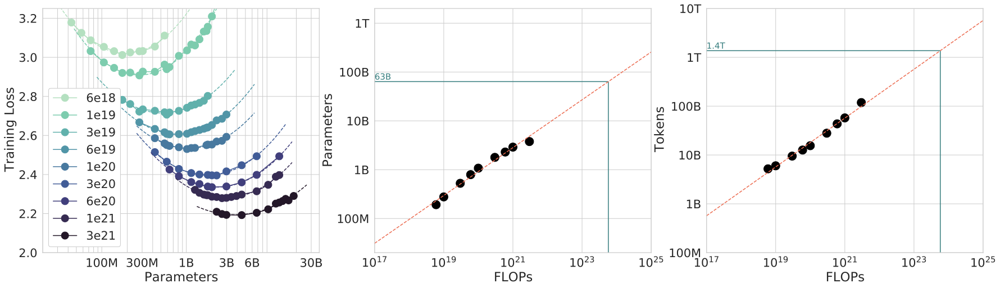
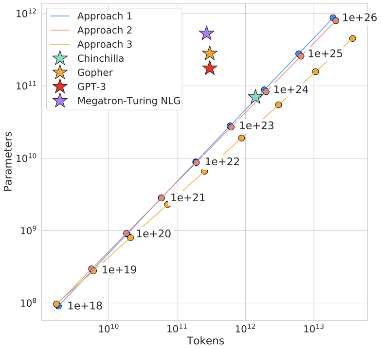

# Scaling Law 与实验经济学

大模型研究早已不是纯学术“试试看”。一次训练可能消耗大量 GPU 小时、标注预算、工程人力和评测时间。于是一个更现实的问题出现了：什么样的实验值得做，什么时候应该扩大模型，什么时候应该增加数据，什么时候该把钱花在推理优化或数据治理上？Scaling law 与实验经济学，正是帮助团队回答这些问题的框架。

!!! note "初学者先抓住"

    Scaling law 给的是“资源增加后收益大概怎样变化”的地图，实验经济学给的是“这条路线值不值得走”的账本。前者帮助你避免盲目堆大，后者帮助你避免把预算押在解释不清、复用不了的实验上。

!!! note "难点解释：小实验为什么不能直接当成大实验结论"

    小模型实验像风洞测试，能排除明显错误，也能发现方向性信号；但放大后优化稳定性、数据混合、通信瓶颈、推理成本都会变化。因此小实验应回答“是否值得扩大”，而不是直接宣称“全量一定有效”。

## 1. Scaling law 在回答什么

最朴素的 scaling law 试图描述损失或某项性能指标如何随参数量 $N$、数据量 $D$、计算量 $C$ 变化。常见形式如：

$$
L(N,D) \approx A N^{-\alpha} + B D^{-\beta} + L_\infty.
$$

虽然真实系统远比这个复杂，但它提供了一个核心启发：收益通常是递减的，而且不同资源维度的边际收益不一样。

Chinchilla 原论文的 IsoFLOP 图非常适合放在这里：它不是只画“模型越大越好”，而是在固定训练 FLOP 预算下，比较不同参数量和训练 token 数的组合，寻找 loss 的谷底。

{ width="920" }

<small>图源：[Training Compute-Optimal Large Language Models](https://arxiv.org/abs/2203.15556)，Figure 4。原论文图意：固定 FLOP 预算时，不同模型大小会对应不同最终 loss；曲线谷底给出该预算下更合适的参数量，并外推出参数和 token 的 scaling 关系。</small>

!!! note "图解：为什么 scaling law 不是“大模型崇拜”"
    左图的每条 IsoFLOP 曲线都有一个谷底：模型太小会欠容量，模型太大则在同样 FLOP 下拿不到足够 token，最终也不划算。中间和右图把这些谷底外推出最优参数量和最优训练 token 数。直觉上，扩规模不是单独把 \(N\) 放大，而是要同时问 \(D\) 是否跟得上。

## 2. 为什么实验经济学重要

在资源有限时，每个实验都不是纯学术探索，而是投资决策。若实验成本为 $K$，预期收益为 $G$，失败概率为 $p_f$，则可粗略想成：

$$
\mathbb{E}[\text{value}] = (1-p_f)G - K.
$$

当然真实收益难以量化，但这个框架提醒我们：高成本、低可解释、低复用的实验，不一定值得优先做。

## 3. 参数扩张何时值得

扩大模型常有收益，但代价包括：

1. 训练成本上升
2. 推理成本上升
3. 部署复杂度上升
4. 调参时间上升

若当前瓶颈主要来自数据脏噪、评测盲区或推理链路过长，盲目加参数往往不是最划算的投资。

## 4. 数据扩张何时值得

**增加数据量的收益取决于**：

1. 新数据是否带来新信息；
2. 是否只是重复主流分布；
3. 清洗和治理成本是否可接受；
4. 是否更适合用于专项微调而非预训练。

对很多垂直系统而言，少量高质量长尾数据可能比海量近重复通用数据更有价值。

## 5. 训练 token 与有效 token

总 token 数并不等于有效学习量。若重复率高、噪声大，则有效 token 数可能远低于表面规模。可用概念性量

$$
D_{\text{eff}} = D (1-\rho_{\text{dup}})(1-\rho_{\text{noise}})
$$

**去提醒团队**：堆更多数据之前，先问这些 token 是否真的新、真的有用。

## 6. 过训练与欠训练

在给定模型规模下，训练 token 过少会欠训练，过多又会带来边际收益下降。所谓 compute-optimal 配置，就是在参数、数据和训练步数之间找到较优平衡。现实中，这种平衡还必须考虑：

1. 墙钟时间
2. 中断风险
3. checkpoint 成本
4. 实验并发需求

{ width="620" }

<small>图源：[Training Compute-Optimal Large Language Models](https://arxiv.org/abs/2203.15556)，Figure 15。原论文图意：在固定训练 FLOP 预算下，三种估计方法给出相近的最优 token 数和参数量关系。</small>

!!! note "图解：欠训练常常藏在“模型够大”背后"
    这张图把最优 token 数和最优参数量放在同一张坐标里。它提醒你：模型规模、训练 token 和计算预算是三角关系。只报告参数量而不报告训练 token，很难判断模型是能力不足、训练不足，还是数据/优化系统没有把预算用好。

## 7. 研究节奏的经济学

一个高成本全量实验能回答更多问题，但迭代慢；多个小规模实验迭代快，但外推风险大。成熟团队通常采用：

1. 小规模快速验证假设；
2. 中规模验证可扩展性；
3. 少量全量训练做最终确认。

这是一种实验投资组合，而不是单一实验哲学。

## 8. 结果外推的风险

很多方法在小模型上有效，在大模型上未必成立；反之亦然。缩放外推必须小心：

1. 优化稳定区间会变；
2. 数据混合比例可能变化；
3. 推理成本会改变方法价值排序；
4. 某些正则在小模型有益、大模型反而多余。

因此实验经济学不仅关心“要不要放大”，还关心“放大后结论是否仍然成立”。

## 9. 推理成本要提前计入

若一个训练方案让离线指标提升 2%，但推理成本翻倍，业务上可能并不划算。可把总拥有成本近似写为

$$
\text{TCO}
=
\text{Training Cost}
+ \text{Serving Cost}
+ \text{Maintenance Cost}.
$$

一些方法训练时略贵，但能大幅降低推理成本；另一些方法正好相反。研究决策应基于全周期成本，而不是只看训练阶段。

## 10. 实验并发与机会成本

**研究团队经常低估机会成本**：把整套资源押在一个大实验上，意味着你失去了同时验证多个假设的机会。尤其在问题不确定、方法很多的早期阶段，高并发小实验常比单次豪赌更合理。

## 11. 例子：扩散蒸馏路线选择

若目标是把扩散采样从 20 步压到 4 步，你可以：

1. 训练更大教师再蒸馏；
2. 试一致性模型；
3. 优化求解器；
4. 改用分布匹配蒸馏。

**实验经济学要求你先估计**：

1. 哪条路线训练成本最低；
2. 哪条路线最可能影响线上时延；
3. 哪条路线最易集成进现有服务；
4. 哪条路线失败了仍能复用中间资产。

## 12. 例子：VLA 数据投资

团队想提升机器人恢复能力，可以选择：

1. 扩大模型；
2. 采集更多成功示范；
3. 专门采失败恢复数据；
4. 改评测和恢复机制。

若真实瓶颈在失败分布稀缺，那么第 3 和第 4 项的回报往往高于第 1 项。Scaling law 在这里提醒你：不是所有能力都靠加模型得到。

## 13. 何时该停止一个方向

实验经济学也关心止损。若连续几轮实验显示：

1. 提升幅度持续小于噪声；
2. 成本增幅远高于收益；
3. 长尾问题不降反升；
4. 与系统约束明显不兼容；

那就应考虑收缩或终止，而不是沉没成本驱动继续投入。

## 14. 设计建议

1. 记录每个实验的真实成本，而不是只记结果。
2. 对大实验先做小规模代理验证。
3. 用长期价值视角比较模型扩张、数据治理、量化和系统优化。
4. 不要忽视推理与运维成本在方法选择中的权重。
5. 建立明确的进入条件与止损条件。

## 15. 小结

Scaling law 给出的是“资源与效果的大致地形图”，实验经济学决定的是“你要如何在这张地形图上行军”。对现代大模型团队而言，研究不再只是提出更好的方法，也包括更聪明地配置算力、数据、人力和时间。真正成熟的团队，往往不是做了最多实验，而是用最合理的实验组合学到了最多东西。 

## 实践补充与检查

### 把 **Scaling Law 与实验经济学** 当成训练平台的一部分

训练页面很容易被写成方法综述，但真正把模型训起来时，**Scaling Law 与实验经济学** 通常并不是一个孤立决策，而是和数据、并行、恢复、评测、成本一起联动的。更实用的读法是先把它放回训练平台语境中：

1. **token 预算、模型规模、数据质量、长上下文成本、实验复用率**。

一旦缺少这种平台视角，团队就容易把很多跨层问题都简化成“改超参”“加数据”或者“再堆 compute”。这在小实验里也许还能蒙对，在大规模训练、长上下文、多模态和后训练阶段几乎一定会反复返工。

### 更稳妥的设计与试验顺序

围绕 **Scaling Law 与实验经济学**，建议把设计过程拆成四步：

1. **先明确能力目标**。是为了基础建模、长上下文、对齐、还是某类专项能力；
2. **再明确预算边界**。包括 token 预算、GPU 小时、可接受的吞吐下降和恢复复杂度；
3. **然后设计数据与状态接口**。哪些样本进入、哪些状态要版本化、哪些评测桶负责判断收益；
4. **最后才做参数微调**。把超参调整放在系统设计之后，而不是之前。

这套顺序能避免一种常见错误：先调出一个看起来不错的局部结果，再发现它和数据版本、恢复语义、评测口径或上线节奏根本对不齐。

### 高频失败模式

围绕 **Scaling Law 与实验经济学**，最常见的失败并不一定是训练直接爆炸，而是更隐蔽的几类：

1. **只看 loss 曲线**。
2. **忽略无效重跑成本**。
3. **把理论 scaling 当预算结论**。

这些问题难查的原因在于，它们经常“功能上都对，曲线上也还能看”，但最终让整条训练资产不可比、不可迁移、不可复用。对成熟团队来说，真正要防的往往就是这种慢性失真，而不是只在乎会不会立刻 `nan`。

### 验收、回滚与资产化

更稳的 **Scaling Law 与实验经济学** 实践，至少应当满足下面几条：

1. **把失败成本计入**。
2. **按阶段做预算门槛**。
3. **对高成本专项做收益核算**。
4. **记录复用资产**。

另外，建议把这类主题产生的关键决策都资产化：

1. **版本化配置与数据快照**；
2. **短跑一致性测试**；
3. **失败案例与回滚条件**；
4. **对下游评测、后训练、量化与推理转换的接口说明**。

只有这样，**Scaling Law 与实验经济学** 才会真正沉淀成组织能力，而不是停留在某次实验里的一段经验。
