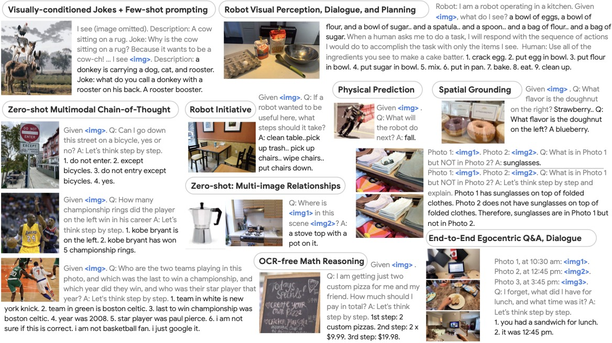

# VLA 总览

VLA（Vision-Language-Action）研究的是：给模型视觉观察和语言指令，让它直接输出动作。

!!! tip "基础知识入口"
    VLA 会同时用到视觉特征、语言 token、attention 和动作序列建模。相关前置概念可以先看 [Transformer 与 Attention](../foundations/transformer-attention-and-tokenization.md)、[张量与计算图](../foundations/tensors-shapes-and-computation-graphs.md) 和 [优化与训练基础](../foundations/optimization-and-training-basics.md)。

**最简单的形式是策略**：

\[
\pi_\theta(a_t \mid o_{\le t}, l)
\]

其中：

- \(o_{\le t}\) 是到当前时刻的观测
- \(l\) 是语言指令
- \(a_t\) 是连续或离散动作

{ width="920" }

<small>图源：[PaLM-E: An Embodied Multimodal Language Model](https://arxiv.org/abs/2303.03378)，Figure 2。原论文图意：展示 PaLM-E 在视觉条件笑话、机器人视觉感知/对话/规划、物理预测、空间 grounding、多图关系和 egocentric QA 等任务上的统一多模态能力。</small>

!!! note "图解：VLA 不是只在 VLM 后面接一个动作头"
    PaLM-E 这张图展示了 VLA 的前置能力：模型需要能看图、理解空间关系、做物理和任务推理，还要把这些能力接到机器人场景里。真正的 VLA 输出是动作，但动作之前必须先完成视觉 grounding、语言理解、任务分解和状态估计。也就是说，VLA 是“多模态理解 + 时序决策 + 控制接口”的组合，不是普通图像问答的简单延伸。

## 1. VLA 和 VLM 的根本区别

VLM 的输出通常是“答案”或“工具调用”。VLA 的输出是会真正改变物理世界的动作。

这意味着 VLA 的错误不只是答错一句话，还可能是：

- 碰撞风险：路径或姿态判断错误会让机器人撞到物体或环境。
- 抓取失败：目标定位、姿态估计或夹爪控制偏差会导致抓空。
- 物体损坏：力控和速度控制不稳时，可能夹坏脆弱物体。
- 路径错误：导航或空间关系理解错误会让机器人走到错误位置。

所以它天然比普通多模态问答更高风险。

### 1.1 为什么“从理解到动作”是质变

在 VLM 中，错误通常还停留在信息层；在 VLA 中，错误会穿过：

1. 视觉理解；
2. 语言 grounding；
3. 动作接口；
4. 时序控制；
5. 真实动力学。

这意味着一个看似很小的感知误差，会被下游控制和环境反馈不断放大。

## 2. 一个直观例子：把红色杯子放到水池左边

这个任务看起来像一句简单指令，实际上拆开后至少包括：

1. 识别“红色杯子”；
2. 定位“水池左边”的空间关系；
3. 规划接近路径；
4. 输出机械臂或移动底盘动作；
5. 在执行中根据观测继续修正。

这说明 VLA 其实是把感知、语言理解、规划和控制绑在一起。

## 3. 一个统一环路

**可以把 VLA 视作如下闭环**：

\[
o_t \rightarrow h_t \rightarrow a_t \rightarrow o_{t+1}
\]

其中中间隐状态 \(h_t\) 吸收了：

- 视觉表征：当前场景中物体、空间关系和可操作区域的表示。
- 语言条件：用户指令、目标对象和约束条件。
- 历史动作：已经执行过的动作，用来判断状态变化和误差积累。
- 任务进度：当前处于接近、抓取、搬运、放置还是恢复阶段。

如果任务是部分可观测，还要显式考虑记忆。

### 3.1 VLA 不是单步映射，而是时序系统

这点很关键。很多人第一次看 VLA，会把它想成“多模态输入，输出一个动作”。真实系统里更接近：

1. 动作块生成；
2. 阶段状态追踪；
3. 闭环重规划；
4. 失败检测和恢复。

因此 VLA 不只是一个大模型头，而是一个时序控制框架。

## 4. 为什么 VLA 难

### 感知误差会直接传到控制层

物体看错 2 厘米，抓取就可能失败。

### 动作需要时间连续性

不是每一步都重新“想一句话”，而是要输出平滑、可执行的轨迹。

### 安全约束必须显式存在

机器人不是网页代理，失误代价更高。

### 分布偏移更明显

训练数据常来自少量示范，但部署时场景变化极大。

### 4.1 再加一个经常被低估的问题：恢复

真实系统里，第一次没做好是常态而不是例外。一个真正可用的 VLA，不只是要有首次成功率，还要会检测失败、重新观察、局部修正和安全退出。没有恢复能力，模型再聪明也很难部署。

## 5. VLA 的主要任务类型

### 机械臂操作

如抓取、放置、开抽屉、插接、收纳。

### 移动机器人

如导航、避障、送货、巡检。

### 混合任务

如移动到底盘前，再伸手抓物体。

### 长时多步骤任务

如家务收纳、仓库拣选、餐具整理、工具递送。这类任务更接近真实场景，也更依赖阶段记忆和恢复能力。

## 6. VLA 的三类核心问题

### 数据问题

有没有足够多、足够统一、带失败覆盖的轨迹数据。

### 策略问题

动作表示、时间建模、闭环修正怎么做。

### 部署问题

延迟、安全、低层控制、状态机如何协同。

### 6.1 为什么很多 VLA 工作最后都回到数据

因为 VLA 的上限经常不是模型结构先卡住，而是：

1. 示范质量不稳定；
2. 轨迹覆盖太窄；
3. 失败样本缺失；
4. 语言和动作对齐不充分；
5. 实机与训练环境差异太大。

这也是为什么数据引擎在 VLA 里几乎是主问题。

## 7. VLA 和具身智能、世界模型的关系

### 与具身智能的关系

VLA 不是具身智能的全部，而是其中“从视觉语言到动作”的主接口之一。

### 与世界模型的关系

世界模型更像 VLA 的内部前瞻模块。前者帮助想象未来，后者负责输出动作。二者若结合得好，可以在动作前先做风险评估和候选筛选。

### 与传统控制的关系

很多现实系统并不会让 VLA 直接接管所有低层控制，而是保留：

1. 经典控制器；
2. 安全状态机；
3. 技能级中间接口；
4. 人工接管链路。

所以最现实的 VLA 形态往往是“高层语义动作接口 + 低层安全控制”。

## 8. 一个更实际的理解方式

如果把 VLM 看成“会看、会说、会调用工具”，那么 VLA 可以理解成“会看、会理解、还要把手伸过去做”。这多出来的“做”，决定了它必须同时满足：

1. 视觉理解够准；
2. 动作表达够稳；
3. 时间连续性够好；
4. 失败恢复够明确；
5. 安全边界够清楚。

这也是为什么 VLA 不能只复制 VLM 的研究逻辑。

## 9. 推荐阅读顺序

**建议先读**：

1. [数据与策略学习](data-and-policy-learning.md)
2. [动作表示与控制接口](action-representation-and-interfaces.md)
3. [Benchmark 与数据引擎](benchmarks-and-data-engines.md)
4. [VLA 的 Sim2Real](sim2real-for-vla.md)
5. [闭环恢复与失败分析](closed-loop-recovery-and-failure-analysis.md)
6. [动作分块、层级策略与潜在技能](action-chunking-hierarchical-policies-and-latent-skills.md)
7. [部署与安全](deployment-and-safety.md)

如果你更关心数据基础，再补读：

1. [遥操作示范质量与采集](teleoperation-demonstration-quality-and-collection.md)

## 10. 一个总判断

VLA 可以理解成“把 VLM 的语义理解，进一步接到控制策略上”，但这句话只说对了一半。另一半是：一旦进入真实动作，所有感知误差、时序误差、动力学误差和安全风险都会被放大。因此 VLA 真正的难点，不是让模型看懂指令，而是让模型在真实世界里持续、稳定、安全地把指令做成。 

## 快速代码示例

```python
def run_episode(env, policy, instruction, max_steps=200):
    obs = env.reset()
    for _ in range(max_steps):
        action = policy(obs, instruction)      # VLA: 观测+语言 -> 动作
        action = env.safety_filter(action)     # 安全约束
        obs, reward, done, info = env.step(action)
        if info.get("need_recovery"):
            env.recover(obs)                   # 闭环恢复
        if done:
            break
```

这段代码用最简形式表达了 VLA 的闭环执行：策略根据观测和语言指令输出动作，环境先做安全过滤，再根据反馈触发恢复逻辑。它强调的不是单次预测，而是连续执行中的稳定性。


## 学习路径与阶段检查

VLA 需要按闭环系统来读：数据决定可学动作，动作接口决定可执行性，评测和恢复决定能否部署。

| 阶段 | 先读 | 读完要能回答 |
| --- | --- | --- |
| 1. 数据和策略 | [数据与策略学习](data-and-policy-learning.md)、[遥操作示范质量与采集](teleoperation-demonstration-quality-and-collection.md) | 示范数据是否覆盖任务阶段、失败状态和恢复轨迹 |
| 2. 动作接口 | [动作表示与控制接口](action-representation-and-interfaces.md)、[动作分块、层级策略与潜在技能](action-chunking-hierarchical-policies-and-latent-skills.md) | 输出的是低层控制、动作 token、动作块还是技能调用；谁负责安全过滤 |
| 3. 评测和迁移 | [Benchmark 与数据引擎](benchmarks-and-data-engines.md)、[VLA 的 Sim2Real](sim2real-for-vla.md) | 离线指标、仿真指标和实机成功率之间的差异如何解释 |
| 4. 闭环部署 | [闭环恢复与失败分析](closed-loop-recovery-and-failure-analysis.md)、[部署与安全](deployment-and-safety.md) | 系统如何发现失败、局部重试、安全退出、记录回放并回流数据 |

读完 VLA 后，建议接 [具身智能总览](../embodied-ai/index.md) 看完整任务系统，再接 [世界模型总览](../world-models/index.md) 理解“动作前先内部推演”的路线。判断 VLA 是否讲清楚，不看它能否输出动作，而看它能否解释动作失败后系统如何继续。
