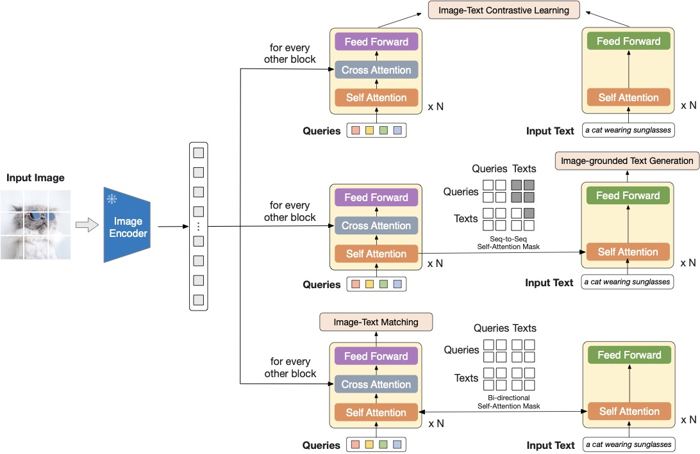

# VLM 的架构与训练

这一页从“结构长什么样、损失函数怎么写、数据怎么组织、系统容易在哪些地方失败”四个角度讲 VLM。读完后，最好把 VLM 看成一个多阶段系统，而不是一句“给 LLM 接个视觉编码器”。

!!! note "初学者先抓住"
    VLM 不是简单把图片丢给 LLM。它至少要先把图片切成视觉 token，再把视觉 token 和文本 token 对齐，最后才由语言模型组织答案、坐标或工具调用。

!!! example "有趣例子：看菜单点餐"
    你问模型“哪道菜最辣”。VLM 需要先看清菜单图片里的文字和图标，再理解“最辣”对应辣椒标识或描述，最后用语言回答。任何一步错了，答案都可能看起来流畅但事实不对。

{ width="920" }

<small>图源：[BLIP-2: Bootstrapping Language-Image Pre-training with Frozen Image Encoders and Large Language Models](https://arxiv.org/abs/2301.12597)，Figure 2。原论文图意：冻结图像编码器，用查询式连接模块抽取视觉信息，并分别服务 image-text contrastive learning、image-grounded text generation 和 image-text matching。</small>

!!! note "图解：连接器不是随便接一层线性投影"
    这张图把“冻结视觉编码器 + 训练少量跨模态模块 + 接入语言侧任务”的思路画得很清楚。左侧图像编码器负责把图片变成视觉特征，中间的查询 token 像一组可学习的探针，只抽取和文本最相关的视觉信息；右侧不同 attention mask 对应不同训练目标。初学时要注意：VLM 的连接器既是信息瓶颈，也是对齐器。如果它太弱，细节进不了 LLM；如果训练目标太单一，模型可能只会粗匹配，不会细粒度问答或定位。

## 1. 统一问题定义

给定图像或视频输入 \(x_v\) 与文本上下文 \(x_t\)，模型输出答案、标签、坐标、动作或工具调用：

\[
p_\theta(y \mid x_v, x_t)
\]

这里的 \(y\) 可能是：

- 一段自然语言回答
- 一个分类标签
- 一组目标框 \((b_i, c_i)\)
- 一串操作指令

如果是多轮对话，还可以把历史上下文记作 \(c\)，写成：

\[
p_\theta(y \mid x_v, x_t, c)
\]

直觉上，VLM 至少要同时完成三件事：

1. 看懂局部视觉证据。
2. 理解语言问题真正关心的对象和关系。
3. 在共享语义空间里把“图里的东西”和“文字里说的东西”对齐。

## 2. 输入是怎么变成 token 的

### 图像 token 化

若输入图像为 \(I \in \mathbb{R}^{H \times W \times C}\)，将其切成大小为 \(P \times P\) 的 patch，则 patch 数量为：

\[
N = \frac{H}{P}\cdot\frac{W}{P}
\]

每个 patch 展平并投影到隐藏维度 \(d\)：

\[
e_i = W_p \cdot \text{flatten}(I_i) + p_i
\]

其中 \(p_i\) 是位置编码。于是视觉编码器得到：

\[
h_v = f_v(e_1, e_2, \dots, e_N)
\]

### 文本 token 化

文本经过 tokenizer 得到 token 序列 \(w_1, \dots, w_T\)，映射成嵌入：

\[
h_t = f_t(w_1, \dots, w_T)
\]

### 一个直观例子：发票理解

一张发票进入 VLM 时，模型并不是直接“看整张图”，而是会把它切成很多局部 patch。  
于是“税号在右上角”“总金额在表格底部”“红章在左下角”这些信息，本质上都变成了不同空间位置上的视觉 token。后续语言问题“税号是多少”其实是在逼模型从这些 token 里把正确区域挑出来。

## 3. 四类主流架构

### 3.1 双塔架构

图像和文本分别编码，再在同一向量空间对齐：

\[
v = g_v(x_v),\qquad t = g_t(x_t)
\]

**相似度通常写成**：

\[
s(v,t)=\frac{\langle v,t\rangle}{\|v\|\|t\|}
\]

**优点**：

- 检索高效
- 图文库可以预编码
- 工程简单，适合大规模召回

**缺点**：

- 交互粒度粗
- 不适合复杂多轮问答

最像现实中的“图文搜索引擎”。

### 3.2 Cross-attention 编码器

把视觉 token 和文本 token 放进同一个交互模块里：

\[
z = P(h_v, h_t)
\]

其中 \(P\) 可能包含多层 cross-attention。  
**这类结构适合**：

- 图文匹配
- VQA
- grounding

因为模型能显式学习“这个词看哪些视觉区域”。

### 3.3 冻结 LLM + 视觉连接器

这是当前最常见的 VLM 路线之一。先用视觉编码器得到视觉特征，再经过 projector 映射到 LLM 的词向量空间：

\[
\tilde{h}_v = W_{\text{proj}} h_v
\]

然后把它作为“伪 token”拼到文本前缀中：

\[
[\tilde{h}_v ; h_t] \rightarrow \text{LLM}
\]

**优点**：

- 可以复用成熟 LLM
- 训练成本相对可控
- 易于迁移到对话、工具使用、代理任务

**缺点**：

- projector 如果太弱，视觉细节塞不进去
- LLM 虽然语言强，但未必天然擅长空间定位

### 3.4 统一 token 自回归模型

把图像 patch、离散视觉 token、文本 token 都当成统一序列建模：

\[
p_\theta(x_1, x_2, \dots, x_n)=\prod_{i=1}^{n}p_\theta(x_i \mid x_{<i})
\]

这种方式优雅，但训练和推理成本都高，往往更适合研究统一多模态建模，而不是工业界最先落地的方案。

## 4. 训练目标不是一个，而是一组

很多 VLM 训练看起来像一个模型，实际上同时叠了多种损失。

### 4.1 图文对比学习

最经典的是 CLIP 风格的 InfoNCE：

\[
\mathcal{L}_{\text{img}\rightarrow \text{text}} = - \frac{1}{B}\sum_{i=1}^{B}\log \frac{\exp(\langle v_i,t_i\rangle/\tau)}{\sum_{j=1}^{B}\exp(\langle v_i,t_j\rangle/\tau)}
\]

\[
\mathcal{L}_{\text{text}\rightarrow \text{img}} = - \frac{1}{B}\sum_{i=1}^{B}\log \frac{\exp(\langle t_i,v_i\rangle/\tau)}{\sum_{j=1}^{B}\exp(\langle t_i,v_j\rangle/\tau)}
\]

**总损失通常为**：

\[
\mathcal{L}_{\text{clip}}=\frac{1}{2}\left(\mathcal{L}_{\text{img}\rightarrow \text{text}}+\mathcal{L}_{\text{text}\rightarrow \text{img}}\right)
\]

它学到的是“谁和谁匹配”，更像在学语义坐标系。

### 例子：商品搜索

你输入“黑色防水徒步外套”，模型要把这句话和一堆商品图放到同一个空间里。若训练足够好，即使图片标题写的是“冲锋衣”，它也会被拉近，因为图像和文本共享“户外、防水、黑色、连帽”这些属性。

### 4.2 图文匹配损失

对比学习只关注相对距离，有时还不够。  
于是很多模型增加二分类匹配损失：

\[
\mathcal{L}_{\text{itm}} = - y \log \hat{y} - (1-y)\log(1-\hat{y})
\]

其中 \(y=1\) 表示图文真匹配。  
这能更直接地学“这两者到底配不配”。

### 4.3 生成式监督

对问答、对话、代理任务，最常见的是条件语言建模：

\[
\mathcal{L}_{\text{gen}} = - \sum_{k=1}^{K}\log p_\theta(y_k \mid y_{<k}, x_v, x_t)
\]

**这意味着模型要学会**：

- 先看图
- 再理解问题
- 最后按语言序列逐词生成答案

### 例子：图表分析助手

输入柱状图和问题“为什么二季度销量下降？”  
这时模型不仅要知道蓝色柱子较短，还要结合图例知道蓝色是“北美市场”，再把这种视觉证据组织成一句自然语言解释，例如“二季度北美市场销量下滑最明显，因此拖累整体表现”。

### 4.4 检测与定位损失

若任务需要框选区域，则还会引入检测损失，例如：

\[
\mathcal{L}_{\text{box}} = \|b-\hat{b}\|_1 + \lambda \mathcal{L}_{\text{giou}}
\]

**总目标可能写成**：

\[
\mathcal{L} = \lambda_1 \mathcal{L}_{\text{clip}} + \lambda_2 \mathcal{L}_{\text{itm}} + \lambda_3 \mathcal{L}_{\text{gen}} + \lambda_4 \mathcal{L}_{\text{box}}
\]

这说明一个真正强的 VLM 往往不是单一训练任务的产物，而是多任务拼装。

## 5. 数据组织决定上限

VLM 的训练效果极度依赖数据，不只是依赖模型规模。

### 5.1 图文对质量比图文对数量更重要

如果训练集里有大量弱配对样本，比如：

- 图像是咖啡馆，标题却只有“IMG_3021”
- 商品图写着一长串 SEO 文案，但和图片本身弱相关

那么模型学到的就不是“准确对齐”，而是“统计共现噪声”。

### 5.2 指令数据决定对话风格

**对话式 VLM 往往需要额外数据**：

- 视觉问答
- OCR 问答
- 屏幕操作轨迹
- 图像推理链

这些数据告诉模型，看到视觉证据后该如何把它组织成“用户真正需要的回答形式”。

### 5.3 一个生动例子：超市货架盘点

如果你只给模型看商品图和名字，它可能很会识别单个商品。  
但当它面对真实超市货架照片时，问题会立刻出现：

- 同一商品部分遮挡
- 反光包装导致颜色失真
- 货架标签和商品包装挨得很近
- 促销海报混在画面里

这说明训练数据若只覆盖“干净单品图”，部署到“拥挤货架图”时会明显掉点。

## 6. 工程上最常见的三套训练配方

### 6.1 检索型 VLM

**目标**：

- 图文检索
- 向量召回
- rerank 前的粗筛

**配方**：

- 双塔结构
- 大规模对比学习
- 尽量大 batch

优点是吞吐高，缺点是难做精细问答。

### 6.2 对话型 VLM

**目标**：

- 看图问答
- 文档理解
- 屏幕代理

**配方**：

- 冻结或半冻结 LLM
- 视觉编码器 + projector
- 大量视觉指令微调

这类系统更像“带眼睛的聊天模型”。

### 6.3 文档/OCR/布局型 VLM

**目标**：

- 票据解析
- 表格理解
- 长文档问答

**配方**：

- 高分辨率视觉输入
- OCR 文本与版面位置信息联合建模
- 局部区域裁剪与全局页面共同输入

因为这里真正重要的不是“图像风格”，而是“空间布局 + 文字内容 + 局部细节”。

## 7. 例子：四个不同应用，为什么架构选择完全不同

### 7.1 医学影像报告生成

输入是胸片，输出是结构化报告。  
这里比起粗检索，更需要：

- 局部病灶敏感性
- 术语生成能力
- 否定表达准确性

因此通常更偏生成式 VLM。

### 7.2 电商图搜

输入是文本“米白色亚麻长裙”，目标是找相似商品图。  
这类系统重点是 embedding 质量与召回效率，双塔结构最合适。

### 7.3 屏幕代理

输入是手机界面截图和指令“打开订单详情页”。  
模型不仅要理解视觉内容，还要定位可点击控件，甚至调用工具。因此更接近“对话型 VLM + grounding + action head”的组合。

### 7.4 工业质检

输入是一张电路板照片，输出是“是否短路、缺件、焊点偏移”。  
这类任务视觉细节远比语言复杂，往往需要高分辨率局部检查，不能只依赖一个通用 LLM projector 硬吞。

## 8. 训练时最容易踩的坑

### 8.1 视觉 token 太少

若下采样过猛，模型可能只看清“这是个页面”，但看不清“按钮上的字是确认还是删除”。  
在屏幕代理、文档理解、精细 OCR 任务里，这会直接致命。

### 8.2 LLM 太强，掩盖视觉弱点

**一个常见假象是**：模型回答听起来很流畅，所以看起来很聪明。  
但它可能只是语言先验强，并没有真的看懂图。

例如给它一张停车场图片问“红车在左边还是右边”，若训练数据不足，它可能按语言偏见瞎猜，却说得非常自信。

### 8.3 数据模板化过强

**如果问答模板始终是**：

- “图片里有什么？”
- “图中主体是什么？”

模型会非常擅长回答模板问题，但不擅长开放式、多跳式、多约束问题。

### 8.4 对齐目标冲突

对比学习想拉近整体语义，检测损失想保局部定位，生成损失想保语言流畅。若权重没调好，模型可能：

- 检索变强但回答变空泛
- 回答流畅但定位变差
- OCR 准确但开放式推理下降

## 9. 一个够用的工程判断框架

当你在选 VLM 架构时，可以先问四个问题：

1. 主要任务是检索、问答、定位还是代理？
2. 视觉细节的重要性有多高？
3. 是否需要长上下文和多轮记忆？
4. 推理成本能接受到什么程度？

**通常来说**：

- 检索优先双塔。
- 通用问答优先“视觉编码器 + LLM”。
- 文档/OCR 优先高分辨率与布局建模。
- 代理任务优先可接工具、可做 grounding 的生成式 VLM。

## 10. 总结

VLM 的核心不是“把图像喂给语言模型”，而是解决三个层次的耦合：

- **表征耦合**：图像和文本如何放进同一语义空间。
- **任务耦合**：检索、问答、定位、代理如何共享一个模型。
- **系统耦合**：视觉分辨率、token 数、推理成本、数据质量如何一起平衡。

真正难的不是写出那条损失函数，而是让模型既能看到细节，又不被成本拖死；既能说得流畅，又不是只会语言幻觉。

## 快速代码示例

```python
from transformers import AutoProcessor, AutoModelForVision2Seq
from PIL import Image

model_id = "Qwen/Qwen2.5-VL-3B-Instruct"
processor = AutoProcessor.from_pretrained(model_id)
model = AutoModelForVision2Seq.from_pretrained(model_id, device_map="auto")

image = Image.open("chart.png")
prompt = "读出图表结论，并给出两条业务建议。"
inputs = processor(images=image, text=prompt, return_tensors="pt").to(model.device)
out = model.generate(**inputs, max_new_tokens=128)
print(processor.decode(out[0], skip_special_tokens=True))
```

这段代码覆盖了一个典型“图表理解”任务：先把视觉输入与问题对齐编码，再让模型生成结构化结论。它可以作为架构与训练章节的快速验收样例，用来检查模型是否具备跨模态推理能力。


## 实践补充与检查

### 把 **VLM 的架构与训练** 放回闭环系统里讨论

VLM、VLA、具身与世界模型类页面，最大的风险不是内容太少，而是内容只停留在“模型结构”和“离线指标”层。真正扎实的页面，必须把方法放回 **任务接口、数据制度、动作/工具链、风险治理和上线边界** 里讨论。围绕 **VLM 的架构与训练**，更有价值的写法不是单纯列方法，而是明确说明它在闭环系统里到底负责哪一段能力。

更具体地说，从编码器、对齐目标、数据制度、工具接口和部署约束看 VLM 架构。只有把这些接口真正讲明白，读者才会知道：某一条路线到底是在提升理解、提升决策、提升执行恢复、提升数据回流效率，还是只是在离线表征上更强。对这类系统而言，接口不清楚，比方法不够新更容易误导决策。

### 从离线能力到闭环能力的递进关系

围绕 **VLM 的架构与训练**，更稳妥的分析方式是把能力分成三层：

1. **离线表征层**：模型是否真的提取到了任务相关信息；
2. **策略与计划层**：模型是否能基于这些信息做出正确下一步，而不是只是生成“看起来像对的输出”；
3. **闭环与恢复层**：当环境、界面、用户或机器人状态变化后，系统是否还能稳定继续。

很多页面容易把第一层和第二层混在一起，仿佛离线分数高就等于闭环更强。事实上，真实系统里最难也最贵的往往是第三层。无论是屏幕代理、VLA、世界模型还是具身部署，真正的差距经常出现在：模型是否能在失败后恢复、是否能在风险边界前收手、是否能在高价值任务上保持一致性，而不是单次离线预测是否好看。

### 更容易被忽略的失败与误判

这类主题里，最常见的误判通常包括：把静态评测当成闭环能力；把高保真生成误当成高价值决策；把多模态数据量增加误当成接口设计已经合理；把实机或线上失败都归因于“模型还不够大”。这些误判共同指向一点：**没有把任务链条拆开验收**。

因此，更扎实的内容应当把失败模式写细：哪些问题来自观测不全，哪些来自接口不稳，哪些来自动作粒度设计不对，哪些来自回流数据抓错重点，哪些来自评测桶没有覆盖真正高价值风险场景。只有这些被写透，读者才会真正理解为什么同一个模型结构，在论文和系统里会呈现出完全不同的表现。

### 更像系统手册的验收方式

对 **VLM 的架构与训练**，推荐把验收至少写成四层：

1. **表征验收**：是否看懂、对齐对不对、关键状态是否保留；
2. **决策验收**：下一步动作、工具选择、计划输出是否可靠；
3. **闭环验收**：失败恢复、风险抑制、长任务稳定性是否成立；
4. **运营验收**：是否能被 replay、shadow、回流、灰度和审计系统接住。

页面只要把这四层真正写实，**VLM 的架构与训练** 就会从“方向介绍页”变成“设计和落地都能用的页”。


### 和相邻页面的接口要怎么看

对 **VLM 的架构与训练**，更扎实的扩写重点不是再堆概念，而是把 编码器、对齐目标、工具接口和部署边界的接口 真正讲清楚。因为这类系统天然跨页：数据页讲输入资产，方法页讲模型能力，评测页讲证据，部署页讲风险。若页面之间的接口没写出来，读者很容易看完每一页仍然不知道系统是怎么连起来的。

### 一条更实用的落地顺序

把 **VLM 的架构与训练** 用到真实系统时，更稳的顺序通常是：先把任务接口和风险边界写清，再决定模型和数据方案；再做离线验证、回放和小规模闭环；最后才进入更大规模的部署或实机阶段。很多返工其实都源于顺序反了：先把模型训出来，后来才发现动作接口、回退逻辑或评测桶根本没准备好。

### 还值得继续深挖的问题

围绕 **VLM 的架构与训练**，下一轮最值得继续加厚的，往往是这些内容：失败恢复怎么真正进入主逻辑；哪些高价值样本最值得回流；哪些闭环指标才真正决定可用性；以及一旦线上或实机表现和离线不一致，应该优先怀疑数据、接口、执行层还是评测口径。把这些补充写厚，页面就会更像系统设计手册而不只是综述页。
