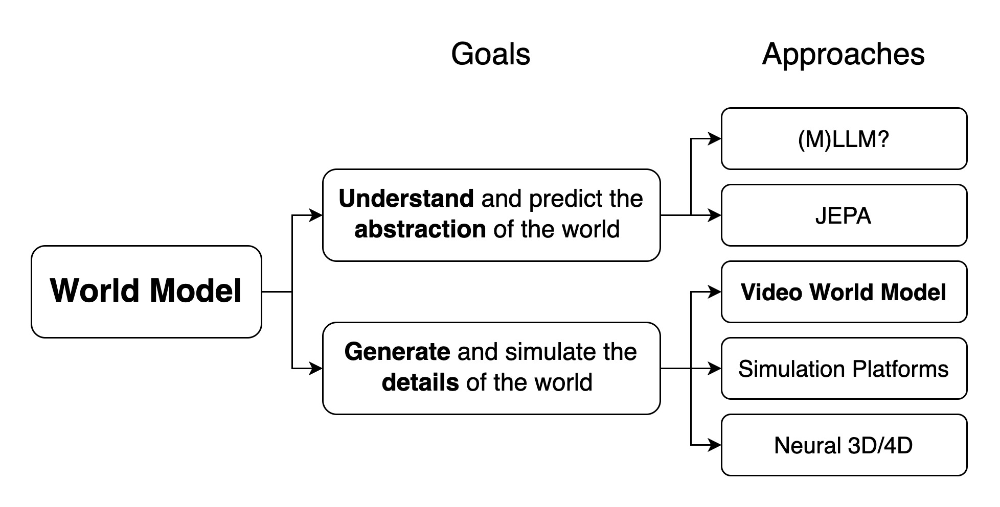
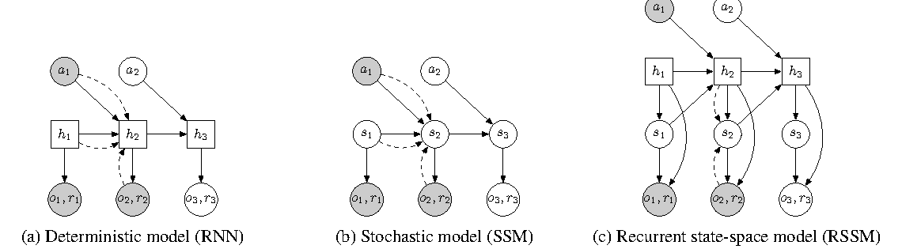

# 世界模型总览

<div class="atlas-hero">
  <div class="atlas-kicker">World Models</div>
  <p class="atlas-lead">这一专题围绕“先在内部模拟，再做决策”的方法谱系展开，覆盖 RSSM、Dreamer、视频世界模型、WM/WAM/VAM、风险规划、反事实与数据引擎。</p>
  <div class="atlas-chip-row">
    <span class="atlas-chip">RSSM / Dreamer</span>
    <span class="atlas-chip">WM / WAM / VAM</span>
    <span class="atlas-chip">视频模拟</span>
    <span class="atlas-chip">风险规划</span>
  </div>
</div>

## 专题定位

世界模型的核心问题不是“能不能生成未来”，而是“能不能把未来预测转化成更好的决策”。它位于表征学习、生成模型、强化学习、机器人、自动驾驶和数据引擎的交叉处。

{ width="900" }

<small>图源：[Towards Video World Models](https://www.xunhuang.me/blogs/world_model.html)，Figure 2。原文图意：把 world model 分成内部理解型和外部模拟型两类，并把 `(M)LLM?`、JEPA、Video World Model、Simulation Platforms、Neural 3D/4D 等路线放到同一张 taxonomy 里。</small>

!!! note "难点解释：先分清 internal 和 external"
    `internal world model` 更像 agent 内部的抽象预测器，目标是帮助 reasoning、planning 和 decision making，不一定要生成像素级画面。`external world simulation model` 则要生成可观察、可交互、可检查的外部世界细节。Dreamer/RSSM 更偏前者的决策接口，LingBot-World、Genie、CausVid 这类视频世界模型更偏后者的交互模拟接口。读后面的页面时，先问清楚模型最后服务的是“内部决策”还是“外部模拟”。

<div class="atlas-meta-grid">
  <div>
    <strong>核心问题</strong>
    <p>如何让模型不只理解当前观测，还能对动作条件下的未来、风险和反事实做内部模拟。</p>
  </div>
  <div>
    <strong>适合读者</strong>
    <p>适合做机器人、自动驾驶、世界模型规划、视频未来预测、合成数据和数据闭环的人。</p>
  </div>
  <div>
    <strong>阅读方式</strong>
    <p>先读定义和 RSSM/Dreamer，再看 WM/WAM/VAM、视频模拟、风险规划和数据引擎。</p>
  </div>
</div>

!!! tip "基础知识入口"
    世界模型会反复用到 latent state、概率分布、序列建模和训练闭环。第一次读可以先看 [概率、潜变量与生成模型](../foundations/probability-latent-variables-and-generative-models.md) 和 [Transformer 与 Attention](../foundations/transformer-attention-and-tokenization.md)。

## 世界模型的定义

**世界模型（World Model）** 是智能体在内部学习到的一套“环境运行机制”的近似模型。更直白地说，它像智能体脑中的可调用沙盘：给定历史观测、已执行动作、当前目标和候选动作，它能在内部推演“接下来可能会发生什么”，再把这些推演结果交给规划器、策略、风险模块或数据引擎使用。

一个面向决策的定义可以写成：

> 世界模型是一个预测环境状态如何随时间、动作和任务条件变化的模型，它输出未来观测、潜状态、奖励、风险、终止或其他对行动有用的信号。

这个定义里有三个关键词：

1. **面向决策**：它不是为了生成好看的未来，而是为了帮助选择动作、评估风险或产生训练数据；
2. **动作条件**：真正有用的世界模型必须回答“如果我这样做，会怎样”，而不只是顺着视频自然续写；
3. **内部模拟**：它把一部分真实环境试错搬到模型内部完成，降低真实试错成本。

一个最基础的潜状态形式是：

$$
p_\theta(z_t \mid z_{t-1}, a_{t-1}), \qquad p_\theta(x_t \mid z_t),
$$

其中 \(z_t\) 是潜状态，\(x_t\) 是观测。现代系统通常还会同时预测奖励、终止、风险、可通行性、接触状态、动作候选或未来视频片段。

## 世界模型到底在做什么

世界模型试图回答的问题可以压缩成一句话：

**如果我现在做动作 \(a\)，接下来世界会怎样变化？**

这和普通表征学习不同。表征学习更关注“当前是什么”，世界模型更关注“下一步会发生什么、不同动作会造成什么差异、这些差异是否影响决策”。

对自动驾驶来说，它可能要预测前车是否急刹、旁车是否让行、变道是否安全、后车是否会逼近。对机器人来说，它可能要预测抓取是否稳定、杯子是否会滑动、当前姿态是否碰撞、失败后是否还能恢复。对网页或工具 agent 来说，它可能要预测一次点击、提交或 API 调用之后系统状态如何变化。

真正有价值的世界模型通常需要具备：

1. 在部分可观测环境中保留历史记忆；
2. 对动作分叉敏感，而不是只生成平均未来；
3. 能支持多步 rollout，而不是只做一步预测；
4. 能输出风险、不确定性或恢复空间；
5. 能在规划、控制、评测或数据闭环中被消费。

所以，世界模型不仅要“像”，还要“有用”。一个视频生成器如果不能比较不同动作导致的不同未来，它最多是预测器或生成器，还不能算真正对决策有用的世界模型。

## 方法谱系

今天谈世界模型，已经不能只停留在经典 latent dynamics 公式上。随着视频生成、动作建模、具身控制、自动驾驶和生成式模拟的发展，世界模型正在变成一个更大的方法家族。

| 路线 | 建模重点 | 代表问题 | 典型价值 |
| --- | --- | --- | --- |
| Latent dynamics | 在潜空间学习可 rollout 的状态演化 | \(p(z_{t+1}\mid z_t,a_t)\) 是否稳定 | imagined rollout、策略学习、MPC |
| 视频/生成式模拟 | 直接预测未来观测或视频片段 | 未来是否视觉合理且动作敏感 | 数据扩增、反事实、可视化规划 |
| 动作联合建模 | 把动作和世界演化放入同一序列 | 动作未来和观测未来是否一致 | 行为先验、离线控制、多任务泛化 |
| 几何/场景表示 | occupancy、BEV、object state、scene token | 是否保留碰撞、接触和空间结构 | 机器人、驾驶、风险判断 |
| 数据引擎路线 | 用模型发现、生成和筛选高价值数据 | near-miss 和失败样本是否被覆盖 | 自我改进、主动采样、仿真闭环 |

## 两条训练路线

如果按“训练数据从哪里来、模型先学什么”来划分，当前世界模型可以先分成两条主线。它们都会走向动作条件未来预测，但出发点不同。

### 路线 A：视频生成型世界模型

这条路线从大规模视频生成或视频预测出发：

```text
大规模视频数据
  -> 视频生成 / 视频预测模型
  -> 加入控制、交互和长记忆
  -> 形成视觉世界模拟器
```

它的核心是先学会世界“看起来如何演化”，再逐步加入动作、相机、交互事件和因果 rollout。`LingBot-World`、`Genie`、`Cosmos` 以及一部分视频 diffusion / AR video generator 都更接近这条路线。

这条路线的优势是视觉质量强、开放场景覆盖广、容易生成可被人检查的视频未来；风险是视觉合理不等于任务可用，动作 grounding 可能偏弱，模型可能更依赖视频惯性而不是候选动作。

### 路线 B：交互轨迹驱动的 latent dynamics 路线

这条路线从 agent 和环境的交互经验出发：

```text
观测 o_t、动作 a_t、奖励 r_t、终止 done_t
  -> 学习潜状态 z_t
  -> 学习状态转移 p(z_{t+1} | z_t, a_t)
  -> 在 latent space 中 imagined rollout
  -> 用于规划或训练 policy
```

代表方法是 `RSSM / Dreamer / DreamerV3 / DayDreamer` 一类 model-based RL 世界模型。它的核心不是生成高清视频，而是学习“状态、动作、下一状态、奖励和终止”之间的动力学关系，让策略能在 learned latent dynamics 里想象未来。

{ width="860" }

<small>图源：[Learning Latent Dynamics for Planning from Pixels](https://arxiv.org/abs/1811.04551)，Figure 2。原论文图意：比较 RNN、SSM 和 RSSM 三种 latent dynamics 设计；RSSM 同时保留 deterministic hidden state 和 stochastic state，用于从像素学习可规划的潜空间动力学。</small>

!!! note "图解：RSSM 为什么适合世界模型"
    RNN 只靠确定性记忆，适合保留历史但不擅长表达多种可能未来；SSM 有随机状态，但长时记忆较弱。RSSM 把两者合起来：确定性状态 \(h_t\) 负责记住历史和动作轨迹，随机状态 \(z_t\) 负责表达当前不确定性。Dreamer 系列沿用这类思想，是因为规划需要的不只是重建当前画面，而是能稳定 rollout 的 latent state。

这条路线的优势是动作因果关系更直接，天然服务规划和控制；风险是交互数据收集贵，真实视觉质量和开放场景覆盖通常不如大视频生成模型，且 latent rollout 的误差会直接传给 policy。

两条路线的对比如下：

| 维度 | 视频生成型世界模型 | 交互轨迹 latent dynamics 世界模型 |
| --- | --- | --- |
| 代表 | LingBot-World、Genie、Cosmos、视频 diffusion simulator | RSSM、Dreamer、DreamerV3、DayDreamer |
| 数据 | 大规模视频、图文视频、少量控制或相机信号 | 环境交互轨迹：观测、动作、奖励、done |
| 核心目标 | 生成或预测未来视觉状态 | 学习状态转移和动作后果 |
| 训练目标 | video reconstruction、diffusion loss、next-frame prediction | latent dynamics loss、reward prediction、continuation prediction、policy learning |
| 输出 | 未来视频、未来帧、可视化世界模拟 | latent state、reward、termination、imagined rollout |
| 强项 | 视觉真实感、开放场景、多样性、长视频模拟 | 决策相关性强、动作因果明确、适合规划与控制 |
| 弱点 | 动作 grounding 可能弱，视觉正确不等于决策可用 | 数据采集贵，视觉真实感和开放域覆盖较弱 |

这两条路线不是互斥的。更现实的长期方向可能是：用视频生成型世界模型提供视觉动态和开放世界先验，用交互轨迹型世界模型提供动作条件动力学、奖励、终止和规划接口。

### 不要把第二条路线等同于 VLA

交互轨迹型世界模型也不等于 `VLA`。`VLA` 主要回答：

$$
\text{vision} + \text{language} \rightarrow \text{action}.
$$

世界模型主要回答：

$$
\text{state} + \text{action} \rightarrow \text{next state / reward / future trajectory}.
$$

也就是说，`VLA` 更像 policy，世界模型更像 dynamics 或 simulator。动作在世界模型中是建模世界动态的条件变量，而不是唯一最终输出。

经典 [RSSM、Dreamer 与规划](rssm-dreamer-and-planning.md) 是理解这一方向的入口，因为它把 belief state、reward、rollout 和 policy learning 的关系讲得最清楚。视频和生成式路线则在 [生成式模拟与视频世界模型](generative-simulation-and-video.md) 里展开。

近期 `LingBot-World` 一类工作展示了更现实的训练路径：先继承视频基础模型的视觉与时序先验，再通过动作标注交互数据、长序列训练、因果化和少步蒸馏，把视频生成器继续训练成可交互的世界模拟器。

## WM、WAM、VAM 的关系

`WM / WAM / VAM` 这组缩写近年在机器人和视频生成交叉方向出现得越来越多，但它们不是完全统一的标准术语。一个实用划分是：

1. **WM（World Model）**：更强调世界如何随动作演化；
2. **WAM（World-Action Model）**：更强调把动作生成和世界演化联合建模；
3. **VAM（Video-Action Model）**：更强调把视频生成能力和动作建模结合起来做控制或数据生成。

传统 `WM + policy` 的分工是：世界模型负责预测，策略负责出动作。但在机器人和驾驶数据里，观测与动作天然共同组成轨迹，把两者完全拆开未必符合数据结构。WAM/VAM 的吸引力在于，它们尝试把“哪类视觉态势经常接哪类动作”和“这些动作会把世界带向哪里”学成同一个时序模式。

这类统一建模的风险也很明确：

1. 视频目标可能压过动作目标，生成很强但控制一般；
2. 联合目标更难训练，失败时归因更复杂；
3. 若评测只看短步动作拟合，会高估真实规划能力；
4. 模型可能复制离线演示数据里的行为偏差。

具体路线见 [WM、WAM、VAM 与动作条件建模](wm-wam-vam-and-action-conditioned-modeling.md)。

## 评测与工程边界

世界模型现在最难的地方不是“展示一个看起来合理的未来”，而是稳定证明它对真实决策有用。重建 loss、next-frame loss、FID、FVD 或视觉自然度都不能直接等价于规划质量。

更合适的评测应分层报告：

| 评测层 | 关注点 | 典型问题 |
| --- | --- | --- |
| Open-loop prediction | 多步 rollout 后关键状态是否可靠 | 单步像、长时漂 |
| Action sensitivity | 不同动作是否导致合理分叉 | 只学平均未来 |
| Planning utility | 接入 planner 后任务是否变好 | 离线收益不等于闭环收益 |
| Risk and uncertainty | near-miss、碰撞、失败恢复是否可识别 | 自信地产生错误未来 |
| System cost | rollout 延迟、显存、调用次数是否可承受 | 有用但跑不动 |

训练和推理基础设施也会成为瓶颈。世界模型的数据通常是连续轨迹，不能随便切成独立样本；隐状态误差会沿 rollout 累积；规划器会反复调用模型，单步延迟会被候选数和 horizon 放大。因此世界模型评估必须同时报告收益和成本。

更详细的失效模式与验收方法见 [评测与失效模式](evaluation-and-failure-modes.md)、[不确定性与风险敏感规划](uncertainty-and-risk-aware-planning.md)。

## 推荐阅读路径

如果刚进入这个方向，建议按下面顺序读：

1. [RSSM、Dreamer 与规划](rssm-dreamer-and-planning.md)：建立 latent state、belief、reward、rollout 和策略学习的基本概念；
2. [WM、WAM、VAM 与动作条件建模](wm-wam-vam-and-action-conditioned-modeling.md)：理解现代动作联合建模谱系；
3. [生成式模拟与视频世界模型](generative-simulation-and-video.md)：理解为什么视频生成模型会进入控制和数据引擎；
4. [模拟器、反事实与合成 Rollout](simulators-counterfactuals-and-synthetic-rollouts.md)：理解如何用模型生成和筛选训练数据；
5. [规划即推断与潜在动作](planning-as-inference-and-latent-actions.md)：理解世界模型如何接入 planner；
6. [评测与失效模式](evaluation-and-failure-modes.md)：建立“看起来好”和“真的有用”之间的边界。

读每类工作时建议固定问四个问题：它建模的基本单位是什么，动作条件放在哪一层，模型输出最终被谁消费，它的失败更多出在表示、规划、数据还是系统成本。

## 阶段检查与下一站

世界模型的学习顺序要避免两个误区：把它只当视频生成，或者只当 model-based RL。更稳的检查方式如下：

| 你正在关注 | 关键判断 | 读完后接到哪里 |
| --- | --- | --- |
| Latent dynamics | latent state 是否保留决策所需信息，rollout 误差是否会误导 policy | [规划即推断与潜在动作](planning-as-inference-and-latent-actions.md)、[训练](../training/index.md) |
| 视频/生成式模拟 | 生成未来是否对动作敏感，而不是只顺着视频惯性续写 | [视频与多模态扩散](../diffusion/video-and-multimodal-diffusion.md)、[VLA](../vla/index.md) |
| 数据引擎 | 模型生成的数据是否覆盖 near-miss、失败恢复和长尾状态 | [模拟器、反事实与合成 Rollout](simulators-counterfactuals-and-synthetic-rollouts.md)、[具身智能](../embodied-ai/index.md) |
| 风险规划 | 不确定性和风险信号是否真的被 planner 或安全模块消费 | [不确定性与风险敏感规划](uncertainty-and-risk-aware-planning.md)、[部署与安全](../vla/deployment-and-safety.md) |

如果一个世界模型页面只展示预测结果，而没有说明动作条件、规划接口、风险输出和系统成本，就还没有进入决策系统语境。

## 专题页地图

<div class="atlas-card-grid">
  <a class="atlas-card" href="rssm-dreamer-and-planning/">
    <strong>RSSM、Dreamer 与规划</strong>
    <p>经典 latent world model 入口，重点是 belief state、imagined rollout 和 policy learning。</p>
  </a>
  <a class="atlas-card" href="wm-wam-vam-and-action-conditioned-modeling/">
    <strong>WM、WAM、VAM 与动作条件建模</strong>
    <p>拆清世界演化、动作生成和视频先验之间的关系。</p>
  </a>
  <a class="atlas-card" href="generative-simulation-and-video/">
    <strong>生成式模拟与视频世界模型</strong>
    <p>解释视频生成模型如何进入未来预测、反事实和数据合成。</p>
  </a>
  <a class="atlas-card" href="planning-as-inference-and-latent-actions/">
    <strong>规划即推断与潜在动作</strong>
    <p>把 world model、planner、latent action 和目标条件建模连起来。</p>
  </a>
  <a class="atlas-card" href="uncertainty-and-risk-aware-planning/">
    <strong>不确定性与风险敏感规划</strong>
    <p>关注世界模型进入高风险决策闭环时必须暴露的风险信号。</p>
  </a>
  <a class="atlas-card" href="simulators-counterfactuals-and-synthetic-rollouts/">
    <strong>模拟器、反事实与合成 Rollout</strong>
    <p>从“会预测”走向“能制造有价值训练样本”。</p>
  </a>
  <a class="atlas-card" href="data-engines-and-self-improvement/">
    <strong>数据引擎与自我改进</strong>
    <p>讨论 near-miss、主动采样、失败回放和闭环数据生成。</p>
  </a>
  <a class="atlas-card" href="applications-in-robotics-and-autonomous-driving/">
    <strong>机器人与自动驾驶应用</strong>
    <p>把世界模型放回真实具身与驾驶系统里看收益和限制。</p>
  </a>
  <a class="atlas-card" href="evaluation-and-failure-modes/">
    <strong>评测与失效模式</strong>
    <p>建立世界模型是否真的改善决策的验收标准。</p>
  </a>
</div>
